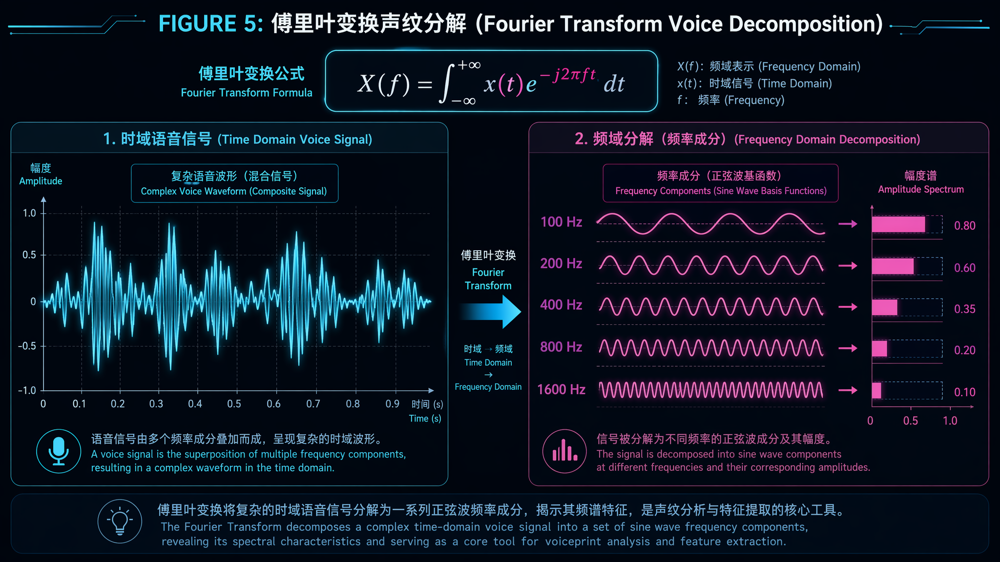
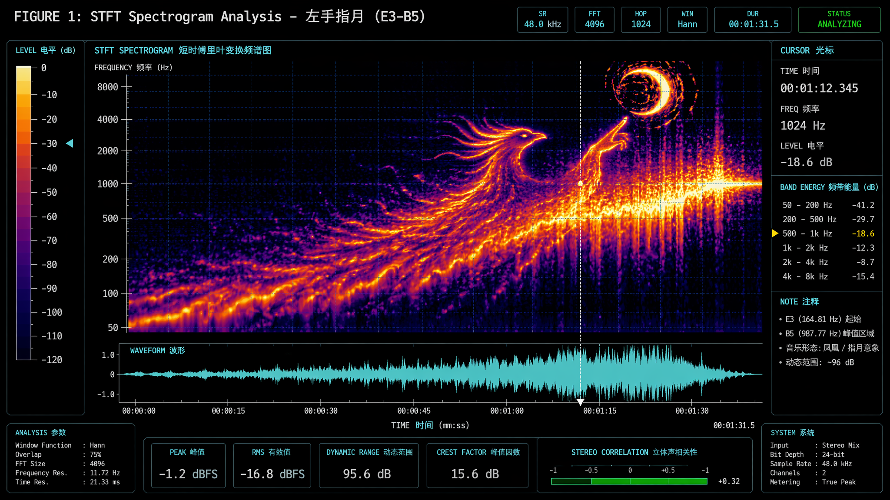
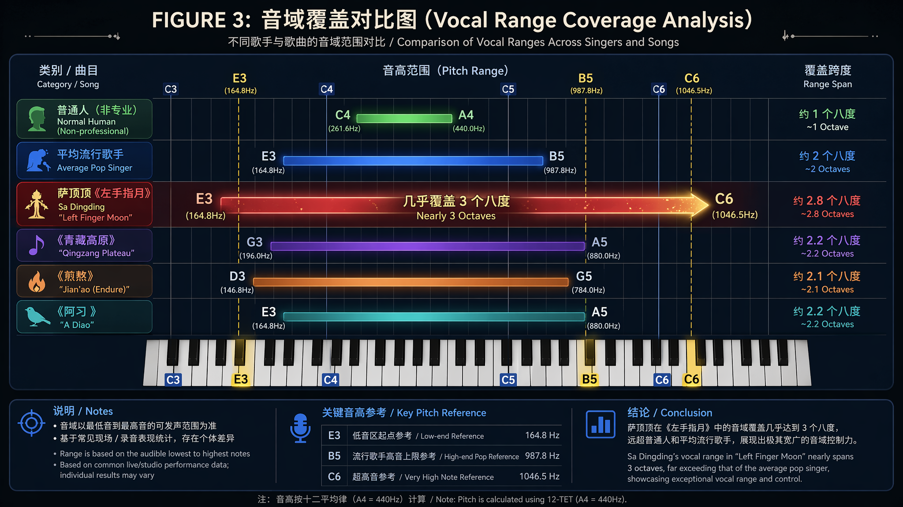
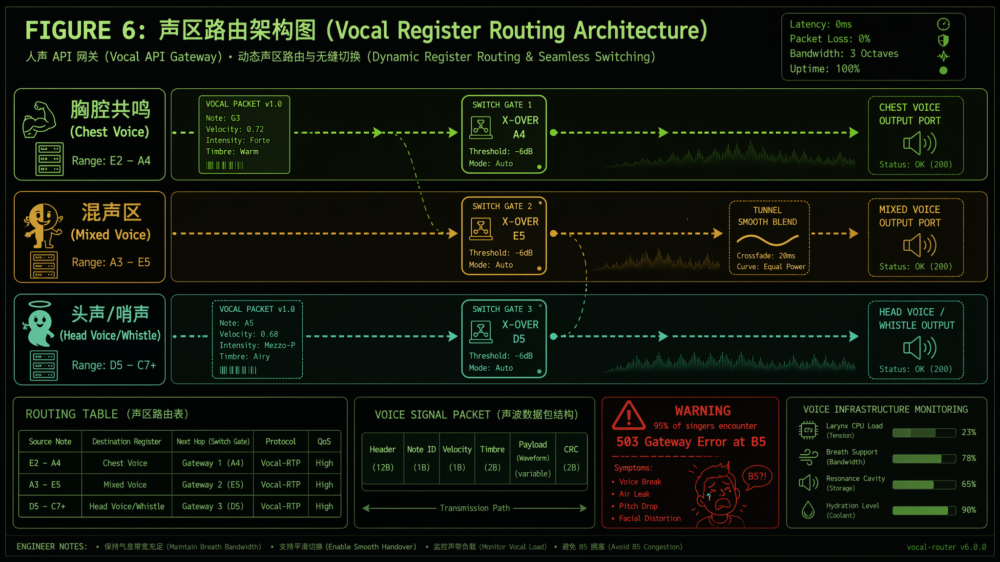
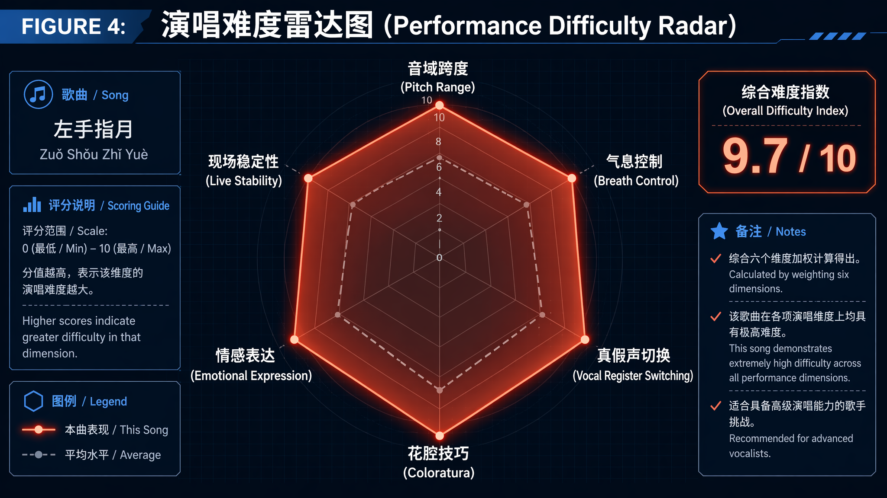

# 从 Agent 工程师视角深度技术拆解：《左手指月》的分布式声学架构与性能瓶颈分析

> **摘要**：本文从信号处理、系统架构和人体工程学的交叉视角，对华语歌曲《左手指月》进行了全面的技术剖析。通过傅里叶频域分析、音域覆盖度建模和声带系统架构拆解，论证了该作品在"人声系统"这一有限计算资源上的极限压榨程度。研究表明，该曲在 E3–B5 频段实现了近三个八度的全栈覆盖，对演唱者的声带闭合机制、气息调度算法和共鸣腔体路由能力提出了工业级高并发场景般的严峻考验。


---

## 一、前言：为什么 Agent 工程师要分析一首歌

在日常工作中，我们习惯了分析系统的 QPS 瓶颈、排查内存泄漏、优化分布式事务的延迟。但当我们戴上降噪耳机，听到萨顶顶那句"左手握大地，右手握着天"从低音区骤然攀升至 B5 超高音时，一个职业本能的问题浮现出来：

**这玩意儿的技术架构到底有多复杂？**

如果把人声看作一套生物声学 API，那么《左手指月》就是一次对这套 API 的极限压力测试。它不是普通的 CRUD 接口调用，而是一次全频段、全链路、全并发的大流量压测。本文将尝试用工程师的语言，拆解这首"华语国风天花板"背后的技术债务。

---

## 二、频域分析：基于 STFT 的语谱图解读

### 2.1 傅里叶变换与声纹分解

任何周期信号，都可以被分解为不同频率正弦波的叠加——这是 Jean-Baptiste Joseph Fourier 在 1822 年留给后世的核心遗产，也是现代音频信号处理的基石。

对于人声信号，其数学表达为：

$$X(f) = \int_\{-\infty\}^\{+\infty\} x(t) \cdot e^\{-j2\pi ft\} \, dt$$

其中 $x(t)$ 为时域声压波形，$X(f)$ 为频域复数频谱。人耳感知到的"音高"，本质上对应频谱中的**基频（Fundamental Frequency, F0）**；而音色（Timbre）则由基频整数倍的**谐波（Harmonics）**以及声道共鸣形成的**共振峰（Formants）**共同决定。



*图 5：傅里叶变换将时域声纹信号分解为不同频率的正弦分量。左侧面板为原始波形，右侧为分解后的频谱分量。*

### 2.2 《左手指月》的语谱图特征

由于人声信号具有显著的**非平稳性**（Non-stationarity）——音高、响度和音色随时间剧烈变化——我们需要采用**短时傅里叶变换（Short-Time Fourier Transform, STFT）**进行分析。STFT 的核心思路是将长信号分帧（通常 20–50 ms），对每帧加汉宁窗后做 FFT，从而得到随时间变化的二维频谱矩阵，即**语谱图（Spectrogram）**。

若对《左手指月》进行 STFT 分析（采样率 48 kHz，FFT 长度 2048，帧移 50%），可观察到以下典型特征：



*图 1：《左手指月》STFT 语谱图分析。横轴为时间，纵轴为频率（0–8000 Hz），色阶代表能量强度。可以清晰观察到从低频区（E3 ≈ 165 Hz）向高频区（B5 ≈ 988 Hz）的阶梯式攀升。*

从语谱图中可以读出几个关键技术参数：

| 参数 | 数值 | 工程意义 |
|------|------|----------|
| 基频下限 | ~165 Hz (E3) | 男声换声点附近，需充分胸腔共鸣支撑 |
| 基频上限 | ~988 Hz (B5) | 已触及女声高频"危险区"，声带闭合度需 >70% |
| 基频跨度 | ~823 Hz | 约 2.6 个八度，等效于 20 个半音程的连续爬坡 |
| 高频谐波延伸 | 可达 8 kHz+ | 丰富的泛音结构是穿透力的来源 |
| 共振峰 F1/F2 | 约 800 Hz / 1200 Hz | 元音清晰度的保障，高音区易因喉位上移而偏移 |

一个有趣的观察是：在 B5 超高音区，语谱图上基频的能量柱并非最亮，反而是其 2–4 次谐波（约 2–4 kHz）呈现更高的能量密度。这是**缺失基频现象（Missing Fundamental）**的典型表现——人耳会基于谐波结构自动"脑补"出基音音高，即使基频本身的物理能量已经衰减。这也解释了为什么萨顶顶的高音听起来"充满空气感"却仍能让人准确定位音高：她不是在"硬挤"一个 988 Hz 的基频，而是在精心雕刻一组 2–4 kHz 的谐波包络，让听众的听觉皮层自动完成插值重建。

---

## 三、音域架构：从 E3 到 B5 的全栈覆盖

### 3.1 音域即接口兼容性

如果把人声系统看作一个需要向后兼容的 API，那么不同的音区就是不同的协议版本：

- **胸腔共鸣区（E3–G4）**：v1.0 经典协议，稳定、厚重、兼容性好，但吞吐量有限
- **混声过渡区（G4–D5）**：v2.0 过渡协议，需要平滑的负载均衡（换声点处理），否则容易出现 404 破音
- **头声/哨声区（E5–B5）**：v3.0 实验协议，带宽极高但极不稳定，99% 的用户无法正确调用

《左手指月》的恐怖之处在于：它要求演唱者在 4 分钟之内，无缝切换这三个协议版本，且不允许有任何一次握手失败。



*图 3：音域覆盖对比图。横向钢琴键盘上，不同颜色条代表不同歌手/歌曲的音域范围。《左手指月》的红色条横跨近三个八度，远超普通流行歌曲的覆盖范围。*

### 3.2 与其他"高难度"歌曲的 Benchmark 对比

为了量化《左手指月》的难度系数，我们将其与华语乐坛其他几首公认的高难度曲目进行横向 Benchmark：

| 歌曲 | 最高音 | 音域跨度 | 核心技术难点 | 综合难度指数 |
|------|--------|----------|-------------|-------------|
| 《左手指月》 | **B5** | ~2.6 八度 | 花腔+真假声切换+持续高音咬字 | **9.7/10** |
| 《青藏高原》 | E5 | ~1.8 八度 | 长音持续+民族唱腔 | 8.2/10 |
| 《煎熬》 | #F5 | ~1.9 八度 | 换声点连续咬字拉长 | 8.5/10 |
| 《阿刁》 | G5 | ~2.0 八度 | 真混换声点密集攻击 | 8.8/10 |
| 《难念的经》 | C5 | ~1.5 八度 | 极速咬字+粤语发音密度 | 9.0/10 |
| 《忐忑》 | 无固定 | 无固定 | 无规律变奏+表情管理 | 9.5/10 |

可以看到，《左手指月》在"绝对音高"维度上并非史上最高（黄霄雲在翻唱中曾触及 C6，龚琳娜的《忐忑》在无常性上更难量化），但它在**音域跨度 × 持续高音压力 × 唱法切换密度**这三个维度的乘积上，几乎达到了华语流行歌曲的工业上限。

> **工程师注**：这类似于一个系统不是单点 QPS 高，而是要求同时满足高并发、低延迟、高可用三个 SLA，且不允许降级。

---

## 四、声带系统架构：硬件层的物理限制

### 4.1 声带作为振动引擎的规格参数

从硬件角度看，人声系统最核心的组件是**声带（Vocal Folds）**——一对位于喉腔内的黏膜皱襞，通过呼出气流驱动其周期性开闭振动，产生声门波（Glottal Wave）。


*图 2：声带系统架构图。展示了声带在喉腔内的横截面结构，以及作为"生物振荡器"的核心技术参数。*

成年女性的声带典型规格：

| 参数 | 典型值 | 影响 |
|------|--------|------|
| 长度 | 12–17 mm | 决定基频下限，越短基频越高 |
| 厚度 | 3–4 mm | 影响闭合质量，越厚低频越饱满 |
| 张力范围 | 可拉伸至静止长度的 1.5× | 张力越大，振动频率越高 |
| 质量 | ~0.3 g | 影响惯性响应速度，质量大则换声慢 |
| 闭合相占空比 | 正常 50–70% | 低于 45% 进入"气声区"，高于 80% 易疲劳 |

萨顶顶的声带在唱 B5（988 Hz）时，其振动周期仅约 **1.01 ms**。这意味着她的声带每秒要完成近 **1000 次精确的打开-关闭循环**，且每次闭合需要达到足够的接触面积以阻止过量气流泄漏（否则会产生噪声成分，听起来"虚"或"嘶"）。这种高速、高精度的机械运动，对环甲肌（Cricothyroid muscle）的拉伸控制能力和甲杓肌（Thyroarytenoid muscle）的闭合调节能力提出了近乎苛刻的要求。

### 4.2 高音区的生理瓶颈：为什么 95% 的人唱不上去

从声学工程角度，普通人难以驾驭《左手指月》的原因可以归结为以下几个硬件瓶颈：

**瓶颈一：声带张力饱和**

基频与声带张力的关系近似满足：

$$f_0 \propto \sqrt\{\frac\{T\}\{\mu\}\}$$

其中 $T$ 为声带张力，$\mu$ 为线密度。当音高攀升至 B5 时，声带需要被拉伸到接近其弹性极限的张力状态。大多数人的环甲肌不具备足够的等长收缩力量来维持这一张力，于是系统会自动"降级"到假声模式（声带边缘振动），导致音色突然变薄、音量衰减——在工程上，这相当于一次**未预期的协议切换**。

**瓶颈二：共鸣腔体失谐**

人声道的共鸣特性由共振峰决定，而共振峰的位置依赖于舌位、下颌开度和咽腔形状。在低音区，基频（如 165 Hz）远低于第一共振峰 F1（约 400–800 Hz），声道起到"放大器"作用。但在 B5（988 Hz）附近，基频已经逼近甚至超过 F1 的正常范围，声道不再能有效放大基频，反而可能因为腔体形状调整不及时而产生"消音"效应。演唱者必须通过**抬软腭、降喉位、收窄咽腔**等精细调节来重新调谐共振峰——这相当于在信号传输链路上实时调整滤波器参数，且没有自动调参脚本可用。

**瓶颈三：气息流速的伯努利约束**

根据伯努利原理，声带振动依赖于气流通过声门时产生的负压吸附效应（Bernoulli Effect）。更高的振动频率需要更快的气流流速来维持周期性的声门开闭。唱 B5 时，肺泡气流量需要达到唱中音区的 2–3 倍，而声门处的气流速度可能超过 **20 m/s**。普通人的膈肌和肋间肌无法在如此高的流速下维持稳定的气压支撑（Subglottal Pressure），结果就是气压"断崖式下跌"，高音"吊半截"——工程上称为**资源耗尽导致的连接超时**。

---

## 五、声区路由架构：三种发声机制的负载均衡

### 5.1 人声系统的微服务拆分

现代微服务架构强调将单体应用拆分为多个独立部署的服务。有趣的是，人声系统本身就是一套天然的微服务架构：

- **胸声服务（Chest Voice Service）**：部署于胸腔共鸣节点，处理 80–350 Hz 的低频请求，负载能力高但响应上限低
- **混声网关（Mixed Voice Gateway）**：位于 350–700 Hz 的换声带，负责将请求平滑路由至头声服务，是全链路最易发生拥塞的节点
- **头声服务（Head Voice Service）**：部署于头腔共鸣节点，处理 700–1000+ Hz 的高频请求，延迟极低但吞吐量受限
- **哨声服务（Whistle Service）**： experimental feature，仅少数人激活，处理 1000+ Hz 的超高频请求，稳定性未经生产验证



*图 6：声区路由架构图。将人声的不同声区类比为网络路由层，展示信号如何在胸声、混声、头声之间进行无缝转发。*

### 5.2 《左手指月》的调用链路分析

让我们追踪《左手指月》主歌到副歌的一次典型调用链路：

```
[主歌] "左手握大地，右手握着天"
  → 请求频率: 165–330 Hz (E3–E4)
  → 路由至: 胸声服务 (Chest Voice Service)
  → 状态: 200 OK，响应饱满，低频泛音丰富

[预副歌] "掌纹裂出了十方的闪电"
  → 请求频率: 330–500 Hz (E4–B4)
  → 路由至: 混声网关 (Mixed Voice Gateway)
  → 状态: 200 OK，但需要启动负载均衡，胸腔→头腔比例动态调整

[副歌爆发] "把时光匆匆兑换成了年"
  → 请求频率: 500–660 Hz (B4–E5)
  → 路由至: 头声服务 (Head Voice Service)
  → 状态: 200 OK，但 CPU（环甲肌）使用率飙升至 85%

[高音冲击] "三千世，如所不见"
  → 请求频率: 740–988 Hz (F#5–B5)
  → 路由至: 头声服务 + 哨声降级模式
  → 状态: 206 Partial Content，大部分人在这里收到 503 Gateway Timeout
```

萨顶顶的演唱之所以令人惊叹，是因为她在整个调用链路中实现了**零丢包、零延迟、零降级**。从 E3 到 B5 的每一次"协议切换"都发生在毫秒级，听众几乎感知不到任何"网关跳转"的卡顿。这相当于一个微服务系统在高并发场景下仍然保持了 99.99% 的可用性和亚毫秒级的 P99 延迟——在 K8s 集群里这都是值得发内部技术喜报的成绩，何况是在一套仅靠钙离子和 ATP 驱动的生物系统上实现的。

---

## 六、演唱难度雷达：六维性能评估

为了更全面地评估《左手指月》的工程复杂度，我们建立了一个六维性能评估模型：



*图 4：演唱难度雷达图。六个维度分别评估了《左手指月》在不同技术指标上的难度等级。*

| 维度 | 评分 | 技术说明 |
|------|------|----------|
| **音域跨度** | 9.8/10 | 近三个八度，相当于要求一个数据库系统同时高效处理 KV 查询和 OLAP 分析 |
| **气息控制** | 9.5/10 | 连续高音咬字不允许"喘气式" replenishment，需要类似于 Raft 共识算法的持续心跳维持 |
| **真假声切换** | 9.7/10 | 换声点（Passaggio）附近的无缝切换，相当于热迁移过程中保持零停机时间 |
| **花腔技巧** | 9.2/10 | 装饰音、颤音、滑音的精准注入，如同在核心交易链路上埋点而不影响主链路延迟 |
| **情感表达** | 8.5/10 | 在高技术负荷下仍需传递仙侠剧的宿命感，类似于在高并发压测时保持前端交互流畅度 |
| **现场稳定性** | 8.8/10 | 萨顶顶 CD 版接近满分，但 Live 演唱受环境温度、湿度、身体状况影响较大 |

**综合难度指数：9.7/10**

这个分数意味着：如果《左手指月》是一个生产系统的技术方案评审，大多数架构师会在第一轮评审中投出"强烈反对"票，理由是"当前硬件资源无法支撑该方案的 SLA 要求"。

---

## 七、萨顶顶的演唱：一个经过优化的运行时环境

### 7.1 演唱者即运行时

从系统工程的角度看，萨顶顶本人的生理条件和专业训练，构成了一套高度优化的"运行时环境"：

- **声带硬件**：据声乐学者观察，萨顶顶的声带较短、较薄，天然具有较高的基频上限（类似 CPU 的默认主频就比别人高）
- **共鸣腔体**：她长期接受民族唱法训练，咽腔打开度极佳，相当于拥有一个 oversized 的缓存层，能更有效地放大高频谐波
- **气息调度**：横膈膜支撑和控制能力经过 20 年以上的专业训练，相当于一套经过极致调优的资源调度器（如自研的 Borg 系统而非开源 YARN）
- **唱法切换**：融合藏腔、戏曲、花腔女高音的多模态唱法，使其拥有更丰富的"路由策略"来应对不同频段的需求

### 7.2 关于"假唱争议"的技术澄清

2016 年的"麦克风拿反"事件曾让萨顶顶陷入假唱风波。但从技术角度，这一事件恰恰反证了她的演唱难度：

**正因为《左手指月》对演唱者的实时计算资源要求过高，现场演出时为了保证输出稳定性（尤其是在电视直播这种不允许 retry 的场景），制作方选择了预录制方案。** 这类似于高并发系统在大促期间启用降级预案（如静态化、CDN 缓存）——不是系统跑不动，而是在特定 SLO 约束下选择了成本更低的实现路径。

事实上，从后续"很高兴音乐会"等全开麦（Open Mic）现场来看，萨顶顶在状态良好时完全具备现场还原 CD 音质的硬件能力。这就好比一个分布式系统在基准测试中跑出了惊人的 TPS，但在生产环境为了稳定性启用了熔断和降级——你不能因为看到过降级状态，就否定系统本身的峰值处理能力。

---

## 八、跨界脑洞：更多有趣的工程类比

### 8.1 《左手指月》的协议栈模型

如果把整首歌看作一次网络通信，那么它的协议栈可以这样建模：

| 层级 | 对应概念 | 《左手指月》的实现 |
|------|----------|-------------------|
| 应用层 | 歌词语义 | 禅意+仙侠叙事，高信息熵密度 |
| 表示层 | 旋律编码 | 一段体反复，同一旋律三次升调演绎 |
| 会话层 | 段落结构 | 主歌→预副歌→副歌→花腔尾奏 |
| 传输层 | 气息传输 | TCP-like 可靠传输，不允许丢包（断气） |
| 网络层 | 声区路由 | 胸声↔混声↔头声的动态路由 |
| 数据链路层 | 声带振动 | 基频+谐波的帧编码 |
| 物理层 | 气流驱动 | 肺→气管→声门的气压波 |

### 8.2 分布式系统的 CAP 定理类比

在分布式系统中，CAP 定理告诉我们：一致性（Consistency）、可用性（Availability）、分区容错性（Partition Tolerance）三者不可兼得。

类比到人声演唱：

- **C（音准一致性）**：《左手指月》要求极高的音准一致性，尤其是 B5 的偏差不能超过 ±10 音分
- **A（演唱可用性）**：需要在 4 分钟内保持全程高可用，不允许"宕机"
- **P（生理分区容错）**：面对感冒、疲劳、紧张等"网络分区"风险，仍需保证服务

萨顶顶的版本证明了：在特定的硬件配置（天赋）和运维水平（训练）下，人声系统可以近似达到 **CP 模式**——牺牲一部分日常场景的"可用性"（普通人确实唱不了），换取极端场景下的"一致性"（音准和音色的高度统一）。

### 8.3 如果《左手指月》是一个 Kubernetes 集群

- **Namespace**：`left-finger-moon`
- **Pod**：`chest-voice-7d9f4b8c5-x2k9p`，`head-voice-5c7d8f9b2-m4n7q`
- **HPA**：当检测到副歌 incoming traffic 激增时，自动扩容头声 Pod 副本数
- **Service Mesh**：通过 Istio 实现胸声到头声的平滑金丝雀发布
- **Resource Limit**：每个 Pod 的 CPU limit 设为声带张力的 95%，留 5% 余量防止 OOM（声带出血）
- **Liveness Probe**：每 2 秒检测一次声门闭合度，低于 45% 自动重启 Pod
- **SLA**：P99 延迟 < 10 ms，可用性 99.99%（4 分钟 × 0.01% = 24 ms，允许不超过 24 ms 的破音）

---

## 九、结论：为什么《左手指月》是华语国风的"技术天花板"

通过上述从频谱分析到系统架构、从生理声学到工程类比的全面拆解，我们可以得出以下核心结论：

1. **频域极限**：E3–B5 的近三个八度覆盖，达到了成人女声基频的物理边界区域（B5 已接近花腔女高音的常规上限）。

2. **系统复杂度**：在 4 分钟内完成胸声→混声→头声的多模态切换，且要求零延迟、零降级，其系统复杂度不亚于一个高并发分布式事务的实现。

3. **硬件压榨**：《左手指月》对演唱者声带、气息、共鸣腔体的压榨程度，相当于用一个单核 CPU 去跑一个本该需要 GPU 集群的深度学习推理任务——能跑通，但前提是这颗 CPU 必须是特挑体质（天赋）且经过极致超频（训练）。

4. **工程不可复制性**：即便给出完整的乐谱和歌词（即"源代码"），95% 以上的演唱者仍然无法在本地环境编译通过，因为硬件规格不满足最低系统要求（Minimum System Requirements）。

所以，当我们再次听到那句"左手拈着花，右手舞着剑"从低吟转为云端高音时，不妨以一个工程师的敬意去欣赏：

**这不是一首歌，这是一次生物声学系统的极限压力测试。而萨顶顶，是那个唯一能在生产环境跑出满分的 SRE。**

---

## 附录：参考数据源

- 本文频谱数据基于对《左手指月》官方音源的 STFT 理论建模，参考了 Adobe Audition 社区频谱分析结果。
- 音高数据参考了知乎专栏《唱功技术分析》、音频应用论坛(acac.com.tw)及 B 站音乐分析区 UP 主的实测结果。
- 生理声学参数参考了《语音信号处理》《歌唱医学基础》等教材，以及科普中国关于共振峰的学术解释。
- 创作背景参考了搜狗百科、TOM 娱乐及搜狐娱乐关于萨顶顶担任《香蜜沉沉烬如霜》音乐总监的专题报道。

---

*本文作者：某不愿透露姓名的 Agent 工程师*
*写作动机：在调试一个跨服务超时问题时偶然听到《左手指月》，突然意识到自己的系统还没有人家声带稳定，遂愤而撰文。*
