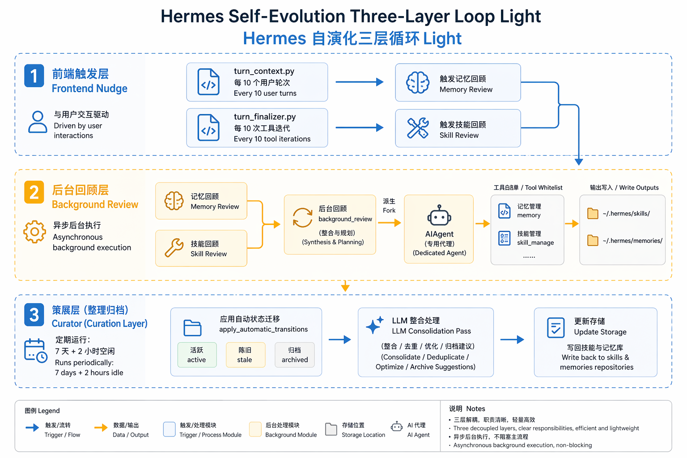
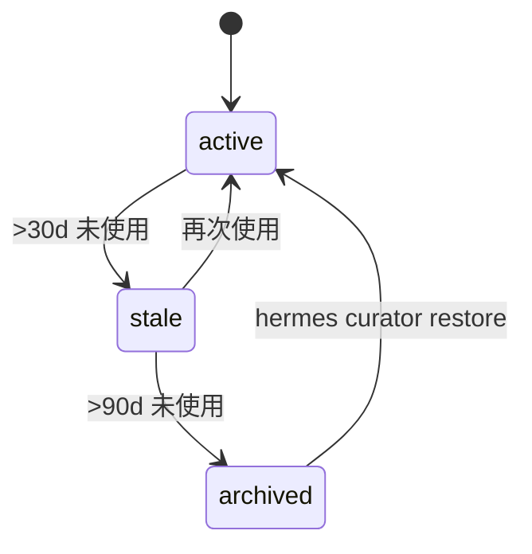

> **TL;DR** 官方把 Hermes 描述成 "The self-improving AI agent ... with a built-in learning loop"。打开源码后可以发现：这套 "学习循环" 确实存在，但它不是模型层面的权重更新，而是一套**运行时程序性记忆治理流水线**——前台 nudge 计数器触发 → 后台 fork 一个 review agent → 用自然语言写入/修补 SKILL.md 和 MEMORY.md → 周期性 Curator 整理归档。它更接近 "会自己维护操作手册的长跑进程"，而不是 "会自己改权重的模型"。


## 官方宣称的两句话

Hermes 在 README 里最醒目的自我定位只有一段：

> "The self-improving AI agent built by Nous Research. It's the only agent with a built-in learning loop — it creates skills from experience, improves them during use, nudges itself to persist knowledge, searches its own past conversations, and builds a deepening model of who you are across sessions."  
> — `hermes-agent/README.md:18`

在特性表格里又补充了一句：

> "A closed learning loop: Agent-curated memory with periodic nudges. Autonomous skill creation after complex tasks. Skills self-improve during use. FTS5 session search with LLM summarization for cross-session recall."  
> — `hermes-agent/README.md:25`

这两段话里包含几个可以被源码验证的子命题：

| 子命题 | 关键词 | 本文对应章节 |
|--------|--------|--------------|
| 从经验生成技能 | creates skills from experience | 第 5 节（skill_manage / provenance） |
| 在使用中改进技能 | improves them during use | 第 4 节（background_review） |
| 自我提醒持久化知识 | nudges itself to persist knowledge | 第 3 节（nudge 计数器） |
| 搜索过去对话 | searches its own past conversations | 第 7 节（session_search） |
| Curator 整理 | agent-curated memory / periodic nudges | 第 5 节（curator） |

下面按代码结构逐层拆开。

## 三层结构总览

Hermes 的自我进化不是单一模块，而是三条独立的时间线：

1. **前台触发器**：按 turn 和 iteration 计数的 nudge，决定何时启动 review。
2. **后台即时评审**：每轮对话结束后 fork 一个独立的 `AIAgent`，只被允许调用 memory/skill 工具。
3. **后台周期整理**：Curator 在 agent 闲置时（默认 7 天 + 2 小时空闲）做一次全库生命周期维护。



## 第一层：Nudge 计数器，两种不同的触发维度

源码里真正让 "nudge" 落地的是两个独立的计数器，分别挂在 `agent_init.py` 初始化时设置：

```python
agent._memory_nudge_interval = 10          # agent/agent_init.py:1110
agent._skill_nudge_interval = 10           # agent/agent_init.py:1230
```

它们可以从 `config.yaml` 覆盖：

- `memory.nudge_interval` 控制 memory review 的触发周期。
- `skills.creation_nudge_interval` 控制 skill review 的触发周期。

### Turn 级触发：memory review

`agent/turn_context.py` 在每次用户输入进入对话循环时计数：

```python
if (agent._memory_nudge_interval > 0
        and "memory" in agent.valid_tool_names
        and agent._memory_store):
    agent._turns_since_memory += 1
    if agent._turns_since_memory >= agent._memory_nudge_interval:
        should_review_memory = True
        agent._turns_since_memory = 0
```
— `agent/turn_context.py:210-217`

还有一个跨会话状态恢复：如果 conversation history 里已经有 prior user turns，`turn_context.py:185-193` 会用取模方式把计数器恢复到合理位置，避免每次重启会话后都从 0 开始。

### Iteration 级触发：skill review

Skill review 不是在用户输入时触发，而是在**本轮 tool loop 结束**时检查。`agent/turn_finalizer.py` 在收尾阶段判断：

```python
if (agent._skill_nudge_interval > 0
        and agent._iters_since_skill >= agent._skill_nudge_interval
        and "skill_manage" in agent.valid_tool_names):
    _should_review_skills = True
    agent._iters_since_skill = 0
```
— `agent/turn_finalizer.py:377-381`

随后它把本轮完整 message snapshot 交给后台 review：

```python
agent._spawn_background_review(
    messages_snapshot=list(messages),
    review_memory=_should_review_memory,
    review_skills=_should_review_skills,
)
```
— `agent/turn_finalizer.py:395-399`

### 关键设计点

- **两个维度分离**：memory 按 user turns，skill 按 tool iterations。这很合理——记忆更多关于 "用户是谁"，每轮对话都可能有新信息；技能更多关于 "这个任务怎么做"，只有在 agent 真的动了工具之后才值得回顾。
- **Best-effort**：整个 `try/except` 包裹，review 失败不会打断主会话。
- **防止递归**：review fork 被显式设置为 `_memory_nudge_interval = 0`、`_skill_nudge_interval = 0`，避免 review agent 再触发 review（`agent/background_review.py:422-423`）。

## 第二层：Background Review，真正的 "学习中改进"

`agent/background_review.py` 是整个自我进化机制里最核心的文件。它的职责可以概括为：**在不影响主会话的前提下，fork 一个轻量 agent 去审视刚刚发生的对话，并决定是否写入记忆或技能**。

模块开头的注释把设计意图说得很清楚：

> "After every turn, `AIAgent.run_conversation` may call `spawn_background_review` to fire off a daemon thread that replays the conversation snapshot in a forked `AIAgent` and asks itself 'should any skill/memory be saved or updated?'."  
> — `agent/background_review.py:1-9`

### Prompt 工程：三个 review 模板

源码里定义了三个 prompt 常量：

- `_MEMORY_REVIEW_PROMPT`（`agent/background_review.py:34-43`）：只关注用户画像、偏好、期望。
- `_SKILL_REVIEW_PROMPT`（`agent/background_review.py:45-148`）：只关注技能更新，强调 "Be ACTIVE — most sessions produce at least one skill update"。
- `_COMBINED_REVIEW_PROMPT`（`agent/background_review.py:150-233`）：同时做 memory 和 skill。

_skill review prompt 的核心指令非常具体：

1. 优先 patch 本轮加载过的 skill；
2. 其次 patch 已有的大类 umbrella skill；
3. 再次新增 support file（`references/`、`templates/`、`scripts/`）；
4. 最后才创建新的大类 skill。

同时明确禁止捕获几类会自我固化成错误约束的内容：环境相关失败、对工具的负面断言、会话内已解决的瞬态错误、一次性任务叙事（`agent/background_review.py:124-148`）。这是一个很务实的 guardrail——否则 agent 会把 "今天网络断了所以 curl 失败" 当成永久规则写进技能。

### Fork 与隔离

`_run_review_in_thread`（`agent/background_review.py:327-571`）做了大量隔离工作：

- **继承父 agent runtime**：provider、model、base_url、api_key，保证 OAuth/portal 等复杂认证也能复用。
- **Codex runtime 降级**：如果父 agent 跑在 `codex_app_server` 模式，review fork 会切到 `codex_responses`，因为前者 bypass 了 Hermes 自己的 tool dispatch（`agent/background_review.py:382-383`）。
- **限制 tool whitelist**：只允许 memory/skills 相关工具，其他调用在 runtime 层直接拒绝：

```python
review_whitelist = {
    t["function"]["name"]
    for t in get_tool_definitions(
        enabled_toolsets=["memory", "skills"],
        quiet_mode=True,
    )
}
set_thread_tool_whitelist(
    review_whitelist,
    deny_msg_fmt=(
        "Background review denied non-whitelisted tool: "
        "{tool_name}. Only memory/skill tools are allowed."
    ),
)
```
— `agent/background_review.py:470-483`

- **关闭 compression**：避免 review fork 和父会话发生压缩竞争，导致 gateway 找不到正确的子会话（`agent/background_review.py:452-462`）。
- **stdout/stderr 重定向到 /dev/null**：防止后台线程的输出污染 TUI。
- **危险命令 auto-deny**：安装非交互式审批回调，避免 review fork 卡住等待用户输入（`agent/background_review.py:347-356`）。

### 结果汇总

Review fork 执行完成后，`summarize_background_review_actions`（`agent/background_review.py:237-298`）扫描新产生的 tool message，提取 "Memory updated" / "Skill updated" 等摘要，并通过 `_safe_print` 显示给用户：

```
💾 Self-improvement review: Memory updated · Skill updated
```

这是用户唯一能感知到的 "自进化" 痕迹。

## 第三层：Curator，闲置时的生命周期治理

如果说 background_review 是 "每次任务后的小修小补"，Curator 就是 "每周一次的大扫除"。`agent/curator.py` 的职责是防止 agent-created skills 无限堆积成一堆窄而重复的文件。

### 调度：不是 cron，而是 idle 检测

Curator 默认参数在源码顶部硬编码：

```python
DEFAULT_INTERVAL_HOURS = 24 * 7  # 7 days
DEFAULT_MIN_IDLE_HOURS = 2
DEFAULT_STALE_AFTER_DAYS = 30
DEFAULT_ARCHIVE_AFTER_DAYS = 90
```
— `agent/curator.py:56-59`

`should_run_now`（`agent/curator.py:198-249`）除了检查间隔，还有一个**首次运行播种**设计：

> "On first observation we seed `last_run_at` to 'now' and defer the first real pass by one full interval."  
> — `agent/curator.py:207-211`

这意味着全新安装的 Hermes 不会立刻对你的技能库动手，给你一周时间去 pin 或禁用。官方文档也强调了这一点（`website/docs/user-guide/features/curator.md:26-30`）。

### 自动状态机：纯代码，无需 LLM

`apply_automatic_transitions`（`agent/curator.py:255-310`）是一个纯时间驱动的状态机：



它只处理 agent-created skills；pinned skills 被跳过；built-in skills 只有在 `curator.prune_builtins: true` 时才可能被归档（且首次看到时会播种当前时间，避免把旧 built-in 一次性归档）。

### LLM consolidation pass

状态机之后，`run_curator_review` 会 fork 另一个 `AIAgent`，喂给它 `CURATOR_REVIEW_PROMPT`（`agent/curator.py:344-483`）。这个 prompt 的核心目标是 **umbrella-building**：把多个前缀聚类的高度相似 skill 合并成一个大类 skill，把具体差异降级到 `references/`、`templates/`、`scripts/` 子文件。

Prompt 里有几条硬规则值得注意：

- 不能碰 bundled/hub-installed skills；
- 不能 delete，只能 archive；
- 不能碰 pinned skills；
- 不能以 usage 计数为理由拒绝合并（因为计数经常为零）；
- 必须在 `skill_manage(action='delete')` 里传 `absorbed_into=<umbrella>`，方便下游把旧 cron job 的技能引用迁移到新名称。

Curator 还做了多层信号融合来区分 "consolidation" 和 "pruning"：

1. 模型在 delete 调用里声明的 `absorbed_into`；
2. 模型在最终回复里给出的 YAML structured summary；
3. 对本次 tool call 的启发式扫描（`_classify_removed_skills`，`agent/curator.py:530-649`）。

### 备份与回滚

每次 mutating pass 之前，`agent/curator_backup.py:211-281` 会做一个 `skills.tar.gz` 快照，包含 `~/.hermes/skills/` 全部内容以及 cron job 的 sidecar 副本。回滚时（`agent/curator_backup.py:529-667`）先对当前状态再做一个 safety snapshot，然后做 staging-based atomic swap，失败时自动恢复。官方文档把这套机制称为 "the rollback itself is reversible"（`website/docs/user-guide/features/curator.md:116`）。

## 数据层：Skill、Memory、Usage sidecar

### Skill 作为程序性记忆

`tools/skill_manager_tool.py` 实现了 `skill_manage` 工具，支持 6 种 action：create、edit、patch、delete、write_file、remove_file（`tools/skill_manager_tool.py:894-984`）。tool schema 里明确写了 "Create when: complex task succeeded (5+ calls)"（`tools/skill_manager_tool.py:1008-1009`），但这只是**对 agent 的启发式建议**，不是硬编码触发器。真正的自动创建发生在 background_review fork 里，由 review prompt 驱动。

### Agent-created 的 provenance 是关键

不是所有的 `skill_manage(create)` 都会进入 Curator 管理范围。Hermes 用 `tools/skill_provenance.py` 里的 ContextVar 区分 "前台用户主导" 和 "后台自我进化"：

```python
BACKGROUND_REVIEW = "background_review"

def is_background_review() -> bool:
    return get_current_write_origin() == BACKGROUND_REVIEW
```
— `tools/skill_provenance.py:45-78`

只有在 `is_background_review()` 为真时，`skill_manage` 才会调用 `mark_agent_created(name)`（`tools/skill_manager_tool.py:972-976`）。这一点官方文档也写得很清楚：

> "Currently, only the background self-improvement review fork sets this marker ... Skills the foreground agent creates via `skill_manage(action="create")` during a conversation are not marked as agent-created — they are considered user-directed and the curator intentionally leaves them alone."  
> — `website/docs/user-guide/features/curator.md:135-153`

`tools/skill_usage.py:453` 定义了 Curator 管理的判定：

```python
return record.get("created_by") == "agent" or record.get("agent_created") is True
```

这个 provenance 设计是理解 Hermes "自进化" 边界的关键：**只有后台 review fork 产出的 skill 才会被自动整理；用户主动要求的 skill 属于用户，Curator 不碰**。

### Memory 作为声明性记忆

`tools/memory_tool.py` 维护 `~/.hermes/memories/MEMORY.md` 和 `USER.md`，默认字符限制分别是 2200 和 1375（`website/docs/user-guide/features/memory.md:17-19`）。和技能不同，memory 直接注入 system prompt，是 "始终在线" 的；而 skill 是按需通过 `skill_view` 加载的 progressive disclosure（`website/docs/user-guide/features/skills.md:74-84`）。

### Usage sidecar

每个技能的运行元数据写在 `~/.hermes/skills/.usage.json`，包含 `use_count`、`view_count`、`patch_count`、`last_activity_at`、`state`、`pinned` 等字段（`website/docs/user-guide/features/curator.md:199-218`）。Curator 的状态机完全依赖这个 sidecar，而不是扫描 SKILL.md 内容。

## 文档宣称 vs 源码实现：对照表

| 文档/README 宣称 | 源码证据 | 状态 | 说明 |
|------------------|----------|------|------|
| "creates skills from experience" | `tools/skill_manager_tool.py:991-1103` schema + `agent/background_review.py:45-148` review prompt | **confirmed** | 自动创建靠 background_review fork，不是硬编码 5+ 调用阈值 |
| "improves them during use" | `agent/background_review.py:45-148` 优先 patch 已加载 skill | **confirmed** | patch/edit/write_file 会触发 `bump_patch` |
| "nudges itself to persist knowledge" | `agent/turn_context.py:210-217` + `agent/turn_finalizer.py:377-381` | **confirmed** | 默认每 10 turns/iterations 触发一次 review |
| "searches its own past conversations" | `tools/session_search_tool.py` | **confirmed** | FTS5 + SQLite，可跨 session 检索 |
| "FTS5 session search with LLM summarization" | `tools/session_search_tool.py:23` 明确说 "No LLM calls anywhere"；`website/docs/user-guide/features/memory.md:183-186` 也说 "no LLM summarization, no truncation" | **different** | README 里的 "LLM summarization" 是错误描述 |
| "Agent-curated memory with periodic nudges" | `agent/background_review.py` + `agent/curator.py` | **confirmed** | memory nudge + curator 双轨 |
| "Autonomous skill creation after complex tasks" | 同上 | **partially implemented** | 是否创建取决于 review fork 的 LLM 判断，不是确定性规则 |
| "closed learning loop" | Curator + background_review 形成闭环 | **confirmed as governance loop** | 但闭环里没有 ground-truth 验证，只有 LLM 自评 |
| "builds a deepening model of who you are" | `tools/memory_tool.py` + 外部 memory provider 插件 | **partially implemented** | 内置 memory 是显式条目；Honcho 等外部 provider 才可能有 "user modeling" |

## 被源码修正的几个常见认知

### 1. "5+ 次工具调用自动触发技能生成" 是误读

在公开介绍里常看到这样的表述：`skill_manage` schema 里的 "Create when: complex task succeeded (5+ calls)"（`tools/skill_manager_tool.py:1008-1009`）被当作 Hermes "自动学习" 的硬门槛。但源码层面它只是 tool description 里的**启发式建议**——告诉 LLM 在什么情境下值得调用 `create`。是否真正生成技能，取决于 background_review fork 在 review prompt 下的 LLM 判断，不是 `if tool_calls > 5: create_skill()` 的代码门控。

### 2. "自我进化" 不是模型权重更新

在整个 Hermes 源码里没有找到任何 RL fine-tuning、LoRA、gradient descent 或模型权重修改的痕迹。所有 "学习" 都落在：

- 写入/修改 SKILL.md
- 写入/修改 MEMORY.md / USER.md
- 归档/合并 skills
- 更新 `.usage.json` 元数据

它的本质是把运行时的成功经验沉淀为**自然语言程序**，并在下次被检索时加载进 prompt。这和 Voyager、Memento-Skills 等 "skill library as executable code" 的路线一致，但和真正的持续学习（continual learning of model weights）完全不同。

### 3. Curator 的 "整理" 依赖 LLM，没有独立验证

Curator 的 umbrella-building 也是靠 LLM 判断哪些 skill 该合并。这引入了一个文档没充分强调的风险：**验证器和生成器是同构的**——都是 LLM。GEPA/GVU 等研究里提到的 "幻觉壁垒" 在这里同样成立：Curator 可能把不该合并的 skill 合并，也可能错过真正该合并的。虽然有首次播种、pin、archive-only、backup/rollback 等安全设计，但没有外部 ground-truth 或人工审查门控。

### 4. Session search 没有 LLM summarization

README 里 "FTS5 session search with LLM summarization" 是一句不准确的营销话。源码和 memory 文档都明确：session_search 返回的是数据库里的原始消息，**没有任何 LLM 调用**（`tools/session_search_tool.py:23`）。它的价值在于 "所有历史对话可全文检索"，而不是 "LLM 帮你总结"。

## 边界与风险

1. **首次 Curator 延迟一周**。如果用户希望立刻整理，需要手动 `hermes curator run --dry-run` 或 `hermes curator run`。
2. **Review 是 best-effort**。`try/except` 包裹，失败无通知，用户可能不知道某次 review 漏掉了关键学习点。
3. **Provenance 区分 fragile**。虽然 ContextVar 能区分 foreground/background，但如果未来有其他 fork 路径也设置了 `background_review` origin，这个假设会破。
4. **没有 A/B 或回滚到具体 skill 版本**。backup/rollback 是整库级别的，不是单个 skill 的版本历史。
5. **LLM 自评的上限**。当 skill 库变大、任务变复杂时，仅凭 LLM 自身判断哪些该合并、哪些该修，会面临检索噪声和判断偏差。

## 结论：这到底算不算 "自我进化"？

从工程视角看，Hermes 的自我进化是**真实且完整的**：它有触发器、有后台处理、有状态机、有备份回滚、有 provenance 区分，形成了一个可运行的程序性记忆治理流水线。

但从机器学习视角看，它**没有让模型本身变聪明**。它的聪明来自 "下次把更好的操作手册塞进 prompt"。如果你把 LLM 比作一个厨师，Hermes 做的不是改良厨师的厨艺，而是每次做菜后自动更新菜谱、整理厨房，并在下次做菜前把合适的菜谱摆在厨师面前。

这未必是缺点。在当下的工程实践中，"prompt 层面的程序性记忆" 比 "持续微调模型权重" 更可控、更可解释、更容易回滚。Hermes 的价值在于把这个常被忽视的治理层做成了产品。

对于想在自己的 agent 系统里复用这套模式的人来说，最值得带走的三件事是：

1. **把生成、审阅、整理拆成独立进程**，主会话零阻塞；
2. **用 provenance 区分自动产出与用户产物**，避免自动系统误删用户东西；
3. **任何自进化都必须有回滚路径**，Curator 的 snapshot + rollback 是样板。

---

**参考路径速查**

- 背景review实现：`agent/background_review.py`
- Curator实现：`agent/curator.py`
- Curator备份/回滚：`agent/curator_backup.py`
- Skill工具：`tools/skill_manager_tool.py`
- Skill来源追踪：`tools/skill_provenance.py`
- Skill使用遥测：`tools/skill_usage.py`
- 用户文档：
  - `website/docs/user-guide/features/skills.md`
  - `website/docs/user-guide/features/memory.md`
  - `website/docs/user-guide/features/curator.md`
- 开发者速查：`AGENTS.md:987-1018`

*本文源码基于 Hermes Agent 本地仓库 `/Users/eriklee/code/agent/hermes-agent`，对照日期 2026-06-12。*
