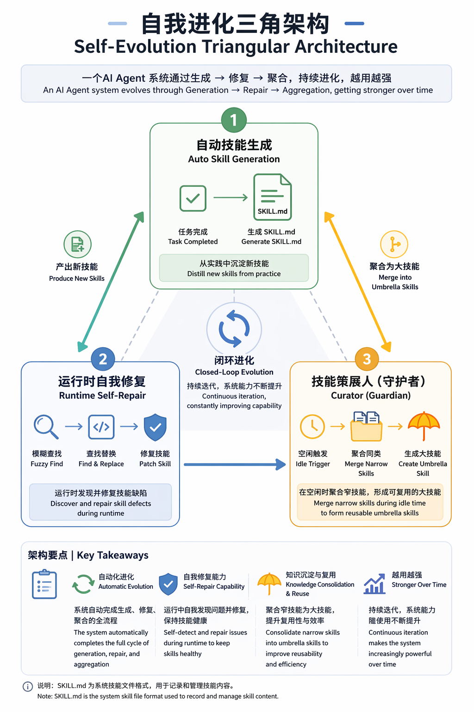
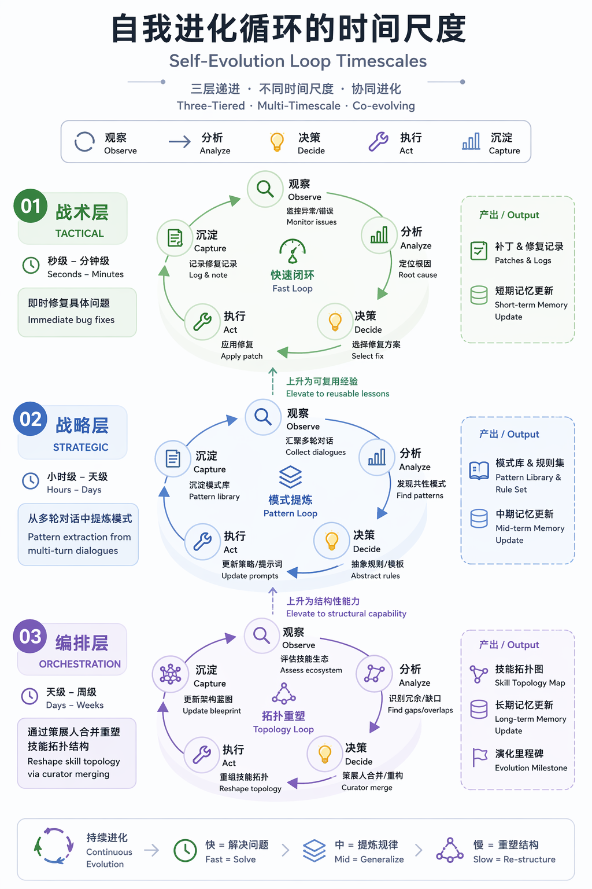
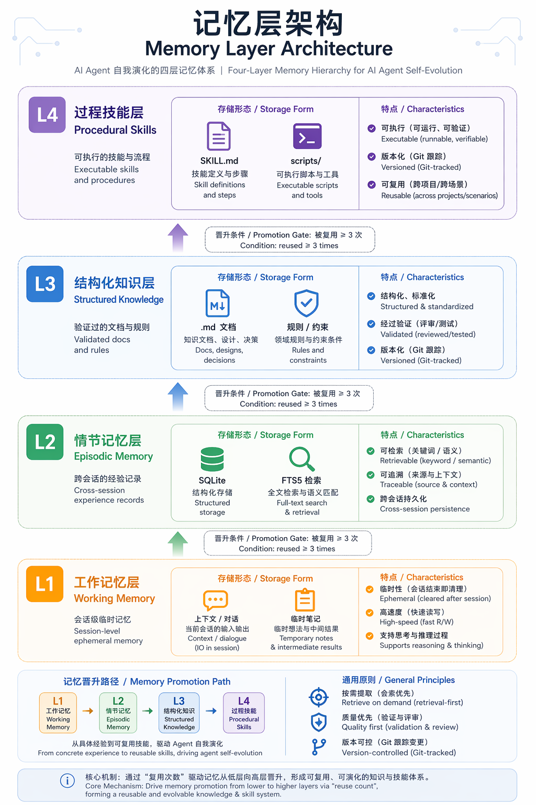
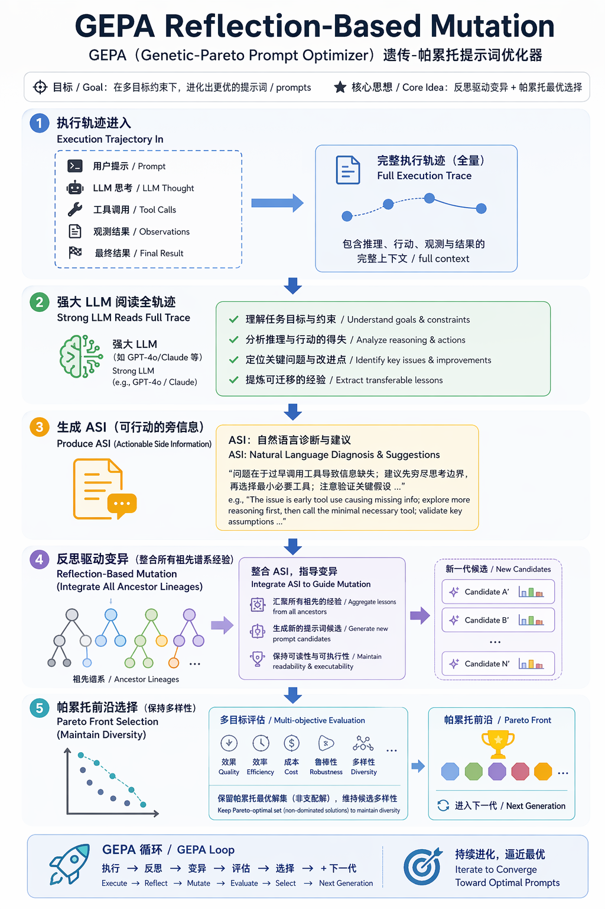

## 那个问题：Agent 跑了 50 次任务之后，它真的变聪明了吗？

想象你有一个 AI agent，每天帮你处理各种任务。第 1 次做某个任务时，它笨手笨脚，连工具调用顺序都搞错。第 10 次，你发现它的表现没什么本质变化。第 50 次——还是差不多。每次犯错它都会说"好的我学到了"，但下次遇到类似场景，该踩的坑一个没少。

这其实不是"模型不够强"的问题。是架构问题。

大多数 agent 把每次对话当作独立 session：没有跨任务记忆，没有技能积累，更没有任何形式的"使用中进化"。Claude Code 靠 CLAUDE.md 和 hooks 勉强记住一些偏好，OpenAI Codex 基本不记。本质上，这些 agent 都是金鱼——每次对话刷新记忆——区别只是 Claude Code 的金鱼缸里贴了一张便签。

Hermes Agent 试图从根本上解决这个问题。

它是 Nous Research 在 2026 年 2 月发布的开源项目（[github.com/NousResearch/hermes-agent](https://github.com/NousResearch/hermes-agent)，MIT 协议），目前已积累约 90K GitHub stars。它的定位很清晰：一个**模型无关的、内置完整自进化闭环**的通用 agent 运行时。

"模型无关"意味着它不绑定特定 LLM——通过 OpenRouter 可以接入 200+ 模型。"自进化"意味着它不只是执行任务，而是在使用过程中持续积累技能、修复错误、整理知识库。有点像：它不但帮你干活，还在干活过程中自己写操作手册、自己修手册里的错误、定期把旧手册归档。

下面拆解这套机制的具体工作原理。讲的不是愿景，而是实际在运行的工程机制。

## 三角架构：自动生成、自我修复、自动整理

Hermes 的自进化系统由三块核心组件构成，三者共同形成一个闭合的进化回路。

**第一块：自动技能生成。**

当 agent 完成一个需要 5 次以上工具调用的复杂任务后，它会在后台自动提炼执行经验，生成一个 SKILL.md 文件，存入 `~/.hermes/skills/`。这个文件包含具体的使用场景、前置条件、步骤和常见坑点。下次遇到类似任务时，agent 会自动检索并加载这个技能。

关键细节：不是所有任务都触发。门槛是"5 次以上工具调用"，这排除了简单查询和单步操作，只沉淀真正需要技能化的复杂工作流。

**第二块：运行时自我修复。**

这可能是三块中最反直觉的机制。技能文件不是一成不变的——agent 在使用技能的过程中，如果发现文件中的某个步骤与实际执行结果不匹配，会通过"模糊查找替换"自动修补。所谓模糊查找，是指用编辑距离或相似度匹配找到技能文件中与错误相关的段落，然后注入修正，而不是要求精确字符串匹配。

这也意味着一件事：技能是会变质的。如果一个技能被修了很多次，可能越来越偏离原始意图。这就引出了第三块。

**第三块：Curator 自动整理。**

Curator 模块和前面两块有本质不同：它不是在任务执行时触发的，而是在 agent 闲置时触发的。

默认规则：每 7 天、agent 空闲超过 2 小时后，Curator 会启动一个 fork 版的自己（独立进程，不影响主 agent），巡检整个技能库。它的核心职责包括：

- **合并窄技能**：如果 agent 创建了多个高度相似的技能（比如"写微信公众号技术评论文""写微信公众号个人散文""写微信公众号文化随笔"），Curator 会识别这些技能的前缀聚类模式，将它们合并为一个"微信公众号文章生成"伞形技能，把各子类型的差异降级为 references 子目录中的变体说明。
- **归档陈旧技能**：如果一个技能长时间未被调用（默认阈值没有公开文档详述，但设计逻辑是 use_count 和 view_count 的衰减函数），Curator 会将其标记为 archived 或直接移除。

此外还有一个 **Nudge 引擎**——两个后台计数器。每 10 个用户回合触发一次记忆整理（从近期对话中蒸馏洞察写入 MEMORY.md），每 10 次迭代触发一次技能评估（检查技能是否有腐化信号）。这两件事都是在一个守护线程中完成的，对用户透明。

三者合在一起的闭环是这样的：

```
任务执行 → 自动生成技能 → 使用中自我修复 → Curator 定期合并归档 → 回到任务执行
```

注意，自动生成和自我修复是在**使用**中发生的，Curator 是在**不使用**时发生的。这是一种关键的设计节奏：用的时候长，不用的时候整理。不浪费任务执行时的上下文窗口。



## 自进化循环的工程结构：三阶段、三级、多时间尺度

把三角架构抽象一层，会发现自进化已经收敛为一种经典的三阶段范式。几乎所有做了自进化的 agent 系统——从学术界的 Reflexion（NeurIPS 2023）、Voyager（2023）、Memento-Skills（2026），到 Hermes 这种生产级框架——核心循环都是同一个结构：

**经验收集 → 反思提炼 → 更新部署**

阶段一，经验收集。Hermes 的做法是记录完整执行轨迹：输入、输出、工具调用序列、错误消息、推理日志。和 Voyager 用 Minecraft 的 `bot.chat()` 记录环境中间状态、Reflexion 保存完整轨迹上下文一样——关键不是记了多少，而是记了**什么结构**。非结构化的日志堆在存储里等于没有。

阶段二，反思提炼。这是自进化"智能"的核心来源。不是把失败日志丢给 LLM 让它总结，而是做**对比反思**——同时喂入成功轨迹和失败轨迹，让模型诊断"为什么 Case A 成功了而 Case B 失败了"。这种对比产生的洞察质量远高于单轨迹反思。

阶段三，更新部署。在 Hermes 里，这分别是技能文件写入、模糊查找替换 write、以及 Curator 的合并/归档操作。所有变更都走 Git 分支 + PR，不直接提交。即使 Hermes 自动生成技能，最终也是通过人工审查的 PR 部署。

有意思的是，这个循环在三个抽象层次上同时运作：

| 层次 | 时间尺度 | 做什么 | 例子 |
|------|---------|--------|------|
| 战术级 | 秒-分钟 | 即时纠错 | 任务失败 → 诊断 → 修补技能文件 |
| 战略级 | 小时-天 | 提炼行为模式 | Nudge 引擎从多轮对话中蒸馏洞察 |
| 编排级 | 天-周 | 重塑技能拓扑 | Curator 合并窄技能为伞形技能 |



这种多时间尺度设计的意义在于：它同时解决了"这个 bug 立刻要修"和"我发现自己总是在重复创建相似的技能"这两种完全不同性质的问题。前者需要实时，后者需要后见之明。

## 记忆分层：为什么"临时想法"和"程序性技能"不能放一起

前面的讨论一直在说"技能""知识""经验"，但它们到底存在哪、怎么组织？

Hermes 和它的学术同类在这个问题上高度一致：自进化的记忆需要分层，而且分层不能太粗也不能太细。跨系统的实践中收敛为四层：

**L1 · 工作记忆。** 当前对话上下文的全部内容——工具调用链、输入输出、中间推理。Reflexion 称之为短期记忆，Voyager 留 4 轮精炼缓冲区（代码 + 反馈 + 错误 + 批评）。这层的生命周期是单次会话，不跨 session 保留。

**L2 · 情节记忆。** 跨会话保留的"这段经历"。Hermes 用 SQLite + FTS5 全文搜索引擎实现，每段记忆经过 LLM 摘要化后存储，支持关键词检索和语义召回。Generative Agents（Stanford & Google, 2023）那篇著名论文的三因素检索是这一层的最优雅实现：**新近度**（指数衰减，衰减因子 0.995）× **重要性**（LLM 创建时评分 1-10）× **相关性**（embedding 余弦相似度），三者经最小-最大归一化后等权求和。这件事做不做、做多好，直接决定 agent 能否在跨会话时"想起上次踩的坑"。

**L3 · 结构化知识。** 经过验证、可以复用的知识——对 Hermes 来说是 MEMORY.md（故意限制约 2200 字符，强制选择性保留）和内部知识条目。对有自进化设计的 writing-agent-harness（本文作者在维护的一个 AI 写作编排层），这一层是 `docs/` 和 `AGENTS.md`，全部 Git 追踪。

**L4 · 程序性技能。** 最高层——可执行的技能文件 + 脚本。Hermes 的 `~/.hermes/skills/*`，harness 的 `.agents/skills/*`，Voyager 的技能库（向量数据库存储，embedding 为 key、可执行 JavaScript 为 value，top-5 检索返回）。

这四个层级之间的晋升不是自动的，而是有门控条件的。以 writing-agent-harness 的实践为例：

```
临时想法 → .local-memory/
     ↓ 验证为可复用
结构化知识 → docs/ 或 AGENTS.md  
     ↓ 相同任务重复 ≥ 3 次
程序性技能 → .agents/skills/
     ↓ 值得自动化
脚本或 workflow runbook
```

门控条件 "≥ 3 次" 是一个经验参数，它背后对应的工程直觉是：**不要因为一次冲动就把临时想法固化为技能**。

MUR 框架（2025）把这个晋升过程形式化了一个更完善的成熟度模型：Draft → Emerging → Stable → Canonical，晋升标准是多维的——使用频率、时间衰减、以及人类显式确认。这个模型目前被多个开源 agent 项目采用。

一个跨模型尺度的关键发现值得单独提：**经验忠实度不对称**。

在 ACE（Stanford & SambaNova, 2024）的研究中，agent 表现出一种稳定的行为偏差——它忠实使用原始执行轨迹（具体到每一步代码和工具调用），但经常忽略或曲解"凝练经验"——比如摘要、启发式规则、"下次注意 X"这种泛化的教训。即使这些凝练内容是 agent 唯一可获得的历史信息，它也倾向于忽略它们。

这件事的工程含义非常具体：**信息保存优于信息压缩**。你应该增量地增长可搜索的 itemized 知识条目，而不是把经验压缩成越来越短的摘要。压缩会破坏 agent 的行为可获取性——你自以为总结了精华，但 agent 读不懂你的总结，只认原始轨迹。

这也是为什么 Hermes 的技能存储是以完整 SKILL.md（详细步骤）而非抽象的"要点提示"进行的。一个三四百字的 SKILL.md 可能费 token，但它能被 agent 用对。一句"微信文章要注意排版风格"的摘要更省 token，但 agent 不会用。



## GEPA：用自然语言替代梯度来优化 Prompt

如果说前面的三角架构和记忆分层是"结构"——数据怎么存、流程怎么走——那 GEPA 解决的是"算法"：怎么用自然语言反思来替代梯度下降，实现无需训练、无需权重访问的提示词进化。

GEPA（Genetic-Pareto Prompt Optimizer，2025）是迄今为止在"文本自进化"这条线上最务实的算法。它的核心洞察非常优雅：

**不要用标量奖励来优化提示词，用完整的自然语言诊断。**

传统的提示词优化（比如 DSPy 的 MIPROv2 和 RL-based 的 GRPO）都依赖一个标量评分函数：跑一条 prompt → 得到 0.7 分 → 调整参数 → 再跑。但标量评分丢掉了一切中间信息——它告诉你"不行"，但不告诉你"为什么第 3 行的推理跳过了关键前提"。

GEPA 的做法是：用一个强 LLM（推荐 GPT-5 at temperature=1.0）读取**完整执行轨迹**——不是只看输入输出，而是看每一步的工具调用、推理日志、错误消息、编译器输出。然后让它用自然语言诊断：候选方案到底在哪一步失败了、为什么失败、具体怎么改。产出的不是 "-0.3 奖励"，而是 "模型误解了约束条件，它在步骤 2 中假设 feature_flag 已启用，但实际环境未设置"。

GEPA 的作者将这种产物的数据结构命名为 **ASI（Actionable Side Information，可操作辅助信息）**，并明确将其定义为"文本优化的梯度类比"。这个类比不是修辞——它的结构性位置和数学优化中的梯度完全一样：是优化信号，指明下一步优化的方向和强度。

有了 ASI，接下来的"进化"就顺理成章了。GEPA 用了两个遗传算法的核心操作：

**反射式突变。** 对某个候选提示词，生成 ASI 诊断其失败原因，然后基于诊断生成变异后的新版本。关键设计是：突变步骤不仅基于当前候选的 ASI，而是整合"所有祖先谱系的累积教训"。一个好提示词的第 5 代版本，不只是第 4 代的修改——它携带着第 1、2、3、4 代所有失败经验的累积。

**遗传合并。** 传统遗传算法的合并（crossover）是盲目的——随机切分两个父代，拼接起来。GEPA 的做法是基于反思分析进行合并：它先搞清楚每个父代分别在什么类型的任务上成功、在什么类型的任务上失败，然后有针对性地取每个父代的优势部分进行重组。"基于反思"这四个字是核心——它不是盲目的，它知道自己在合并什么。

但还有一个问题：如何防止进化过程过早收敛到局部最优？一个候选方案可能在当前评测集上表现最好，但只是在某些具体维度上刚好碰对了——一旦部署到真实场景就原形毕露。

GEPA 的解法是**帕累托前沿（Pareto Front）选择**。不是只追踪当前最佳候选，而是维护一个集合：所有至少在**一个**评估实例上达到最高分的候选。下轮进化时，按覆盖比例从前沿中采样变异候选——确保在探索新方向的同时，保留已发现的互补策略。

这种维持多样性的策略和"只保留第一名"的贪心选择相比，在复杂任务上差异显著：后者容易过拟合到当前评测集，前者保留了"不同任务可能需要不同策略"的可能性。

样本效率对比是同口径评测中的重要参考：

| 方法 | Metric Call 次数 | 性能 vs GEPA |
|------|-----------------|-------------|
| GRPO | 5,000-25,000+ | 低 6-20% |
| MIPROv2 | 500-2,000+ | 低 10% |
| GEPA | 100-500 | - |

GEPA 用 GRPO 约 1/35 的评测调用量，超越了 GRPO 6-20%。最少 3 个示例即可开始工作。



## 工程上的反模式和真实教训

前面的内容容易给人一种错觉——自进化是完备的、可控的、美好的。但实际工程中，真正有价值的知识往往来自失败。

以下是多个自进化系统在实践中暴露出的关键反模式，按危害程度排列：

**反模式 #1：工具中心而非工作流中心的技能设计。** 当你创建技能文件时，很容易写成"如何用工具 X"——围绕工具的能力来组织步骤。但 agent 执行任务时，它需要的是"完成目标 Y 的端到端流程"——围绕工作流来组织。工具中心的技能会导致 agent 在任务切换时无法复用，因为同一个目标换了个工具就失效了。Hermes 的 Curator 在合并技能时有一个显式检查：如果技能是围绕工具组织的，降级为 reference 而不是提升为技能。

**反模式 #2：无衰减整理导致技能腐化。** 技能文件不会自动过期。随着环境变化（API 改了、工具升级了、workflow 优化了），旧的技能文件变成错误来源。更麻烦的是，agent 可能在任务匹配时检索到旧技能、应用它、然后因为结果不对触发自我修复——但这个自我修复打在了一个已经本应废弃的文件上，浪费了一次修复机会。这就是为什么 Curator 的存在不是 nice-to-have，而是必须长期运行才能保持技能库健康的基础设施。

**反模式 #3：语义相似度路由失败。** 当 agent 试图为新任务匹配已有技能时，基于 embedding 的语义相似度检索是最常用的方案。但有一个非直觉的失败模式：两个任务使用相同的术语但需要完全不同的执行策略。比如"微信公众号发布"和"微信公众号排版"——它们的文本相似度很高（cos 0.91+），但涉及的工具链、步骤序列、前置条件完全不同。Memento-Skills（2026）用 InfoNCE 对比学习训练了一个专门的路由器（Recall@1 0.60 vs BM25 0.32）来解决这个问题——但这本身也是一笔训练成本。

**反模式 #4：缺少验证门控使破损技能持续存在。** 一个技能被自我修复修改后，怎么知道它修对了？如果修复引入了新的 bug，而 agent 在使用时才发现——那等于把 bug 从已知位置搬到了未知位置。所有成熟的演化系统都强制要求：每次技能变更必须有独立的验证步骤。在 Hermes 的 PLAN 中，这意味着基准非退化门控——TBLite、TerminalBench2、YC-Bench 三套独立评测必须都不变差，变更才能通过。

**最后，也是最重要的教训：幻觉壁垒（Hallucination Barrier）。**

这个发现来自 GVU 框架的系统研究。当自进化系统依赖 LLM 来验证 LLM 的输出——即验证器和生成器是同构的——自纠正的可靠性急剧下降。生成器犯的错误，验证器大概率也看不出来。这不是模型能力的问题，而是同质化带来的结构性问题。

工程杠杆是：**强化验证器，不是强化生成器。** Hermes 的设计部分体现了这个原则——Curator 是一个独立的模型实例（fork 出的独立 AIAgent），Nudge 引擎使用独立的审查 agent——但生产实践中的效果验证仍然是一个开放研究问题。

## 设计哲学的分歧：信息该凝练还是该增长？

最后回到一个根本性的设计选择。这个选择贯穿前面讨论的每一项机制。

在所有自进化系统中，关于"经验如何存储和传递"存在三种不同的哲学立场：

**凝练派**（ACE、MUR、writing-agent-harness）认为：经验应该以 itemized 的形式增量增长——一条一条的 playbook 条目、带结构化 YAML 头部的知识单元、带引用的具体规则。不损失性压缩，因为"经验忠实度不对称"证明 agent 会忽略摘要而只认原始轨迹。

**压缩派**（EvoSC、MemSkill）认为：经验必须被蒸馏为紧凑表示——可学习提示 token、RL 训练的记忆控制器、参数化压缩后的向量——否则 token 成本会无限增长。MemSkill 用 PPO + Gumbel-Top-K 训练了一个记忆控制器，决定 Insert/Update/Delete/Skip 每一段记忆，在零样本跨模型/跨领域迁移中展现了较强的泛化能力。

**混合派**（Memento-Skills、Hermes）走中间路线：外部 SKILL.md 作为主要存储，不压缩内容，但路由器（InfoNCE 对比学习 / FTS5 + embedding）负责高效检索。分层升级策略确保只在必要时重构——大多数时候只是增量修补。

当前的实证证据整体偏向凝练派。原因是简单而残酷的：

经验忠实度不对称 + 幻觉壁垒 = **信息保存比压缩更安全**。丢失关键细节的代价远大于多消耗几百个 token 的上下文成本。尤其是在 agent 场景中——上下文窗口虽然有限，但在 100K-1M token 的尺度上，"多读了两个 SKILL.md 文件"几乎不是一个实际的瓶颈。

但这不是定论。随着技能库增长到数百个文件，检索精度和信号覆盖率的矛盾会越来越尖锐。Memento-Skills 的 InfoNCE 路由器是目前最接近工程解法的方案，但它的训练成本（需要构建正负样本对 + 训练奖励模型）仍然很高。

---

回到开头的问题。

一个 agent 跑了 50 次任务后，它变聪明了吗？

Hermes 的回答是：如果你只给它一个执行循环，不会。如果你给它一个**自进化循环**——自动生成技能、运行时自我修复、闲置时 curator 整理、Nudge 引擎定期蒸馏洞察——它会的。不是"模型变聪明了"，而是"系统的知识积累机制让它下次遇到同类任务时有更好的指导"。

这和人类的经验积累不完全一样——但结构已经很像了。
