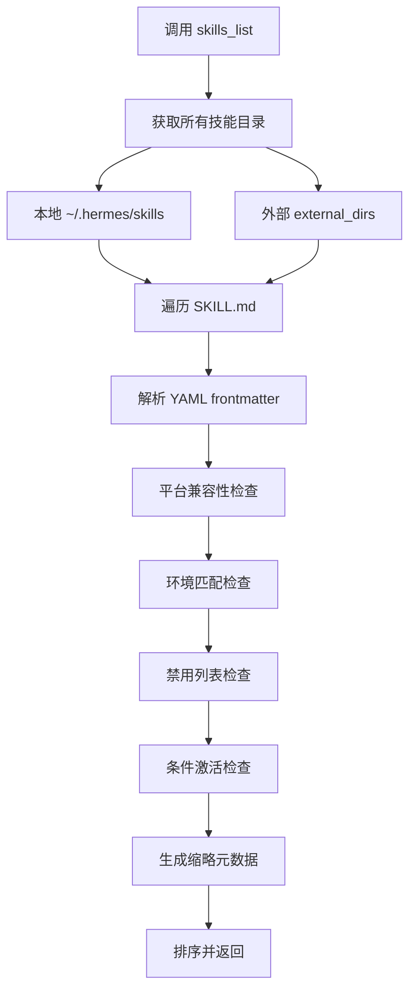
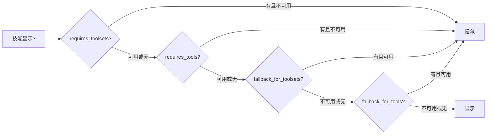
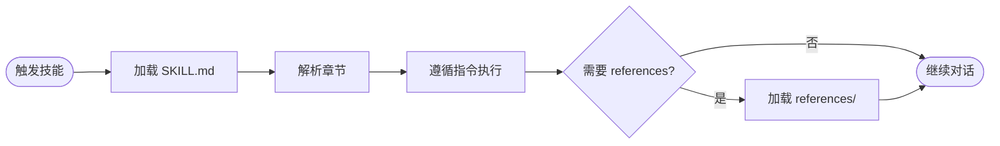
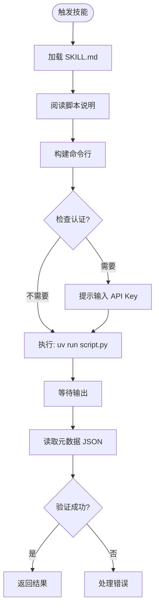
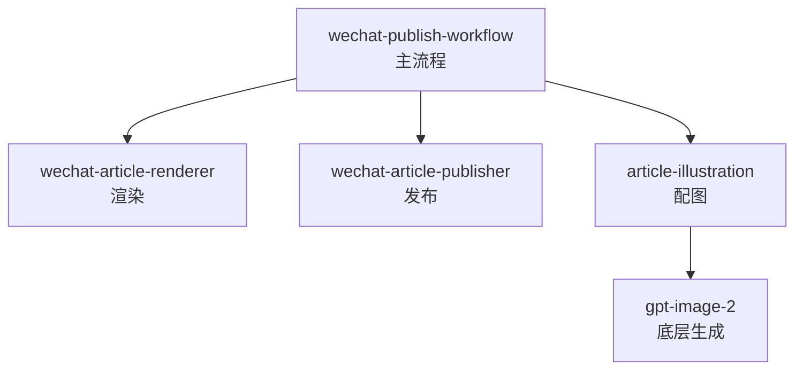
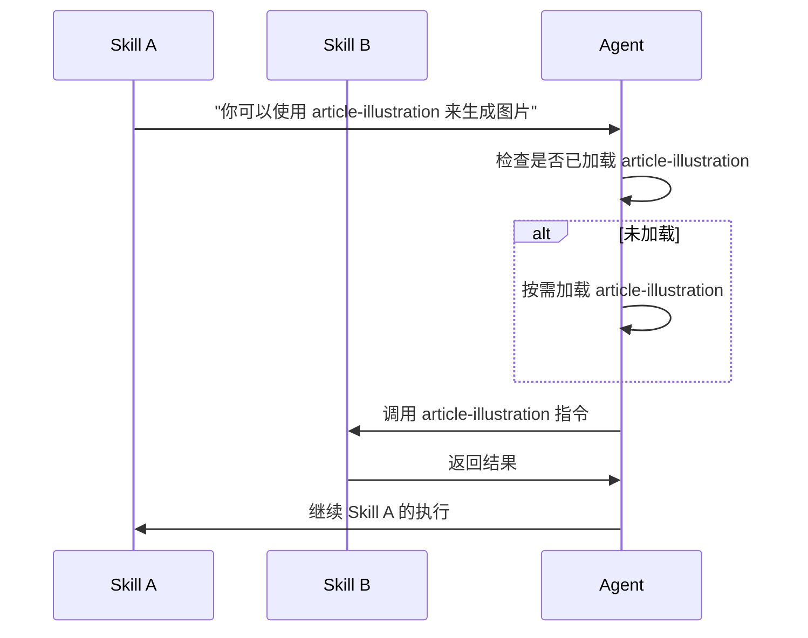
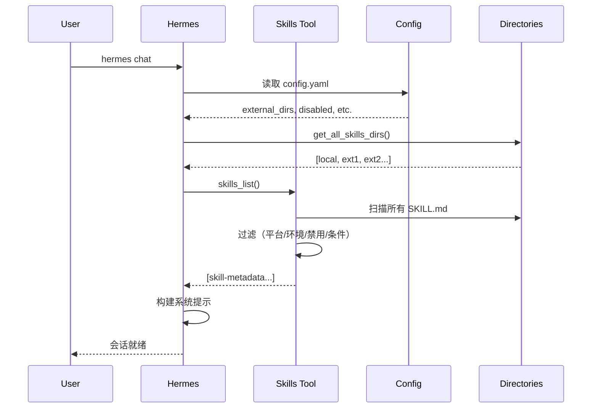
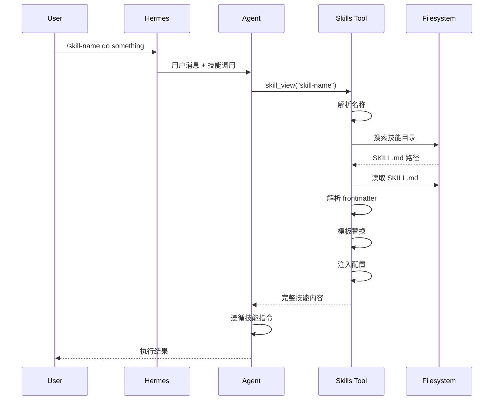

Skill System 是 Hermes Agent 和 Claude Code 的核心能力之一。它将领域知识、工作流和工具能力封装为可复用模块，通过**渐进式披露**平衡了可用性与 token 效率——启动时只加载技能元数据（约 3k tokens），使用时才读取完整内容。

本文结合 `writing-agent-harness` 项目实践，深度解析 Skill System 的设计原理、工程实现与最佳实践。

---

## 一、核心设计理念

### 1.1 设计原则

Skill System 的设计遵循五个核心原则：

1. **渐进式披露（Progressive Disclosure）**：三层加载机制，只在需要时加载对应层级内容
2. **单一真实来源**：`~/.hermes/skills/` 是唯一的读写主目录
3. **外部目录扩展**：`external_dirs` 是只读扩展，除非目录本身可写
4. **本地优先**：同名技能本地版本静默胜出，避免意外覆盖
5. **插件命名空间**：`namespace:skill` 格式隔离插件技能

### 1.2 Token 效率权衡

渐进式披露的核心是在"总能找到技能"和"不浪费 token"之间找到平衡：

```
Level 0: skills_list()    → 仅元数据 (~3k tokens，启动时固定成本)
Level 1: skill_view(name) → 完整内容（通常 10-100k tokens，边际成本）
Level 2: skill_view(name, path) → 特定参考文件（可变，按需加载）
```

Level 0 的 ~3k tokens 是会话启动时就会支付的固定成本；Level 1 和 Level 2 是边际成本，只有使用特定技能时才会产生。这种设计使得系统在拥有数百个技能的同时，仍能保持合理的 token 使用量。

---

## 二、目录结构与索引机制

### 2.1 标准技能目录布局

```
~/.hermes/skills/
├── category/
│   └── skill-name/
│       ├── SKILL.md          # 主文件，必需
│       ├── references/       # 参考文档（按需加载）
│       ├── templates/        # 模板文件
│       ├── scripts/          # 辅助脚本
│       ├── evals/            # 评估用例
│       └── assets/           # 资源文件
├── .hub/                     # Hub 本地状态
│   ├── lock.json
│   ├── quarantine/
│   └── audit.log
├── .bundled_manifest         # 捆绑技能内容哈希清单
└── .archive/                 # 归档目录
```

### 2.2 索引机制：无预构建，按需扫描

Hermes 不使用 SQLite 或 JSON 索引数据库。每次 `skills_list()` 都会重新扫描文件系统：

```python
# 来自 agent/skill_utils.py
def iter_skill_index_files(skills_dir: Path, filename: str):
    """遍历技能目录，返回匹配的文件路径"""
    for root, dirs, files in os.walk(skills_dir, followlinks=True):
        # 实时过滤：原地修改 dirs 列表，避免递归进入排除目录
        dirs[:] = [d for d in dirs if d not in EXCLUDED_SKILL_DIRS]
        if filename in files:
            yield Path(root) / filename
```

```python
EXCLUDED_SKILL_DIRS = frozenset((
    ".git", ".github", ".hub", ".archive",
    ".venv", "venv", "node_modules", "site-packages",
    "__pycache__", ".tox", ".nox", ".pytest_cache",
    ".ruff_cache", ".mypy_cache"
))
```

没有缓存，每次都重新扫描。这在技能数量 < 1000 时完全可接受。

其他设计细节：
- 使用 `os.walk(followlinks=True)`，支持软链接
- 原地修改 `dirs[:]` 列表，避免递归进入排除目录（这是 `os.walk()` 的标准优化技巧）
- `.bundled_manifest` 记录的是内容哈希，不是修改时间：避免时间漂移导致的误更新

### 2.3 project-level 技能：`writing-agent-harness` 实践

在 `writing-agent-harness` 项目中，我们使用项目级技能目录：

```
.agents/skills/
├── article-ideation/
│   └── SKILL.md
├── article-illustration/
│   ├── SKILL.md
│   └── scripts/
│       └── generate_article_illustration.py
├── polish-article/
│   └── SKILL.md
├── wechat-article-renderer/
│   └── SKILL.md
└── wechat-publish-workflow/
    └── SKILL.md
```

通过配置 Hermes 的 `external_dirs`，这些技能可以直接被加载使用，无需复制。更重要的是：Agent 在会话中修改这些技能时，会直接更新 Git 仓库中的文件。

---

## 三、渐进式披露详解

### 3.1 Level 0: 技能列表（skills_list）

这是启动时的第一层加载，目的是让 Agent 知道有哪些技能可用，但不加载具体内容。

**完整流程**：



**关键代码**（tools/skills_tool.py）：

```python
def skills_list():
    """返回所有可用技能的元数据列表"""
    # 1. 收集所有技能
    skills = _find_all_skills()
    
    # 2. 应用过滤器
    filtered = []
    for skill in skills:
        if not skill_matches_platform(skill["frontmatter"]):
            continue
        if not skill_matches_environment(skill["frontmatter"]):
            continue
        if skill["name"] in get_disabled_skill_names():
            continue
        if not _skill_matches_conditions(skill["frontmatter"]):
            continue
        filtered.append(skill)
    
    # 3. 只返回必要字段
    return _sort_skills(filtered)
```

**返回的元数据结构**：
```json
{
  "name": "skill-name",
  "description": "Brief description...",
  "category": "category-name",
  "tags": ["tag1", "tag2"]
}
```

### 3.2 Level 1: 完整技能加载（skill_view）

当用户明确调用某个技能时，才加载完整内容。

**名称解析策略**（四种策略，按优先级）：

```python
# 策略1: 直接路径
direct_path = search_dir / name
if direct_path.is_dir() and (direct_path / "SKILL.md").exists():
    return direct_path / "SKILL.md"

# 策略2: 递归按目录名
for found_skill_md in iter_skill_index_files(search_dir, "SKILL.md"):
    if found_skill_md.parent.name == name:
        return found_skill_md

# 策略3: 按 frontmatter 中的 name 字段
fm, _ = _parse_frontmatter(fm_content)
if fm.get("name") == name:
    return found_skill_md

# 策略4: legacy flat .md 文件
for found_md in search_dir.rglob(f"{name}.md"):
    if found_md.name != "SKILL.md":
        return found_md
```

**名称冲突处理**：

当多个技能有相同名称时，Hermes 不会静默选择，而是报错并列出所有匹配项：

```python
if len(candidates) > 1:
    return json.dumps({
        "success": False,
        "error": f"Ambiguous skill name '{name}': {len(candidates)} skills match",
        "matches": [str(smd) for _, smd in candidates],
        "hint": "Use full relative path instead"
    })
```

**完整加载流程**：

```mermaid
flowchart TD
    A[调用 skill_view(name)] --> B{检查命名空间?}
    B -->|是: plugin:skill| C[插件技能路径]
    B -->|否| D[本地/外部搜索]
    D --> E[构建搜索路径列表]
    E --> F[策略1: 直接路径]
    E --> G[策略2: 目录名递归]
    E --> H[策略3: frontmatter name]
    E --> I[策略4: legacy .md]
    F --> J{找到多个?}
    G --> J
    H --> J
    I --> J
    J -->|是| K[报错: 名称冲突]
    J -->|否| L[读取 SKILL.md]
    L --> M[解析 frontmatter]
    M --> N[平台检查]
    N --> O[前置处理]
    O --> P[模板变量替换]
    P --> Q[内联 shell 执行]
    Q --> R[注入配置值]
    R --> S[返回完整内容]
```

### 3.3 Level 2: 参考文件加载

当技能需要额外参考资料时，可以按需加载特定文件：

```python
skill_view("skill-name", "references/api.md")
```

这会加载技能目录内的指定文件，而不是整个技能。对于包含大量参考资料的技能，这种设计可以显著节省 token。

---

## 四、外部目录解析：缓存设计

### 4.1 配置读取与缓存

```python
_EXTERNAL_DIRS_CACHE: Dict[Tuple[str, int], List[Path]] = {}

def get_external_skills_dirs() -> List[Path]:
    """读取配置中的外部目录，带 mtime 缓存"""
    config_path = get_config_path()
    if not config_path.exists():
        return []
    
    # 缓存键：(绝对路径, mtime_ns)
    try:
        stat = config_path.stat()
        cache_key = (str(config_path), stat.st_mtime_ns)
    except OSError:
        cache_key = None
    
    if cache_key is not None and cache_key in _EXTERNAL_DIRS_CACHE:
        return list(_EXTERNAL_DIRS_CACHE[cache_key])
    
    # 解析配置
    parsed = yaml_load(config_path.read_text())
    raw_dirs = parsed.get("skills", {}).get("external_dirs", [])
    
    # 展开路径
    result = []
    seen = set()
    for entry in raw_dirs:
        expanded = os.path.expanduser(os.path.expandvars(entry))
        p = Path(expanded)
        if not p.is_absolute():
            p = (get_hermes_home() / p).resolve()
        else:
            p = p.resolve()
        if p == get_skills_dir().resolve():
            continue  # 跳过本地目录重复
        if p in seen:
            continue
        if p.is_dir():
            seen.add(p)
            result.append(p)
    
    if cache_key is not None:
        _EXTERNAL_DIRS_CACHE[cache_key] = list(result)
    return result
```

性能权衡：
- `stat()` ~2μs vs YAML 解析 ~85ms：两个数量级的差距
- 缓存键使用 `mtime_ns`（纳秒级时间戳），不是 `mtime`（秒级），避免时间粒度问题
- 每次都返回 `list(cache)` 的副本，避免调用方意外修改缓存
- 缓存是进程级的，重启失效

### 4.2 路径展开规则

```python
# 支持的展开：
- ~ → 用户目录
- ${VAR} → 环境变量
- $VAR → 环境变量（部分支持）

# 相对路径解析：
# 相对于 HERMES_HOME，不是当前工作目录
"relative/path" → get_hermes_home() / "relative/path"
```

相对路径相对于 `HERMES_HOME` 解析，这是一个合理的约定，但需要注意不要与当前项目目录混淆。

### 4.3 `writing-agent-harness` 配置示例

编辑 `~/.hermes/config.yaml`：

```yaml
skills:
  external_dirs:
    - /Users/eriklee/code/my_project/writing-agent-harness/.agents/skills
```

**工作原理**：
1. **搜索顺序**：`~/.hermes/skills/` → `external_dirs[0]` → `external_dirs[1]` → ……
2. **名称冲突**：本地优先。相同技能名的外部版本会被静默忽略
3. **读写行为**：Agent 修改技能时，会更新该技能所在的原始目录（包括外部目录，如果可写）
4. **容错**：配置中不存在的目录会被静默跳过，不报错

---

## 五、条件激活机制

### 5.1 条件字段

技能可以根据工具集可用性自动显示或隐藏：

```python
# 从 frontmatter 提取条件
def extract_skill_conditions(frontmatter: Dict):
    metadata = frontmatter.get("metadata", {})
    hermes = metadata.get("hermes", {})
    return {
        "fallback_for_toolsets": hermes.get("fallback_for_toolsets", []),
        "requires_toolsets": hermes.get("requires_toolsets", []),
        "fallback_for_tools": hermes.get("fallback_for_tools", []),
        "requires_tools": hermes.get("requires_tools", [])
    }
```

### 5.2 判断逻辑



### 5.3 用例：降级方案

```yaml
# duckduckgo-search 技能
metadata:
  hermes:
    fallback_for_toolsets: [web]  # 仅在 web 工具集不可用时显示
```

当用户配置了 FIRECRAWL_API_KEY 时，web 工具集可用 → duckduckgo 隐藏；
当 API key 缺失时，web 工具集不可用 → duckduckgo 自动显示。

条件激活仅影响 `skills_list()` 和系统提示，不阻止显式调用 `skill_view("hidden-skill")`。

---

## 六、平台与环境匹配

### 6.1 平台匹配

```python
def skill_matches_platform(frontmatter: Dict) -> bool:
    platforms = frontmatter.get("platforms")
    if not platforms:
        return True  # 默认所有平台
    
    current = sys.platform
    running_in_termux = is_termux()
    
    for platform in platforms:
        normalized = str(platform).lower().strip()
        mapped = PLATFORM_MAP.get(normalized, normalized)
        
        if current.startswith(mapped):
            return True
        # Termux 特殊处理
        if running_in_termux and mapped == "linux":
            return True
        if running_in_termux and mapped in ("termux", "android"):
            return True
    return False
```

```python
PLATFORM_MAP = {
    "macos": "darwin",
    "linux": "linux",
    "windows": "win32"
}
```

### 6.2 环境匹配

```python
_KNOWN_ENVIRONMENTS = frozenset({"kanban", "docker", "s6"})

def _detect_environment(env: str) -> bool:
    if env == "kanban":
        return (os.getenv("HERMES_KANBAN_TASK") 
                or os.getenv("HERMES_KANBAN_BOARD")
                or _profile_has_kanban_toolset())
    elif env == "docker":
        return is_container()
    elif env == "s6":
        return os.path.isdir("/run/s6") or os.path.isdir("/package/admin/s6-overlay")
    return True  # 未知环境默认通过
```

---

## 七、技能内容前置处理

### 7.1 模板变量替换

```python
# 支持的变量：
${HERMES_SKILL_DIR}  → 技能目录的绝对路径
${HERMES_SESSION_ID} → 当前会话 ID
```

**示例**：
```markdown
Run this script:
node ${HERMES_SKILL_DIR}/scripts/analyze.js
```

渲染为：
```markdown
Run this script:
node /Users/erik/.hermes/skills/category/skill-name/scripts/analyze.js
```

### 7.2 内联 Shell 执行（可选）

配置启用：
```yaml
skills:
  inline_shell: true
  inline_shell_timeout: 10  # 秒
```

使用：
```markdown
Current date: !`date -u +%Y-%m-%d`
Git branch: !`git -C ${HERMES_SKILL_DIR} rev-parse --abbrev-ref HEAD`
```

执行后：
```markdown
Current date: 2026-06-13
Git branch: main
```

---

## 八、配置注入机制

### 8.1 配置声明

技能在 frontmatter 中声明需要的配置：

```yaml
metadata:
  hermes:
    config:
      - key: wiki.path
        description: Path to wiki directory
        default: ~/wiki
        prompt: Wiki directory path
```

### 8.2 配置解析

```python
def resolve_skill_config_values(config_vars: List) -> Dict:
    """从 config.yaml 解析配置值"""
    config_path = get_config_path()
    config = {}
    if config_path.exists():
        try:
            parsed = yaml_load(config_path.read_text())
            if isinstance(parsed, dict):
                config = parsed
        except Exception:
            pass
    
    resolved = {}
    for var in config_vars:
        logical_key = var["key"]
        storage_key = f"skills.config.{logical_key}"
        value = _resolve_dotpath(config, storage_key)
        
        if value is None or (isinstance(value, str) and not value.strip()):
            value = var.get("default", "")
        
        # 展开路径
        if isinstance(value, str) and ("~" in value or "${" in value):
            value = os.path.expanduser(os.path.expandvars(value))
        
        resolved[logical_key] = value
    return resolved
```

### 8.3 注入到技能内容

当技能加载时，配置值会自动追加：

```
[Skill config (from ~/.hermes/config.yaml):
  wiki.path = /Users/erik/wiki
]

# 技能正文...
```

---

## 九、SKILL.md 格式规范

### 9.1 基本结构

```markdown
---
name: skill-name                    # 必需：技能名称（用于调用）
description: Brief description      # 必需：简短描述（<1024 chars）
version: 1.0.0                      # 可选：版本号
author: Your Name                   # 可选：作者
license: MIT                        # 可选：许可证
platforms: [macos, linux]           # 可选：平台限制
metadata:
  hermes:
    tags: [tag1, tag2]              # 标签
    category: category-name         # 分类
    related_skills: [other-skill]   # 相关技能
    # 条件激活
    requires_toolsets: [web]        # 仅在特定工具集可用时显示
    requires_tools: [web_search]    # 仅在特定工具可用时显示
    fallback_for_toolsets: [web]    # 仅在特定工具集不可用时显示
    fallback_for_tools: [browser]   # 仅在特定工具不可用时显示
    # 配置项
    config:
      - key: my.path
        description: Path to something
        default: ~/default/path
        prompt: Enter the path
# 环境变量需求
required_environment_variables:
  - name: API_KEY
    prompt: Enter your API key
    help: Get one at https://example.com
    required_for: full functionality
---

# 技能标题

## When to Use
何时使用这个技能。

## Quick Reference
快速参考，常用命令等。

## Procedure
1. 步骤一
2. 步骤二

## Pitfalls
- 陷阱一：解决方案

## Verification
如何验证成功。
```

### 9.2 推荐章节结构

根据 `writing-agent-harness` 的实践，一个好的技能文档应该包含：

| 章节 | 用途 | 必需 |
|------|------|------|
| `Overview` / `When to Use` | 何时使用，场景说明 | ✓ |
| `Quick Reference` | 快速参考、常用命令 | |
| `Procedure` / `Workflow` | 详细步骤 | |
| `Examples` | 完整示例 | |
| `Pitfalls` / `Troubleshooting` | 常见问题 | |
| `References` | 参考资料链接 | |
| `Script Usage` | 脚本调用说明（如果有） | |

---

## 十、技能执行模式

### 10.1 模式 A：指令遵循模式（无脚本）



**示例：article-ideation**
- 无脚本，纯指令
- Agent 读取 SKILL.md 中的 Workflow 章节
- 按步骤执行：Restate → Calibrate → Offer Angles → Produce Brief

### 10.2 模式 B：脚本调用模式（有脚本）



**示例：gpt-image-2**

```bash
# 脚本调用示例
uv run .agents/skills/gpt-image-2/scripts/gpt_image_2.py generate \
  --prompt "A cozy alpine cabin at dawn, mist over the lake" \
  --size landscape \
  --out output/gpt-image-2/cabin.png
```

让我们以 `gpt-image-2` 为例，看看一个完整的技能脚本架构：

```mermaid
flowchart TB
    subgraph "入口层"
        Main[main() 函数]
        ArgParse[argparse 解析]
        EnvLoad[加载 .env]
    end
    
    subgraph "命令层"
        Gen[generate]
        Edit[edit]
        Batch[generate-batch]
    end
    
    subgraph "核心层"
        Auth[认证管理]
        Model[模型解析]
        Size[尺寸验证]
        Prompt[提示词增强]
        Payload[请求构建]
    end
    
    subgraph "执行层"
        Client[OpenAI Client]
        Retry[重试逻辑]
        Progress[进度显示]
    end
    
    subgraph "输出层"
        Decode[Base64 解码]
        Write[写入文件]
        Meta[元数据 JSON]
        Downscale[可选缩放]
    end
    
    Main --> EnvLoad
    Main --> ArgParse
    ArgParse -->|command=generate| Gen
    ArgParse -->|command=edit| Edit
    ArgParse -->|command=generate-batch| Batch
    
    Gen --> Auth
    Gen --> Model
    Gen --> Size
    Gen --> Prompt
    Gen --> Payload
    Payload --> Client
    Client --> Retry
    Retry --> Progress
    Progress --> Decode
    Decode --> Write
    Decode --> Meta
    Write --> Downscale
```

```python
# 1. 参数解析与验证
def main():
    _load_dotenv()  # 加载 .env 文件
    parser = argparse.ArgumentParser(...)
    subparsers = parser.add_subparsers(dest="command", required=True)
    
    # generate 子命令
    gen_parser = subparsers.add_parser("generate", ...)
    _add_shared_args(gen_parser)
    gen_parser.set_defaults(func=_generate)
    
    args = parser.parse_args()
    
    # 全局验证
    if args.n < 1 or args.n > MAX_N:
        _die(f"--n must be between 1 and {MAX_N}")
    
    # 执行
    return args.func(args)

# 2. 提示词增强
def _augment_prompt_fields(augment: bool, prompt: str, fields: dict):
    if not augment:
        return prompt  # 直接返回原始提示词
    
    sections = []
    if fields.get("use_case"):
        sections.append(f"Use case: {fields['use_case']}")
    sections.append(f"Primary request: {prompt}")
    if fields.get("scene"):
        sections.append(f"Scene/backdrop: {fields['scene']}")
    # ... 更多字段
    
    return "\n".join(sections)  # 组合增强后的提示词

# 3. API 调用与重试
async def _generate_one_with_retries(client, payload, attempts, job_label):
    last_exc = None
    for attempt in range(1, attempts + 1):
        try:
            return await _call_with_progress(
                lambda: client.images.generate(**payload),
                job_label,
                started_at=time.time()
            )
        except Exception as exc:
            last_exc = exc
            if not _is_retryable_error(exc):
                raise
            # 指数退避重试
            sleep_s = _extract_retry_after_seconds(exc) or min(60.0, 2.0 ** attempt)
            await asyncio.sleep(sleep_s)
    raise last_exc

# 4. 输出与元数据
def _meta(idx, path):
    return {
        "title": args.title,
        "prompt": payload["prompt"],
        "model": model_name,
        "base_url": base_url,
        "size": payload["size"],
        "quality": payload["quality"],
        "background": payload.get("background"),
        "output_format": output_format,
        "n": args.n,
        "image_path": str(path),
        "created_at": _now_iso(),
        "dry_run": False,
    }

# 写入图片和元数据
_decode_and_write(images, outputs, ..., write_metadata=True, metadata_factory=_meta)
```

---

## 十一、技能组合与依赖管理

### 11.1 技能组合模式

#### 模式 1：顺序流水线


#### 模式 2：主技能 + 辅助技能



### 11.2 技能间引用机制



---

## 十二、插件技能系统

### 12.1 命名空间解析

```python
def parse_qualified_name(name: str) -> Tuple[Optional[str], str]:
    """将 'namespace:skill-name' 拆分为 (namespace, bare_name)"""
    if ":" not in name:
        return None, name
    return tuple(name.split(":", 1))
```

### 12.2 插件技能加载流程

```mermaid
flowchart TD
    A[skill_view('plugin:skill')] --> B[解析命名空间]
    B --> C[发现插件]
    C --> D{插件存在?}
    D -->|否| E[尝试作为分类路径: plugin/skill]
    D -->|是| F[查找插件技能]
    F --> G{技能存在?}
    G -->|否| H[列出可用技能]
    G -->|是| I[读取 SKILL.md]
    I --> J[添加兄弟姐妹横幅]
    J --> K[前置处理]
    K --> L[返回内容]
```

### 12.3 插件技能横幅

当加载插件技能时，会自动添加上下文横幅：

```
[Bundle context: This skill is part of the 'plugin' plugin.
Sibling skills: skill1, skill2.
Use qualified form to invoke siblings (e.g. plugin:skill1).]

# 技能正文...
```

---

## 十三、安全机制

### 13.1 路径安全

```python
def _skill_lookup_path_error(name: str) -> Optional[str]:
    """防止路径遍历攻击"""
    if not isinstance(name, str):
        return "Skill name must be a string."
    candidate = name.strip()
    if (PurePosixPath(candidate).is_absolute()
            or PureWindowsPath(candidate).is_absolute()
            or PureWindowsPath(candidate).drive):
        return "Skill name must be a relative path."
    if has_traversal_component(candidate):
        return "Skill name cannot contain '..' path traversal components."
    return None
```

### 13.2 Prompt 注入检测

```python
_INJECTION_PATTERNS = [
    "ignore previous instructions",
    "ignore all previous",
    "you are now",
    "disregard your",
    "forget your instructions",
    "new instructions:",
    "system prompt:",
    "<system>",
    "]]>",
]
```

### 13.3 Hub 安全扫描

所有从 Hub 安装的技能都经过安全扫描，检查：
- 数据渗出模式
- Prompt 注入尝试
- 破坏性命令
- Shell 注入

### 13.4 写入审批门控

```yaml
skills:
  write_approval: true  # 启用审批
```

启用后，所有 `skill_manage` 写入操作都会被暂存：

```
/skills pending          # 列出待审批
/skills diff <id>        # 查看差异
/skills approve <id>     # 批准
/skills reject <id>      # 拒绝
```

暂存文件存储在 `~/.hermes/pending/skills/`。

---

## 十四、完整调用流程

### 14.1 会话启动时



### 14.2 用户调用技能时



---

## 十五、技能管理命令速查

### 15.1 常用命令

| 操作 | 命令 |
|------|------|
| 列出技能 | `hermes skills list` |
| 搜索技能 | `hermes skills search docker` |
| 安装技能 | `hermes skills install official/research/arxiv` |
| 检查更新 | `hermes skills check` |
| 更新所有 | `hermes skills update` |
| 重置技能 | `hermes skills reset skill-name [--restore]` |
| 配置技能 | `hermes skills config skill-name` |

### 15.2 会话中使用

```
/skills                    # 列出所有技能
/skills search docker      # 搜索
/skills install ...        # 安装
/skill-name do something   # 调用技能
```

---

## 十六、软链接支持与开发工作流

### 16.1 软链接支持

Hermes 完全支持软链接（symlinks）。代码层面，`iter_skill_index_files()` 使用 `os.walk(..., followlinks=True)` 遍历目录，`Path` 库对软链接透明。

**使用场景**：
1. **Git 版本控制**：将技能目录放在 Git 仓库中，通过软链接让 Hermes 加载
2. **团队共享**：在多台机器间共享同一套技能，通过 Git 同步
3. **环境隔离**：不同 profile 用不同软链接指向不同技能集

### 16.2 `writing-agent-harness` 开发工作流

```bash
# 项目结构
/my-project/
├── .git/
├── .agents/skills/         # Git 版本控制的技能
│   ├── article-ideation/
│   └── polish-article/
└── src/

# 链接到 Hermes（可选，也可以直接配置 external_dirs）
ln -s /my-project/.agents/skills ~/.hermes/project-my-project

# 配置 config.yaml
skills:
  external_dirs:
    - /my-project/.agents/skills
```

这样修改技能会直接反映在 Git 中，便于团队协作。

---

## 十七、最佳实践总结

### 17.1 Skill 设计原则

1. **单一职责**：每个 Skill 解决一个明确的问题
2. **渐进披露**：SKILL.md 摘要在前，细节在后；大内容放 references/
3. **可观测性**：脚本输出元数据 JSON，记录执行过程
4. **幂等性**：重复执行不产生副作用（或处理 `--force`）
5. **可组合**：通过 references/ 引用其他技能，而非硬编码

### 17.2 目录组织建议

```
.agents/skills/
├── category/               # 按功能分类
│   ├── skill-a/
│   │   ├── SKILL.md
│   │   ├── scripts/
│   │   ├── references/
│   │   └── evals/
└── _deprecated/            # 废弃技能归档
    └── old-skill/
```

### 17.3 编写高质量 SKILL.md 的建议

- **First paragraph matters most**：第一段决定触发匹配和快速理解
- **结构化章节**：使用标准章节（Overview, When to Use, Quick Workflow, Script, References）
- **包含正反例**：明确何时使用、何时不使用
- **提供完整复制粘贴示例**：用户和 Agent 都能直接用

### 17.4 团队协作最佳实践

1. **版本控制**：将自定义技能放在 Git 仓库中，通过 `external_dirs` 链接
2. **目录组织**：按类别组织技能（`research/`、`devops/`、`productivity/`）
3. **渐进式披露**：将大技能拆分为主文件 + 参考文件，按需加载
4. **条件激活**：合理使用 `fallback_for_*` 和 `requires_*` 减少噪音
5. **安全**：只从可信来源安装技能，使用 `--force` 前仔细审查

---

## 十八、性能优化要点

1. **缓存策略**：外部目录列表使用 mtime 缓存
2. **按需加载**：渐进式披露避免加载未使用技能
3. **遍历优化**：`os.walk` 实时过滤排除目录
4. **软链接支持**：`followlinks=True` 但防止循环
5. **批量操作**：技能清单一次扫描生成

---

## 十九、文件清单与关键函数

### 19.1 核心文件

| 文件 | 用途 |
|------|------|
| `tools/skills_tool.py` | 技能工具主实现 |
| `agent/skill_utils.py` | 轻量级技能工具函数 |
| `tools/skill_manager_tool.py` | 技能管理工具 |
| `tools/skills_hub.py` | Skills Hub 集成 |
| `tools/skills_sync.py` | 技能同步逻辑 |

### 19.2 关键函数

| 函数 | 位置 | 用途 |
|------|------|------|
| `skills_list()` | skills_tool.py | 列出所有技能元数据 |
| `skill_view()` | skills_tool.py | 加载技能完整内容 |
| `get_external_skills_dirs()` | skill_utils.py | 获取外部目录列表 |
| `parse_frontmatter()` | skill_utils.py | 解析 YAML frontmatter |
| `skill_matches_platform()` | skill_utils.py | 平台兼容性检查 |
| `extract_skill_conditions()` | skill_utils.py | 提取条件激活字段 |
| `resolve_skill_config_values()` | skill_utils.py | 解析技能配置值 |

---

## 二十、总结

Hermes Agent Skill System 的设计体现了五个核心原则：

1. **Token 效率优先**：渐进式披露，只加载必要内容
2. **灵活性与扩展性**：外部目录、插件技能、条件激活
3. **安全第一**：路径检查、注入检测、写入审批
4. **用户体验**：清晰的错误信息、名称冲突处理、配置便捷
5. **性能优化**：智能缓存、按需遍历、快速路径

这种设计使得技能系统既轻量又强大，能够支持从个人笔记到团队共享的各种场景。对于 `writing-agent-harness` 这样的项目，Skill System 提供了完美的能力封装机制，让我们可以将写作工作流的各个环节沉淀为可复用的技能，同时保持 Git 版本控制和团队协作能力。

---

## 附录：完整配置示例

### config.yaml 完整示例

```yaml
skills:
  # 外部技能目录
  external_dirs:
    - ~/.agents/skills
    - /team/shared/skills
    - ${PROJECT_ROOT}/.skills
  
  # 全局禁用的技能
  disabled:
    - experimental-skill
  
  # 平台特定禁用
  platform_disabled:
    telegram:
      - local-file-management
      - system-admin
  
  # 技能写入审批（安全环境）
  write_approval: true
  
  # 配置项
  config:
    wiki:
      path: ~/wiki
    github:
      token: ~/.github-token
```

---

## 参考资料

- Hermes Agent 官方文档
- `writing-agent-harness` 项目源码
- Claude Code Skills 系统设计
- 本文配套 HTML 报告：`hermes-skill-system-report.html`
