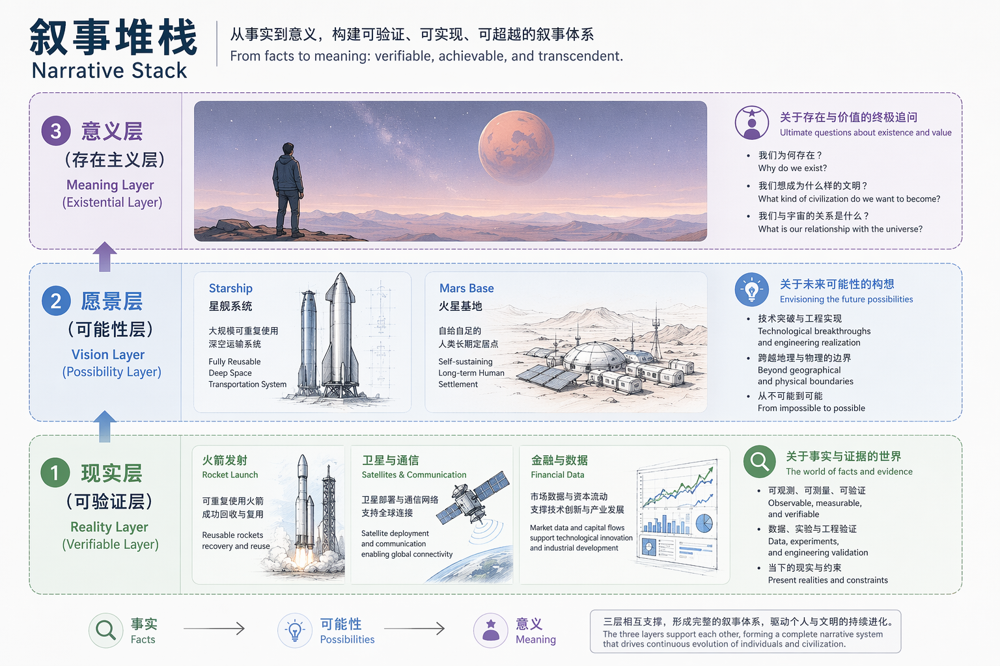
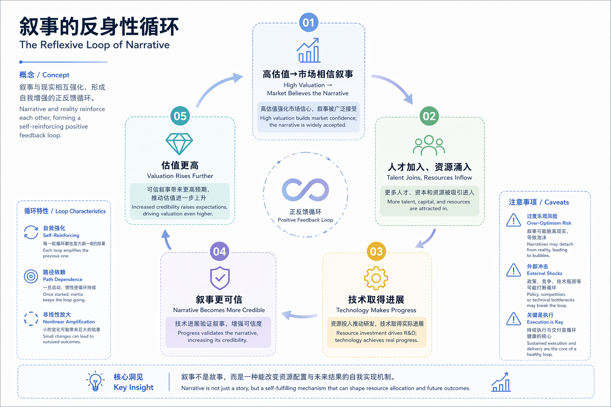

2026年6月12日上午9:30，纽约纳斯达克。

Gwynne Shotwell站在敲钟台前，身旁是CFO Bret Johnsen和Starlink销售副总裁Jonathan Hofeller。她举起手，敲响了SpaceX上市的开市钟。交易大厅里的人们欢呼、拍照，社交媒体上瞬间充斥着这个历史性时刻的画面。

同一时刻，3200公里之外的德州Boca Chica，马斯克站在Starship发射架旁。没有摄像机，没有欢呼人群，只有发射场的混凝土、金属管道，和即将进行的下一次测试。

这个缺席不是疏忽，不是日程冲突——这是一个精心设计的叙事符号。

## 叙事经济学：故事也能定价

诺奖经济学家罗伯特·席勒在叙事经济学里说过：经济活动不是只被数据驱动，也会被故事驱动。一个足够有感染力的故事，会像病毒一样传播，改变人们的信念，然后反过来改变现实。

这种现象有一个专门的名词，叫**叙事套利**。

这个词听起来高级，其实意思很简单：同样一家公司，同样的利润，你给它换一个故事，它的估值能差10倍。

同样是造火箭，贝索斯说"我们要去太空"，人们点点头，觉得这是一家很有前景的航天公司。马斯克说"我们要让人类成为多星球物种"，很多人真的开始想象火星城市、星舰起飞、地球之外的第二个家园。

这两个叙事的差异，不是词汇的差异，是协议层的差异。

贝索斯的叙事是一个API：输入资金，输出太空旅行服务。它清晰、可验证、边界明确。你可以用DCF模型计算它的现值，可以用传统的商业逻辑评估它的风险。

马斯克的叙事是一个操作系统。它不定义具体的输入输出，它定义一个运行环境——在这个环境里，各种各样的应用（资本、人才、政府合作、技术突破）都可以跑起来。它的价值不在于当下的现金流，而在于它能调度多大规模的协作。

这就是为什么SpaceX的估值能达到2.1万亿美元——这个价格买的不是一家火箭公司，买的是一个能让人类集体想象火星的叙事操作系统。

## 市梦率：想象力的定价权

普通公司出售产品，优秀公司出售效率，极少数公司出售人类对未来的想象力。这就是**市梦率**。

纽约大学最权威的估值学教授阿斯沃斯·达摩达兰，专门为SpaceX做了一份DCF模型。他算出来的公允价值是1.22万亿美元，比IPO估值低了将近30%。如果用更保守的方法去算，公允价值大概在3000亿到5000亿之间。

但市场还是给了2.1万亿美元。

为什么？因为多出的那一万亿，买的不是资产，不是利润，不是现金流——买的是一个故事。

市场不傻。它知道按现金流、按利润、按任何传统指标都不值，但它还是出了这个价。因为传统估值模型适合看业务成熟、现金流稳定、增长路径清晰的公司——消费品、银行、公用事业、成熟制造业，这些公司未来大概能赚多少钱是可以估的。

但SpaceX不一样。

它的估值逻辑不是现在能赚多少钱，而是如果未来某些极端场景真的发生，它会值多少钱。这就是金融里一个很重要的概念：**期权价值**。

所谓期权，就是你买的不是一个确定的现在，而是一个不确定但上限极高的未来。

比如星链，如果它只是一个卫星宽带服务，那当然有天花板。但如果它变成全球低轨互联网基础设施，它就不是普通宽带公司，它会变成新的通信底层网络。

再比如星舰，如果失败，它就是一个巨大的烧钱项目。但如果成功，它会把进入太空的成本降到每公斤185美元，只有历史平均水平的百分之一。

一旦成本下降到这个量级，后面打开的不只是航天，还有一整套产业链——卫星互联网、空间站、月球基地、深空探测、太空采矿、军用部署，甚至更远的火星任务。

SpaceX最难估值的地方不是它现在有什么，而是它未来可能连接到太多东西，哪怕这些事情发生的概率只有5%。但如果一旦发生，价值可能是几十万亿美金级别，那这5%的可能性本身就值很多钱。

这就是为什么很多人看马斯克的公司永远觉得贵——因为你在买现金流，而市场在买未来的上限。你在问他现在赚多少钱，市场在问如果他真的成了，人类历史会不会改写。这两个问题得出的价格当然不一样。

## SpaceX的三层叙事堆栈

像任何精心设计的系统一样，SpaceX的叙事也有清晰的分层架构。从下到上，每一层都有明确的功能，每一层都为上一层提供支撑。

### 第一层：现实层（可验证层）

这是叙事堆栈的最底层，也是整个系统的信任根基。它的作用是证明：这个叙事不是空谈。

现实层由一组可验证的数据组成：
- 猎鹰9号已经完成了200多次成功发射，第一级火箭的复用次数达到了15次
- 2025年，SpaceX实现了46.3亿美元的收入，5.5亿美元的净利润
- Starlink已经发射了8300多颗卫星，在全球70多个国家拥有超过1650万订阅用户

这一层就像一个产品的MVP——它不需要完美，但它必须能跑起来。它的存在回答了怀疑者的第一个问题："他们真的在做事吗？"

对于工程师来说，这一层就像TCP/IP协议栈的物理层和链路层——它不 glamorous，但它是所有上层协议的基础。没有这一层，再宏大的愿景都是空中楼阁。

### 第二层：愿景层（可能性层）

现实层建立了信任，愿景层则打开了想象空间。

这一层由一系列未来的可能性组成：
- Starship能把进入太空的成本降到每公斤185美元（只有历史平均水平的百分之一）
- 火星殖民的技术路线图
- 太空经济的潜在规模——可能是几万亿美元，甚至更多

愿景层不承诺确定性，它只展示可能性。它的作用是让人们问自己："如果这真的发生了，世界会变成什么样？"

这就像一个产品的路线图——它不是承诺，它是一个方向。它告诉市场：我们不只是在做今天的生意，我们在为明天的战场布局。

### 第三层：意义层（存在主义层）

这是叙事堆栈的最顶层，也是最有力量的一层。它不谈论商业，不谈论技术，它谈论意义。

意义层的核心命题很简单："人类需要成为多星球物种，否则我们可能会灭绝。"

这个命题无法被验证，也无法被证伪。但它击中了人类深层的存在焦虑——我们不只是想赚钱，我们想参与到某个更大、更有意义的事情中去。

这一层就像一个开源项目的使命宣言。Linux的使命不是"卖操作系统赚钱"，而是"让每个人都能自由地使用计算机"。后者能调动全球开发者的无偿贡献，前者只能调动员工的工作时间。

意义层的真正魔力在于：它把"投资"变成了"参与"。你买的不只是SpaceX的股票，你是在为人类成为多星球物种这个目标贡献算力。你不只是一个财务投资者，你是这个叙事网络中的一个节点。

这就是行为金融里说的**参与溢价**。

比特币早期，很多人买的金额并不大，但他们要的不是收益，是"我是早期参与者"这个身份。iPhone首发，连夜排队的人，理性算账绝对不划算，但他们要的是"我在现场"。SpaceX也是同一类东西。对很多人来说，买它不是买一只股票，是买一张故事的入场券。

## 叙事的反身性循环

金融大鳄索罗斯有一个著名的概念叫**反身性**：价格上涨会强化信仰，信仰增强又推动更高价格。

SpaceX的叙事完美地体现了这个循环：

1. **高估值→市场相信叙事**：当市场给SpaceX 2.1万亿美元的估值时，这本身就是一个强烈的信号——这么多聪明人都相信，那这个叙事一定有道理。

2. **市场相信→人才加入、资源涌入**：最优秀的火箭工程师、最有耐心的资本、最有远见的政府机构，都想加入这个叙事。他们带来了技术、资金和政策支持。

3. **资源涌入→技术取得进展**：有了人才和资金，Starship的进展更快了，Starlink的用户更多了，现实层的数据更好看了。

4. **技术进展→叙事更可信**：每一次成功的发射，每一个新的里程碑，都让"人类成为多星球物种"这个叙事看起来更真实。

5. **叙事更可信→估值更高**：于是循环回到了起点，估值继续上涨。

这个循环不是泡沫，至少不是那种毫无根据的泡沫。它更像一个成功的开源社区——参与的人越多，社区的价值越大；社区的价值越大，参与的人越多。这是一个自我强化的系统。

但正反馈循环有一个特点：它要么一直向上，要么崩溃。没有中间状态。

SpaceX这个IPO就是反身性的完美剧本。估值越高，故事越可信；故事越可信，机构越要买；机构买得越多，价格越往上推。整个市场都在用真金白银把这个故事推向自我兑现。

## 泡沫与未来之间

不过，这里要问一个问题：SpaceX的高估值到底是不是泡沫？

答案是：它既是泡沫，也不是泡沫。

说它是泡沫，因为按传统估值，它确实解释不了。说它不是，因为人类社会本来就不是只靠现金流量表运转的。我们靠故事组织人群，靠信念调动资源，靠想象力穿越不确定性。

火箭、互联网、AI、登月、火星，这些东西在财报里一开始都不好看。历史上每一次真正的大时代开启，一开始都听起来太夸张。当然，听起来太夸张的东西，大部分最后也确实只是太夸张。

这就是资本市场最迷人的地方，也是最危险的地方——它永远站在泡沫和未来之间。

SpaceX的S-1文件里埋着几颗雷，每一颗都在提醒我们：叙事不是现实。

第一颗雷是火星运输的成本。目前估算，把一吨货物运到火星需要10亿美元——这个数字连马斯克自己都承认不可持续。如果成本降不下来，火星殖民就永远只是一个愿景。

第二颗雷是那个750亿美元的Anthropic合同。S-1里有一行小字：这份合同任何一方提前90天通知就能取消。750亿美元，90天就能撕掉。

第三颗雷，也是最大的一颗雷：叙事的单点故障。

马斯克持有82.4%的投票权。这意味着，SpaceX在纳斯达克会以受控公司身份挂牌，豁免独立董事的治理要求。翻译成人话就是：你买的不是公司的股权，你是马斯克本人的合伙人。只要他还在，故事就还在；他哪一天放弃，故事就在哪一天结束。

这就像一个中心化的系统——所有的容错机制都依赖于一个节点的稳定性。这个节点很强壮，但它不是不可摧毁的。

叙事的真正风险不在于它是假的，而在于它跑得太快，现实追不上。当市场完全相信叙事，而现实还在以它自己的速度慢慢前进时，中间的那个缺口就会变成泡沫。

泡沫不一定会破灭，但它会让系统变得脆弱。任何一点现实的挫折，都可能被放大成叙事的危机。

## 敲钟的地方

回到6月12日的两个现场。

Gwynne Shotwell在纳斯达克敲钟，那是资本市场认可的仪式。那口钟的声音，标志着SpaceX正式成为一家公众公司，标志着叙事的商业化。

但马斯克选择在Boca Chica。他在那里，因为他知道：真正的敲钟，不是在纽约的交易所，而是在未来的火星。

资本市场定价的从来不只是公司。它定价的是人类愿意把多少钱压在未来身上。SpaceX卖的不是火箭，不是星舰，也不只是马斯克个人——它卖的是一个问题：

如果人类真的有下一站，你愿意为这张船票付多少钱？

昨天，这个问题的答案是2.1万亿美元。

明天呢？没有人知道。但有一件事是确定的：当一个叙事足够宏大、足够有说服力时，它就不再只是一个故事。它会变成一个协议，一个操作系统，一个能调度人类集体想象力的基础设施。

而我们每个人，都是这个系统里的节点。我们用注意力、用资本、用信仰，为这个系统贡献算力。

这就是马斯克最厉害的地方：他理解了一个比火箭技术更深层的技术——叙事是人类最高效的协作协议。

纽约的钟声已经消散，但Boca Chica的发射架还在那里。下一次Starship的升空，才是真正的敲钟。

那时候，我们会知道：这个叙事，是真的要带着我们去火星了。
