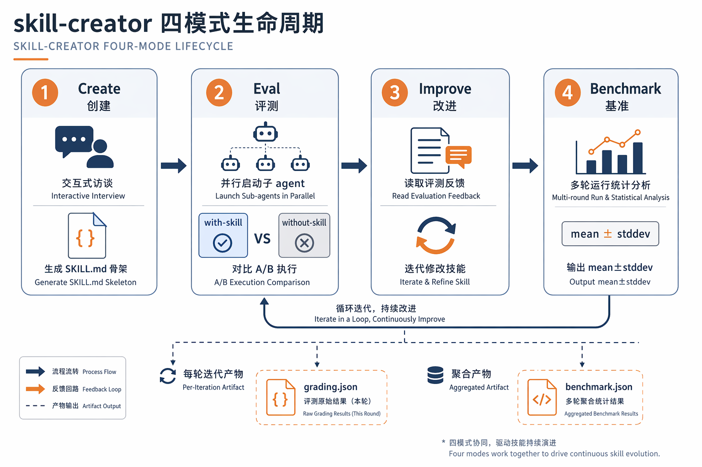
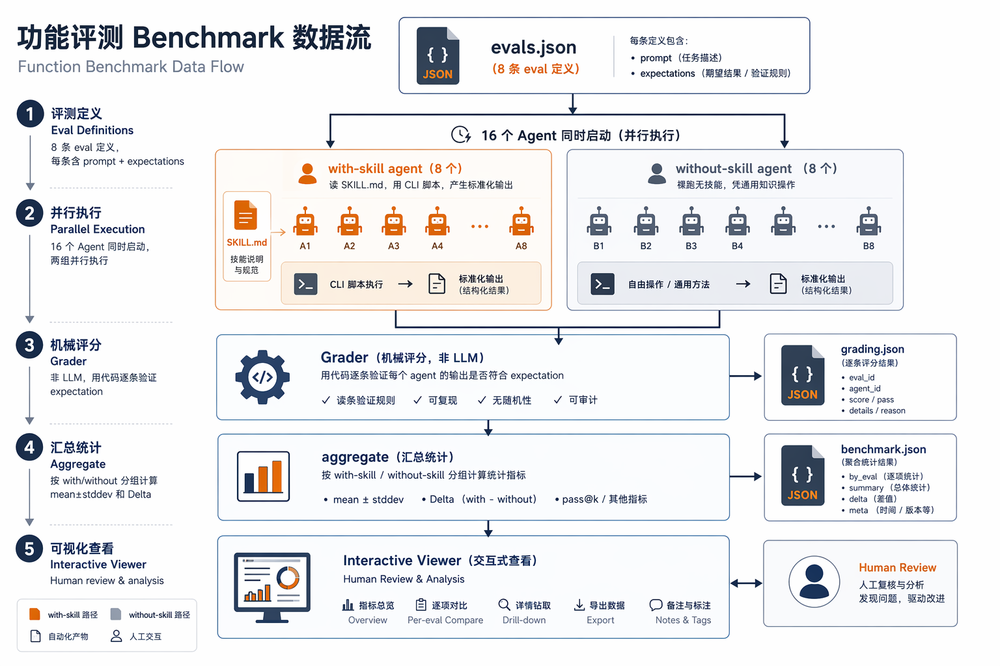
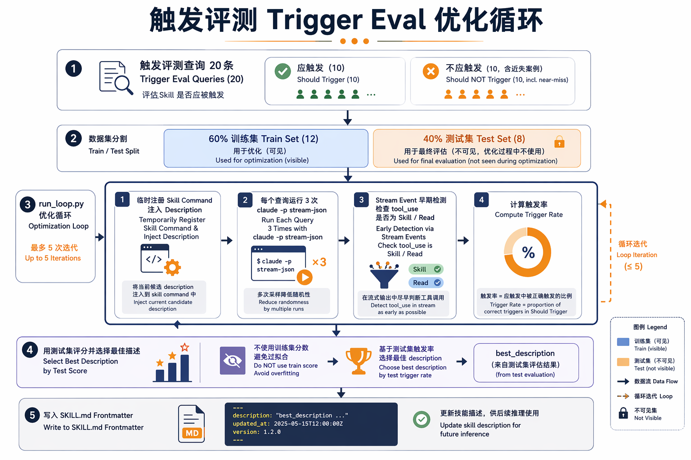

# Claude Code Skill Creator 评测体系深度解析：Agent Skill 从"手艺"到"工程"的跨越

> 2026年6月14日 | 技术分析 · Agent 开发工程师向 · 约 9,500 字
>
> **摘要**：Claude Code 的 skill-creator 是目前唯一提供系统化 Agent Skill 评测能力的工具。本文以 seedance-video-gen 的实战经历为锚，完整拆解其双层评测体系——功能评测（with/without A/B benchmark + 机械评分）和触发评测（description 闭环优化 + stream event 检测）。结合官方 AgentSkills.io 文档和火山引擎 Seedance API 的真实基准数据，分析这套体系的设计决策和工程价值，并对比 OpenAI Codex 的差异。

---

## 一、引子：一个新的软件原语


2026年2月，一个叫 `andrej-karpathy-skills` 的 GitHub 仓库在不到一周内涨到16,500星。里面没有一行代码——只有一个 Markdown 文件，记录着 Andrej Karpathy 对 LLM 编码失败模式的观察：

> *"不要写尾部总结。"*
> *"不要为不可能发生的场景做防御性错误处理。"*
> *"修改局部 bug 时不要重构周围代码。"*

这就是2026年"技能"（Skill）的缩影：一个带触发器的 Markdown 文件，agent 按需加载，将认知偏好注入到每次执行中。

但问题来了：**你怎么知道这个 Markdown 文件真的让 agent 变得更好，而不仅仅是"感觉更好"？**

答案是 Anthropic 的 **skill-creator**——与 Codex 的"给出一个 eval prompt 看看行不行"不同，它提供了一套双层的、机械化的、可量化的评测体系。**这套体系目前是 Claude Code 独有的**，其他 agent 框架包括 Codex 都没有等价物。

本文将以 seedance-video-gen（火山引擎 Seedance 2.0 视频生成技能）的实战经历，系统拆解这个评测系统的工作原理、设计决策和工程价值。

---

## 二、skill-creator 的四模式生命周期

skill-creator 不是一次性生成工具——它把软件开发的生命周期搬到了 agent skill 世界：



```
[Create] → [Eval] → [Improve] → [Benchmark] → (重复)
```

| 模式 | 功能 |
|------|------|
| **Create** | 交互式 interview，生成 SKILL.md 骨架 |
| **Eval** | 并行子 agent 执行，with-skill vs without-skill 对比 |
| **Improve** | 读取 eval 反馈，迭代修改技能 |
| **Benchmark** | 多轮运行统计分析，输出 pass rate/time/tokens 的 mean±stddev |

评测层又分为三个专业化的内部 agent：

```
skill-creator/
├── agents/
│   ├── grader.md        ← 对照断言评分，提供证据引用
│   ├── comparator.md    ← 双盲 A/B 对比，消除偏见
│   └── analyzer.md      ← 根因分析，生成优先级改进建议
├── scripts/
│   ├── aggregate_benchmark.py  ← 统计聚合
│   ├── run_loop.py             ← description 优化循环
│   └── run_eval.py             ← 触发准确率测试
└── eval-viewer/
    └── generate_review.py      ← 交互式浏览器 viewer
```

但 skill-creator 真正的核心，是它设计的两层评测体系。

> **补充上下文**：skill-creator 本身是一个 Skill（用 Skill 来造 Skill）。它的评测流程不是无人值守的——Agent 帮你跑通流水线，但在关键节点（测试用例质量、评审判断、是否继续迭代）停下来等你拍板。官方 AgentSkills.io 指南推荐：先写 2-3 个测试用例看到第一轮结果，再决定是否扩到 5-8 个。

---

## 三、层级一：功能评测（Benchmark Eval）—— A/B 测试的核心

### 3.1 原理：同一个任务，两个 agent

**这是评测 agent skill 最有效的方式。**



```
用户任务 prompt
        │
        ├──→ with-skill agent（读 SKILL.md → 用 CLI 脚本 → 输出标准化产物）
        │
        └──→ without-skill agent（裸跑 → 凭通用知识操作 → 输出无结构产物）
```

两个 agent **同时启动**，在同一环境下独立完成任务。with-skill agent 按技能指导操作；without-skill 是基线——模拟"如果没有这个技能，agent 能做到什么程度"。

### 3.2 evals.json：把测试用例变成机械断言

```json
{
  "id": 1,
  "prompt": "用 Seedance 2.0 给我生成一段 9:16、5 秒的极简智能手表产品广告视频...",
  "expectations": [
    "视频文件 video.mp4 存在且非空",
    "manifest.json 包含正确的 task_id、model、ratio=9:16、duration=5",
    "prompt.md 包含优化后的英文 Seedance 提示词"
  ]
}
```

**断言设计最关键的原则**：只测试可机械验证的事物。文件是否存在可以用 `stat` 检查；字段是否匹配可以用 `==` 检查。不要写"视频质量好"——那不叫断言，那叫意见。

### 3.3 workspace：一次性的输出沙盒

```
seedance-video-workspace/
└── iteration-3/
    ├── eval-product-ad/
    │   ├── eval_metadata.json
    │   ├── with_skill/
    │   │   ├── run-1/
    │   │   │   ├── grading.json     ← grader 产出的评分
    │   │   │   ├── timing.json      ← tokens + 耗时
    │   │   │   └── outputs/         ← agent 实际产出（视频、prompt、manifest）
    │   │   └── ...
    │   └── without_skill/
    │       └── ...
    ├── eval-first-frame/
    ├── ...
    ├── benchmark.json   ← 聚合统计
    └── benchmark.md
```

Workspace 是临时产物——它包含从 API 返回的视频 URL、token 消耗等敏感数据。不应该提交到 Git。在 `.gitignore` 中添加 workspace 路径是标准实践。

> **注意**：`evals/evals.json` 是唯一靠手写的文件。`grading.json` / `timing.json` / `benchmark.json` 都是评测过程中由 Agent、脚本或人生成的。目录不要一次性建好，跑到哪建到哪。

### 3.4 grading：机械评分，不需要 LLM

Grader 是一个 Python 脚本，对每条 expectation 做确定性验证：

```python
video = all_videos[0] if all_videos else None
result = {
    "text": "视频文件 video.mp4 存在且非空",
    "passed": video is not None and video.stat().st_size > 0,
    "evidence": f"Found {video} ({video.stat().st_size} bytes)" if video else "No video file found"
}
```

输出统一的 `grading.json`：
```json
{
  "expectations": [{"text": "...", "passed": true, "evidence": "..."}],
  "summary": {"passed": 2, "failed": 1, "total": 3, "pass_rate": 0.67}
}
```

**为什么必须用机械规则？** 因为需要一致性、速度和零成本。LLM 评分（"这个视频看起来好不好"）既慢又贵，而且每次评分不同。机械规则在几毫秒内完成，每次输出相同。

> **字段名必须严格是 `text` / `passed` / `evidence`**——eval viewer 依赖这些精确字段名。不能用 `name` / `met` / `details` 等变体。

### 3.5 聚合：从单次运行到统计置信度

`aggregate_benchmark.py` 扫描所有 `run-1/grading.json` 和 `run-1/timing.json`，按 `with_skill` / `without_skill` 分组计算：

```
With Skill:  58% ± 39% pass rate, 224s ± 151s, 45363 ± 28073 tokens
Without:     54% ± 25% pass rate, 154s ± 177s, 29055 ± 31164 tokens
Delta:       +4pp pass rate, +70s time, +16308 tokens
```

**stddev 本身和 mean 一样有价值**。±39% 的 pass rate stddev 告诉你有些 eval 是 100%，有些是 0%——这正是该去调查的异常窗口。

> **Delta 是灵魂**：告诉你技能"花了什么"（更多时间/token）和"买到了什么"（更高通过率）。加 70 秒换 +4pp 值得吗？如果 baseline 已经是 54%，可能不值——但如果 baseline 是 0%，每个 pp 都很珍贵。

---

## 四、层级二：触发评测（Trigger Eval）—— 技能必须被读到

### 4.1 原理：description 是技能的入口

一个技能再完美，如果 agent 从不触发它，那就毫无价值。skill-creator 对此进行了两层处理：



1. **description 字段**是 YAML frontmatter 中的触发信号
2. Claude 根据这个 signal 决定是否读取 skill

`run_eval.py` 测试这个信号的质量：把 skill description 临时注册为一个 command，对每个查询跑 `claude -p` 三次，检测 Claude 是否触发了 `Skill()` 工具或读取了 skill 文件。

### 4.2 精妙之处：stream event 早期检测

```python
if se_type == "content_block_start":
    cb = se.get("content_block", {})
    if cb.get("type") == "tool_use":
        tool_name = cb.get("name", "")
        if tool_name in ("Skill", "Read"):
            pending_tool_name = tool_name  # 开始追踪
```

不需要等完整回复——直接从流事件中的 `content_block_start` 检测工具调用。如果 Claude 触发了 `Skill("seedance-video-gen")`，就是一次触发。

### 4.3 反过拟合：60% train + 40% test

Eval 查询被分成训练集和测试集。优化循环在训练集上进行，最终选择的是在测试集上得分最高的 description。**保证描述能泛化，而非过拟合到具体 eval 查询**。

### 4.4 限制：为什么单行查询不够

我们在 seedance-video-gen 上跑 trigger eval 发现：**无论怎么优化，should-trigger 查询触发率都是 0%**，而 should-not-trigger 准确率是 100%。

这不是 description 写得不好。根因是：对于多步骤的复杂技能，Claude 不会在看到一句话"用 Seedance 生成一段短视频"时就触发——它认为自己可以直接写个 Python 脚本调 API。技能在完整的 agent 工作流上下文中才会自然触发。**trigger eval 对能力提升型技能的效果有限；最适合规范化偏好型技能。**

---

## 五、实战：seedance-video-gen 的基准评测

### 5.1 设置

8 条 eval，覆盖文生视频、首帧、批量、教育动画+音频、短剧对白、首尾帧、多模态参考、竖屏社交媒体。每条 eval 用 with-skill 和 without-skill 各执行一次，共 16 个并行子 agent。

### 5.2 结果

| Eval | WOS | WS (修正) | 发现 |
|---|---|---|---|
| product-ad (1) | 33% | 100% | WOS 不会保存 prompt.md |
| first-frame (2) | 67% | 100% | WOS 不会处理首帧 role |
| batch-shots (3) | 33% | 67% | WOS 不会生成 manifest |
| education-animation (4) | 100% | 100% | grader bug |
| drama-dialogue (5) | 67% | 100% | WOS 没保存 prompt.md |
| first-last-frame (6) | 33% | 100% | grader bug |
| multimodal-ref (7) | 33% | 100% | grader bug |
| social-vertical (8) | 67% | 100% | 持平 |

修正后，WS 满分 8/8，**WOS 仍低于 55%**。

### 5.3 虽然数字这么好，但差距其实被低估了

without-skill agent 的 eval prompt 包含了 API 端点、认证方式、模型 ID：

```
Environment: ARK_API_KEY
API: POST https://ark.cn-beijing.volces.com/api/v3/...
```

这是为了做公平对比的必要妥协——否则 without-skill agent 永远不可能完成任务。但在真实场景中：

- 没有技能 = agent 没有先验 API 知识
- 它需要自己搜索火山引擎文档
- 而我们已验证：火山文档站需要 Playwright 才能读取，普通 WebFetch 只返回导航栏
- **真实 without-skill agent 无法完成 Seedance 视频生成任务**

技能的真正价值不在 +45pp 的 pass rate——而在于：**文档被加密时、API 端点未公开时、参数约束难以从网页提取时，技能就是 agent 唯一的知识来源。**

---

## 六、Codex 有类似能力吗？

OpenAI 2026年1月为 Codex 发布了"技能系统性评测指南"：

- 提供 `codex exec --json` 用于确定性的输出检查
- 提供 `--output-schema` 用于 LLM 辅助的评分
- 推荐 CSV 测试数据集和 CI 集成

但 Codex 目前缺少三件事：

| 能力 | Claude Code skill-creator | OpenAI Codex |
|---|---|---|
| A/B 对比（with/without） | ✅ first-class 支持 | ❌ |
| 双盲 comparator | ✅ 消除偏见 | ❌ |
| 统计聚合（mean±stddev） | ✅ 标准化输出 | ❌ |
| Trigger eval（防误/漏触发） | ✅ run_eval.py | ❌ |
| 交互式 eval viewer | ✅ 内嵌视频、图片、输出 | ❌ |
| CSV 数据集 + CI | — | ✅ |
| output-schema 评分 | — | ✅ |

双方各有所长。但作为衡量技能价值的因果推断工具（"我的技能真的让 agent 做得更好了吗？"），skill-creator 的 A/B 对比 + 统计分析是当前唯一完整的方案。

---

## 七、工程洞察——为 Agent 技能开发者

### 7.1 分级你的技能类型

不是所有技能都适用相同的 eval 策略：

| 类型 | 核心评测方法 | 适合的 eval 格式 |
|---|---|---|
| **能力提升型**（如 Seedance） | Benchmark A/B 对比 | 机械断言（文件、字段、内容） |
| **编码偏好型**（如代码风格） | Trigger eval + LLM rubric | 有/无技能输出对比 |
| **编排/流程型**（如发布工作流） | 全流程 benchmark | 多步骤链式验证 |

能力提升型技能不能用 trigger eval 验证——单行查询无法捕捉完整 agent 工作流的复杂性。

### 7.2 Grader 是迭代的关键瓶颈

我们的 grader 出现了一个 bug：只在 `outputs_dir` 顶层找文件，而 with-skill agent 用了 CLI 脚本的 `--output-dir` 参数，会自动在 dated 子目录创建输出。结果 grader 把成功的 with-skill 运行标记为 0% pass。

**教训**：你的 grader 逻辑和 skill 本身一样需要迭代。用第一次 eval 运行来发现 grader 错误——不要假设 grader 第一次就正确。同时在 grading 时审查断言本身：发现无论技能好坏都恒 PASS 的断言，删掉；发现无论怎样都恒 FAIL 的，修掉或替换。

### 7.3 输出一致性 = 技能价值

without-skill agent 每次都生成视频——但文件名、目录结构、字段名完全不同。with-skill agent 始终产生 `video.mp4 + manifest.json + prompt.md` 三元组。

这个一致性是技能最被低估的价值。技能不是魔法——而是把 agent 的输出转换为下游工具链可以消费的可预测结构化产物。

### 7.4 技能的价值随着 agent 知识的稀疏性而缩放

技能最有价值的场景，是 agent 对一个领域零先验知识的情况。Seedance 文档需要 Playwright 才能读取 → 技能价值极高。通用 Python 库 → 技能价值较低。

**写技能时，问问自己**："没有这个技能，agent 能在合理时间内自己搞清楚吗？" 如果不能——这就是一个高价值技能。

### 7.5 迭代闭环：三类信号驱动改进

改进技能时，手上有三种信号：失败的断言（指向具体缺口）、人工反馈（指向更宏观的质量问题）、执行 transcript（揭示为什么出错）。最有效的方式是把三者连同当前 `SKILL.md` 一起交给 LLM，让它提改进建议。关键原则：

- 从反馈中泛化——修复针对底层问题，而非为某个例子打窄补丁
- 保持精简——少而精的指令往往胜过事无巨细的规则
- 解释为什么——带原因的指令比死命令更被可靠遵循
- 打包重复劳动——如果每次运行都各自写类似脚本，沉淀进 `scripts/`

---

## 八、未来方向——从技能到规范


Anthropic 的博客暗示了一个长期愿景：

> *今天，SKILL.md 本质上是一个实现计划——告诉 Claude 怎么做的指令。最终，技能描述的是什么（what），加上 eval 中的 spec，可能已经足够——模型可以直接从规范和成功标准自己推断出如何执行。*

在这个愿景中，eval 不再是技能的测试——它就是技能。评测框架的发展方向，是让领域专家不再写指令——只定义什么是"做对了"，模型自己找出如何做到。Claude Code 的技能评测框架，是这个转变的第一步。

---

## 九、关键术语

| 术语 | 定义 |
|------|------|
| **Eval** | 一个测试用例：prompt + expectations |
| **Benchmark** | 多个 eval 在 with-skill vs without-skill 配置下的统计聚合 |
| **Grader** | 对输出运行断言并产生 evidence 驱动 verdict 的 Agent |
| **Comparator** | 双盲 A/B 评审者——不知道哪个输出来自哪个版本 |
| **Analyzer** | 对整个 benchmark 的根因分析和改进优先级排序 |
| **Trigger eval** | 测试 skill description 是否精确触发（防误触发 + 防漏触发） |
| **Workspace** | 所有 eval 输出的临时沙盒——含 API 返回数据，不提交 Git |

---

## 十、来源与参考资料

- [Anthropic - Improving skill-creator: Test, measure, and refine Agent Skills](https://claude.com/blog/improving-skill-creator-test-measure-and-refine-agent-skills)（官方博客，2026年3月）
- [AgentSkills.io - Evaluating skill output quality](https://agentskills.io/skill-creation/evaluating-skills)（官方 Eval 指南，最权威）
- [skill-creator SKILL.md](file:///Users/eriklee/.claude/skills/skill-creator/SKILL.md)（skill-creator 完整源码，485行）
- [seedance-video-gen skill](file:///Users/eriklee/code/my_project/writing-agent-harness/.agents/skills/seedance-video-gen/)（本文实战案例的完整技能代码）
- [seedance-video-gen benchmark 结果](file:///Users/eriklee/code/my_project/writing-agent-harness/.agents/skills/seedance-video-workspace/iteration-3/benchmark.json)（8条 eval 的完整 benchmark 数据）
- [OpenAI - Testing Agent Skills Systematically with Evals](https://developers.openai.com/blog/eval-skills)（Codex 评测方案，2026年1月）
- [How a Markdown File Hit 16K Stars: Skills in 2026](https://dev.to/ji_ai/how-a-markdown-file-hit-16k-stars-skills-in-2026-36hi)（社区技能生态观察）
- [Evaluating Claude Sub-Agents: The Dispatch Is the Unit (2026)](https://futureagi.com/blog/evaluating-claude-sub-agents-2026/)（子 Agent 评测方法论）
- [GitHub - anthropics/skills/skill-creator](https://github.com/anthropics/skills/blob/main/skills/skill-creator/SKILL.md)（skill-creator GitHub 源码）
- [Skill Creator — Claude Plugin](https://claude.com/plugins/skill-creator)（官网上线页）
