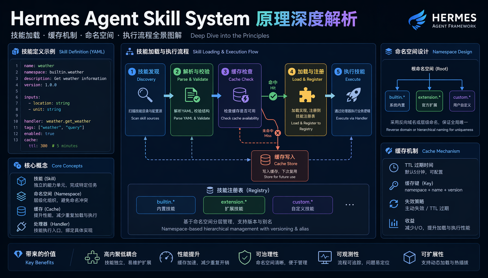
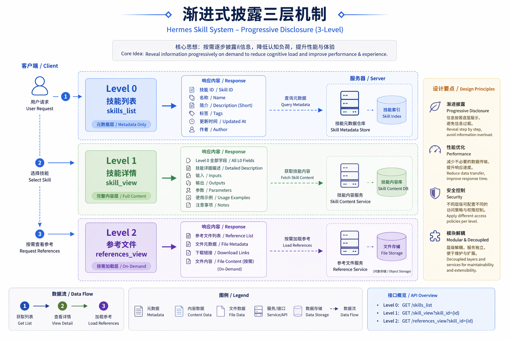
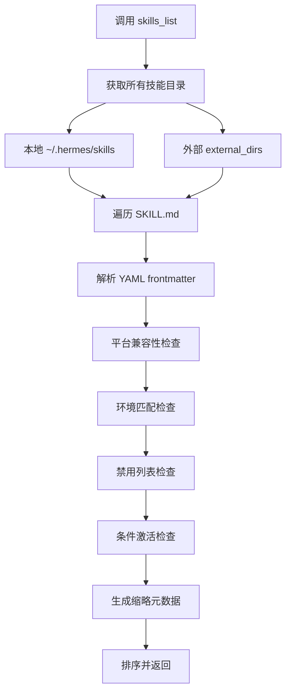
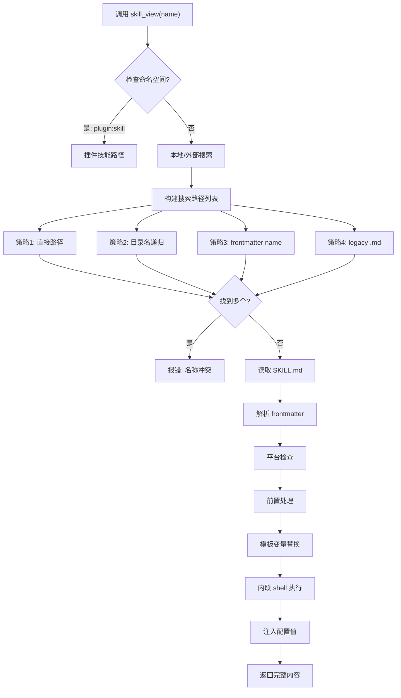
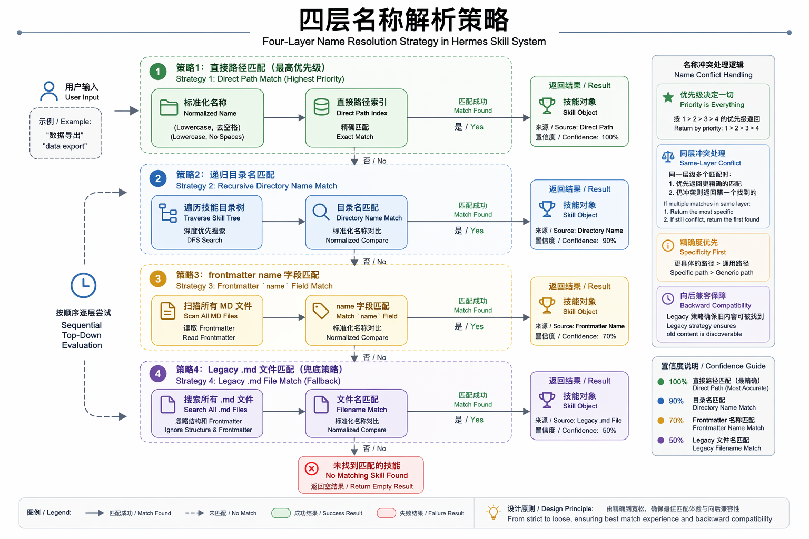
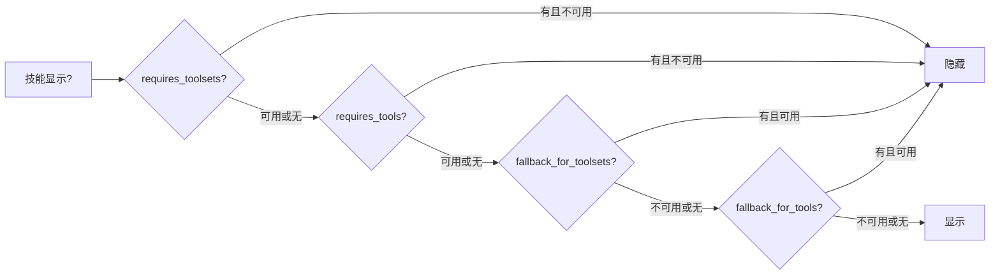
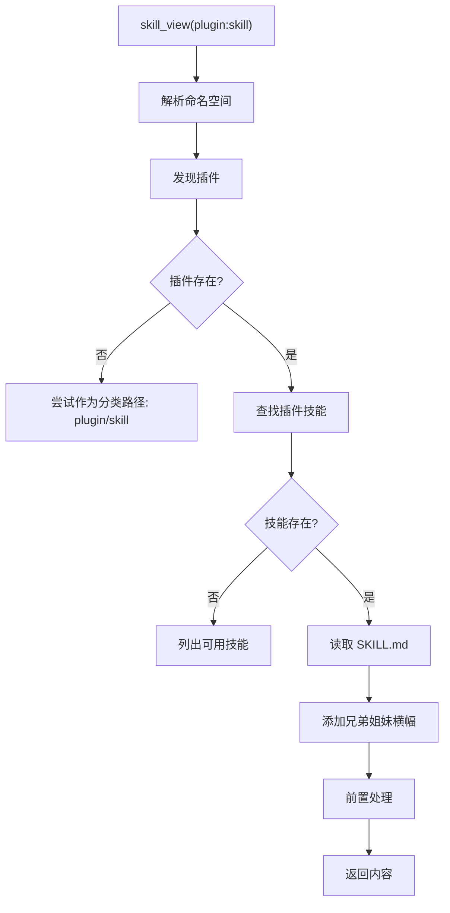
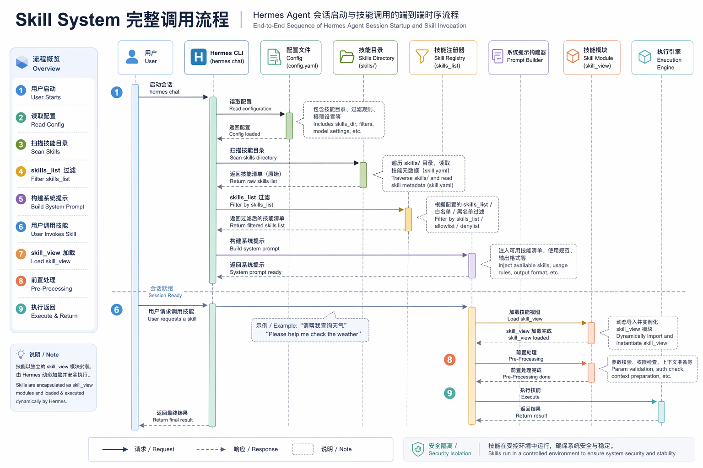
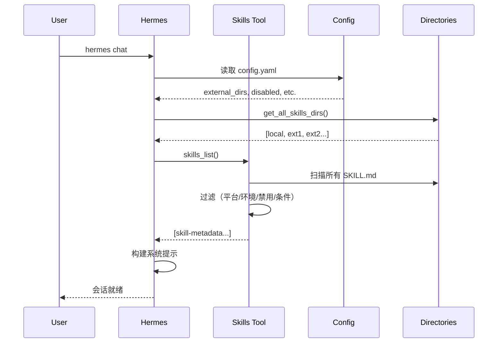
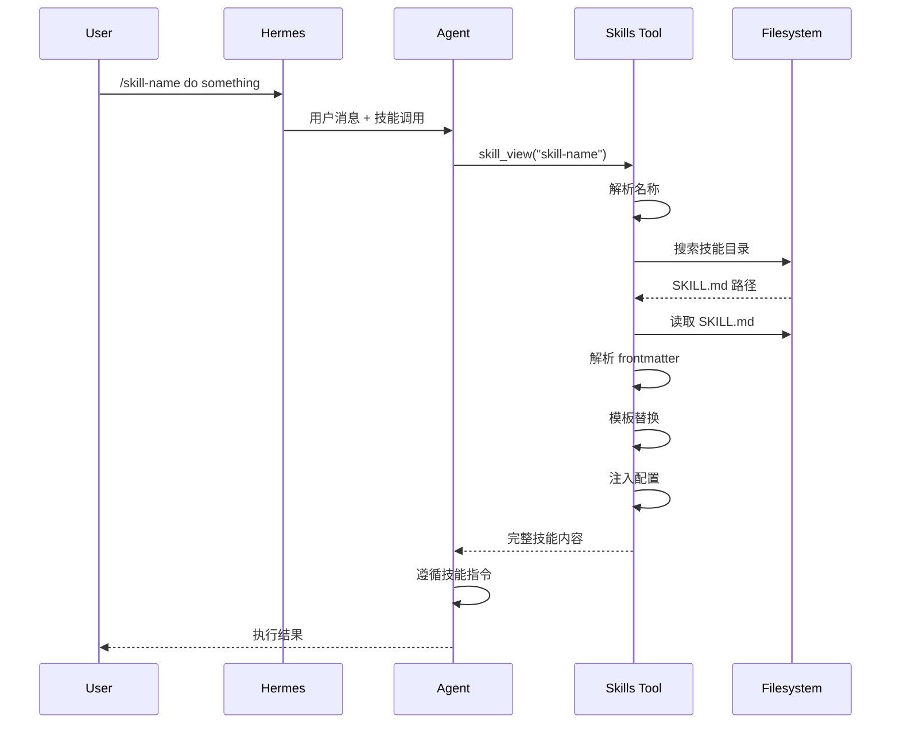

本文档分析 Hermes Agent Skill System 的实现原理，重点关注：技能加载的四层策略、渐进式披露的 token 权衡、外部目录缓存机制、以及名称冲突的显式处理。我们结合源代码分析，并提供流程图帮助理解。



## 核心架构理念

### 设计原则

1. **渐进式披露（Progressive Disclosure）**：三层加载机制，平衡可用性与 token 效率
2. **单一真实来源**：`~/.hermes/skills/` 是唯一的读写主目录
3. **外部目录扩展**：`external_dirs` 是只读扩展，除非目录本身可写
4. **本地优先**：同名技能本地版本静默胜出，避免意外覆盖
5. **插件命名空间**：`namespace:skill` 格式隔离插件技能

### Token 效率权衡

```
Level 0: skills_list()    → 仅元数据 (~3k tokens)
Level 1: skill_view(name) → 完整内容（可变，通常 10-100k tokens）
Level 2: skill_view(name, path) → 特定参考文件（可变）
```

**关键观察**：Level 0 的 ~3k tokens 是固定成本，这是在会话启动时就会支付的。Level 1 和 Level 2 是边际成本，只有使用特定技能时才会产生。

## 目录结构与索引

### 技能文件布局

```
~/.hermes/skills/
├── category/
│   └── skill-name/
│       └── SKILL.md          # 主文件，必需
├── .hub/                     # Hub 本地状态
│   ├── lock.json
│   ├── quarantine/
│   └── audit.log
├── .bundled_manifest         # 捆绑技能内容哈希清单
└── .archive/                 # 归档目录
```

### 索引机制：无预构建，按需扫描

Hermes 不使用 SQLite 或 JSON 索引数据库。每次 `skills_list()` 都会重新扫描文件系统。

关键函数在 `agent/skill_utils.py`：

```python
def iter_skill_index_files(skills_dir: Path, filename: str):
    """遍历技能目录，返回匹配的文件路径"""
    for root, dirs, files in os.walk(skills_dir, followlinks=True):
        # 实时过滤：原地修改 dirs 列表，避免递归进入排除目录
        dirs[:] = [d for d in dirs if d not in EXCLUDED_SKILL_DIRS]
        if filename in files:
            yield Path(root) / filename
```

**排除目录**：

```python
EXCLUDED_SKILL_DIRS = frozenset((
    ".git", ".github", ".hub", ".archive",
    ".venv", "venv", "node_modules", "site-packages",
    "__pycache__", ".tox", ".nox", ".pytest_cache",
    ".mypy_cache", ".ruff_cache"
))
```

**性能设计观察**：
- 没有缓存，每次都重新扫描。这在技能数量 < 1000 时可接受
- 使用 `os.walk(followlinks=True)`，支持软链接
- 原地修改 `dirs[:]` 列表，避免递归进入排除目录（这是 `os.walk()` 的标准优化技巧）

## 渐进式披露详解



### Level 0: 技能列表（skills_list）

**流程：**



**关键代码**（tools/skills_tool.py）：

```python
def skills_list():
    """返回所有可用技能的元数据列表"""
    # 1. 收集所有技能
    skills = _find_all_skills()

    # 2. 应用过滤器
    filtered = []
    for skill in skills:
        if not skill_matches_platform(skill["frontmatter"]):
            continue
        if not skill_matches_environment(skill["frontmatter"]):
            continue
        if skill["name"] in get_disabled_skill_names():
            continue
        if not _skill_matches_conditions(skill["frontmatter"]):
            continue
        filtered.append(skill)

    # 3. 只返回必要字段
    return _sort_skills(filtered)
```

**返回的元数据结构：**

```json
{
  "name": "skill-name",
  "description": "Brief description...",
  "category": "category-name",
  "tags": ["tag1", "tag2"]
}
```

### Level 1: 完整技能加载（skill_view）

**流程：**



**名称解析策略**（skills_tool.py）：



```python
# 策略1: 直接路径
direct_path = search_dir / name
if direct_path.is_dir() and (direct_path / "SKILL.md").exists():
    return direct_path / "SKILL.md"

# 策略2: 递归按目录名
for found_skill_md in iter_skill_index_files(search_dir, "SKILL.md"):
    if found_skill_md.parent.name == name:
        return found_skill_md

# 策略3: 按 frontmatter 中的 name 字段
fm, _ = _parse_frontmatter(fm_content)
if fm.get("name") == name:
    return found_skill_md

# 策略4: legacy flat .md 文件
for found_md in search_dir.rglob(f"{name}.md"):
    if found_md.name != "SKILL.md":
        return found_md
```

**名称冲突处理**：

当多个技能有相同名称时，Hermes 不会静默选择，而是报错并列出所有匹配项：

```python
if len(candidates) > 1:
    return json.dumps({
        "success": False,
        "error": f"Ambiguous skill name '{name}': {len(candidates)} skills match",
        "matches": [str(smd) for _, smd in candidates],
        "hint": "Use full relative path instead"
    })
```

### Level 2: 参考文件加载（skill_view with path）

当技能需要额外参考资料时：

```python
skill_view("skill-name", "references/api.md")
```

会加载技能目录内的指定文件，而不是整个技能。

## 外部目录解析：缓存设计


这是 Skill System 中最精巧的性能优化。

### 配置读取与缓存

**关键代码**（agent/skill_utils.py）：

```python
_EXTERNAL_DIRS_CACHE: Dict[Tuple[str, int], List[Path]] = {}

def get_external_skills_dirs() -> List[Path]:
    """读取配置中的外部目录，带 mtime 缓存"""
    config_path = get_config_path()
    if not config_path.exists():
        return []

    # 缓存键：(绝对路径, mtime_ns)
    try:
        stat = config_path.stat()
        cache_key = (str(config_path), stat.st_mtime_ns)
    except OSError:
        cache_key = None

    if cache_key is not None and cache_key in _EXTERNAL_DIRS_CACHE:
        return list(_EXTERNAL_DIRS_CACHE[cache_key])

    # 解析配置
    parsed = yaml_load(config_path.read_text())
    raw_dirs = parsed.get("skills", {}).get("external_dirs", [])

    # 展开路径
    result = []
    seen = set()
    for entry in raw_dirs:
        expanded = os.path.expanduser(os.path.expandvars(entry))
        p = Path(expanded)
        if not p.is_absolute():
            p = (get_hermes_home() / p).resolve()
        else:
            p = p.resolve()
        if p == get_skills_dir().resolve():
            continue  # 跳过本地目录重复
        if p in seen:
            continue
        if p.is_dir():
            seen.add(p)
            result.append(p)

    if cache_key is not None:
        _EXTERNAL_DIRS_CACHE[cache_key] = list(result)
    return result
```

**性能权衡**：
- `stat()` ~2μs vs YAML 解析 ~85ms：两个数量级的差距
- 缓存键使用 `mtime_ns`（纳秒级时间戳），不是 `mtime`（秒级），避免时间粒度问题
- 每次都返回 `list(cache)` 的副本，避免调用方意外修改缓存
- 缓存是进程级的，重启失效

### 路径展开规则

```python
# 支持的展开：
- ~ → 用户目录
- ${VAR} → 环境变量
- $VAR → 环境变量（部分支持）

# 相对路径解析：
# 相对于 HERMES_HOME，不是当前工作目录
"relative/path" → get_hermes_home() / "relative/path"
```

**设计观察**：相对路径相对于 `HERMES_HOME` 解析，这是一个合理的约定，但需要注意不要与当前项目目录混淆。

## 条件激活机制

### 条件字段

```python
# 从 frontmatter 提取条件
def extract_skill_conditions(frontmatter: Dict):
    metadata = frontmatter.get("metadata", {})
    hermes = metadata.get("hermes", {})
    return {
        "fallback_for_toolsets": hermes.get("fallback_for_toolsets", []),
        "requires_toolsets": hermes.get("requires_toolsets", []),
        "fallback_for_tools": hermes.get("fallback_for_tools", []),
        "requires_tools": hermes.get("requires_tools", [])
    }
```

### 判断逻辑



### 用例：降级方案

```yaml
# duckduckgo-search 技能
metadata:
  hermes:
    fallback_for_toolsets: [web]  # 仅在 web 工具集不可用时显示
```

当用户配置了 FIRECRAWL_API_KEY 时，web 工具集可用 → duckduckgo 隐藏；
当 API key 缺失时，web 工具集不可用 → duckduckgo 自动显示。

## 平台与环境匹配

### 平台匹配

```python
def skill_matches_platform(frontmatter: Dict) -> bool:
    platforms = frontmatter.get("platforms")
    if not platforms:
        return True  # 默认所有平台

    current = sys.platform
    running_in_termux = is_termux()

    for platform in platforms:
        normalized = str(platform).lower().strip()
        mapped = PLATFORM_MAP.get(normalized, normalized)

        if current.startswith(mapped):
            return True
        # Termux 特殊处理
        if running_in_termux and mapped == "linux":
            return True
        if running_in_termux and mapped in ("termux", "android"):
            return True
    return False
```

**PLATFORM_MAP**:
```python
PLATFORM_MAP = {
    "macos": "darwin",
    "linux": "linux",
    "windows": "win32"
}
```

### 环境匹配

```python
_KNOWN_ENVIRONMENTS = frozenset({"kanban", "docker", "s6"})

def _detect_environment(env: str) -> bool:
    if env == "kanban":
        return (os.getenv("HERMES_KANBAN_TASK")
                or os.getenv("HERMES_KANBAN_BOARD")
                or _profile_has_kanban_toolset())
    elif env == "docker":
        return is_container()
    elif env == "s6":
        return os.path.isdir("/run/s6") or os.path.isdir("/package/admin/s6-overlay")
    return True  # 未知环境默认通过
```

## 技能内容前置处理

### 模板变量替换

```python
# 支持的变量：
${HERMES_SKILL_DIR}  → 技能目录的绝对路径
${HERMES_SESSION_ID} → 当前会话 ID
```

**示例**：
```markdown
Run this script:
node ${HERMES_SKILL_DIR}/scripts/analyze.js
```

渲染为：
```markdown
Run this script:
node /Users/erik/.hermes/skills/category/skill-name/scripts/analyze.js
```

### 内联 Shell 执行（可选）

配置启用：
```yaml
skills:
  inline_shell: true
  inline_shell_timeout: 10  # 秒
```

使用：
```markdown
Current date: !`date -u +%Y-%m-%d`
Git branch: !`git -C ${HERMES_SKILL_DIR} rev-parse --abbrev-ref HEAD`
```

执行后：
```markdown
Current date: 2026-06-15
Git branch: main
```

## 配置注入机制

### 配置声明

技能在 frontmatter 中声明需要的配置：

```yaml
metadata:
  hermes:
    config:
      - key: wiki.path
        description: Path to wiki directory
        default: ~/wiki
        prompt: Wiki directory path
```

### 配置解析

```python
def resolve_skill_config_values(config_vars: List) -> Dict:
    """从 config.yaml 解析配置值"""
    config_path = get_config_path()
    config = {}
    if config_path.exists():
        try:
            parsed = yaml_load(config_path.read_text())
            if isinstance(parsed, dict):
                config = parsed
        except Exception:
            pass

    resolved = {}
    for var in config_vars:
        logical_key = var["key"]
        storage_key = f"skills.config.{logical_key}"
        value = _resolve_dotpath(config, storage_key)

        if value is None or (isinstance(value, str) and not value.strip()):
            value = var.get("default", "")

        # 展开路径
        if isinstance(value, str) and ("~" in value or "${" in value):
            value = os.path.expanduser(os.path.expandvars(value))

        resolved[logical_key] = value
    return resolved
```

### 注入到技能内容

当技能加载时，配置值会自动追加：

```
[Skill config (from ~/.hermes/config.yaml):
  wiki.path = /Users/erik/wiki
]

# 技能正文...
```

## 插件技能系统

### 命名空间解析

```python
def parse_qualified_name(name: str) -> Tuple[Optional[str], str]:
    """将 'namespace:skill-name' 拆分为 (namespace, bare_name)"""
    if ":" not in name:
        return None, name
    return tuple(name.split(":", 1))
```

### 插件技能加载流程



### 插件技能横幅

当加载插件技能时，会自动添加上下文横幅：

```
[Bundle context: This skill is part of the 'plugin' plugin.
Sibling skills: skill1, skill2.
Use qualified form to invoke siblings (e.g. plugin:skill1).]

# 技能正文...
```

## 技能管理（skill_manage）

### 写入审批门控

```yaml
skills:
  write_approval: true  # 启用审批
```

启用后，所有 `skill_manage` 写入操作都会被暂存：

```
/skills pending          # 列出待审批
/skills diff <id>        # 查看差异
/skills approve <id>     # 批准
/skills reject <id>      # 拒绝
```

暂存文件存储在 `~/.hermes/pending/skills/`。

### 操作类型

| 操作 | 用途 |
|------|------|
| `create` | 从头创建新技能 |
| `patch` | 针对性修改（推荐，更省 token） |
| `edit` | 整体重写 |
| `delete` | 删除技能 |
| `write_file` | 添加/更新辅助文件 |
| `remove_file` | 删除辅助文件 |

## 完整调用流程



### 会话启动时



### 用户调用技能时



## 安全机制

### 路径安全

```python
def _skill_lookup_path_error(name: str) -> Optional[str]:
    """防止路径遍历攻击"""
    if not isinstance(name, str):
        return "Skill name must be a string."
    candidate = name.strip()
    if (PurePosixPath(candidate).is_absolute()
            or PureWindowsPath(candidate).is_absolute()
            or PureWindowsPath(candidate).drive):
        return "Skill name must be a relative path."
    if has_traversal_component(candidate):
        return "Skill name cannot contain '..' path traversal components."
    return None
```

### Prompt 注入检测

```python
_INJECTION_PATTERNS = [
    "ignore previous instructions",
    "ignore all previous",
    "you are now",
    "disregard your",
    "forget your instructions",
    "new instructions:",
    "system prompt:",
    "<system>",
    "]]>",
]
```

### Hub 安全扫描

所有从 Hub 安装的技能都经过安全扫描，检查：
- 数据渗出模式
- Prompt 注入尝试
- 破坏性命令
- Shell 注入

## 性能优化要点

1. **缓存策略**：外部目录列表使用 mtime 缓存
2. **按需加载**：渐进式披露避免加载未使用技能
3. **遍历优化**：`os.walk` 实时过滤排除目录
4. **软链接支持**：`followlinks=True` 但防止循环
5. **批量操作**：技能清单一次扫描生成

## 总结

Hermes Agent Skill System 的设计体现了几个核心原则：

1. **Token 效率优先**：渐进式披露，只加载必要内容
2. **灵活性与扩展性**：外部目录、插件技能、条件激活
3. **安全第一**：路径检查、注入检测、写入审批
4. **用户体验**：清晰的错误信息、名称冲突处理、配置便捷
5. **性能优化**：智能缓存、按需遍历、快速路径

这种设计使得技能系统既轻量又强大，能够支持从个人笔记到团队共享的各种场景。
