> 立场：这篇文章不是 README 翻译，也不推销产品。我会先把 CopilotKit + AG-UI 放进 AI Agent 开发栈的坐标系，再说它和 Vercel AI SDK、LangChain、LangGraph、Agno 等 agent framework 的边界；然后深入到具体组件、协议事件、Generative UI 的三种 spec、HITL 的两种 pattern、State streaming；最后给两个能直接跑的 demo：一个 Built-in Agent（10 分钟），一个 CopilotKit 前端 + LangGraph backend（30-60 分钟，看协议层真正的力量）。
> 全部事实查证日期：2026-06-16。

## 0. 动机：为什么 agent 落地这么难

你可能已经跑过这样的 demo：在 LangGraph 里把 React agent、search tool、summarize tool 串成一个 state graph，命令行里问"今天北京天气怎么样，适合去哪"，agent 自己规划、call tool、给答案。一切顺利。

但要把同一个 agent 嵌进你真正的产品里——比如一个 SaaS 后台、一个 Notion-like 的编辑器、一个 SaaS spreadsheet——你立刻会遇到一堆没在 LangGraph 里考虑过的问题：

- 用户的"上下文"是当前打开的那条记录、那个表格、那张图。**agent 怎么读到？**
- 工具调用（tool call）是一个 JSON，但用户要看的是一个真正的按钮、表格、地图、form。**怎么让 agent 渲染真的 React 组件，而不是让前端去 parse JSON？**
- 高风险操作（发邮件、扣款、删除数据）必须有人类批准。**agent 怎么在 graph 中间停下来，弹一个真实的确认 UI？**
- 用户改了一个表单字段，agent 的下一步规划需要看到。**React state 和 agent state 怎么双向同步？**

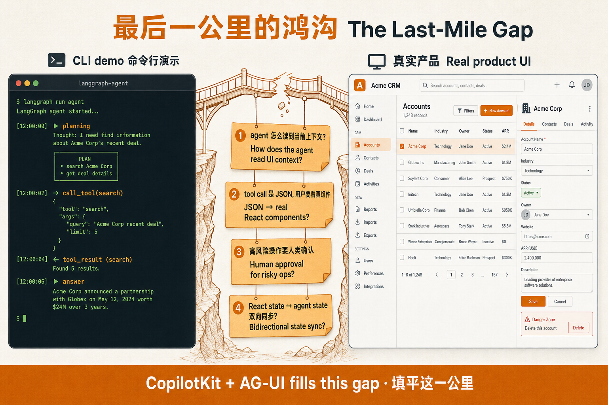

这就是 CopilotKit 要解决的最后一公里。它**不**是 agent 框架（不是 LangChain 替代），**不**是底层 SDK（不是 Vercel AI SDK 替代），而是**Agent ↔ User**这一层的协议 + React 工具链。

要理解为什么需要单独抽出来这一层，先把整个 AI Agent 开发栈画出来。

## 1. 坐标系：AI Agent 开发栈的 5 层

把一个 agent 从 LLM 串到"用户正在操作的界面"，中间隔着几件事：

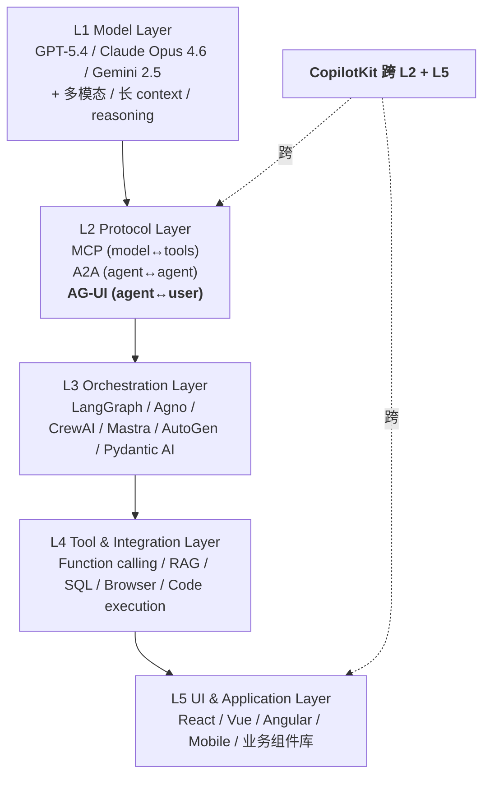

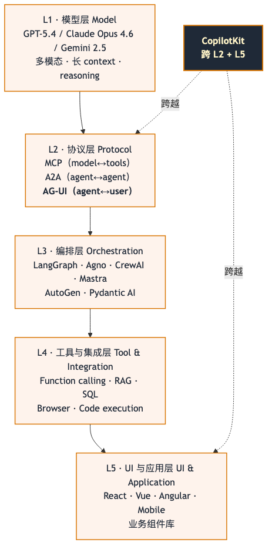

每层都有自己的代表项目：

| 层 | 职责 | 代表项目 |
| --- | --- | --- |
| L1 Model | 调用、计费、context 管理 | OpenAI / Anthropic / Google / 国内各家 |
| L2 Protocol | 标准化的跨进程通信 | MCP（Anthropic）/ A2A（Google）/ **AG-UI（CopilotKit）** |
| L3 Orchestration | state graph、agent 循环、tool 选择 | LangGraph、Agno、CrewAI、Mastra、AutoGen、Microsoft Agent Framework |
| L4 Tool | 单个工具的实现 | function-calling、browser-use、SQL connectors |
| L5 UI | 把 agent 的输出和操作者接起来 | React 组件、状态管理、表单库 |

**CopilotKit 跨 L2 + L5**——它定义了 L2 的协议（AG-UI）并提供了 L5 的 React 工具链。它不抢 L3 的 orchestration 位置，所以 LangGraph、Agno、Mastra 这些 L3 框架都可以作为它的 backend。

这一点决定了 CopilotKit 和 Vercel AI SDK 的关系：Vercel AI SDK 是 L3 + L4 之间的"模型/工具调用 SDK"，可以独立用，也可以被 CopilotKit runtime 拿来作为 L3 backend；而 assistant-ui 是一个 L5 优先的 headless 组件库；CopilotKit 在这三者里跨 L2 + L5，定位最重。

## 2. CopilotKit 是什么

**一句话定义**：CopilotKit 是一个 full-stack 的 Agent 前端框架，外加它定义和维护的开源协议 **AG-UI**（Agent–User Interaction Protocol）。它解决"如何把任何 L3 agent framework 接到真实 React 应用"这个问题。

截至 2026-06-16 的可验证数据：

| 指标 | 数据 | 来源 |
| --- | --- | --- |
| GitHub stars | 35.2k | https://github.com/copilotkit/copilotkit |
| Dependents | 1.7k | 同上 |
| Contributors | 184 | 同上 |
| License | MIT | 同上 |
| 当前版本 | v1.60.1（2026-06-12 发布） | GitHub releases |
| 协议层 | AG-UI v2026.06.15（3 小时前刚发） | https://github.com/ag-ui-protocol/ag-ui |
| AG-UI stars | 14.3k | 同上 |

维护方是 CopilotKit Inc.，创始人是 Atai Barkai，团队是 Y Combinator W23。

**CopilotKit 实际包含两个项目**：

- [`copilotkit/copilotkit`](https://github.com/copilotkit/copilotkit) — React 组件 + 运行时 + 各种 framework 集成，MIT
- [`ag-ui-protocol/ag-ui`](https://github.com/ag-ui-protocol/ag-ui) — 协议规范 + 多语言 SDK（Python / TS / Dart / Kotlin / Java / Go），MIT

这是两个独立 repo。AG-UI 是协议，CopilotKit 是协议的首批 reference implementation + 商业扩展（Copilot Cloud）。

## 3. AG-UI 协议：agent↔user 通信的"行业标准"

### 3.1 为什么要单独搞一个协议

在 AG-UI 出现之前，每个 agent framework 都要自己实现"前端怎么调用我、我的 stream 怎么推给前端、tool call 怎么回流"。结果就是：

- LangGraph 推 SSE 给你一个 event stream
- Mastra 用它自己的 transport
- CrewAI 有它自己的格式
- Agno 又不一样

每个 framework 都要在前端重新写一遍 client。CopilotKit 的判断是：**agent 和前端之间的 wire format 应该是一个标准协议**，就像 HTTP 是 server-client 之间的标准一样。这就是 AG-UI。

### 3.2 AG-UI 在协议版图里的位置

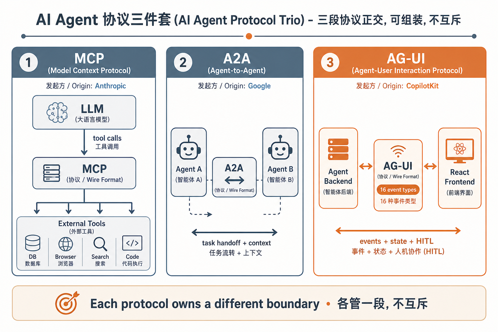

三段协议各管一段：

- **MCP**（Anthropic 提出）：model / agent 怎么调用外部 tool。
- **A2A**（Google 提出）：agent 和 agent 之间怎么交接任务、传上下文。
- **AG-UI**（CopilotKit 提出）：agent 和前端 / 用户之间怎么通信、共享状态、请求人类输入。

它们**正交**——不是替代关系，是组装关系。AG-UI 在协议描述里直接说"while MCP and A2A handle context and coordination, AG-UI defines the layer between the user, application, and agent"。

### 3.3 容易混淆：A2UI ≠ AG-UI

Google 2025-12 推出 **A2UI**（Agent-to-UI），和 AG-UI 名字像但定位不同：

- **A2UI** 是一份 **generative UI 规范**——agent 输出某种 JSON spec，前端按 spec 渲染 widget。偏静态、声明式。
- **AG-UI** 是一个 **双向 runtime 协议**——16 个 streaming event type、状态共享、HITL、interrupt。偏动态、运行时。

CopilotKit v1.50 之后**同时支持 A2UI 和 AG-UI**（再加上 MCP Apps 和 Open-JSON-UI），意味着你可以用 AG-UI 做 runtime transport，用 A2UI 做 generative UI 的输出格式，二者不冲突。

### 3.4 AG-UI 的事件分类

AG-UI 一共 16 个 event type，分 5 类：

| 类别 | 事件 | 用途 |
| --- | --- | --- |
| Lifecycle | `RUN_STARTED` / `RUN_FINISHED` / `RUN_ERROR` / `STEP_STARTED` / `STEP_FINISHED` | 一次 agent 调用的生命周期 |
| Text message | `TEXT_MESSAGE_START` / `TEXT_MESSAGE_CONTENT` / `TEXT_MESSAGE_END` | 流式文本（chat 主体） |
| Tool call | `TOOL_CALL_START` / `TOOL_CALL_ARGS` / `TOOL_CALL_END` | agent 调前端 / 后端工具的完整过程 |
| State management | `STATE_SNAPSHOT` / `STATE_DELTA` / `MESSAGES_SNAPSHOT` | 共享状态的完整快照 / 增量 delta（JSON Patch RFC 6902） |
| Reasoning（替代 Thinking） | `REASONING_START` / `REASONING_MESSAGE_*` / `REASONING_END` | chain-of-thought 流（v2 把旧 THINKING_* 都标 deprecated） |
| Special | `RAW` / `CUSTOM` | 透传事件、用户自定义事件 |
| Draft | `META_EVENT` / extended `RunFinished` | 应用级 annotation、interrupt 感知的扩展 |

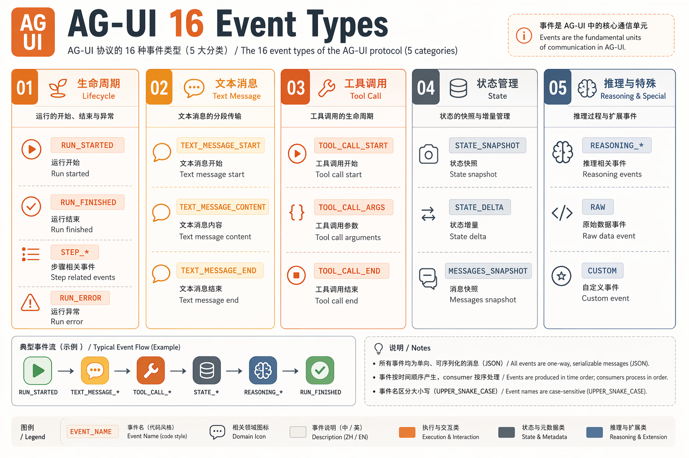


3 个事件流模式（这是 AG-UI 设计上很关键的一点）：

1. **Start–Content–End**：流式内容（text、tool call）走这种。
2. **Snapshot–Delta**：状态同步走这种——`STATE_SNAPSHOT` 给全量，`STATE_DELTA` 给 JSON Patch 增量。
3. **Lifecycle**：监控 agent run。

### 3.5 一次 user input 走过的事件流

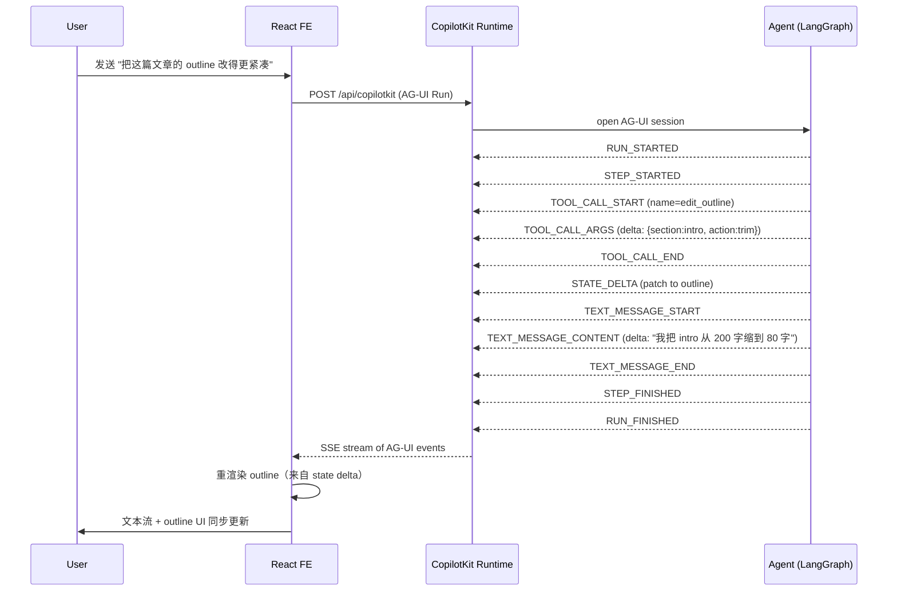

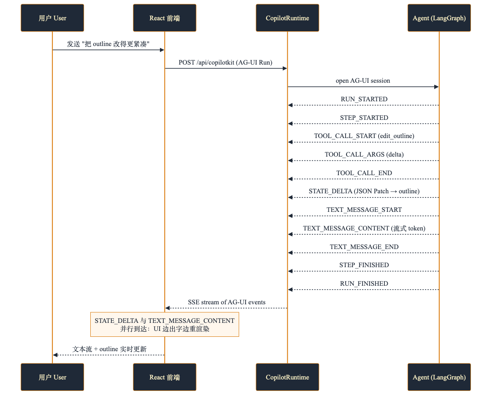

注意 `STATE_DELTA`（增量）和 `TEXT_MESSAGE_CONTENT`（增量）是**并行**的——文本流式输出的同时，状态也在 patch，前端可以根据 `STATE_DELTA` 实时重渲染"被 agent 改的 outline 组件"。

## 4. CopilotKit 的三件套架构

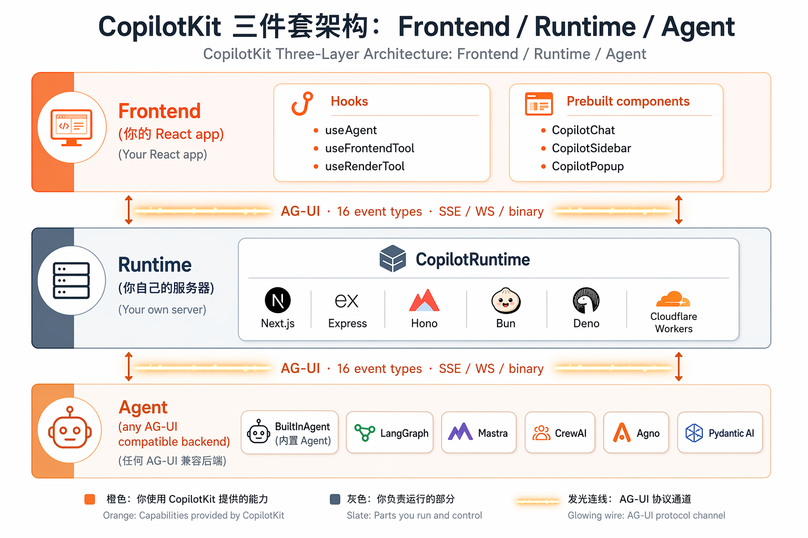

三层的职责：

### 4.1 Frontend

- **Hooks**：`useAgent`、`useFrontendTool`、`useRenderTool`、`useHumanInTheLoop`、`useAgentContext`、`useConfigureSuggestions` 等。`useAgent` 是 v2 的核心——既能订阅 agent state，又能调方法（`runAgent`、`subscribe`、`setState`）。
- **Prebuilt 组件**：`CopilotChat`（嵌入式 chat）、`CopilotSidebar`（侧边栏）、`CopilotPopup`（浮窗）。开箱即用。
- **Headless 模式**：以上都不是必须的。完全可以用 hooks 自己拼 UI，prebuilt 只是给"懒得设计 UI"的人。

### 4.2 Runtime

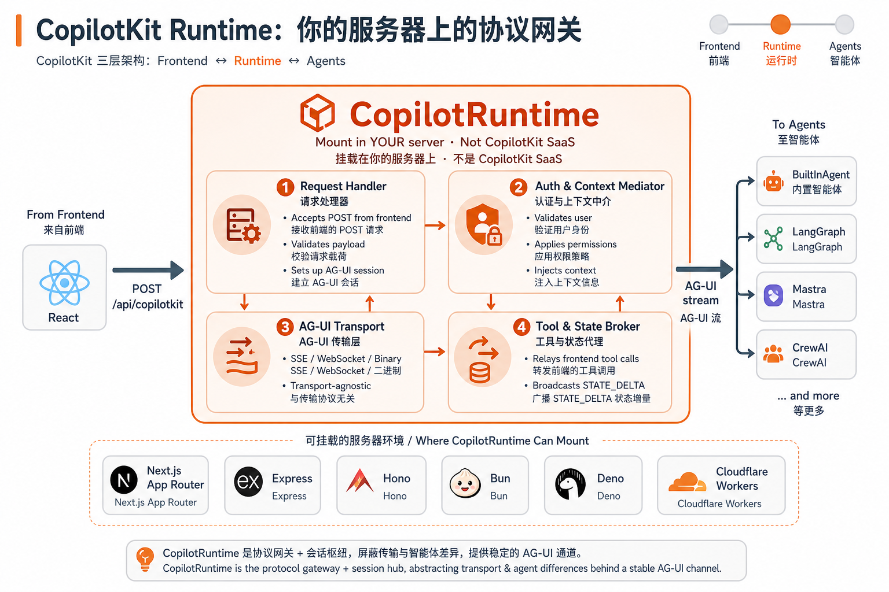

`CopilotRuntime` 是一个 mount 在你自己服务器上的 request handler：

- 接受前端 POST
- 中介 auth / 权限 / 上下文
- 转发给配置的 agent backend（通过 AG-UI）
- 把 agent 的 stream 转发回前端（SSE / WebSocket / 二进制）

支持 Next.js App Router、Express、Hono、Bun、Deno、Cloudflare Workers。这是**你的**服务器，不是 CopilotKit 的 SaaS——这点很重要，意味着你不用把 user prompt 发到 Copilot 的服务器去（除非你额外买 Copilot Cloud 的 Threads/Persistence）。

如果选 **BuiltInAgent**（in-process 模式），runtime 直接在同一进程内运行 agent，连外部 LLM 调用都省了。


### 4.3 Agent

任何实现 AG-UI 协议的 backend：

- **BuiltInAgent**：CopilotKit 自带，in-process 跑，适合 demo
- **LangGraph**（Python / TS / FastAPI）：最广泛支持
- **Mastra**（TS）：TypeScript-native
- **CrewAI**、**Agno**、**Pydantic AI**、**Microsoft Agent Framework**、**AWS Strands**、**Google ADK**、**LlamaIndex**、**AG2**、**AI SDK** 全都接进来了
- **你自己的** AG-UI 实现

CopilotKit 的解耦策略：换 backend 改一行配置，前端不动。

```ts
// 换 backend 的 diff：只改 runtime 这一段
const runtime = new CopilotRuntime({
  agents: {
    // 上周用 BuiltInAgent
    // default: new BuiltInAgent({ model: "openai:gpt-4o" }),
    // 这周换 LangGraph
    default: new LangGraphHttpAgent({ url: "http://localhost:8000/agent" }),
  },
});
```

## 5. 详细组件手册

> CopilotKit 1.x → 1.5 → 1.6 这两版做了一次较大的 hook 重命名。v1 用 `useCopilotAction`、`useCoAgent`、`useCoAgentStateRender`，v2 用 `useFrontendTool`、`useAgent`、`useRenderTool`。我按 v2 写（也是官方当前推荐），v1 hook 在 deprecated 注释里还能用。

### 5.1 `useAgent` — agent 的全功能接口（v2）

```tsx
import { useAgent } from "@copilotkit/react-core/v2";

const { state, setState, runAgent, subscribe, stop } = useAgent({
  agentId: "travel-planner",
});

// 读 state
console.log(state.tripPlan);

// 写 state（前端直接 set，agent 立即可见）
setState({ tripPlan: { ...state.tripPlan, destination: "Tokyo" } });

// 订阅 event
const unsub = subscribe({ eventTypes: ["STATE_DELTA", "TOOL_CALL_END"] }, (event) => {
  console.log(event);
});

// 主动起一次 run
await runAgent({ messages: [{ role: "user", content: "帮我加一天京都" }] });

// 停止
stop();
```

这个 hook 在 v2 把 v1 的 `useCoAgent`（state）+ 单独的 `runAgent` 合并了。一个 hook 同时管"读 state、写 state、订阅 event、起 run、停 run"。

### 5.2 `useFrontendTool` — 让 agent 调前端代码

让 agent 在自己规划时调一个**跑在浏览器里**的函数——比如把 agent 选中的行高亮、跳到某个段落、触发一个前端 store 更新。

```tsx
import { useFrontendTool, z } from "@copilotkit/react-core/v2";

useFrontendTool({
  name: "highlightRows",
  description: "在前端把指定 id 的行高亮 1.5 秒。",
  parameters: z.object({
    rowIds: z.array(z.string()).describe("要高亮的行 id"),
  }),
  handler: async ({ rowIds }) => {
    setHighlighted(rowIds);
    await new Promise((r) => setTimeout(r, 1500));
    setHighlighted([]);
    return { ok: true, count: rowIds.length };
  },
});
```

这个 tool 跑在浏览器，agent 调它时 runtime 会中转——AG-UI 的 `TOOL_CALL_*` 事件让前端 handler 执行，handler return value 走同样事件流回去。

### 5.3 `useRenderTool` / `useDefaultRenderTool` — tool 的 UI 渲染

当 agent 调一个 tool（无论是前端 tool 还是后端 tool），结果通常应该被渲染成**真的 React 组件**，而不是塞进 chat 气泡。v2 的 `useRenderTool` 就是干这个的：

```tsx
import { useRenderTool, useDefaultRenderTool, z } from "@copilotkit/react-core/v2";

// 1) 给某个特定 tool 注册专属 renderer
useRenderTool(
  {
    name: "get_weather",
    parameters: z.object({ location: z.string() }),
    render: ({ parameters, result, status }) => {
      const loading = status !== "complete";
      return (
        <WeatherCard
          loading={loading}
          location={parameters.location}
          temperature={result?.temperature}
          conditions={result?.conditions}
        />
      );
    },
  },
  []
);

// 2) 给所有"没被认领"的 tool 一个 catch-all
useDefaultRenderTool({
  render: ({ name, parameters, status, result }) => (
    <GenericToolCard name={name} params={parameters} result={result} status={status} />
  ),
}, []);
```

这就是 **Generative UI** 的落地：tool 的语义由 agent 决定，tool 的"长什么样"由前端 React 组件决定。Runtime 通过 AG-UI 的 `TOOL_CALL_START/ARGS/END` 事件把 `(tool name, parameters, result, status)` 推给前端。

### 5.4 `useHumanInTheLoop` — 工具式 HITL

HITL 的第一种 pattern：**LLM 决定什么时候暂停**。你定义一个前端 tool，让 LLM 在合适的时候调它，UI 上弹一个 form 让用户答。

```tsx
import { useHumanInTheLoop, useConfigureSuggestions, z } from "@copilotkit/react-core/v2";

function BookingChat() {
  useConfigureSuggestions({
    suggestions: [
      { title: "和 sales 约个 call", message: "请帮我约个 sales 介绍会议" },
      { title: "和 Alice 一对一", message: "约下周和 Alice 的一对一" },
    ],
    available: "always",
  });

  useHumanInTheLoop({
    agentId: "booking-agent",
    name: "book_call",
    description: "问用户选一个时段。",
    parameters: z.object({
      topic: z.string().describe("约什么"),
      attendee: z.string().describe("和谁约"),
    }),
    render: ({ args, status, respond }) => (
      <TimePickerCard
        topic={args?.topic}
        attendee={args?.attendee}
        status={status}
        onSubmit={(result) => respond?.(result)}
      />
    ),
  });

  return <CopilotChat agentId="booking-agent" />;
}
```

后端在 LangGraph Python 里只需要装 middleware：

```python
from langchain.agents import create_agent
from langchain_openai import ChatOpenAI
from copilotkit import CopilotKitMiddleware

graph = create_agent(
    model=ChatOpenAI(model="gpt-4o"),
    tools=[],
    middleware=[CopilotKitMiddleware()],
)
```

`CopilotKitMiddleware` 负责把前端 tool 注册的 schema 透传给 LLM。当 LLM 决定调 `book_call`，前端就拿到事件、render 出 picker、用户点完之后 `respond?.()` 走 AG-UI 回流给 agent。

### 5.5 `useInterrupt` — Graph 决定什么时候暂停

HITL 的第二种 pattern：**graph 自己决定暂停**。在 LangGraph 节点里调 `interrupt(...)`：

```python
from langgraph.types import interrupt

def confirm_email_node(state):
    payload = interrupt({
        "question": "确认发这封邮件吗？",
        "preview": state["draft"],
    })
    if not payload.get("approved"):
        return {"cancelled": True}
    return {"sent": True}
```

前端用 `useInterrupt` 接这个 payload：

```tsx
import { useInterrupt, z } from "@copilotkit/react-core/v2";

useInterrupt({
  agentId: "mailer",
  render: ({ payload, respond }) => (
    <ConfirmEmailCard
      preview={payload.preview}
      onApprove={() => respond({ approved: true })}
      onCancel={() => respond({ approved: false })}
    />
  ),
});
```


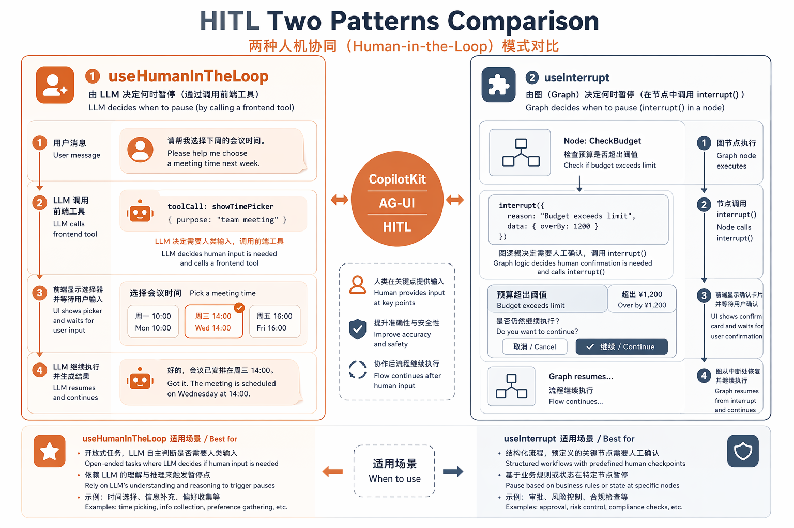
两种 pattern 的区别：

| Pattern | 谁决定暂停 | 后端 surface | 适用 |
| --- | --- | --- | --- |
| `useHumanInTheLoop` | LLM（调一个 tool） | 前端定义的 tool schema + render | 高频、可枚举的确认 / 选择 |
| `useInterrupt` | Graph（节点里 `interrupt()`） | graph 节点 + payload schema | graph 自己知道该不该停、不该被 LLM 二次规划 |

### 5.6 `useAgentContext` — 只读上下文（one-way UI→Agent）

当某个值**UI 拥有、agent 只读**（当前 user、当前 selected record、scroll 位置），用 `useAgentContext`：

```tsx
useAgentContext({
  description: "当前用户",
  value: { userId, orgId, role },
});
```

auto-unregister on unmount。agent 在 system prompt 里就能看到，不用塞到 user message 里重复。

### 5.7 `useConfigureSuggestions` — 聊天框的建议 chip

```tsx
useConfigureSuggestions({
  suggestions: [
    { title: "总结这篇文章", message: "请总结当前 article" },
    { title: "改成更口语", message: "把语气改得更口语" },
  ],
  available: "always",  // 或 "when-idle" / "after-message"
});
```

比手写一个 `useEffect` 塞 props 进去省事。

### 5.8 Prebuilt 组件

- `CopilotChat` — 嵌入式 chat（嵌在页面某处）
- `CopilotSidebar` — 侧边栏（push content 那种）
- `CopilotPopup` — 浮窗按钮 + 弹出 panel
- `CopilotKit` — Provider（必须包根 layout）

v2 全部从 `@copilotkit/react-core/v2` 导出：

```tsx
import { CopilotKit, CopilotChat, CopilotSidebar, CopilotPopup } from "@copilotkit/react-core/v2";
import "@copilotkit/react-core/v2/styles.css";
```

## 6. Generative UI 的三种 spec
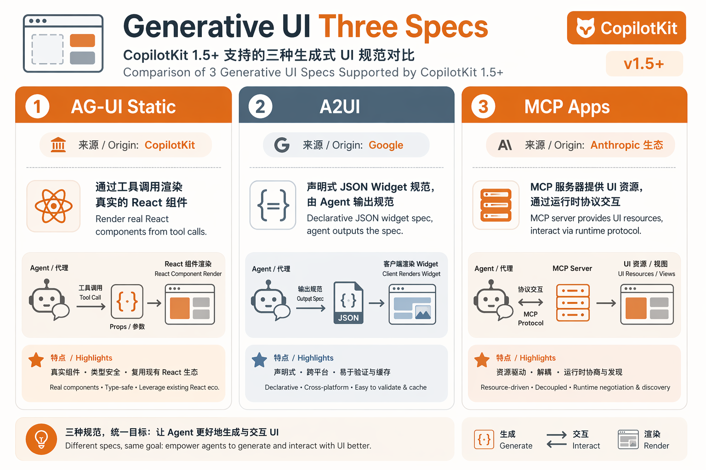


CopilotKit 1.50 起把市面上三个 generative UI spec 都接进来了：

| Spec | 来源 | 定位 | CopilotKit 角色 |
| --- | --- | --- | --- |
| **AG-UI Static** | CopilotKit | 静态组件渲染（agent 决定渲染什么 React 组件） | 一等公民 |
| **A2UI** | Google | 声明式 widget 规范（agent 输出 JSON spec） | launch partner |
| **MCP Apps** | Anthropic 生态 | 通过 MCP server 提供可交互的 UI 资源 | full support |
| **Open-JSON-UI** | 社区 | 开放的 JSON UI spec | 支持 |

`useRenderTool` 走的是 AG-UI Static 路线——和 AG-UI runtime 一体。你想接 A2UI 也行，CopilotKit 自带 `@copilotkit/a2ui-renderer`，把 Google 出的 spec 转成真组件。

## 7. State Streaming：token 级的双向 state

如果你在 LangGraph 里有一个 `document` state，让 agent 用 `write_document` tool 一边生成一边写。**默认**行为是：tool call 完成后 `STATE_DELTA` 一次发完整文档。用户在 chat 里要等好几秒才能看到结果。

`StateStreamingMiddleware` 把 tool 的某个**argument** 的 streaming 直接灌进 state——UI 上 token-by-token 看到 agent 写的字：

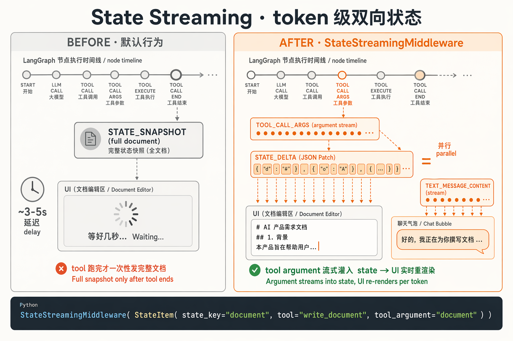

```python
from langgraph.types import Command
from langchain_core.messages import ToolMessage
from copilotkit import (
    CopilotKitMiddleware,
    StateItem,
    StateStreamingMiddleware,
)

@tool
def write_document(document: str, runtime: ToolRuntime) -> Command:
    """写一个文档。"""
    return Command(update={
        "document": document,
        "messages": [ToolMessage(content="Document written.", tool_call_id=runtime.tool_call_id)],
    })

graph = create_agent(
    model=ChatOpenAI(model="gpt-4o"),
    tools=[write_document],
    middleware=[
        CopilotKitMiddleware(),
        StateStreamingMiddleware(
            StateItem(
                state_key="document",          # 推到 state["document"]
                tool="write_document",         # 监听这个 tool
                tool_argument="document",      # 取这个 argument 的 streaming
            )
        ),
    ],
    state_schema=AgentState,
)
```

关键约束：**tool argument 名必须和 `state_key` 相同**，否则前端 `usePredictStateSubscription` 没法对到。

## 8. 竞品地图

把最常被拿来比的项目列出来：

| 项目 | 层 | 哲学 | 最强项 | 最弱项 |
| --- | --- | --- | --- | --- |
| **CopilotKit + AG-UI** | L2 + L5 | Bundle：协议 + UI 全包 | 跨 framework、协议中立、generative UI + HITL + shared state 闭环 | 协议升级时第三方跟进有 lag；headless 想自管 UI 时 bundle 偏重 |
| **Vercel AI SDK** | L3/L4 | 底层 SDK，自由拼 | 多 provider 抽象、流式 UI primitives、最轻 | 没有 agent 协议、没有 native shared state / HITL 闭环 |
| **assistant-ui** | L5 | Headless 优先，UI 你自己拼 | 真正的 headless、customizable、shadcn 风格 | 没有自带 protocol、靠各家 framework 推 stream、自己实现 HITL |
| **LangGraph Studio** | L3 | LangChain 官方调试器 | LangGraph 可视化、debug 友好 | 不是产品里的 UI，是开发工具；不能嵌进业务 app |
| **Mastra** | L3 + L5 | TS-native 端到端 | TypeScript 一把梭、自带 memory/workflows | 生态比 LangGraph 小、跨 L2 的能力弱 |
| **OpenAI AgentKit** | L3 + L5 | OpenAI 自家 | 与 OpenAI 模型深度集成 | 只为 OpenAI 模型设计、跨 provider 难 |
| **Microsoft Agent Framework** | L3 | .NET / Python | enterprise integration | UI 一侧比较薄 |
| **AG2 / AutoGen** | L3 | 学术派 multi-agent | 多 agent 协作、消息协议 | UI 一侧几乎全靠你自己 |

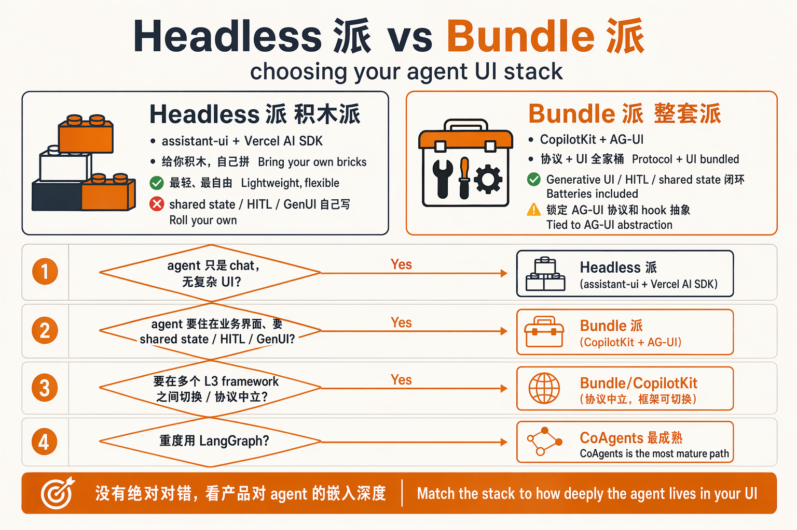

**Headless 派 vs Bundle 派**：

- **Headless 派**（assistant-ui + Vercel AI SDK）——给你积木，你自己拼。你想要 shared state 双向同步、HITL 自动 UI、Generative UI 全套，要自己写。
- **Bundle 派**（CopilotKit）——给你整套。代价是锁定 AG-UI 协议和它的 hook 抽象。

判断标准：

- 你的 agent 只是 chat，没有复杂 UI → headless 派。
- 你的 agent 要"住在"业务界面里、要 shared state、要 HITL、要 generative UI → bundle 派。
- 你打算在不同 L3 framework 之间切换（LangGraph → Agno → 自家实现）→ CopilotKit，因为协议中立。
- 你重度用 LangGraph → CoAgents 这条路最成熟。

## 9. Demo A：Built-in Agent，10 分钟

路径选**Built-in Agent**——in-process 跑，0 依赖外部服务，只需要 OpenAI key。

我已经在本地用 Next.js 16.2.9 + CopilotKit 1.60.1 实测跑过一遍（见 [附录 A](#附录-a-demo-实测日志)），下面是最小可跑代码。

### 9.1 初始化

```bash
npx create-next-app@latest my-copilot-app --typescript --tailwind --app --use-npm
cd my-copilot-app
npm install @copilotkit/react-core @copilotkit/react-ui @copilotkit/runtime
```

### 9.2 配 env

`.env`：

```bash
OPENAI_API_KEY=sk-...
```

### 9.3 `app/api/copilotkit/route.ts`

这是 runtime 入口。`BuiltInAgent` 在同一进程内运行：

```ts
import {
  CopilotRuntime,
  copilotRuntimeNextJSAppRouterEndpoint,
} from "@copilotkit/runtime";
import { BuiltInAgent } from "@copilotkit/runtime/v2";
import { NextRequest } from "next/server";

const builtInAgent = new BuiltInAgent({
  model: "openai:gpt-4o",
});

const runtime = new CopilotRuntime({
  agents: { default: builtInAgent },
});

export const POST = async (req: NextRequest) => {
  const { handleRequest } = copilotRuntimeNextJSAppRouterEndpoint({
    runtime,
    endpoint: "/api/copilotkit",
  });
  return handleRequest(req);
};
```

### 9.4 `app/layout.tsx` — Provider

```tsx
import { CopilotKit } from "@copilotkit/react-core/v2";
import "@copilotkit/react-core/v2/styles.css";
import "./globals.css";

export default function RootLayout({ children }: { children: React.ReactNode }) {
  return (
    <html lang="en">
      <body className="antialiased">
        <CopilotKit runtimeUrl="/api/copilotkit">
          {children}
        </CopilotKit>
      </body>
    </html>
  );
}
```

### 9.5 `app/page.tsx` — Sidebar

```tsx
import { CopilotSidebar } from "@copilotkit/react-core/v2";

export default function Page() {
  return (
    <main className="min-h-screen p-8">
      <h1 className="text-2xl font-semibold">CopilotKit Built-in Agent Demo</h1>
      <p className="mt-2 text-sm text-neutral-600">
        右侧 Sidebar 就是 CopilotSidebar；底层的 CopilotKit 已经在 layout 里包好了。
      </p>
      <CopilotSidebar />
    </main>
  );
}
```

### 9.6 启动

```bash
npm run dev
```

打开 http://localhost:3000 就看到右侧 sidebar。问"Can you tell me a joke?"，LLM 直接答。

### 9.7 加一个 frontend tool

把 page.tsx 改成：

```tsx
"use client";
import { CopilotSidebar, useFrontendTool, z } from "@copilotkit/react-core/v2";
import { useState } from "react";

export default function Page() {
  const [highlight, setHighlight] = useState<string | null>(null);
  return (
    <main className="min-h-screen p-8">
      <h1 className={`text-2xl font-semibold ${highlight ? "text-orange-600" : ""}`}>
        标题（agent 可以高亮我）
      </h1>
      <CopilotSidebar />
      <Highlighter setHighlight={setHighlight} />
    </main>
  );
}

function Highlighter({ setHighlight }: { setHighlight: (s: string | null) => void }) {
  useFrontendTool({
    name: "highlight_title",
    description: "把页面顶部标题高亮 1.5 秒。",
    parameters: z.object({
      reason: z.string().describe("为什么高亮，例如 '答对了'" }),
    }),
    handler: async ({ reason }) => {
      setHighlight(reason);
      await new Promise((r) => setTimeout(r, 1500));
      setHighlight(null);
      return { highlighted: true };
    },
  });
  return null;
}
```

现在让 agent 自己决定什么时候调这个 tool——比如问"如果我答对了一道数学题，请高亮标题表示奖励"，LLM 就会调 `highlight_title`，前端标题变成橙色，1.5 秒后恢复。

## 10. Demo B：CopilotKit + LangGraph backend，30-60 分钟

这个 demo 演示**协议层的真正力量**——前端是 CopilotKit，agent 跑在独立 Python LangGraph 服务里。


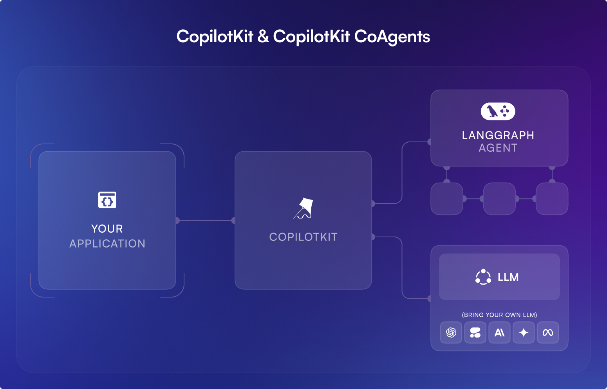
### 10.1 用官方 CLI scaffold

```bash
npx copilotkit@latest create
# 按提示：
#   Project name: my-langgraph-app
#   Enterprise Intelligence Platform: No (先不上 Copilot Cloud)
#   Framework: LangGraph (Python)
```

CLI 会 scaffold 一个 monorepo，目录大概长这样：

```
my-langgraph-app/
├── agent/                  # Python LangGraph 服务
│   ├── pyproject.toml      # uv 管依赖
│   ├── langgraph.json
│   └── src/agent.py
├── ui/                     # Next.js 前端
│   ├── package.json
│   ├── app/
│   │   ├── api/copilotkit/route.ts
│   │   ├── layout.tsx
│   │   └── page.tsx
│   └── ...
└── package.json            # workspace 根
```

`agent/src/agent.py` 里就是标准 LangGraph，`CopilotKitMiddleware` 把所有前端 tool 透传给 LLM。

### 10.2 一个写文档的 agent

```python
import uuid
from langchain.agents import AgentState as BaseAgentState, create_agent
from langchain.tools import ToolRuntime, tool
from langchain_core.messages import ToolMessage
from langchain_openai import ChatOpenAI
from langgraph.types import Command
from copilotkit import (
    CopilotKitMiddleware,
    StateItem,
    StateStreamingMiddleware,
)

class AgentState(BaseAgentState):
    document: str

@tool
def write_document(document: str, runtime: ToolRuntime) -> Command:
    """写一个文档。每次写都用这个 tool,document 参数会流式进 shared state。"""
    return Command(update={
        "document": document,
        "messages": [ToolMessage(
            content="Document written to shared state.",
            name="write_document",
            id=str(uuid.uuid4()),
            tool_call_id=runtime.tool_call_id,
        )],
    })

graph = create_agent(
    model=ChatOpenAI(model="gpt-4o"),
    tools=[write_document],
    middleware=[
        CopilotKitMiddleware(),
        StateStreamingMiddleware(
            StateItem(state_key="document", tool="write_document", tool_argument="document")
        ),
    ],
    state_schema=AgentState,
    system_prompt=(
        "You are a collaborative writing assistant. When the user asks you to write, "
        "draft, or revise any piece of text, ALWAYS call `write_document` with the full "
        "content in the `document` argument. Never paste the document in chat directly."
    ),
)
```

### 10.3 前端：读 + 渲染 shared state

```tsx
"use client";
import { CopilotChat, useAgent } from "@copilotkit/react-core/v2";
import { Card, CardContent, CardHeader, CardTitle } from "@/components/ui/card";

export default function Page() {
  return (
    <CopilotKit runtimeUrl="/api/copilotkit" agent="default">
      <div className="flex h-screen">
        <div className="flex-1 p-8 overflow-y-auto">
          <DocumentView />
        </div>
        <div className="w-[420px] border-l">
          <CopilotChat agent="default" className="h-full" />
        </div>
      </div>
    </CopilotKit>
  );
}

function DocumentView() {
  const { state } = useAgent({ agentId: "default" });
  return (
    <Card>
      <CardHeader>
        <CardTitle>Document (live from agent state)</CardTitle>
      </CardHeader>
      <CardContent>
        <pre className="whitespace-pre-wrap text-sm">
          {state?.document || "等 agent 写…"}
        </pre>
      </CardContent>
    </Card>
  );
}
```

现在问"帮我写一首关于 AG-UI 协议的七言绝句"，你会看到右侧 chat 在流式输出 token，**同时**左侧 Card 也在流式更新这首诗——是同一个 `state.document` 的两个 view，因为 `StateStreamingMiddleware` 把 `write_document` 的 `document` 参数 token-by-token 推给前端。

### 10.4 启动

```bash
# 根目录
npm run dev
# 这会同时启动：
#   - UI  dev server    (Next.js, 默认 3000)
#   - Agent dev server  (langgraph dev,  默认 8123)
```

打开 http://localhost:3000，UI 通过 `/api/copilotkit` 这个 Next.js route 把请求转发给 `http://localhost:8123` 的 LangGraph。

如果想换到 production 部署（你的 LangGraph 不在本地）：

```ts
// ui/app/api/copilotkit/route.ts
const runtime = new CopilotRuntime({
  agents: {
    default: new LangGraphHttpAgent({ url: "https://my-langgraph.example.com/agent" }),
  },
});
```

前端一行不用动。

### 10.5 对比两个 demo

| 维度 | Demo A (Built-in Agent) | Demo B (LangGraph backend) |
| --- | --- | --- |
| 启动时间 | 10 分钟 | 30-60 分钟（多一个 Python 服务） |
| agent 在哪 | 同 Node 进程 | 独立 Python 进程 |
| 适合场景 | demo、纯 chat、个人工具 | 真正生产 agent、多语言 stack |
| 协议层价值 | 看不出来 | 一目了然——换 backend 改一行 |
| Shared state 流式 | 不支持 | 支持（`StateStreamingMiddleware`） |
| HITL 完整 | 只支持 `useHumanInTheLoop` | 两种都支持（含 `useInterrupt`） |

**关键判断**：CopilotKit 在 Demo A 看起来就是 "Vercel AI SDK 套了层 chat 组件"——这是错觉。Demo B 才把协议层的价值显出来：**你今天在 Node 进程里跑 BuiltInAgent，下周拆出 Python LangGraph 服务，前端一行不动**。这种迁移在 Vercel AI SDK / assistant-ui 这边要重写一遍 chat client。

## 11. 关键判断 / 收尾

**为什么是 CopilotKit 在做这件事，而不是别人**：

- **时机**：2024 年 agent framework 井喷，到 2025 年 L3 已经被 LangGraph / Agno / Mastra 切完了，剩下没人填的层就是 L2 + L5
- **定位**：他们不是想做"最好的 agent framework"，而是想做"agent framework 的最大公约数"
- **押注**：把协议（AG-UI）和 reference impl（CopilotKit）一起开源，赌的是"如果所有 framework 都接 AG-UI，CopilotKit 就是默认前端"
- **商业化**靠 Copilot Cloud（threads、persistence、observability、guardrails）——enterprise 卖 SaaS，OSS 留住开发者

**生态张力**：CopilotKit 想中立，但同时也想当默认 client。这个张力会在 2026-2027 越来越明显——如果 LangGraph 自己做一套 AG-UI 兼容的 client（已经有 LangGraph Studio），CopilotKit 的"唯一 reference impl"地位就会松动。

**接下来看什么**：

- AG-UI 的 event type 数（16 → ?）和 backward compat 节奏
- CopilotKit 1.6 → 2.0 何时合并 v1/v2 hook
- Mastra / Agno 的前端策略：会不会也搞自己的一套协议
- Anthropic 的 MCP Apps 能不能和 AG-UI 共享一个 event 模型

**回到开头**：以前是"agent 跑得怎么样"（模型 + orchestration 性能），现在变成"agent 能不能住进你的产品里"（UI + 协议 + shared state）。CopilotKit + AG-UI 是把后一个问题的工程答案显式地摆出来——不是靠"智能体将重塑一切"这种判断，而是靠一份 16 个 event type 的协议规范。

**附录 A — Demo 实测日志**：

我本机在 `/tmp/copilotkit-verify/built-in-agent` 用 Next.js 16.2.9 (Turbopack) + CopilotKit 1.60.1 跑过 Demo A：

- `npx create-next-app@latest built-in-agent` → 1m 装 357 个包
- `npm install @copilotkit/react-core @copilotkit/react-ui @copilotkit/runtime` → 2m 装 787 个包
- 写 `route.ts` / `layout.tsx` / `page.tsx`
- `npx tsc --noEmit` → 通过，零类型错误
- `npx next dev -p 3010` → Ready in 457ms
- `GET /` → HTTP 200，43KB
- 页面 chunks 里包含 `node_modules_@ag-ui_client`、`node_modules_@copilotkit_core`、`node_modules_@copilotkit_a2ui-renderer`、`node_modules_@a2ui_web_core` 等——证明 AG-UI 客户端和 A2UI renderer 真的被加载

要真聊起来 agent，得在 `.env` 里换上一个真实的 `OPENAI_API_KEY`。runtime 起来后 `POST /api/copilotkit` 返回 400（因为没传合法 request body），这恰好证明 route 挂上了、CopilotKit runtime 启动了，只是没真的在聊。

**附录 B — 参考资料**：

- 官方站：https://www.copilotkit.ai/
- 协议站：https://ag-ui.com/，https://docs.ag-ui.com/
- 架构总览：https://docs.copilotkit.ai/concepts/architecture
- Built-in Agent quickstart：https://docs.copilotkit.ai/built-in-agent/quickstart
- LangGraph Python quickstart：https://docs.copilotkit.ai/langgraph-python/quickstart
- HITL 详解：https://docs.copilotkit.ai/langgraph-python/human-in-the-loop
- Shared state 详解：https://docs.copilotkit.ai/langgraph-python/shared-state
- Generative UI tool rendering：https://docs.copilotkit.ai/langgraph-python/generative-ui/tool-rendering
- AG-UI events：https://docs.ag-ui.com/concepts/events
- AG-UI architecture：https://docs.ag-ui.com/concepts/architecture
- AG-UI vs MCP / A2A 关系：https://www.copilotkit.ai/ag-ui
- GitHub：https://github.com/copilotkit/copilotkit，https://github.com/ag-ui-protocol/ag-ui
- 中文圈介绍：https://juejin.cn/post/7506349526942466083，https://www.cnblogs.com/dc-s/p/18755071
- 第三方对比：https://yourgpt.ai/blog/comparison/copilot-sdk-vs-vercel-ai-sdk，https://medium.com/@akshaychame2/the-complete-guide-to-generative-ui-frameworks-in-2026-fde71c4fa8cc
