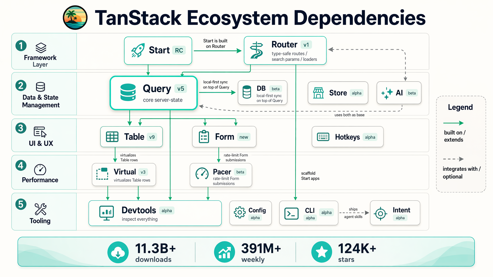
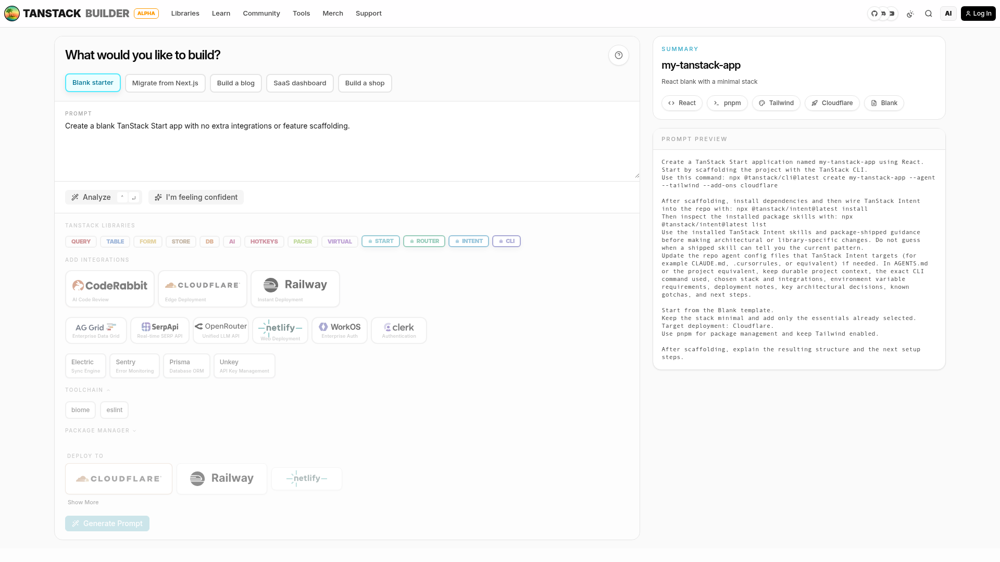
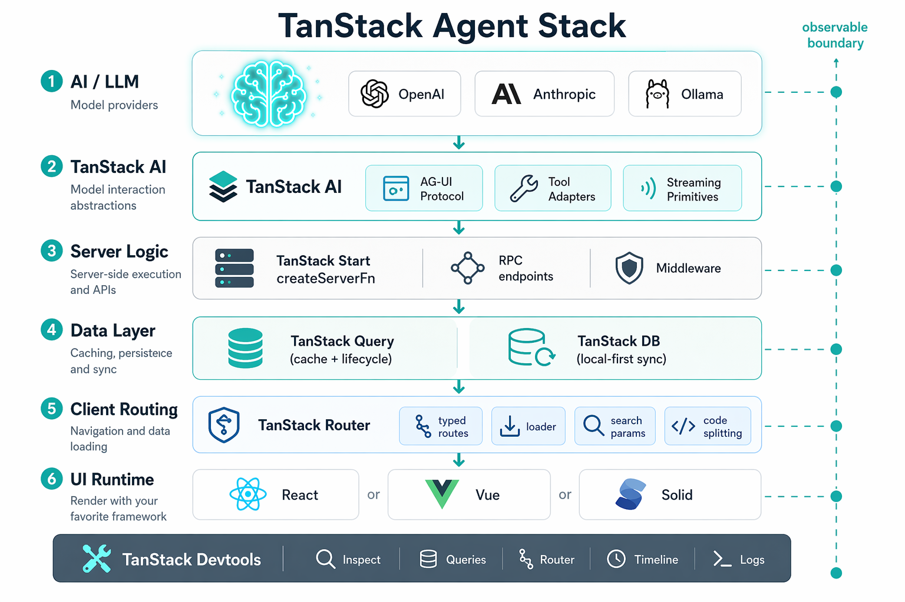
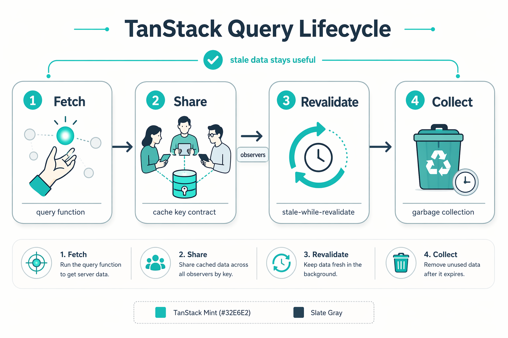
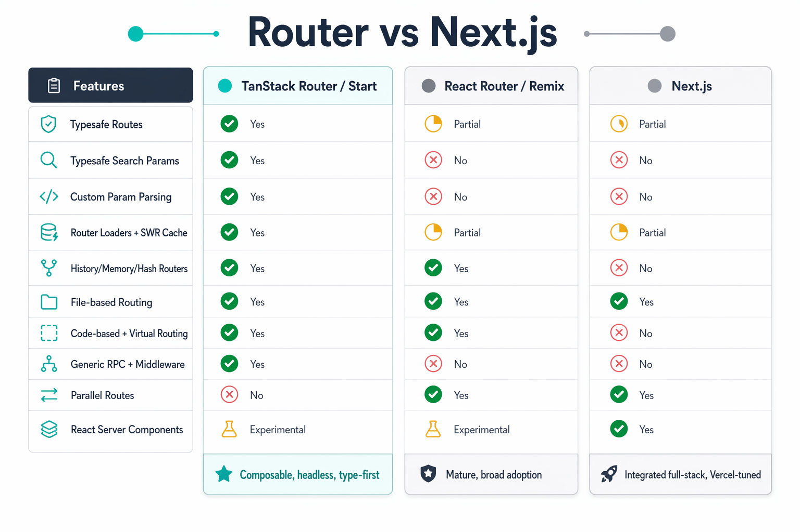
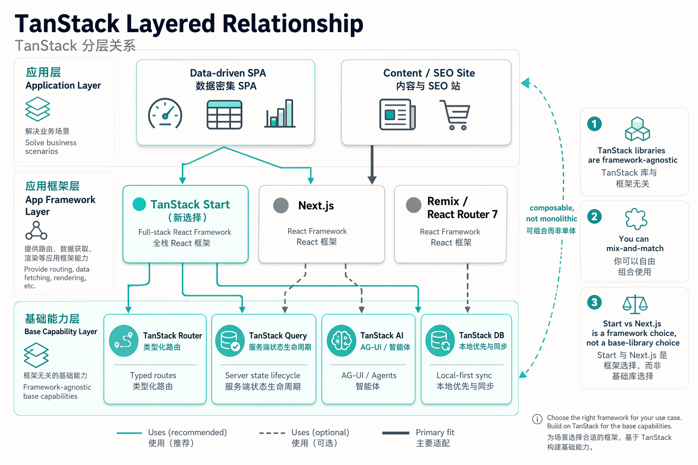
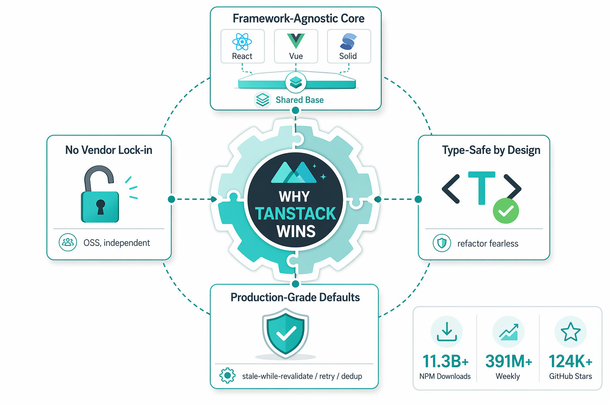

## 一、你肯定写过这种 useEffect

十有八九，你的某个 React 项目里有过这样一段：

```tsx
function ProjectList() {
  const [projects, setProjects] = useState<Project[]>([])
  const [loading, setLoading] = useState(true)
  const [error, setError] = useState<Error | null>(null)

  useEffect(() => {
    setLoading(true)
    fetch('/api/projects')
      .then(r => r.json())
      .then(d => { setProjects(d); setLoading(false) })
      .catch(e => { setError(e); setLoading(false) })
  }, [])

  if (loading) return <Spinner />
  if (error) return <ErrorBox error={error} />
  return <List items={projects} />
}
```

第一遍写，觉得挺顺的。

第二遍：当用户在另一个 tab 改完数据再切回来，发现列表是旧的——你想加 window focus refetch。

第三遍：用户点了一个删除按钮——你想做 optimistic update + rollback。

第四遍：列表页和详情页同时订阅同一个 `/api/projects`，网络面板里看到两个一模一样的请求——你想做 request dedupe。

第五遍：你想在路由切换时 prefetch 下一个详情页的数据。

写到第十遍，你手上会有一坨几百行的"自研 data layer"，写着写着你就明白：**React 没有给你一个把"远端数据"当成"有生命周期的资源"来管理的原语**。你只是在 useEffect 里手工模拟一个。

这正是 TanStack Query 当年横空出世时打的点——也正是整个 TanStack 生态今天想解决的那个根本问题的缩影。

> 本文是一篇技术学习笔记 + 工程分析。我会先回答"TanStack 到底是什么、为什么火、跟 Next.js 是什么关系"，然后带你跑一段真实可执行的 demo。文章里所有数字、库名、状态都核对自 [tanstack.com](https://tanstack.com)（截至 2026-06-16）。


---

## 二、TanStack 到底是什么

TanStack 不是单一框架。它是一组**headless、type-first、framework-agnostic** 的 TypeScript 库，以"@tanstack/" 为统一命名空间，由同一群维护者协作开发，组合起来覆盖现代 web 应用的几乎所有横切关注点。

官方对自己的描述非常精确：

> "Headless, type-safe, composable tools for building modern web applications that work naturally for **developers** and reliably for **agents**."

这句话是 TanStack 整套叙事的支点：**"agents" 不是嘴炮**。你往下看会看到，TanStack 2026 年专门出了一个 TanStack AI 库、用 AG-UI 协议做 provider 中立，还做了一个 Builder 工具让你用自然语言描述 app，自动生成一段给 agent 用的 prompt。Agent 友好是产品决策，不是营销话。

几个量级数字（截至 2026-06-16，来自 [tanstack.com](https://tanstack.com) 主页）：

- **NPM 总下载：11.33B+**（累计）
- **周下载：391M+**
- **GitHub stars：124K+**（TanStack org 名下所有仓库合计）

这个量级放在前端开源生态里，是 React Router / SWR / Apollo 那一档的。Query 单独一项就已经是 React 圈最常用的 server state 库。

### 13+ 个库，按 5 个层排

下图是 TanStack 当前的全部库、所在层、以及**它们之间的依赖关系**（实线 = "built on / extends"，虚线 = "integrates with / optional"）。来自 [tanstack.com](https://tanstack.com) 主页抓取，结合官方文档梳理。



几个关键依赖关系值得记一下：

- **Start → Router**：Start 本质上是 Router 包了一层 server runtime，不是另起炉灶
- **DB → Query**：DB 用 Query 当底层 cache，自己做 local-first sync
- **AI → Start + Query**：AI 同时依赖 Start 的 server fn 和 Query 的状态生命周期
- **Table / Form ← Router + Query**：UI/UX 层那两个大库都同时用 Router（loader）和 Query（mutate）
- **Virtual ← Table、Pacer ← Form**：performance 层给具体 UI 库做底层支持
- **Devtools**：所有核心库（Query / Router / Table / Form）的检查都汇到 Devtools，是横切工具

注意几个状态标记：

- **Stable**：Query、Router、Table、Virtual、Form、Hotkeys（部分还在 alpha/beta）
- **RC**：Start
- **Beta**：DB、AI、Pacer
- **Alpha**：Store、Devtools、Config、CLI、Intent

生态在快速收敛，但很多核心库已经可以在生产用。

---

## 三、它在 Agent 开发中处于什么位置

这是用户最关心的问题之一。直接给答案：

**TanStack 在 Agent 时代把自己定位成"agent-callable 的 web 应用基础设施"。** 它不是 agent framework（那是 LangChain / LlamaIndex / Claude Agent SDK / Hermes Agent 这一层的活儿），而是**让 agent 能"可观察、可调用、可流式"地操作 web app** 的那一层。

### 3.1 显式证据 #1：官方一句话点题

[tanstack.com](https://tanstack.com) 主页开头那句 "work naturally for developers and reliably for agents" 不是 brand 装饰。

### 3.2 显式证据 #2：TanStack Builder（Alpha）

访问 [tanstack.com/builder](https://tanstack.com/builder)，你可以用自然语言描述你要做的 app，Builder 会输出：

- 一段**给 agent 用的 prompt**（不是一段给人类读的 checklist）
- 推荐要引入的 TanStack 库
- 推荐 partner integration（Cloudflare、CodeRabbit、Railway 等）

它对"Migrate from Next.js"和"Auth + database"这类有明确痛点的 brief 都有专门的预设。
下面是 Builder 的实际界面截图（2026-06-16 抓取）：



注意右边那个 "PROMPT PREVIEW" 面板——它输出的不是给人类看的 checklist，而是**给 agent 用的、可以被 `npx @tanstack/cli` 直接执行**的一段 prompt。截图中实际生成的内容（简化）：

```
Create a TanStack Start application named my-tanstack-app using React.
Start by scaffolding the project with the TanStack CLI.
Use this command:
  npx @tanstack/cli@latest create my-tanstack-app --agent --tailwind --add-ons cloudflare

After scaffolding, install dependencies and then wire TanStack Intent
into the repo with: npx @tanstack/intent@latest install
Then inspect the installed package skills with: npx @tanstack/intent@latest list
Use the installed TanStack Intent skills and package-shipped guidance before
making architectural or library-specific changes. Do not guess when a shipped
skill can tell you the current pattern.
Update the repo agent config files that TanStack Intent targets (for example
CLAUDE.md, .cursorrules, or equivalent) if needed. In AGENTS.md or the project
equivalent, keep durable project context, the exact CLI command used, chosen
stack and integrations, environment variable requirements, deployment notes,
key architectural decisions, known gotchas, and next steps.
```

几个值得注意的细节：

- 它直接告诉你**用什么 CLI 命令**，不需要 agent 猜
- 它**主动 callout "Do not guess when a shipped skill can tell you the current pattern"**——这等于在 prompt 里就要求 agent 优先用 TanStack Intent 的 skill，而不是凭印象
- 它**告诉 agent 把项目记忆写到 AGENTS.md**——和本项目仓库的 `AGENTS.md` 规范正好一致

也就是说：Builder 不只是"生成脚手架"，它在**预设 agent 跟 TanStack 一起工作的协议**。

### 3.3 显式证据 #3：TanStack AI（Beta）

[2026-06-09 发布的博客](https://tanstack.com/blog/tanstack-ai-beta) 把 TanStack AI 的定位讲得很清楚：

> "Own the AI stack between your UI and your models. … Clients and servers speak **AG-UI**-compatible requests and event streams, so teams can own their transport, runtime, and deployment shape."

关键技术点：

- **AG-UI 协议**：client 和 server 之间不绑定 LangChain 或 Vercel AI SDK，用一套标准 event stream
- **Provider 是适配器不是架构**：OpenAI / Anthropic / Gemini / Ollama / Groq / xAI / ElevenLabs / fal.ai 都是 adapter
- **Tool 调用有类型**：client tool、server tool、isomorphic tool、provider-native tool，input/output 都有 type
- **媒体在同一个 SDK 故事里**：text、structured output、reasoning、image、speech、realtime voice、video

下图是 TanStack AI 在一个典型 agent 应用中的位置（与上层的 LLM、下层的数据层和路由层的关系）：



图上那条贯穿右侧的虚线官方叫 **observable boundary**——意味着每一层都默认可被 Devtools 看到。文字版流程：**LLM 提供商 → TanStack AI（AG-UI + 工具适配 + 流式）→ Server Logic（createServerFn / RPC / middleware）→ Data Layer（Query + DB）→ Client Routing（typed routes / loader / search params）→ UI Runtime（React / Vue / Solid 任选）**。

### 3.4 TanStack 在 Agent 栈里到底是哪一层

为了避免和 LangChain / Hermes Agent 这一层混淆，列一个分层：

| 层 | 代表项目 | TanStack 在不在这里？ |
| --- | --- | --- |
| 模型 / 推理 | OpenAI、Anthropic、Ollama | 不在 |
| Agent runtime | LangGraph、Claude Agent SDK、Hermes Agent | 不在 |
| **Agent-UI / Agent-Protocol** | **TanStack AI、AG-UI、Vercel AI SDK** | **在（TanStack AI）** |
| Web app 框架 | Next.js、Remix、**TanStack Start** | 在（Start / Router） |
| Server state / 数据层 | SWR、Apollo、RTK Query、**TanStack Query / DB** | 在（Query / DB） |
| UI 组件 | shadcn、Radix、MUI | 不在 |
| 部署 | Vercel、Cloudflare、Railway | Partner，不是产品 |

一句话：**TanStack 是"agent 跑在上面的 web app" 这一层，**也是"agent 用来操作 web app 的 protocol"这一层。它不抢 agent framework 的活儿，但它让你用同一个 stack 既能服务人类用户、也能服务 agent。

---

## 四、三个最值得深入的核心库

生态里库很多，但工程上**90% 的项目日常只跟三个打交道**：Query、Router、Start。下面分别拆。

### 4.1 TanStack Query：把 server state 当成有生命周期的资源

Query 是 TanStack 当家花旦。最早叫 React Query（那时候还不属于 TanStack brand），现在跨 React、Vue、Solid、Svelte、Angular 全平台。

它解决的核心问题，用官网原话就是：

> "Stop syncing server data by hand. … Server data is remote, shared, cached, refetched, invalidated, and sometimes stale on purpose."

传统 useEffect 的写法是"我手动维护一份远端数据的本地副本"，Query 的写法是"我声明我**需要**这份数据"，剩下的全部由 runtime 处理。

Query 官网把 server-state 的生命周期画成 4 步（Fetch → Share → Revalidate → Collect）：



压成文字：

1. **Fetch**：`queryFn` 抓数据，Query 帮你 retry、cancel、dedupe
2. **Share**：所有 observer 读同一个 cache entry，不会每个组件各 fetch 一次
3. **Revalidate**：stale 数据可以保留在屏幕上，背景 refetch 静默更新
4. **Collect**：没人用的数据保留一会"以备翻页用"，然后 GC 回收

**最容易踩的认知误区**：把 Query 当成一个"自动 fetch 的 useEffect 替代品"。

它不是。它的核心抽象是**query key 是 cache 的 contract**。你写 `['projects', \{ status: 'active' \}]`，整个 cache 命名空间、invalidation、prefetching、devtools 都围绕这个 key 走。一旦你把 query key 设计乱，invalidation 就成地狱。

一个最小但完整的例子：

```tsx
import { useQuery, useMutation, useQueryClient } from '@tanstack/react-query'

function projectQueryOptions(status: 'active' | 'archived') {
  return {
    queryKey: ['projects', { status }],
    queryFn: () =>
      fetch(`/api/projects?status=${status}`).then(r => r.json()),
    staleTime: 30_000,            // 30s 内不重新 fetch
    gcTime: 5 * 60_000,           // 5 分钟没 observer 就 GC
  }
}

function ProjectList({ status }: { status: 'active' | 'archived' }) {
  const queryClient = useQueryClient()
  const { data, isPending, isError } = useQuery(projectQueryOptions(status))

  const archive = useMutation({
    mutationFn: (id: string) =>
      fetch(`/api/projects/${id}/archive`, { method: 'POST' }),
    onSuccess: () => {
      // 让所有 projects 相关的 query 失效 → 自动 refetch
      queryClient.invalidateQueries({ queryKey: ['projects'] })
    },
  })

  if (isPending) return <Spinner />
  if (isError) return <ErrorBox />
  return <List items={data} onArchive={id => archive.mutate(id)} />
}
```

这里的 `invalidateQueries(\{ queryKey: ['projects'] \})` 是一句很有"声明式数据"味道的代码——你没说"重新 fetch"，你说"projects 这个命名空间下面的所有数据可能已经过时了"，由 Query 自己决定何时、如何 refetch。

### 4.2 TanStack Router：路由 = 应用契约

如果说 Query 重塑了"数据"，Router 重塑的就是"导航"。

传统路由库（react-router、Next.js App Router）给你的核心抽象是"URL → 组件"。TanStack Router 给你的是**"URL + 路由文件 + search schema + loader + 类型"共同组成一个 contract**。

官网原话：

> "The route tree is the application contract. … Router turns your routes into typed APIs for navigation, URL state, loaders, pending states, and code splitting."

几个**只在 TanStack Router 上是 first-class**的能力：

- **完全类型安全的 path / search params**：写 `<Link to="/projects/$id" params=\{\{ id: 'p1' \}\} />`，参数写错直接编译失败
- **Search params 是真正的 state**：有 schema 校验、继承、结构化共享，不再是 `URLSearchParams` 字符串操作
- **Route loader 跑在组件之前**：默认 SWR cache，preload on hover / viewport / intent
- **File-based、code-based、virtual 全部支持**：可以渐进式迁移

我自己在多个项目里最直观的体感差异：

- React Router：你写 `useNavigate()` 然后拼一个字符串
- TanStack Router：你写 `navigate(\{ to: '/projects/$id', params: \{ id \}, search: \{ tab: 'details' \} \})` —— **改 URL 结构时 TypeScript 帮你找出所有调用点**

### 4.3 TanStack Start：基于 Router 的 full-stack 框架

Start 是 TanStack 在 full-stack 层的对位产品。官方原话：

> "The full-stack framework for Router-first apps. … Start is for the moment the same app also needs SSR, streaming, server-only work, server routes, middleware, and deployable server output."

关键架构选择：**Start 不是重新发明一套路由，而是把 Router 包了一层 server runtime**。你的路由文件、loader、search schema 都是 Router 的那套，加的是：

- `createServerFn`：让组件、loader、hook、handler 都能调用 server-only 代码，带类型校验和 same-origin RPC
- SSR + streaming + 选择性 SPA
- Server routes、middleware、API endpoint
- 部署到 Cloudflare、Vercel、Railway 等

截至 2026-06-16，Start 处于 **RC**——API 稳定，准备 1.0。官方建议"生产用可以，但锁版本"。

一个非常小的 server function：

```ts
// src/server/projects.ts
import { createServerFn } from '@tanstack/react-start'
import { z } from 'zod'

export const getProjects = createServerFn({ method: 'GET' })
  .validator(z.object({ status: z.enum(['active', 'archived']) }))
  .handler(async ({ data }) => {
    return db.projects.findMany({ where: { status: data.status } })
  })
```

在客户端组件里直接用：

```tsx
const { data } = useQuery({
  queryKey: ['projects', status],
  queryFn: () => getProjects({ data: { status } }),
})
```

`createServerFn` 既能在客户端被调用（通过 RPC），也能在 server 端被直接调用，没有"两套代码"。

---

## 五、竞品分析：分层而不是列表

"竞品"这个词在 web framework 圈是误用。准确说应该是**"在每一层各自有谁"**。

### 5.1 Server state 层：Query 的对手是谁

| 库 | 哲学 | 关键差异 |
| --- | --- | --- |
| **TanStack Query** | Framework-agnostic cache + lifecycle | 类型最好；不绑框架；Devtools 一流 |
| **SWR** | 极简 stale-while-revalidate | API 更小；mutation 支持弱一些；Vercel 系项目常见 |
| **Apollo Client** | GraphQL-first | GraphQL 项目首选，cache normalization 是杀手锏；REST 项目用太重 |
| **RTK Query** | Redux 体系内 | 已经在用 Redux Toolkit 的话顺手接上；否则不算轻量 |
| **urql** | GraphQL，可组合 | 比 Apollo 灵活，比裸 fetch 省事 |

简单决策树：

- GraphQL → Apollo 或 urql
- 已经在 Redux → RTK Query
- **新项目、RESTful、跨框架考虑 → TanStack Query**

### 5.2 Routing 层：Router 的对手

[官方 comparison 表](https://tanstack.com/router/latest/docs/comparison) 把三家的 capability 列得很细。摘一些对工程决策有意义的：

| Capability | TanStack Router | React Router | Next.js |
| --- | --- | --- | --- |
| Typesafe Routes | ✅ 完整 | 🟡 1/5 | 🟡 |
| Typesafe Search Params | ✅ 完整 | 🛑 | 🛑 |
| Typesafe Path Params | ✅ | ✅ | 🛑 |
| Custom Param Parsing/Serialization | ✅ | 🛑 | 🛑 |
| Code-based Routes | ✅ | ✅ | 🛑 |
| Virtual/Programmatic File-based Routes | ✅ | ✅ | 🛑 |
| History + Memory + Hash Routers | ✅ | ✅ | 🛑 |
| Router Loaders + SWR Cache | ✅ | 🛑 | ✅ |
| Generic RPC + Middleware | ✅ | 🛑 | 🛑 |
| Runtime Route Manipulation (Fog of War) | 🛑 | ✅ | ✅ |
| Parallel Routes | 🛑 | 🛑 | ✅ |
| React Server Components | 🟡 Experimental | 🟡 Experimental | ✅ |

我做成一个直观的视觉矩阵：



肉眼可见的差异：

- **类型安全**：Router 在 path / search / context / custom parsing 四个维度全 ✅，另两家基本 🛑
- **灵活路由模式**：Router code + file + virtual 三种都 ✅
- **服务端能力**：Next.js 在 RSC、Parallel Routes 上领先
- **通用 RPC**：Router 的 createServerFn + Middleware 是它独一份的能力

### 5.3 Full-stack 层：Start 的对手

这就是大家最关心的问题。直接给结论：

| 维度 | TanStack Start | Next.js | Remix / React Router 7 |
| --- | --- | --- | --- |
| 路由底座 | TanStack Router | 自有 App Router | React Router 7 framework mode |
| Server runtime | Vite + Nitro（多 runtime） | 自有 runtime | 自有 runtime |
| 数据加载 | Router loader + Query | RSC + fetch | Loader + Action |
| 部署 | 任意 Node/edge（Cloudflare、Vercel…） | Vercel 一等公民 | 任意 Node |
| 学习曲线 | 中（要先吃 Router） | 中（RSC 心智成本高） | 中 |
| 生态成熟度 | RC 阶段 | Production-ready | Production-ready |
| 卖点 | 类型 / 灵活性 / 框架无关 | RSC / 平台集成 / SEO | 渐进增强 / Web 标准 |

LogRocket 的 [TanStack Start vs Next.js](https://blog.logrocket.com/tanstack-start-vs-next-js-choosing-the-right-full-stack-react-framework/) 文章给了一个相对中立的选型框架（不无引用价值）：

> "Next.js is often preferred in building large-scale applications, e-commerce sites, marketing websites, and projects where SEO is paramount. … TanStack Start can be found useful in building **data-intensive dashboards and applications requiring rich client-side interactivity**."

---

## 六、跟 Next.js 到底什么关系

这个问题的最准确回答是**"分层关系，不是替代关系"**。



把图压成文字版：上层（应用层）按场景分两类——数据密集 SPA 和内容/SEO 站；中层（应用框架层）有三个候选，TanStack Start、Next.js、Remix/React Router 7；下层（基础能力层）是 TanStack Router / Query / AI / DB 这些 headless 库。**TanStack 的核心库（Router、Query、AI）可以同时被 TanStack Start 和 Next.js 选用，不是互斥关系**——选哪个 full-stack 框架是另一道题，不影响底层库的选择。

我看到的工程现实是：

- **Next.js 项目里完全可以用 TanStack Query**——事实上很多 Vercel 自家教程也这么干，因为 RSC + `fetch` 解决不了一半的数据需求
- **TanStack Start 项目里也可以用部分 Next.js 风格的 server function**——只是 RPC 方式不一样
- **两边都在向 RSC 方向试探**，但 Next.js 显然更激进

所以"我该不该从 Next.js 迁到 TanStack Start"这个问题，**没有标准答案**。我个人的判断标准是：

| 你的项目 | 推荐 |
| --- | --- |
| SEO 优先 / 营销站 / 电商 | Next.js |
| 数据密集 SPA / dashboard / 内部工具 | TanStack Start 或 Next.js（看团队） |
| 客户端产品 / IDE-like / 高交互 | TanStack Start |
| 重度类型安全 / 全 monorepo TypeScript | TanStack Start |
| 已经在 Vercel 平台深度集成 | Next.js |
| 团队不想碰 RSC 心智成本 | TanStack Start |
| 团队想用同一个 stack 服务 human + agent | TanStack |

[Reddit r/reactjs](https://www.reddit.com/r/reactjs/comments/1lsxico/) 上一位高赞回答基本也是这个分法。

---

## 七、为什么火：4 个核心原则

下图是 TanStack 持续吸引人的 4 个产品原则（[tanstack.com/tenets](https://tanstack.com/tenets) 整理）：



### 7.1 Framework-Agnostic Core

**这是 TanStack 整套叙事的支点。** 每个库都有一个 provider-agnostic core，再外接 React / Vue / Solid / Angular / Svelte / Preact / Lit 适配器。这件事的工程意义是：

- 你的 query key、loader 协议、route 协议，**不绑死**任何一个框架
- 团队可以渐进迁移（比如从 Vue 迁到 React，Query 那一层完全不用动）
- AG-UI、tRPC、Zod 校验这些"协议层"工具可以跨框架复用

### 7.2 Type-Safe by Design

TypeScript first-class 不是事后加的糖。Router 的 typed routes、Query 的 queryKey 推导、Form 的 zod validator、AI 的 typed tool call——**type 错误能在编译期抓到**。这在大型代码库里的回报是指数级的。

### 7.3 Production-Grade Defaults

重要的"无趣工作"都是默认开箱即用的：stale-while-revalidate、request dedupe、retry、background refetch、window focus refetch、garbage collection、search param 校验、auth context、loader 缓存、prefetching on intent、code splitting per route……

每一个单独看都不难，但**把它们在所有层都做对**——这就是一个生态能不能在生产里站住的关键。SWR 偏小、Apollo 偏重、React Router 没有内置 SWR cache、Next.js 把很多事藏进 RSC 黑盒——TanStack 在"显式 + 默认正确"之间选了一个很舒服的位置。

### 7.4 No Vendor Lock-in

Open source、independent、不绑定 Cloudflare 或 Vercel 任何一家。这是 partner model（金牌 sponsor 是 Cloudflare、CodeRabbit、Railway），不是 acquisition。这是很多企业选型的硬指标。

### 7.5 数字：它真的有人在用

| 指标 | 数字（2026-06-16） |
| --- | --- |
| NPM 累计下载 | 11.33B+ |
| 周下载 | 391M+ |
| GitHub stars（org 总和） | 124K+ |
| 维护者团队 | 5 位核心 maintainer |
| 起始年 | 2020（Tanner Linsley 把 React Query 等项目整合成 TanStack brand） |

Tanner Linsley 是创始人和精神领袖，Dominik Dorfmeister（Query）、Corbin Crutchley（Form / Store）、Manuel Schiller（Start / Router）、Kevin Van Cott（Pacer / Hotkeys）等分别领一条线。这是一支**小而精、跨项目高度协同**的维护团队——这是 TanStack 设计语言高度统一的原因。

---

## 八、上手 Demo：Vite + React + Query + Router，10 分钟跑通

理论看完了。来看一段**完整可运行**的上手 demo。

我们做一个"项目看板"的极简版——列表页有 project，可以切换 status filter，可以 archive。

### 8.1 准备项目

```bash
# 1. 起手 Vite + React + TS
npm create vite@latest tanstack-demo -- --template react-ts
cd tanstack-demo
npm install

# 2. 装 TanStack 三个核心库 + 一个 router devtools
npm install @tanstack/react-query @tanstack/react-router

# 3. 装 router 的 vite 插件（file-based routes 编译期生成）
npm install -D @tanstack/router-plugin @tanstack/router-devtools
```

### 8.2 改 vite.config.ts

```ts
import { defineConfig } from 'vite'
import react from '@vitejs/plugin-react'
import { TanStackRouterVite } from '@tanstack/router-plugin/vite'

export default defineConfig({
  plugins: [
    // 注意顺序：Router 插件要在 React 之前
    TanStackRouterVite({ target: 'react', autoCodeSplitting: true }),
    react(),
  ],
})
```

### 8.3 配 QueryClientProvider

```tsx
// src/main.tsx
import { StrictMode } from 'react'
import { createRoot } from 'react-dom/client'
import { QueryClient, QueryClientProvider } from '@tanstack/react-query'
import { RouterProvider, createRouter } from '@tanstack/react-router'
import { routeTree } from './routeTree.gen'  // 插件自动生成
import './index.css'

const queryClient = new QueryClient({
  defaultOptions: {
    queries: {
      staleTime: 30_000,
      retry: 1,
    },
  },
})

const router = createRouter({ routeTree })

declare module '@tanstack/react-router' {
  interface Register {
    router: typeof router
  }
}

createRoot(document.getElementById('root')!).render(
  <StrictMode>
    <QueryClientProvider client={queryClient}>
      <RouterProvider router={router} />
    </QueryClientProvider>
  </StrictMode>
)
```

### 8.4 写一个 mock API

```ts
// src/api/projects.ts
export type Project = {
  id: string
  name: string
  status: 'active' | 'archived'
}

const data: Project[] = [
  { id: 'p1', name: 'Atlas',  status: 'active'   },
  { id: 'p2', name: 'Beacon', status: 'active'   },
  { id: 'p3', name: 'Cinder', status: 'archived' },
]

export async function fetchProjects(status: 'active' | 'archived'): Promise<Project[]> {
  // 模拟网络延迟
  await new Promise(r => setTimeout(r, 400))
  return data.filter(p => p.status === status)
}

export async function archiveProject(id: string): Promise<void> {
  await new Promise(r => setTimeout(r, 300))
  const p = data.find(p => p.id === id)
  if (p) p.status = 'archived'
}
```

### 8.5 写一个 typed search schema（关键能力）

```ts
// src/routes/projects.tsx
import { createFileRoute, useNavigate } from '@tanstack/react-router'
import { z } from 'zod'

// 把 URL 里的 ?status=active 当成 schema 校验过的状态
const searchSchema = z.object({
  status: z.enum(['active', 'archived']).default('active'),
})

export const Route = createFileRoute('/projects')({
  validateSearch: searchSchema,
  component: ProjectsPage,
})

function ProjectsPage() {
  const { status } = Route.useSearch()
  const navigate = useNavigate({ from: Route.fullPath })

  return (
    <div>
      <select
        value={status}
        onChange={e =>
          navigate({ search: { status: e.target.value as 'active' | 'archived' } })
        }
      >
        <option value="active">Active</option>
        <option value="archived">Archived</option>
      </select>
      <ProjectList status={status} />
    </div>
  )
}
```

注意几点：
- `validateSearch: searchSchema` 让 URL 里的 search 自动过 Zod 校验，错的 query 直接拦截
- `navigate(\{ search: ... \})` 是 typed call——写错 status 编译失败
- `Route.useSearch()` 拿到的 `status` 已经被 schema 推导过类型

### 8.6 写数据层（Query）

```tsx
// src/components/ProjectList.tsx
import { useQuery, useMutation, useQueryClient } from '@tanstack/react-query'
import { fetchProjects, archiveProject } from '../api/projects'
import type { Project } from '../api/projects'

export function ProjectList({ status }: { status: 'active' | 'archived' }) {
  const qc = useQueryClient()

  const { data, isPending, isError } = useQuery<Project[]>({
    queryKey: ['projects', { status }],
    queryFn: () => fetchProjects(status),
  })

  const archive = useMutation({
    mutationFn: archiveProject,
    onSuccess: () => {
      // 让所有 projects 相关 query 失效 → 自动 refetch
      qc.invalidateQueries({ queryKey: ['projects'] })
    },
  })

  if (isPending) return <p>Loading…</p>
  if (isError)   return <p>Something went wrong.</p>

  return (
    <ul>
      {data.map(p => (
        <li key={p.id}>
          {p.name}{' '}
          {p.status === 'active' && (
            <button onClick={() => archive.mutate(p.id)}>Archive</button>
          )}
        </li>
      ))}
    </ul>
  )
}
```

### 8.7 跑起来

```bash
npm run dev
```

打开浏览器，去 `/projects`，你会看到：

1. 列表初始 fetch（400ms loading）
2. 切到 Archived → 立即显示旧数据 + 背景 refetch（**stale-while-revalidate 的体感**）
3. 点 Archive 按钮 → 列表消失项，**不需要任何乐观更新代码**，因为 cache 失效后 Query 自动 refetch
4. 复制 URL 粘到新 tab → 同样的 list、同样的 filter，**search schema 帮你自动恢复状态**

试着故意把 search schema 改成 `z.enum(['active', 'archived', 'all'])`，在浏览器地址栏手敲 `?status=foo`——Router 会直接拦截。

这就是一个**带 URL state、server state 生命周期、类型安全、5 分钟搭起来**的看板前端。没有 useEffect、没有手写 cache、没有拼字符串 URL。

---

## 九、什么时候用、什么时候不要用

### 9.1 用 TanStack 的好场景

- **Dashboard / 内部工具 / SaaS**：数据密集、客户端路由深、search 状态复杂
- **Agent 配套 UI**：你要做一个"agent 在背后操作、人类在前面看"的产品，AG-UI + TanStack AI 正好
- **全 TS monorepo**：类型安全可以一路打通到后端
- **跨 framework 需求**：你的产品有 React / Vue / Solid 多端，Query / Router / AI 的 core 是同一份

### 9.2 别用 TanStack 的场景

- **简单的内容站 / 营销站**：Next.js 几行配置就出活
- **SEO 是第一 KPI**：直接上 Next.js + Vercel，TanStack Start 的 SEO pipeline 还在收口
- **团队已经重度绑定 Vercel AI SDK / LangChain**：再接 TanStack AI 学习成本不低
- **你就是想要个 fetch wrapper**：SWR 够了，Query 偏重

### 9.3 选型决策表

| 你的情况 | 推荐 | 理由 |
| --- | --- | --- |
| 我想做个内部 dashboard，下周上线 | TanStack Start + Query + Router | 一次到位，类型 + lifecycle 都有 |
| 我想做个公司官网，SEO 关键 | Next.js | RSC + ISR 是为这个设计的 |
| 我做 agent 产品，需要 streaming + tool + multi-provider | TanStack AI + Start + AG-UI | 这就是它的甜区 |
| 我在 Vercel 上做 Next.js 为主，想用 React Query | 直接用 TanStack Query | 与 Next.js 完全兼容 |
| 我有现成 React Router 项目想升级类型 | TanStack Router 渐进迁移 | 提供 migration guide |

---

## 十、收尾

TanStack 不是新事物了——Query 已经存在 6 年。但它**作为一个生态在 2025-2026 年完成了质变**：

- Router 1.0 落地，类型安全的 route 树不再只是 hooks
- Start RC 把 Router 升级为 full-stack 框架
- AI Beta 给出 AG-UI 协议，确立"agent-callable web" 位置
- Builder 把生态推荐变成一段 agent 可读的 prompt

如果你以前只是"用一下 React Query"——这一波是重新评估整个生态的好时机。

如果只能记一句话：

> **TanStack 是"headless + type-first + framework-agnostic"的 TypeScript web 应用基础设施层。它的成功不在某一个库，而在 13+ 个库共享同一套协议、同一套类型、同一套设计语言。Agent 时代它的位置更明确了——它是 agent 跑在上面、agent 调用的那层 web app。**

---

## 资源链接

- 官网：[tanstack.com](https://tanstack.com)
- Query 文档：[tanstack.com/query/latest](https://tanstack.com/query/latest)
- Router 文档：[tanstack.com/router/latest](https://tanstack.com/router/latest)
- Start 文档：[tanstack.com/start/latest](https://tanstack.com/start/latest)
- AI 文档：[tanstack.com/ai/latest](https://tanstack.com/ai/latest)
- Builder：[tanstack.com/builder](https://tanstack.com/builder)
- 官方 Router 对比表：[tanstack.com/router/latest/docs/comparison](https://tanstack.com/router/latest/docs/comparison)
- TanStack AI Beta 博客（2026-06-09）：[tanstack.com/blog/tanstack-ai-beta](https://tanstack.com/blog/tanstack-ai-beta)
- TanStack Table v9 TypeScript 性能博客（2026-06-14）：[tanstack.com/blog/tanstack-table-v9-typescript-performance](https://tanstack.com/blog/tanstack-table-v9-typescript-performance)
- LogRocket 第三方对比：[blog.logrocket.com/tanstack-start-vs-next-js](https://blog.logrocket.com/tanstack-start-vs-next-js-choosing-the-right-full-stack-react-framework/)

> 本文是 [Erik 的 AI 写作 harness](https://github.com/...) 产出的学习笔记，所有数据均核对自 [tanstack.com](https://tanstack.com) 截至 2026-06-16。如果你也在评估 TanStack，建议从 Query 或 Router 单点切入，不要试图一次上全套。
