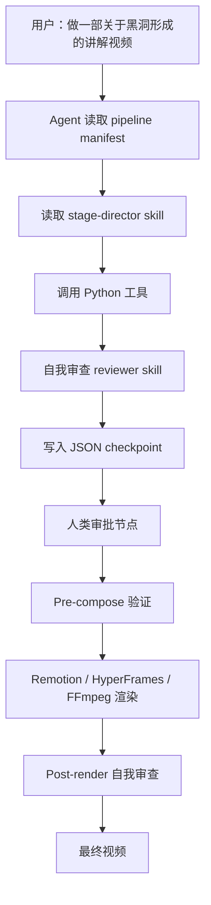
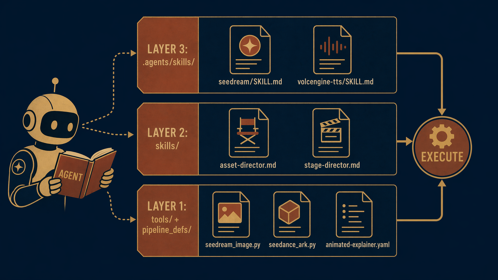
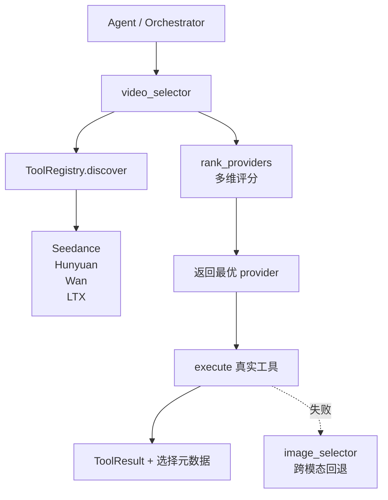
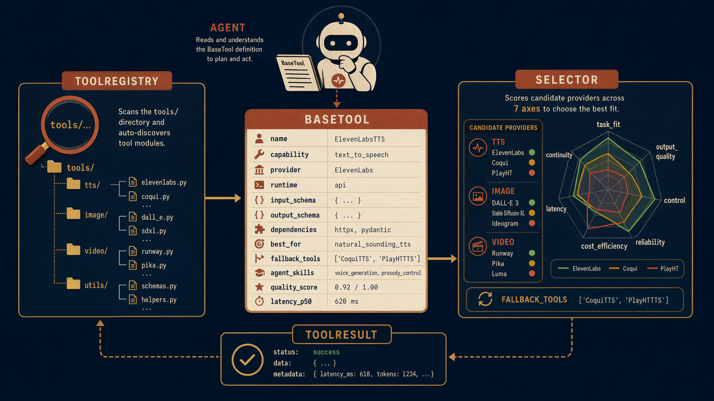
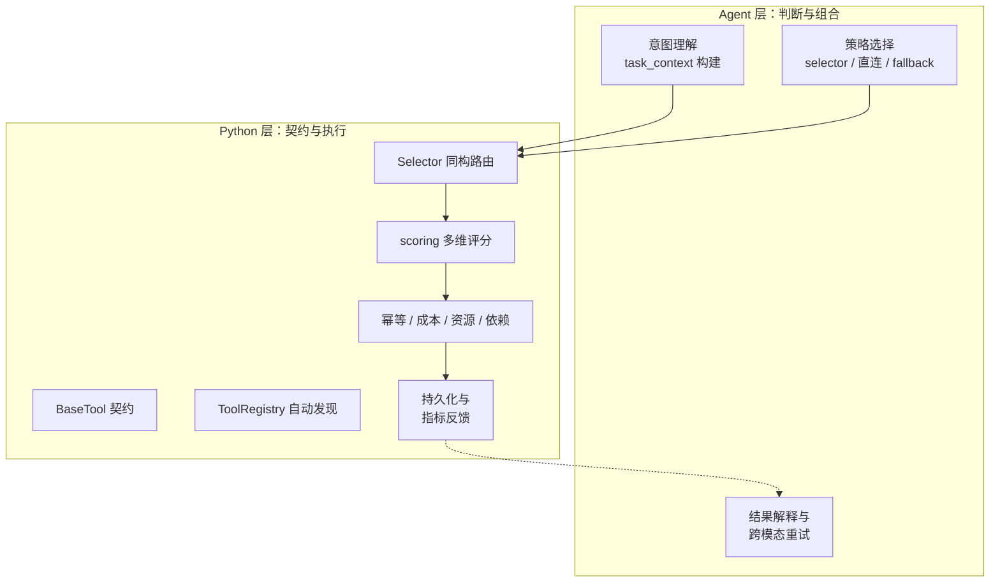
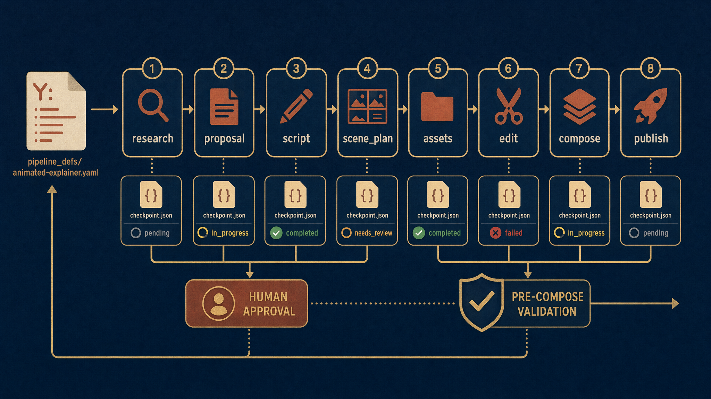
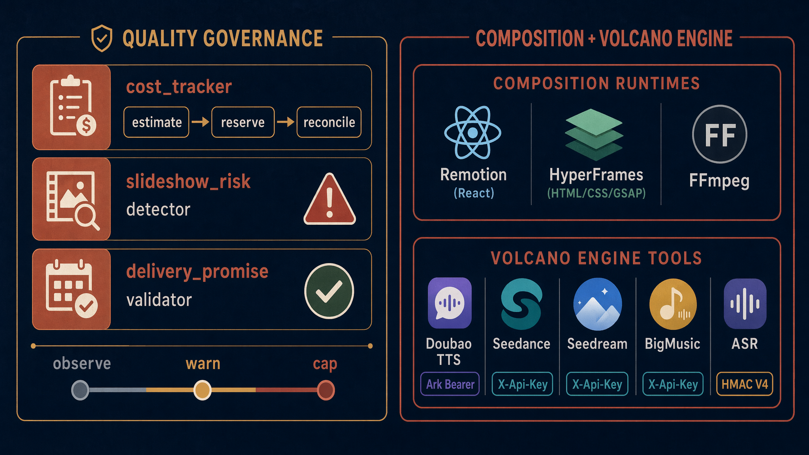

# OpenMontage 不是视频生成器，是 Agent 的视频制作 OS

> 研究日期：2026-06-29
> 项目地址：[github.com/calesthio/OpenMontage](https://github.com/calesthio/OpenMontage)
> 源码位置：`/Users/eriklee/code/aigc/OpenMontage/`

---

## 从一个具体场景切入

我先前跑了一个 OpenMontage 管线，主题是"唐朝兴衰史"。脚本由 Agent 根据网络调研写出，旁白走火山引擎豆包语音 2.0，画面一部分用 Seedream 5.0 生成国潮插画，一部分用 Seedance 2.0 生成动态镜头，音乐由火山 BigMusic 生成，最后进 Remotion 做字幕、章节卡片和胶片颗粒叠加。1 分钟版总长 57 秒，720p；5 分钟版则拆成多章，每章 2–3 分钟，中间有"重新 hook"的节奏设计。

整个过程中，最印象深刻的是：**我没有写一行编排代码**。Agent 自己读了 YAML 管线清单、Markdown 导演技能、工具注册表，然后决定每一步调用什么、生成什么、检查什么。Python 代码只是工具和后端持久化，真正的"导演"是 LLM。

OpenMontage 不是又一个输入 prompt 输出 5 秒视频的生成器。它把"视频制作团队"的完整流程交给了 Agent：调研 → 提案 → 脚本 → 场景规划 → 资产生成 → 编辑 → 合成 → 发布。对 Agent 工程师来说，它是一份关于"如何把复杂工作流交给 LLM 编排"的鲜活教材。

---

## 先建立坐标系：OpenMontage 到底是什么

官方自称 "the first open-source, agentic video production system"。这个定位里有三个关键词：

1. **Open-source / 开源**：AGPLv3，代码全在 GitHub，工具、管线、技能都是可读可改的文本文件。
2. **Agentic / Agent 驱动**：没有 Python 编排器，LLM coding assistant（Claude Code、Cursor、Copilot、Windsurf、Codex）就是控制平面。
3. **Video production system / 视频制作系统**：覆盖从创意到成片的完整生产流程，而不只是"生成一段视频"。

截至 2026 年 6 月，项目已包含 12 条生产管线、57+ 个 Python 工具、500+ 个 Agent 技能，支持 14 个视频生成提供商、10 个图像生成提供商、5 个 TTS 提供商。GitHub 峰值日增 3400+ Star，登上过 Trending #1。

这里的架构假设值得细看：如果把视频制作看成一条复杂工作流，那么最适合的编排者不是硬编码的 DAG 引擎，而是能阅读指令、理解上下文、做出判断的通用 Agent。

---

## 核心设计原则：Agent-First 架构

OpenMontage 的架构决策可以用一句话概括：

> **Python = 工具 + 持久化；Agent = 所有智能。**

传统上，我们会用 Airflow / Temporal / 自研 DAG 来编排"生成脚本 → 调用 TTS → 调用图片模型 → 渲染"这样的流程。OpenMontage 完全不做这件事。`pipeline_defs/` 里只有声明式 YAML，`skills/` 里只有 Markdown 指令，`tools/` 里只有可被调用的原子能力。Agent 自己读取、理解、执行、审查、写检查点。

整个高层流程如下：



这个设计有两个直接后果：

第一，调试方式变了。如果 Agent 在某个阶段表现不对，你通常不需要改 Python，而是改 Markdown 技能文件或 YAML 管线清单。技能和管线的可读性成了系统可维护性的关键。

第二，Agent 的能力边界就是系统的质量天花板。OpenMontage 不调用 LLM API 做生成决策——它依赖你本地运行的 coding assistant 本身。用 Claude Opus 和用小模型驱动，结果差距很大。

---

## 三层知识架构：把"能用"和"会用"分开

OpenMontage 把知识分成三层，这个设计值得迁移到自己的项目里：

```text
Layer 1: tools/ + pipeline_defs/     "存在什么" — 可执行能力 + 编排声明
Layer 2: skills/                     "如何使用" — OpenMontage 的约定和质量标准
Layer 3: .agents/skills/             "技术原理" — 外部技术知识包
```

**Layer 1** 是可执行能力。比如 `tools/graphics/seedream_image.py` 实现了 Seedream 5.0 生图，`tools/video/seedance_ark.py` 实现了直接调用火山方舟的 Seedance 2.0，`tools/audio/volc_bigmusic.py` 实现了 BigMusic BGM 生成。每个工具继承自 `tools/base_tool.py` 里的 `BaseTool`，声明自己的 capability、provider、runtime、依赖、best_for、input/output schema 等。

**Layer 2** 是项目级约定。比如 `skills/pipelines/explainer/asset-director.md` 告诉 Agent：在 animated-explainer 管线的 assets 阶段，你应该生成哪些类型的资产、如何命名、如何组织目录、质量检查看什么。

**Layer 3** 是外部技术知识。比如 `.agents/skills/seedream/SKILL.md` 详细讲解 Seedream 5.0 的 prompt 结构、参数、反模式、Recipes。`.agents/skills/volcengine-tts/SKILL.md` 讲解豆包语音 2.0 的 voice_id、模型选择、字级时间戳、context_texts 表达控制。

工具通过 `agent_skills` 字段指向 Layer 3，Agent 调用工具前会先读对应技能。这样就把"工具存在"和"会用工具"解耦了：新增一个工具不需要改编排代码，只需要写好它的知识文件。

我在集成火山引擎服务时，就是按这个模式走的：

| 能力 | Layer 1 工具 | Layer 3 技能 |
|---|---|---|
| Seedance 2.0 视频生成 | `tools/video/seedance_ark.py` | `.agents/skills/seedance-2-0/SKILL.md` |
| Seedream 5.0 图像生成 | `tools/graphics/seedream_image.py` | `.agents/skills/seedream/SKILL.md` |
| BigMusic BGM | `tools/audio/volc_bigmusic.py` | `.agents/skills/volcengine-bigmusic/SKILL.md` |
| Doubao ASR | `tools/analysis/volc_asr.py` | `.agents/skills/volcengine-asr/SKILL.md` |
| Doubao TTS | `tools/audio/doubao_tts.py` | `.agents/skills/volcengine-tts/SKILL.md` |

其中 Seedream、BigMusic、ASR 是项目原本没有的，直接新建工具文件和技能文件即可。注册表会自动发现，不需要改任何中心代码。



*图：OpenMontage 把"能用的工具""项目级用法"和"外部技术原理"拆成三层，新增能力只需在对应层填空。*

---

## 架构与工具系统：把路由、评分和调用统一成自描述契约

OpenMontage 的架构中最鲜明的工程判断不是"做了多少工具"，而是"工具以什么形态存在"。它没有把各家的 TTS、图像、视频 API 包成一层薄 wrapper，然后让 orchestrator 写一堆 if-else。它选择了一种更激进的方式：让工具自己描述自己，让选择器自己成为工具，让评分先于调用发生。

这一章的核心论点是：**OpenMontage 的 Agent-first 架构把"调用哪个能力"从 orchestrator 的私有逻辑里抽出来，变成一个可发现、可评分、可解释、可回退的系统层**。Python 层负责工具契约、自动发现、持久化和评分；Agent 层负责所有需要判断和组合的智能。

### BaseTool：一份被低估的"工具身份证"

在 OpenMontage 里，一个 tool 远不止 `name` 加 `execute()`。打开 `tools/base_tool.py`，`BaseTool` 的类属性把工具的全部运行上下文都编码成了一纸契约：

```python
class BaseTool(ABC):
    name: str = ""
    version: str = "0.1.0"
    tier: ToolTier = ToolTier.CORE
    stability: ToolStability = ToolStability.EXPERIMENTAL
    execution_mode: ExecutionMode = ExecutionMode.SYNC
    determinism: Determinism = Determinism.DETERMINISTIC
    runtime: ToolRuntime = ToolRuntime.LOCAL

    dependencies: list[str] = []
    capability: str = "generic"
    provider: str = "openmontage"
    capabilities: list[str] = []
    input_schema: dict = {}
    output_schema: dict = {}
    artifact_schema: dict = {}

    resource_profile: ResourceProfile = ResourceProfile()
    retry_policy: RetryPolicy = RetryPolicy()
    resume_support: ResumeSupport = ResumeSupport.NONE
    idempotency_key_fields: list[str] = []

    side_effects: list[str] = []
    fallback: Optional[str] = None
    fallback_tools: list[str] = []

    agent_skills: list[str] = []
    quality_score: Optional[float] = None
    historical_success_rate: Optional[float] = None
    latency_p50_seconds: Optional[float] = None
```

执行入口统一为 `execute(self, inputs: dict) -> ToolResult`，返回结构也标准化：

```python
@dataclass
class ToolResult:
    success: bool
    data: dict[str, Any] = field(default_factory=dict)
    artifacts: list[str] = field(default_factory=list)
    error: Optional[str] = None
    cost_usd: float = 0.0
    duration_seconds: float = 0.0
    seed: Optional[int] = None
    model: Optional[str] = None
```

这套契约的设计意图非常明确：**工具必须能被机器理解，而不仅仅是被机器调用**。`dependencies` 用 `cmd:`、`env:`、`python:` 三种前缀声明依赖，直接决定工具是 `AVAILABLE` 还是 `UNAVAILABLE`。`idempotency_key_fields` 让工具自己决定哪些输入字段构成幂等键，自动派生：

```python
def idempotency_key(self, inputs: dict[str, Any]) -> str:
    key_data = {k: inputs.get(k) for k in self.idempotency_key_fields}
    raw = json.dumps(key_data, sort_keys=True)
    return hashlib.sha256(raw.encode()).hexdigest()[:16]
```

`resource_profile` 和 `retry_policy` 让 orchestrator 在调度前就能估算资源与失败策略；`agent_skills` 把"这个工具适合配合哪些 Agent 技能使用"也写进了契约。`quality_score`、`historical_success_rate`、`latency_p50_seconds` 这三个字段现在可能为空，但一旦被调用日志填满，就会成为 scoring 引擎的事实依据。

这种设计有成本。工具作者必须填写大量元数据，一旦 `best_for` 敷衍或 `supports` 缺失，选择器就会做出错误判断。另外，`BaseTool` 用普通类属性承载契约，子类如果误用可变默认值（比如共享同一个 `list`），会出现隐性状态污染。这是工程债务，但瑕不掩瑜。

### ToolRegistry：目录即插件

如果说 `BaseTool` 定义了"工具长什么样"，`ToolRegistry` 就回答了"系统怎么知道有哪些工具"。它的核心机制是自动发现：

```python
def discover(self, package_name: str = "tools") -> list[str]:
    self._load_dotenv()
    package = importlib.import_module(package_name)
    ...
    for module_info in pkgutil.walk_packages(package_paths, f"{package.__name__}."):
        if module_info.name.endswith(".base_tool") or module_info.name.endswith(".tool_registry"):
            continue
        module = importlib.import_module(module_info.name)
        discovered.extend(self.register_module(module))
```

`register_module` 只注册定义在本模块内、且非抽象的类：

```python
def register_module(self, module: ModuleType) -> list[str]:
    registered: list[str] = []
    for _, cls in inspect.getmembers(module, inspect.isclass):
        if cls is BaseTool or not issubclass(cls, BaseTool):
            continue
        if cls.__module__ != module.__name__ or inspect.isabstract(cls):
            continue
        tool = cls()
        self.register(tool)
        registered.append(tool.name)
    return registered
```

这种设计的收益是"放对目录就等于注册"。你在 `tools/audio/`、`tools/graphics/` 或 `tools/video/` 里新增一个继承 `BaseTool` 的类，selector 和 registry 下一次 `discover()` 时就能感知到，无需改任何白名单。registry 还提供了多维视图：`by tier`、`by capability`、`by provider`、`by status`，以及 `support_envelope()` 和 `provider_menu_summary()`，方便 orchestrator 做 preflight 检查。

其中一个细节很能说明设计者的取舍：`provider_menu_summary()` 的去重规则是"只要 provider 下有任意工具可用，就不把它列为不可用"。这不是 bug，而是一种务实的 provider 级别健康检查逻辑——provider 只要还能提供一个可用能力，就值得被继续考虑。

另一个细节是 `provider_menu()` 会跳过 `provider == "selector"` 的工具。selector 是聚合层，不是真实 provider，必须被 registry 发现，但不能被当作普通 provider 统计。这个过滤很小，却体现了对"路由层"与"执行层"的区分。

代价是导入副作用。所有工具模块在 `discover()` 时会被完整 import，不良的模块级代码会拖慢启动、触发网络请求或泄露 secrets。这要求工具模块是"纯声明"的，初始化逻辑推迟到 `execute()` 里。这个约束也是 Agent-first 架构的一部分：Python 层负责把工具摆上桌，Agent 层决定什么时候点菜。

### Selector 模式：把路由也做成一个 Tool

OpenMontage 里一个重要的工程决定，是把 `tts_selector`、`image_selector`、`video_selector` 也做成 `BaseTool`。它们继承同一个契约，只是 `provider = "selector"`。这意味着 orchestrator 调用 selector 与调用真实 provider 的接口完全一致。

以 `video_selector` 为例，它通过 capability 从 registry 发现真实 provider：

```python
def _providers(self) -> list[BaseTool]:
    from tools.tool_registry import registry
    registry.ensure_discovered()
    return [t for t in registry.get_by_capability("video_generation")
            if t.name != self.name]
```

并动态构建 fallback 链：

```python
@property
def fallback_tools(self) -> list[str]:
    return [t.name for t in self._providers()] + ["image_selector"]
```

注意最后那个 `"image_selector"`——当视频生成全部失败时，系统可以回退到生成一张静态图。这是一种跨模态降级，只有在 selector 与 tool 同构的前提下才容易实现。

选择逻辑统一走 `rank_providers()`，同时尊重用户的 `preferred_provider` 和 `allowed_providers`：

```python
def _select_best_tool(self, inputs, candidates, task_context):
    preferred = inputs.get("preferred_provider", "auto")
    allowed = set(inputs.get("allowed_providers") or [])
    if allowed:
        candidates = [tool for tool in candidates if tool.provider in allowed]

    rankings = rank_providers(candidates, task_context)

    tool_by_provider = {}
    for tool in candidates:
        if tool.provider not in tool_by_provider and tool.get_status() == ToolStatus.AVAILABLE:
            tool_by_provider[tool.provider] = tool

    if preferred != "auto":
        for score_item in rankings:
            if score_item.provider == preferred and score_item.provider in tool_by_provider:
                return tool_by_provider[score_item.provider], score_item

    for score_item in rankings:
        if score_item.provider in tool_by_provider:
            return tool_by_provider[score_item.provider], score_item
```

`image_selector` 还做了细致的输入适配：stock 工具用 `query`，生成工具用 `prompt`；按下游 `input_schema` 剥离不支持的参数。`video_selector` 额外处理参考图上传，并读取 `VIDEO_GEN_LOCAL_MODEL` 环境变量来提示本地模型偏好。执行成功后，selector 会把选择原因、候选列表、推荐 Agent skills 等元数据写回 `ToolResult.data`，让上层不仅知道"生成了什么"，还知道"为什么选它"。



这个模式的意义：**路由不再是 orchestrator 里的特殊分支，而是可组合、可调试、可 fallback 的常规能力**。你甚至可以用 `operation: "rank"` 模式只跑评分不触发实际生成，做零成本的 preflight。

代价是调用链变长，每次 selector 调用都要重新 discover 和评分。provider 少时不是问题，多了会成为启动延迟。另一个隐患是 selector 与 provider 的输入 schema 存在隐式耦合，需要 image_selector 那样的键名适配和参数剥离。这个耦合无法完全消除，只能通过更严格的 schema 约定缓解。

### scoring.py：可解释的多维评分引擎

如果说 selector 是"路由的执行者"，`lib/scoring.py` 就是"路由的判断者"。它把 provider 选择从"第一个可用"升级为"多目标优化"。

`ProviderScore` 定义了七个维度及权重：

```python
@dataclass
class ProviderScore:
    tool_name: str
    provider: str
    task_fit: float = 0.0       # 0-1: best fit for this exact asset class
    output_quality: float = 0.0
    control: float = 0.0
    reliability: float = 0.0
    cost_efficiency: float = 0.0
    latency: float = 0.0
    continuity: float = 0.0

    @property
    def weighted_score(self) -> float:
        return (
            self.task_fit * 0.30
            + self.output_quality * 0.20
            + self.control * 0.15
            + self.reliability * 0.15
            + self.cost_efficiency * 0.10
            + self.latency * 0.05
            + self.continuity * 0.05
        )
```

权重设计本身就在表达产品优先级：任务匹配度最重要（30%），输出质量次之（20%），可控性和可靠性并列（各 15%），成本、延迟、连续性各占 5-10%。这不是一个"越快越好"的系统，而是一个"先确保做对，再考虑省钱"的系统。

每个 score 可以自我解释：

```python
def explain(self) -> str:
    parts = [f"{self.tool_name} ({self.provider}): {self.weighted_score:.2f}"]
    top = sorted(
        [
            ("task_fit", self.task_fit, 0.30),
            ("output_quality", self.output_quality, 0.20),
            ...
        ],
        key=lambda x: x[1] * x[2],
        reverse=True,
    )
    for name, val, weight in top[:3]:
        parts.append(f"  {name}={val:.2f} (w={weight})")
    return "\n".join(parts)
```

关键词匹配的相似度选择值得细看。scoring 刻意使用 **Overlap Coefficient** 而非 Jaccard：

```python
def _keyword_overlap(set_a: set[str], set_b: set[str]) -> float:
    if not set_a or not set_b:
        return 0.0
    a = {s.lower().strip() for s in set_a}
    b = {s.lower().strip() for s in set_b}
    intersection = len(a & b)
    smaller = min(len(a), len(b))
    return intersection / smaller if smaller > 0 else 0.0
```

注释写得很清楚：

```python
# Uses |A ∩ B| / min(|A|, |B|) rather than Jaccard. Jaccard over-penalizes
# tools whose best_for describes many strengths — a premium provider with
# seven rich bullets ends up with a smaller Jaccard than a narrowly-scoped
# provider with one bullet, even when the premium provider fully covers the
# intent.
```

这是一个容易被忽视的系统设计细节。Jaccard 会惩罚描述详尽的工具，因为分母变大；而 Overlap Coefficient 问的是"用户意图是否是工具能力的子集"，这更符合 provider 选择的本质。如果这里用错了相似度指标，系统会系统性地偏向"描述短但刚好命中"的工具，而不是"能力全面、恰好覆盖"的工具。

scoring 还引入了同义词簇进行语义扩展，把 `cinematic / film / trailer / dramatic / epic` 视为同一簇，`explainer / educational / tutorial / teaching` 视为另一簇。`normalize_task_context()` 则把用户输入的松散上下文转换成结构化信号：

```python
context["prefers_generated_visuals"] = bool(text_tokens & _GENERATED_VISUAL_TERMS)
context["wants_reference_conditioning"] = (
    operation == "reference_to_video" or bool(text_tokens & _REFERENCE_TERMS)
)
context["wants_image_editing"] = (
    operation == "edit" or bool(text_tokens & _IMAGE_EDIT_TERMS)
)
```

这些信号直接影响 provider 得分。例如当用户意图包含生成式视觉词时，stock provider 会被降权：

```python
if task_context.get("prefers_generated_visuals") and stock_like and asset_type in {"video", "image"}:
    task_fit *= 0.55
    output_quality *= 0.85
```

可靠性评分优先使用真实历史成功率，否则回退到 stability/status 启发式：

```python
hist_success = info.get("historical_success_rate")
if hist_success is not None:
    reliability = float(hist_success)
elif status == "available":
    reliability = 0.95 if info.get("stability") == "production" else 0.8
```

输出质量也优先使用实测 `quality_score`，否则才用 stability/tier 启发式。针对视频的"premium-cinematic"奖励则会在检测到电影/预告片意图且 provider 具备原生音频、多镜头、镜头控制、唇同步等高级特性时额外加分。


这套设计的核心优势是**可审计**。权重和 heuristics 都是代码，方便 A/B 测试和专家调参。它为"数据闭环"预留了钩子：一旦接入真实的成功率、质量评分、延迟 p50，评分会自动变准。早期靠专家标注的 stability 运行，随着日志积累，实测指标逐步替代默认启发式，选择器自然进化。

代价是 heuristics 需要持续维护。同义词簇、style keywords、premium feature 列表都是手工知识，会过时。当前权重固定，按项目或用户偏好动态调权需要额外扩展。



*图：工具通过 BaseTool 自描述，Registry 自动发现，Selector 按可解释评分选择供应商，失败时可回退。*

### Python 层与 Agent 层的边界

前面已经拆解了 BaseTool、ToolRegistry、Selector 和 Scoring 的机制，这里做一个简短总结。

Python 层负责确定性基础设施：工具契约、自动发现、同构路由、多维评分、幂等、依赖检查、成本估算。持久化也属于这一层——调用日志、成功率、延迟分布，最终落盘成为下一轮评分的输入。

Agent 层负责所有需要判断的部分：任务分解、何时调用 selector、如何解释评分、如何回退、如何跨模态组合（视频不行换图片）、如何把用户意图翻译成 `task_context`。

两层之间不是上下级关系，而是分工。Python 层保证工具自描述、可发现、可评分；Agent 层决定用哪个、按什么顺序、失败后怎么办。这个边界让系统既能享受 Python 的确定性，又能保留 Agent 的灵活性。



---

## 管线、检查点与质量治理

OpenMontage 的动画解说管线不是"写完 prompt 就等视频"的线性脚本，而是一份被显式声明、分段执行、可被审计的生产契约。它的核心假设很朴素：AI 生成视频最大的风险不是某一步失败，而是失败被延迟到最后一刻才暴露。因此，整套治理机制都围绕"早发现、可回退、花得起、验得清"四个目标展开。

### YAML：把视频生产写成一份阶段化契约

整个管线的入口是 `/Users/eriklee/code/aigc/OpenMontage/pipeline_defs/animated-explainer.yaml`。它用 `stages` 数组把一段视频的生命周期切成 7 个主阶段，外加一个条件性子阶段 `proposal.sample`：

```yaml
stages:
  - name: research
    skill: pipelines/explainer/research-director
    produces: [research_brief]
    checkpoint_required: false
    human_approval_default: false

  - name: proposal
    skill: pipelines/explainer/proposal-director
    required_artifacts_in: [research_brief]
    produces: [proposal_packet, decision_log]
    checkpoint_required: true
    human_approval_default: true
    sub_stages:
      - name: sample
        condition: "video_analysis_brief_exists"
        human_approval_default: true

  - name: script
    ...
  - name: scene_plan
    ...
  - name: assets
    ...
  - name: edit
    ...
  - name: compose
    ...
  - name: publish
    ...
```

几个设计点决定了后续治理形态：

- **依赖即数据流**：每个阶段用 `required_artifacts_in` 声明输入、`produces` 声明输出。`scene_plan` 必须拿到 `script`，`assets` 必须同时拿到 `scene_plan` 和 `script`。这种显式依赖让编排器可以精确判断"现在能不能进入下一阶段"，而不是靠函数调用的隐式顺序。
- **人机卡点是配置，不是硬编码**：`checkpoint_required` 与 `human_approval_default` 组合控制每个阶段结束后是否停下来等人。`proposal`、`script`、`scene_plan`、`publish` 默认需要人批准；`assets`、`edit`、`compose` 默认自动推进，但仍会写 checkpoint。这意味着创作者可以把控创意入口和最终出口，却不必为每张生成图都点一次确认。
- **预算与期限也写进契约**：`orchestration` 区块把默认预算、最大修订次数、最大回退次数、墙钟时间全部透明化：

```yaml
orchestration:
  mode: executive-producer
  skill: pipelines/explainer/executive-producer
  budget_default_usd: 2.00
  max_revisions_per_stage: 3
  max_send_backs: 3
  max_wall_time_minutes: 20
```

```yaml
extensions:
  custom_scripts: true
  custom_playbooks: true
  custom_skills: true
  custom_tools: false
```

`extensions` 则是一个很容易被忽略但很重要的安全阀：允许自定义 script / playbook / skill，但**禁止**自定义 tool。这防止了 Agent 在无人知晓的情况下调用新工具、绕过预算审批或引入不可复现的外部能力。

### Checkpoint：阶段状态机与恢复机制

YAML 只是声明，真正让流水线"可断点续跑"的是 `/Users/eriklee/code/aigc/OpenMontage/lib/checkpoint.py`。它的基本模型是**每个阶段落盘一个 `checkpoint_<stage>.json`**：

```python
checkpoint = {
    "version": "1.0",
    "project_id": project_id,
    "pipeline_type": pipeline_type or "unknown",
    "stage": stage,
    "status": status,
    "timestamp": datetime.now(timezone.utc).isoformat(),
    "checkpoint_policy": checkpoint_policy,
    "human_approval_required": human_approval_required,
    "human_approved": human_approved,
    "artifacts": artifacts,
}
```

写入时会强制校验：阶段如果处于 `completed` 或 `awaiting_human`，必须包含该阶段的规范产物：

```python
CANONICAL_STAGE_ARTIFACTS = {
    "research": "research_brief",
    "proposal": "proposal_packet",
    "script": "script",
    "scene_plan": "scene_plan",
    "assets": "asset_manifest",
    "edit": "edit_decisions",
    "compose": "render_report",
    "publish": "publish_log",
}

def _validate_artifacts_for_stage(stage, status, artifacts):
    required_artifact = CANONICAL_STAGE_ARTIFACTS[stage]
    if status in {"completed", "awaiting_human"} and required_artifact not in artifacts:
        raise CheckpointValidationError(
            f"Stage {stage!r} with status {status!r} must include "
            f"canonical artifact {required_artifact!r}"
        )
```

恢复流程由 `get_latest_checkpoint`、`get_completed_stages` 和 `get_next_stage` 驱动：

```python
def get_next_stage(pipeline_dir, project_id, pipeline_type=None):
    stages = get_pipeline_stages(pipeline_type) if pipeline_type else STAGES
    completed = set(get_completed_stages(...))
    for stage in stages:
        if stage not in completed:
            return stage
    return None
```

这意味着恢复不是从"上一个函数返回的位置"继续，而是从**文件系统中实际存在的 checkpoint** 继续。`get_completed_stages` 还会按当前 `pipeline_type` 过滤，避免旧项目残留 checkpoint 导致错序。`proposal` 完成后，`decision_log` 会被合并到项目级 `decision_log.json`，并在后续产物里保留 `decision_log_ref`，形成一条审计链。如果某个阶段被中断，恢复时不仅知道"到哪一步了"，还知道"当时为什么做出这个决定"。



*图：管线清单把生产切成显式阶段，每个阶段写入 JSON checkpoint，状态机在 completed / failed / needs_review 之间迁移。*

### 预算治理：estimate → reserve → reconcile

在 OpenMontage 里，成本不是后置账单，而是前置约束。`/Users/eriklee/code/aigc/OpenMontage/lib/config_model.py` 把预算模式抽象为枚举：

```python
class BudgetMode(str, Enum):
    OBSERVE = "observe"
    WARN = "warn"
    CAP = "cap"

class BudgetConfig(BaseModel):
    mode: BudgetMode = BudgetMode.WARN
    total_usd: float = 10.0
    reserve_pct: float = 0.10
    single_action_approval_usd: float = 0.50
    require_approval_for_new_paid_tool: bool = True
```

`OBSERVE` 只记录，`WARN` 报警，`CAP` 会硬性阻止超支。`/Users/eriklee/code/aigc/OpenMontage/tools/cost_tracker.py` 里的 `CostTracker` 维护一条成本条目流水，状态机为 `estimated -> reserved -> completed|failed|refunded`。

它区分了两个关键数值：

```python
@property
def budget_remaining_usd(self) -> float:
    return self.budget_total_usd - self.budget_spent_usd - self.budget_reserved_usd

@property
def usable_budget_usd(self) -> float:
    holdback = self.budget_total_usd * self.reserve_pct
    return max(0.0, self.budget_remaining_usd - holdback)
```

`reserve` 时会触发三层拦截：

```python
def reserve(self, entry_id: str) -> None:
    if estimated > self.single_action_approval_usd:
        raise ApprovalRequiredError(...)
    if self.require_approval_for_new_paid_tool and tool not in approved:
        raise ApprovalRequiredError(...)
    if estimated > self.usable_budget_usd and mode == CAP:
        raise BudgetExceededError(...)
```

大额动作、新付费工具、可用预算不足，都会把人拉进决策环。更细的是，`estimate_from_reference` 会读取参考视频的 pacing density、motion ratio 和剪辑节奏，推导目标视频的 scene 数、image 数、clip 数，并给出 low/high 区间。这使得预算在生成第一帧之前就已经有据可查，而不是等账单来了再惊呼。

### 计划阶段的质量关卡：先验治理

计划阶段（research → proposal → script → scene_plan → assets）的核心问题是：**我们有没有一份可执行、不降级、不超支、不像幻灯片的计划？**

质量门由三层构成：YAML 里的 `review_focus` 和 `success_criteria`、reviewer 的 CHAI 三原则（Accurate / Complete / Constructive）、以及专用评分库。

`/Users/eriklee/code/aigc/OpenMontage/lib/slideshow_risk.py` 是一个六维评分器：

```python
def score_slideshow_risk(scenes, edit_decisions=None, renderer_family=None, render_runtime=None):
    dimensions = {
        "repetition": _score_repetition(scenes),
        "decorative_visuals": _score_decorative(scenes),
        "weak_motion": _score_weak_motion(scenes),
        "weak_shot_intent": _score_weak_intent(scenes),
        "typography_overreliance": _score_typography(scenes),
        "unsupported_cinematic_claims": _score_cinematic_claims(scenes, renderer_family),
    }
    ...
    if average < 2.0: verdict = "strong"
    elif average < 3.0: verdict = "acceptable"
    elif average < 4.0: verdict = "revise"
    else: verdict = "fail"
```

例如 `typography_overreliance` 会直接惩罚"文字卡片过多"：

```python
text_scenes = sum(1 for s in scenes if s.get("type") in ("text_card", "stat_card", "kpi_grid"))
ratio = text_scenes / len(scenes)
if ratio > 0.6:
    score = 4.0
    reason = "... video feels like animated slides"
```

`/Users/eriklee/code/aigc/OpenMontage/lib/delivery_promise.py` 则在 proposal 阶段锁定交付承诺，防止后期把 motion-led 视频悄悄降级成幻灯片：

```python
class PromiseType(Enum):
    MOTION_LED = "motion_led"
    SOURCE_LED = "source_led"
    DATA_EXPLAINER = "data_explainer"
    ...

"motion_led": {
    "still_fallback_allowed": False,
    "requires_video_generation": True,
    "min_motion_ratio": 0.7,
    "description": "Video's quality depends on real motion...",
}
```

`validate_cuts` 把 cut 分为 real motion、animated slides、stills 三类，计算 motion ratio 并触发 violations：

```python
motion_ratio = motion_cuts / total if total > 0 else 0.0
if self.motion_required and motion_ratio < min_ratio:
    violations.append(
        f"Motion ratio {motion_ratio:.0%} is below minimum {min_ratio:.0%}..."
    )
```

`/Users/eriklee/code/aigc/OpenMontage/skills/pipelines/explainer/asset-director.md` 进一步要求：批量生成前必须先做 TTS / image / music 的小样预演，并执行 pre-caption / critique / post-caption 三步自审；`text_card` 类场景不生成图，避免 AI 把品牌名写错。

### 渲染后质量关卡：从"生成成功"到"可发布"

计划阶段的治理只能保证"计划看起来没问题"，但很多缺陷只有渲染完成后才可见：音画不同步、某段 motion 实际变成了静帧、字幕叠在关键画面上、承诺的运动比被 runtime 偷偷替换。因此 OpenMontage 在 compose 阶段强制做一次 `final_review`。

根据 `/Users/eriklee/code/aigc/OpenMontage/skills/meta/reviewer.md`，compose 必须产出 `final_review` 且 `status == pass`，否则不能进入 publish：

```markdown
- `final_review.status`?
  - `pass` → OK
  - `revise` → ... CRITICAL
  - `fail` → pipeline MUST NOT proceed
```

`final_review` 通常包含五个维度：

```json
{
  "final_review": {
    "status": "pass",
    "checks": {
      "technical_probe": {
        "ffprobe_valid": true,
        "duration_seconds": 87.4,
        "video_codec": "h264",
        "audio_codec": "aac",
        "sample_rate_hz": 48000
      },
      "visual_spotcheck": {
        "frame_samples": [0, 1200, 2400, 3600],
        "black_frames": [],
        "frozen_frames": [],
        "text_legibility": "ok"
      },
      "audio_spotcheck": {
        "loudness_lufs": -14.2,
        "peak_db": -1.1,
        "voice_music_balance": "ok"
      },
      "promise_preservation": {
        "runtime_swap_detected": false,
        "motion_ratio": 0.74
      },
      "subtitle_check": {
        "caption_source": "tts_to_captions",
        "burn_in_safe": true,
        "overlap_with_visual": []
      }
    }
  }
}
```

`technical_probe` 用 ffprobe 读取容器与流信息，确认时长、码率、编码、采样率是否符合发布平台的硬性要求；`visual_spotcheck` 按时间轴均匀采样帧，检测黑帧、静帧、画面文字是否可读；`audio_spotcheck` 分析响度、峰值和人声与背景音乐的平衡；`promise_preservation` 对比 proposal 阶段锁定的 `delivery_promise`，确保 runtime 没有私自把 motion-led 场景替换成静帧或幻灯片；`subtitle_check` 则确认 caption 来自 `tts_to_captions` 而非 ASR 二次识别，避免字幕与语音错位。

同时，`delivery_promise.validate_cuts` 会在 edit / compose 阶段再次运行，因为 edit_decisions 里 cut 的真实类型只有到这时才知道。如果 motion-led 承诺要求 motion ratio ≥ 70%，但实际只有 45%，reviewer 会把它标记为 critical。

### 为什么质量关卡要分"计划阶段"和"渲染后"

把质量门拆成两段的直接原因是**成本不对称**。

计划阶段的错误纠正成本最低。一个被 `slideshow_risk` 判定为 `fail` 的 scene_plan，只需要改一份 JSON；而一旦进入 assets 和 edit，每张图、每段视频、每次 TTS 都是真实花费。`delivery_promise` 在 proposal 阶段锁定，是为了在预算还没花出去之前就把"不降级"写入契约。预算门在 assets 阶段前置，也是同样的逻辑：先 reserve，再生成，超支就降级或驳回。

但计划阶段无法验证一切。LLM 写的 scene_plan 可能看起来运动感十足，实际渲染时却因为某个 renderer 不支持 `camera_pan` 而回退成静帧；TTS 语音的停顿可能与 BGM 的节奏冲突；参考视频估算的 pacing 可能和最终脚本长度不匹配。因此渲染后必须有一次独立的、基于真实介质的审查。`final_review` 不是对计划的重述，而是对"磁盘上那个 MP4"的物理检查。

这两段之间通过三类契约连接：

1. **Artifact 契约**：`proposal_packet` → `script` → `scene_plan` → `asset_manifest` → `edit_decisions` → `render_report` → `publish_log`，每一环的输入都来自上一环的输出。
2. **Decision log 契约**：renderer family、runtime、provider、music、voice、composition mode 等关键选择必须写入决策日志，并在后续 reviewer 中被引用。
3. **Delivery promise 契约**：proposal 阶段锁定 promise，edit/compose 阶段用 `validate_cuts` 验证；任何 silent downgrade 都会被标记为 critical。

### 治理体系小结

OpenMontage 的治理体系是三层叠加：YAML 声明约束"能做什么、花多少、到哪停"；checkpoint 与决策日志保证"中断后可恢复、选择可审计"；reviewer 协议与 `slideshow_risk`、`delivery_promise`、`cost_tracker` 等专用库在计划和渲染后分别回答"计划是否可执行"与"输出是否兑现承诺"。

核心洞见是：AI 视频生产最怕的不是报错，而是"看起来成功了，其实已经降级"。所以 OpenMontage 把"成功"从"渲染完成"扩展为"渲染完成 + 自我审查通过 + 契约未被破坏"。在 compose 阶段，ffprobe 报告、帧采样、音频分析，和创意本身同样重要。



*图：治理层（预算、幻灯片风险、交付承诺）与合成层（Remotion / HyperFrames / FFmpeg）及火山引擎工具矩阵共同支撑最终成片。*

---

## 合成引擎与长视频制作

OpenMontage 的合成层没有把所有视频都塞进同一个渲染器，而是把"创意语法"和"技术引擎"拆成了两条正交轴线：`renderer_family` 决定拍什么，`render_runtime` 决定怎么拍。这种拆分的实际意义在于，Agent 可以在 proposal 阶段就锁定渲染路径，而不是在渲染失败后再临时换引擎。

### 三套引擎的边界：不是"谁更好"，而是"谁更适合"

在 `tools/video/video_compose.py` 里，`render_runtime` 只有三种合法取值：`remotion`、`hyperframes`、`ffmpeg`。选择逻辑非常明确，几乎没有灰色地带。

**Remotion** 是默认路径。当你需要逐词高亮字幕、TalkingHead 数字人、已经沉淀在 `remotion-composer/src/components/` 里的 React 场景栈，或者像 `CinematicRenderer` 这种依赖帧精确动画的组件时，Remotion 是唯一合理选项。迁移成本是这里的关键约束：OpenMontage 已经积累了三十多种 cut type，从 `bar_chart`、`line_chart` 到 `terminal_scene`、`screenshot_scene`，全都是以 Remotion 组件形式存在的，HyperFrames 不可能在 Phase 1 就复刻这套能力。

**HyperFrames** 的定位是"React 场景栈覆盖不到的地方"。根据 `hyperframes_compose.py` 里的 `best_for` 与 `not_good_for`，它最适合 kinetic typography、产品发布片、website-to-video，以及依赖 registry block（如 `data-chart`、`grain-overlay`）的场景。它的核心优势是 HTML/CSS/GSAP 的原生表达力：一个文字弹跳、一个 SVG 路径描边、一个 CSS clip-path reveal，写起来比 React + Remotion 的 spring 插值更直接。但 `not_good_for` 也写得清楚：逐词字幕、avatar 口型同步、既有 React 组件栈，Phase 1 仍应留在 Remotion。

**FFmpeg** 则是"没有合成需求的合成"。`video_stitch.py` 只做拼接、trim、crossfade、fade-through-black 和空间布局（side-by-side、vertical stack、PiP）。如果你只是按时间线把多个已渲染片段连起来，或者做一个 TikTok Duet 式分屏，Remotion 和 HyperFrames 都不会增加价值，FFmpeg 反而最快最稳。

治理上，`video_compose.py` 强调三点：`render_runtime` 在 proposal 阶段锁定，编辑阶段保持不变；禁止静默降级；若选定 runtime 不可用，必须返回结构化 blocker，而不是偷偷换引擎。这比"哪个渲染器更强"更重要——它避免了长视频项目在深夜渲染时因为引擎切换而失控。

### Explainer 的五层画面模型

`remotion-composer/src/Explainer.tsx` 是 OpenMontage 的默认合成核心。它把一帧画面严格拆成五层，每一层职责单一，互不越界：

**Layer 0：动态背景 `AnimatedBackground`。** 它根据主题生成背景：明亮主题用渐变网格加漂浮光晕球；`dark-gold-cjk` 国潮主题则退化为极 subtle 的金色粒子加暗角。这个设计很关键：国潮视频的前景信息密度高，背景不能抢戏，所以 `AnimatedBackground` 在检测到 `#00B0FF` 主色时会主动降低动态幅度。

**Layer 1：主视觉 scenes。** 每个 cut 被映射成 Remotion 的 `Sequence`，通过 `SceneRenderer` 根据 `cut.type` 分发到对应组件。`SceneRenderer` 处理了约三十种场景类型，包括媒体回退（`ImageScene`、`VideoScene`）、数据卡片（`text_card`、`stat_card`、`callout`）、图表（`bar_chart`、`line_chart`、`pie_chart`、`kpi_grid`）、合成场景（`terminal_scene`、`screenshot_scene`、`anime_scene`），以及国潮专属类型（`big_year`、`kinetic_keyword`、`poem_quote`、`rise_fall_line`、`three_panel`、`brush_wipe` 等）。

**Layer 2：叠加层 overlays。** 包括 `section_title`、`stat_reveal`、`hero_title`、`provider_chip`、`cjk_chapter`、`count_up`。它们通常跨多个 cut 存在，比如章节标题会在一个叙事段落的开头悬停几秒，然后淡出。

**Layer 3：字幕。** 英文内容走 `CaptionOverlay` 的逐词高亮；中文纪录片则走 `ChineseSubtitle` 的底部居中宋体单行 pill。两者互斥——如果 `subtitleCaptions` 存在，就不渲染英文高亮字幕。这个设计避免了中英混排时的排版灾难。

**Layer 4：音频。** 包括旁白 `narration`、音乐 `music` 和音效 `sfx`。音乐支持 `offsetSeconds` 跳过前奏、`loop` 循环，以及基于 `interpolate` 的淡入淡出音量曲线；SFX 则按 `startSeconds` 精确定位。

这种分层不是装饰性的。它让 Agent 可以独立调整每一层：只换音乐床、只改字幕样式、只替换背景粒子，都不会影响其他层。对于 10 分钟以上的长视频，这种解耦是维护性的基础。

### CJK/国潮组件：把数据图表做成纪录片包装

国潮组件集中在 `remotion-composer/src/components/`，并通过 `cjk-font.ts` 统一字体回退链：`"Songti SC", "STSong", "Noto Serif SC", "Source Han Serif SC", "SimSun", serif`。视觉语言高度一致：黑底 `#0A0A0C`、麦秆金 `#D4AF37`、朱砂红 `#C1292E`、宣纸米黄 `#F5E6C8`，以及 NIO 品牌蓝 `#00B0FF`。

组件可按功能分成几组：

- **章节/标题**：`CJKChapterCard` 用红杠加宋体呈现章节小标题；`BigYearCard` 做全屏大年份，如"618""907"，带呼吸缩放和金杠。
- **诗意/书法**：`PoemQuotation` 做竖排古诗词宣纸卷轴；`EndCalligraphy` 用 expanding `clipPath` 模拟毛笔书写片尾大字。
- **数据可视化**：`RiseFallLine` 是水墨折线图，默认内置唐朝 618-907 曲线；`CJKBarChart` 做正负双向柱状图；`NioBigStat` 支持 count-up 动画，并通过 `tweenCJKNumber` 保留"亿/万/辆"等 CJK 单位。
- **转场/氛围**：`BrushWipe` 水墨笔刷转场；`NioAmbient` 用确定性伪随机生成金色粒子，避免 `Math.random()` 导致渲染非确定性；`DigitalRain` 做数字雨收敛为 big stat 的冷开场；`StampMontage` 做印章连打的数据快闪。
- **字幕**：`ChineseSubtitle` 底部居中宋体 pill，与英文逐词高亮形成双语双轨。

动画模式也很有规律：spring 入场 + 呼吸保持、笔触 reveal、印章 slam、count-up、确定性粒子环境层。这些不是零散特效，而是一套可复用的"国潮动效语法"。

`BeijingComposition.tsx` 和 `NioComposition.tsx` 展示了项目级 wrapper 的标准模式：异步加载 `props.json`，渲染核心 `<Explainer \{...props\} />`，再叠加 `BreathingVignette`、`FilmOverlay`、`BrushWipeOverlay` 和 `FadeToBlack`。这相当于把 Explainer 当作合成引擎，wrapper 负责项目特定的电影包装。`Root.tsx` 里注册的 `BeijingBirthDecade` 长达 680 秒，`NioQ1Earnings` 120 秒，说明这条路径已经能支撑长视频。

### 长视频的工程化：分章、节奏、音乐床与批量组装

长视频不是短片的简单拼接，而是结构、节奏和音频的协同问题。OpenMontage 的解法分散在几个层面。

**分章结构**由 Layer 2 的 `cjk_chapter` overlay 承担。`CJKChapterCard` 会在叙事段落开头出现几秒，用红杠+宋体标注"第一章：盛世""第二章：转折"。它不是简单字幕，而是视听上的"章节锚点"，让观众在 10 分钟以上的片长中始终有方位感。底层 `cuts` 数组本身按时间线顺序排列，每个 cut 有 `in_seconds` 和 `out_seconds`，天然支持按章节分组。

**节奏控制**由 `SceneRenderer` 的动画编排和 `AnimatedBackground` 的动态强度共同完成。`SceneRenderer` 为国潮主题下的数据 cut 自动注入 `GoldParticles`、`SignalAccent` 和 `KenBurnsShell`，消除静态黑底的沉闷；`BigYearCard`、`KineticKeyword` 等组件用 spring 入场 + 呼吸保持，让重节拍有"砸下来"的感觉，轻节拍有"悬停"的延续感。`calculateMetadata` 会根据最后一个 cut 的 `out_seconds` 自动计算总时长，避免手动帧数计算。

**连续音乐床**由 Layer 4 的 `Audio` 组件处理。`music` 支持 `offsetSeconds` 跳过前奏、`loop` 循环，以及基于 `interpolate` 的淡入淡出。这意味着你可以选一段 3 分钟的 BGM，从 0:12 能量起来的地方切进去，循环铺满 10 分钟视频，并在结尾 3 秒淡出。`music-to-video` skill 进一步把音乐作为 spine：先跑 `analyze-beatgrid.py` 生成 `audiomap.json`，再按能量起伏切分 frame，每个 frame 的 pacing 由音乐决定。

**批量组装**则由 `video_stitch.py` 负责。它支持 `cut`、`crossfade`、`fade` 三种转场，能自动归一化分辨率/帧率/编码格式，处理无声片段的静音音轨填充，并生成低分辨率 preview。对于超长视频，一种实际做法是把每个章节先作为独立 `Explainer` 渲染，再用 `video_stitch` 拼接成长片——这样既能控制单次渲染的内存占用，又能在章节级别做并行。

### 合成层小结

OpenMontage 的合成层设计体现了一个成熟判断：没有最好的渲染器，只有最合适的渲染路径。Remotion 守住数据解释器、字幕和既有组件资产；HyperFrames 承接强动效、产品营销和 website-to-video；FFmpeg 只做拼接与转码。国潮组件栈则在 Remotion 内部开辟出一条中文纪录片/财报解读的专用通道，用黑金朱砂、宋体、印章、水墨笔触把数据图表包装成可播出的视觉内容。

对 Agent 工程师来说，值得关注的不是某个组件怎么写，而是"分层 + 分引擎 + 锁定 runtime"的治理思路：让复杂长视频在可维护的前提下，保留足够的艺术表达空间。

---

## 火山引擎集成实录：补齐 OpenMontage 的国内模型矩阵

OpenMontage 最早的模型层是"国际阵容"：视频靠 fal.ai 代理的 Seedance、图片靠 OpenAI 的 DALL·E / GPT-image 和 fal.ai 的 FLUX、语音靠 ElevenLabs 与 OpenAI TTS、字幕靠本地 faster-whisper。这套组合跑英文内容非常顺，但一落到中文场景，处处是裂痕：中文内嵌文字渲染差、国风概念偏西化、BGM 没有中文情绪、TTS 没有字级时间戳、ASR 的中文标点和切分总是差一口气。

所以过去几周我的任务很明确：在 OpenMontage 里再建一条火山引擎直连链路。不是替换原有工具，而是把"缺什么补什么"做清楚。最终新增四个工具：`seedance_ark`、`seedream_image`、`volc_bigmusic`、`volc_asr`；并更新了已有的 `doubao_tts` 以接入豆包语音 2.0 新接口，重写为 `volcengine-tts` Layer 3 技能。这一章记录其中四块核心工具的接入决策与代码取舍。

### 工具地图与认证矩阵

火山引擎内部其实是三条完全不同的接入线：

| 工具 | 服务线 | 认证方式 | 环境变量 |
|---|---|---|---|
| `seedance_ark` | Ark（视觉） | Bearer Token | `ARK_API_KEY` |
| `seedream_image` | Ark（视觉） | Bearer Token | `ARK_API_KEY` |
| `volc_bigmusic` | OpenAPI（音乐） | HMAC-SHA256 Signature V4 | `VOLC_ACCESSKEY` / `VOLC_SECRETKEY` |
| `volc_asr` | OpenSpeech（语音） | `X-Api-Key` + `X-Api-Resource-Id` | `VOLC_SPEECH_API_KEY` |
| `doubao_tts` | OpenSpeech（语音） | `X-Api-Key` + `X-Api-Resource-Id` | `VOLC_SPEECH_API_KEY` |

这意味着同一个"火山引擎"入口，代码里要同时维护三套认证语义：Ark 的 Bearer、语音的 `X-Api-Key`、BigMusic 的 AK/SK 签名。这不是配置多几个字段的问题，而是错误处理、日志脱敏、轮询策略全都不一样。

### Seedance Ark：官方直营 vs fal.ai 代理

原有 `seedance_video.py` 走 fal.ai 队列，好处是接入简单、支持参考视频和参考音频；坏处是排队不可控、分辨率锁在 720p、也没有批量分镜能力。火山 Ark 的 Seedance 2.0 接口更像"官方直营"：直连 `ark.cn-beijing.volces.com/api/v3`，支持 1080p，首/尾帧用多模态 `content` 数组表达。

Ark 的 payload 结构值得仔细看。它不像 fal.ai 那样把首帧、尾帧、参考图摊成扁平字段，而是把 prompt、首帧、尾帧按数组顺序排列，并用 `role` 标记语义：

```python
content = [{"type": "text", "text": prompt}]
if first_frame:
    content.append({
        "type": "image_url",
        "image_url": {"url": self._image_to_data_url(first_frame)},
        "role": "first_frame",
    })
if last_frame:
    content.append({
        "type": "image_url",
        "image_url": {"url": self._image_to_data_url(last_frame)},
        "role": "last_frame",
    })
```

这种写法更接近多模态 LLM 的消息格式，让"帧控制"从参数配置变成对话角色。批量模式下我的取舍是：**串行提交、并发轮询下载**。火山提交接口没有 QPS 限制，所以先一个 for 循环把任务全发出去；真正的瓶颈在生成侧并发（个人 3 / 企业 10），于是轮询和下载用 `ThreadPoolExecutor` 做有界并发，每个 worker 持独立 `requests.Session`：

```python
# 阶段 1：串行提交
for item in items:
    tid = self._submit_task(session, base_url, api_key, payload)
    task_records.append({...})

# 阶段 2：并发轮询 + 下载
def _poll_and_download(rec):
    with requests.Session() as worker_session:
        result = self._poll_until_done(worker_session, base_url, api_key, rec["task_id"])
        video_url = self._extract_video_url(result)
        self._download_video(worker_session, video_url, Path(rec["output_path"]))
```

长视频生成动辄几分钟，轮询过程中 transient 网络抖动不能直接把任务判失败。代码里我允许最多连续 5 次网络异常，超过才抛错：

```python
consecutive_net_errors = 0
while time.time() < deadline:
    time.sleep(_POLL_INTERVAL)
    try:
        resp = session.get(f"{base_url}/contents/generations/tasks/{task_id}", ...)
    except Exception:
        consecutive_net_errors += 1
        if consecutive_net_errors >= 5:
            raise RuntimeError(...)
        continue
    consecutive_net_errors = 0
```

与原有 `seedance_video` 的关系不是取代，而是错位：`seedance_video` 仍负责需要参考视频/音频的复杂生成；`seedance_ark` 负责批量分镜、1080p 和首/尾帧语义化控制。

### Seedream：把中文优势产品化

原有图片工具在中文场景有两个硬伤：中文内嵌文字经常乱码或歪掉，多图分镜之间的人物/风格/场景不连贯。Seedream 通过 Ark 提供的 `sequential_image_generation` 和 `web_search` 工具，正好补上这两块。

最关键的设计是把"搜索增强""连贯分镜""参考图"塞进同一份 body，而不是拆成多次调用：

```python
body = {
    "model": DEFAULT_MODEL,
    "prompt": prompt,
    "size": size,
    "output_format": output_format,
    "watermark": watermark,
}
if web_search:
    body["tools"] = [{"type": "web_search"}]
if sequential and max_images > 1:
    body["sequential_image_generation"] = "auto"
    body["sequential_image_generation_options"] = {"max_images": max_images}

ref = inputs.get("reference_image")
refs = [self._encode_reference(ref)]
if len(refs) == 1:
    body["image"] = refs[0]
elif len(refs) > 1:
    body["image"] = refs
```

这里 `sequential_image_generation` 不是客户端循环调用，而是**单次请求返回 N 张相互关联的图**。参考图支持本地路径自动转 base64 data URL，也支持 HTTP URL 透传。与 OpenAI 只返 `b64_json`、FLUX 只返 URL 不同，Seedream 的响应更灵活，需要同时处理两种返回：

```python
if item.get("b64_json"):
    out_path.write_bytes(base64.b64decode(item["b64_json"]))
elif item.get("url"):
    img_resp = requests.get(item["url"], timeout=120)
    img_resp.raise_for_status()
    out_path.write_bytes(img_resp.content)
```

选型上，Seedream 是中文场景、连贯分镜、参考图、知识型信息图的首选；OpenAI 的 `gpt-image-1` 更适合复杂英文排版；FLUX 仍是西方人像/摄影的舒适区。

### BigMusic：Signature V4 的实战成本

BigMusic 是这次接入里最"不一样"的工具。它不是 Bearer Token，而是需要手写 AWS Signature V4 风格的 HMAC-SHA256 签名。原因无他：火山 OpenAPI 的 BGM 服务不暴露简单 Token，必须用 AK/SK 对请求签名。

签名流程完全在工具内实现：

```python
canonical_request = "\n".join([
    "POST",
    "/",
    f"Action={action}&Version={self._API_VERSION}",
    f"host:{self._API_HOST}\nx-content-sha256:{payload_hash}\nx-date:{x_date}\n",
    "host;x-content-sha256;x-date",
    payload_hash,
])

string_to_sign = "\n".join([
    "HMAC-SHA256",
    x_date,
    credential_scope,
    hashlib.sha256(canonical_request.encode("utf-8")).hexdigest(),
])

signature = hmac.new(k_signing, string_to_sign.encode("utf-8"), hashlib.sha256).hexdigest()
authorization = (
    f"HMAC-SHA256 Credential={ak}/{credential_scope}, "
    f"SignedHeaders=host;x-content-sha256;x-date, Signature={signature}"
)
```

请求体也和其他音乐工具完全不同：不是歌词、不是风格描述，而是一个中文单字段 `Text` 加一个 `Duration`。流程是 `GenBGMForTime` 提交、`QuerySong` 轮询，状态机为 0 等待 / 1 处理中 / 2 成功 / 3 失败：

```python
body = {
    "Text": text,
    "Duration": duration,
    "Version": self._MODEL_VERSION,
    "EnableInputRewrite": rewrite,
}
status_code, text_resp, log_id = self._sign_and_post(ak, sk, self._SUBMIT_ACTION, body)
...
audio_url = self._poll(ak, sk, task_id)
```

BigMusic 返回的音频格式不固定，所以我做了两层嗅探：先从 URL query 参数里找 `mime_type=audio_` 后缀， fallback 用文件头 magic bytes 判断 WAV / OGG / MP3。这避免用户拿到 `.wav` 扩展名却装着 MP3 内容。

与 Suno / ElevenLabs Music 的对比很清晰：BigMusic 是给中文 AIGC 视频配 10–120 秒 BGM 的专用工具；Suno 适合带人声的完整歌曲；ElevenLabs Music 适合英文描述式快速配乐。

### Volc ASR：视频到字幕的一站式设计

原有 `transcriber.py` 基于本地 faster-whisper，对中文标点、视频输入、字幕切分支持较弱。火山 Doubao Speech 2.0 录音文件识别在中文场景效果更好，且返回字级时间戳，所以我把"提取音频 → 提交 → 轮询 → 字幕切分 → 输出 SRT/VTT/JSON"整条链路包进了 `volc_asr.py`。

首先用 ffmpeg 把任意视频/音频转成 Ark 接受的格式：

```python
_AUDIO_PRESETS = {
    "opus": {"ext": "ogg", "codec": "libopus", "bitrate": "32k"},
    "mp3":  {"ext": "mp3", "codec": "libmp3lame", "bitrate": "64k"},
    "wav":  {"ext": "wav", "codec": "pcm_s16le", "bitrate": None},
}

def _extract_audio(video_path: Path, out_path: Path, audio_format: str) -> None:
    cmd = [
        "ffmpeg", "-y", "-i", str(video_path), "-vn",
        "-af", "aresample=async=1:first_pts=0",
        "-ac", "1", "-ar", "16000", "-c:a", preset["codec"],
    ]
```

火山接口的状态码在 HTTP header `X-Api-Status-Code` 里，业务成功码是 `20000000`。我单独写了一个分类器，把状态分成 success / empty / auth / user / transient，避免"还没转完"被误判为失败：

```python
SUCCESS_CODE = 20000000
EMPTY_RESULT_CODES = {20000003, 45000002}
USER_ERROR_CODES = {45000001, 45000151}

def _classify_status_code(code, message):
    if code == SUCCESS_CODE: return "success"
    if code in EMPTY_RESULT_CODES: return "empty"
    if code in USER_ERROR_CODES:
        if any(t in message.lower() for t in ("auth", "api key", "unauthor", "apikey")):
            return "auth"
        return "user"
    return "transient"
```

轮询采用退避策略：5s / 10s / 20s / 30s，最大等待时间按音频时长 1.5 倍计算，底线 1800 秒。字幕切分器复刻了 `vst` 项目的标点/静默感知逻辑，支持 `subtitle` / `chinese_pill` / `long` 三种预设，最终生成 SRT、VTT 和 OpenMontage 内部 `captions` 列表。

与本地 `transcriber` 的关系也不是替代：需要隐私、离线、说话人分离时，WhisperX 仍是更好的选择；`volc_asr` 把"视频→字幕"做成一键云端服务。

### 横向复盘：三套认证、三种轮询、一种批量

接入完成后，几个工程层面的取舍值得单独拎出来。

**认证共存**。Ark 视觉类工具是标准 Bearer，最省心；语音类工具用 `X-Api-Key` + `X-Api-Resource-Id`，需要处理资源 ID 和请求 ID 一致性；BigMusic 是独立的 AK/SK Signature V4 体系， canonical request 错一个换行符就 403。三套体系在错误日志里都做了 key 脱敏。

**轮询策略**。`seedance_ark` 固定 5 秒间隔，重点在连续网络错误容忍；`volc_bigmusic` 固定 5 秒，重点在整数状态机；`volc_asr` 用指数退避，重点在长时间音频的合理等待。三种策略分别对应三种业务形态：视频生成 transient 多、音乐生成状态简单、语音识别时长差异大。

**批量并发**。五个新工具里只有 `seedance_ark` 做了客户端批量。这不是偷懒，而是其他工具要么同步返回（Seedream、TTS），要么是单任务长流程（ASR、BigMusic），强行为它们做批量只会增加失败面。

**错误处理**。`volc_asr` 自定义了 `_AsrError` 异常层级，把 auth / user / transient / fatal 分开；`doubao_tts` 对流内错误码和 HTTP 可重试状态码分别处理；`seedance_ark` 批量模式会收集前 5 个错误摘要返回。这些差异直接来自各 API 的错误语义不一致。

### 什么时候选火山，什么时候保留原有工具

接入完之后，OpenMontage 的模型矩阵变成了"按场景选工具"而不是"按厂商选工具"。

- 中文内嵌文字、国风概念、连贯分镜、知识型信息图 → Seedream
- 批量分镜、1080p、首/尾帧控制 → Seedance Ark
- 参考视频/参考音频的复杂生成 → fal.ai Seedance
- 中文 BGM、10–120 秒情绪配乐 → BigMusic
- 中文配音 + 字级时间戳硬字幕对齐 → 豆包 TTS
- 英文克隆声线、表现力控制 → ElevenLabs
- 中文视频字幕一键生成 → Volc ASR
- 隐私/离线/说话人分离 → 本地 WhisperX

这条火山链路的接入没有让原有工具失业，而是让 OpenMontage 在中英文混合、多模态参考、批量分镜这些真实生产场景里，终于有了可落地的选择。从工程角度看，重要的是每个工具的能力边界和失败模式都变得可预测——这才是能进生产环境的集成。

---

## 可迁移的设计原则

读源码、跑 demo、补完火山组件后，我总结了几条可以迁移到其它 Agent 系统的设计原则：

### 1. 让 Agent 读声明式配置，别把配置写进代码

OpenMontage 的管线是 YAML，技能是 Markdown，工具契约是 Python class attributes。Agent 通过这些文本理解自己要做什么。系统行为可以通过编辑文本文件调优，不用每次改逻辑都发版。

### 2. 工具不仅要可执行，还要可被机器理解

`BaseTool` 的契约说明：工具的可解释性不只靠文档，而要靠结构化字段。`capabilities`、`best_for`、`supports`、`input/output schema`、`resource_profile`、`fallback_tools` 直接参与评分和路由。当路由本身也被做成 tool（selector），调用、测试、fallback 才能统一。

### 3. 把选择建模为可解释评分，为历史数据埋点

7 维度评分让系统在不同预算、质量、延迟要求下自动调整，同时保留审计日志。`historical_success_rate`、`quality_score`、`latency_p50_seconds` 这些字段是关键：早期靠专家标注的 stability 运行，随着日志积累，实测指标逐步替代启发式，选择器自然进化。这比维护"提供商优先级列表"更健壮，也比一开始就上黑箱模型务实。

### 4. 质量关卡前置

Pre-compose 验证阻止垃圾计划进入渲染，比"渲染完再人工审核"省得多。任何烧 GPU / 烧钱的 Agent 系统，都应在重资源任务前做 plan-level validation。

### 5. 把人类放在创意决策点，不在每个机械步骤设卡

`human_approval_default` 默认只在 proposal、script、scene_plan、publish 等创意阶段暂停。research、assets、edit、compose 自动推进但仍写 checkpoint。人类审核的粒度要匹配创意决策的粒度。

### 6. 三层知识架构是扩展复杂系统的好方法

Layer 1 回答"有什么"，Layer 2 回答"本项目怎么用"，Layer 3 回答"这项技术怎么工作"。新增外部服务时，只需要在三层各补一块，不用在中心逻辑里开洞。火山引擎五个工具的接入没有改任何中心代码，就是这套架构的验证。

---

## 局限性与失败模式

OpenMontage 有明显的边界：

- **Agent 推理成本**：一个 60 秒视频的 Agent token 费用约 $1–$7（Claude Opus 级别）。
- **延迟**：端到端 10–30 分钟是常态，不适合实时场景。
- **质量天花板**：输出质量取决于驱动 Agent 的模型能力。小模型可能读不懂导演技能。
- **长视频叙事**：10 分钟以上内容的叙事连贯性仍是挑战。
- **AGPLv3**：强 Copyleft，SaaS 包装需开源修改。
- **无帧精确控制**：电影级精剪仍需要 DaVinci / Premiere。
- **无 GUI**：纯 CLI + Agent 界面，对非技术用户不友好。

---

## 回到开头

OpenMontage 值得关注，不是因为它"用 AI 做视频"，而是因为它把 AI 的角色从"生成一个片段"推进到了"编排一个完整生产流程"。

对 Agent 工程师来说，OpenMontage 的教训不是"视频可以这样生成"，而是：把声明式配置、结构化工具契约、可解释评分和阶段化质量关卡组合起来，可以让 Agent 接管一条此前必须靠人编排的复杂工作流。Python 提供确定性和可测试性，YAML / Markdown 提供可读性和可调优性，LLM 提供判断和组合能力——三者各司其职。

视频制作是第一个被这样重构的复杂创意工作。类似的模式可能出现在音乐制作、建筑设计、科研实验中，也可能回到软件工程本身。

---

## 参考与延伸阅读

1. [OpenMontage GitHub Repository](https://github.com/calesthio/OpenMontage)
2. [OpenMontage AGENT_GUIDE.md](https://github.com/calesthio/OpenMontage/blob/main/AGENT_GUIDE.md) — Agent 操作契约
3. [OpenMontage docs/ARCHITECTURE.md](https://github.com/calesthio/OpenMontage/blob/main/docs/ARCHITECTURE.md) — 架构参考
4. 本地源码：`/Users/eriklee/code/aigc/OpenMontage/`
5. 本机集成工具：`tools/video/seedance_ark.py`、`tools/graphics/seedream_image.py`、`tools/audio/volc_bigmusic.py`、`tools/analysis/volc_asr.py`
6. 火山引擎文档中心：`https://www.volcengine.com/docs`

---

*封面图由 Seedream 5.0 生成，风格为科技感与国潮元素结合。*
