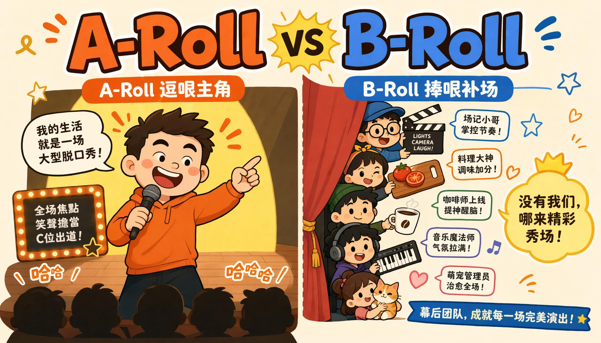
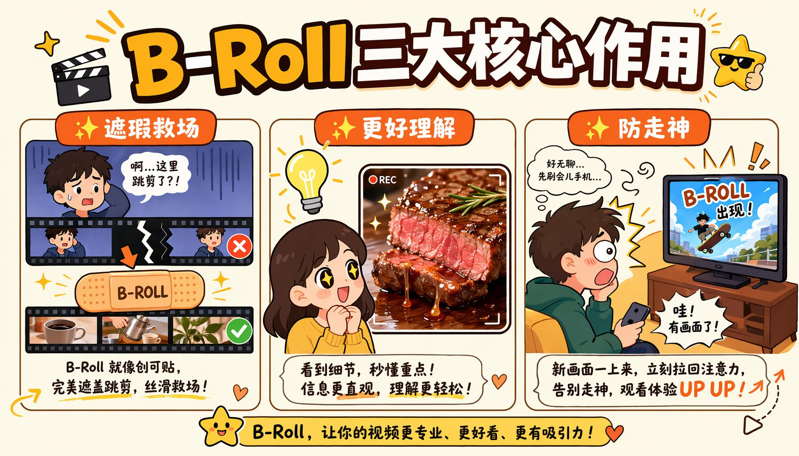
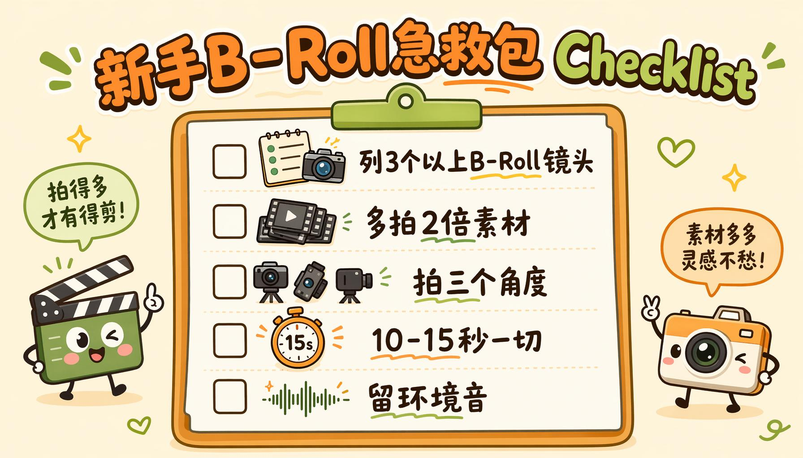

你有没有过这种经历：看一个博主对着镜头叭叭讲了5分钟，全程只有一张大脸怼在屏幕上，哪怕内容讲得再好，看30秒就忍不住想划走。

但同样的内容，中间穿插点做饭的手、路边的猫、敲键盘的特写、城市的空镜，你不知不觉就看完了，甚至还觉得"这博主拍得好专业"。

差别根本不在内容好不好，而在你可能听都没听过的两个影视圈老概念：**A-Roll和B-Roll**。

说出来你可能不信，你刷到的90%的短视频、vlog、纪录片甚至新闻联播，背后都是这俩兄弟在撑场面。搞懂它们，你用手机拍的视频质感也能直接甩开80%的新手。

---

## 先搞懂：A-Roll和B-Roll到底是什么？

说穿了特别好理解，用相声打个比方你就秒懂：

🎤 **A-Roll就是台上的逗哏，是绝对主角**

所有核心台词、核心信息、故事主线全在它这儿。比如博主对着镜头讲话、采访时受访者的回答、产品演示的主画面，相当于你听相声时主要盯着说话的那个人，所有核心包袱都从他嘴里出来。

🤝 **B-Roll就是捧哏+后台所有工作人员**

你看不到它直接说话，但它全程在递梗、补细节、圆场、遮丑。

比如讲"今天做番茄炒蛋"时切的切番茄的特写、采访咖啡馆老板时插的磨豆子的镜头、vlog里讲"今天天气真好"时拍的天上的云、美食博主咬一口牛排后切的肉汁流出的慢动作，全是B-Roll。

说个冷知识：这俩名字听起来高大上，其实来源特别朴素。

老电影时代剪辑师真的是用两卷胶片剪片子，A卷是拍主角的主素材，B卷是拍其他画面的补素材，剪的时候把B卷盖在A卷的剪辑痕迹上，就不会出现画面跳来跳去的尴尬。

所以B-Roll从出生那天起，干的就是"补锅"的活——行业里人送外号：**跳切救星，视频尴尬粉碎机**。

---

## 别再拍"大头视频"了！B-Roll才是视频质感的秘密

很多新手拍视频，举着手机对着自己拍10分钟讲话就觉得完事了，剪出来一看，要么自己说话卡壳的地方全露馅，要么看着特别无聊，自己都看不下去——本质就是没有B-Roll。

别觉得B-Roll是可有可无的边角料，它的作用比你想象的大得多：

### ✨ 作用1：视频"遮瑕膏"，专门救场
你说话卡了个壳、忘词停了两秒、剪的时候切掉了说错的话，直接在这个位置盖个相关的B-Roll画面，观众根本发现不了你剪过，专业上叫"覆盖跳切"，说白了就是给你的剪辑bug打马赛克。

举个例子：你讲"我昨天去吃了特别好吃的火锅"，说完卡了两秒，直接切个火锅沸腾的特写，卡壳的痕迹直接消失，谁都看不出来。

电影里拍演员说错台词、镜头穿帮，全靠这招遮丑，你看正片的时候根本发现不了。

### ✨ 作用2：让观众"看得懂"，比说10句话管用
心理学里有个数据：旁白配相关画面，比单纯听人说话，观众的理解度能高65%。

你说"这个键盘打字特别爽"，拍10秒手指敲键盘的特写（带点按键的声音），比你对着镜头形容"手感软糯、回弹快、声音脆"管用10倍。

毕竟老话说"Show, don't tell"，拍出来比说破嘴皮子有用。美食博主为什么总拍食物特写、咬开的瞬间？因为你看饿了，比他说100句"好吃"管用。

### ✨ 作用3：防止观众走神，专治视觉疲劳
人眼对同一个静止画面的注意力最多维持15秒，你一直把大脸怼在镜头前，哪怕你长得再好看，观众也会看累。

每隔10-15秒切个相关的小镜头，就像上课的时候老师偶尔讲个小段子，注意力一下就拉回来了。

说个行业冷数据你就知道B-Roll有多重要：纪录片里B-Roll要占最终成片的40%-60%，新闻片段里甚至要占50%-70%——你看的新闻里主播只占小半画面，大部分切的现场画面，全是B-Roll。

你觉得人家拍得专业，根本不是因为设备贵，就是B-Roll给你制造的"专业感错觉"。

---

## 新手也能学会的B-Roll实操指南，看完就能用

不讲复杂理论，直接给三个落地方法，手机也能拍明白：

### 📝 拍之前：花5分钟列个"镜头清单"，别瞎拍
不用搞复杂的分镜，就对着你写的文案/口播稿，每讲一个关键点，对应想1-2个可以拍的画面就行。给你个现成模板可以直接抄：

| 你要说的话（A-Roll） | 对应的B-Roll拍什么 |
|---|---|
| "今天给大家测评这款新出的咖啡" | 咖啡罐特写、手冲咖啡的水流、杯子放在桌上的镜头 |
| "我平时在家工作效率特别高" | 敲键盘的手、电脑屏幕特写、桌上的绿植、摊开的笔记本 |
| "这家火锅店真的特别好吃" | 红油沸腾的特写、毛肚下锅的瞬间、蘸料的细节 |

就这么简单，根本不需要什么专业功底，拍之前列3-5个点，就不会出现剪的时候找不着素材的尴尬。

### 📱 拍的时候：记住这3个笨技巧，手机也能拍得专业
- **多拍！多拍！多拍！** 重要的事说三遍：计划用1分钟的B-Roll，至少拍2-3分钟的素材，多拍点特写、空镜，后期选的时候才有得挑，总比剪的时候发现没素材强。
- **同一个场景多换几个角度拍**：比如拍咖啡，别只拍一个全景，拍个咖啡罐的特写、冲咖啡的手、咖啡液面的奶泡、端杯子的动作，剪的时候来回切，丰富度直接上来。
- **别抖！别逆光拍！** 新手用手机拍就记住两个底线：找个支撑（三脚架/甚至把手机放桌上也行）别晃，尽量对着自然光拍，别逆光拍出来脸黑糊糊的，比什么构图技巧都管用。

### ✂️ 剪的时候：两个小技巧让过渡更自然
- **别卡着点切画面**：可以试试"声音先出，画面后切"——比如你还在讲"这个咖啡特别香"，画面提前0.5秒切到咖啡冒热气的镜头，观众会觉得过渡特别顺，不会有生硬的卡顿感。
- **给B-Roll加一丢丢小声音**：拍键盘就留一点敲键盘的声音，拍咖啡就留一点水流声，不用太大，若有若无就行，真实感瞬间拉满。

最后解答两个新手最常问的问题：
> 问：我没时间自己拍B-Roll怎么办？
> 答：库存素材也是B-Roll的一种，找一些免费可商用的素材网站下就行，只要和内容匹配，没人看得出来。

> 问：B-Roll要开声音吗？
> 答：拍的时候一定要录环境音！后期可以静音，但别不录，那些细碎的小声音是提升质感的神器。

---

## 新手B-Roll急救包：直接抄作业的Checklist

下次拍视频之前，对着这5条打勾就行，保证你拍出来的视频质感直接上一个台阶：
- [ ] 拍视频前，先对着口播稿列至少3个对应B-Roll镜头
- [ ] B-Roll拍摄数量至少是计划用量的2倍，多拍特写和细节
- [ ] 同一个内容拍全景、中景、特写三个角度，后期更好剪
- [ ] 剪的时候每隔10-15秒切一个B-Roll，别让大脸怼满全程
- [ ] B-Roll留一点细碎的环境音，真实感翻倍

其实B-Roll本质上就是视频里的"细节控"。

你觉得一个视频拍得"用心""专业"，从来不是因为它用了多贵的相机、多复杂的特效，而是这些你可能根本没注意到的小细节，在悄悄影响你的感受。

下次刷视频的时候可以留意一下，哪些地方用了B-Roll，哪些地方没用到，你一眼就能看出谁是新手谁是老手。

如果觉得有用，欢迎点个赞/在看，也可以在评论区说说：你拍视频遇到过最尴尬的剪辑bug是什么？
