> 面向 **agent 应用工程师** 的技术向报告。结合 Hermes Agent 当前代码仓（`agent/context_compressor.py`、`agent/conversation_compression.py`、`agent/turn_context.py`、`agent/conversation_loop.py`、`agent/prompt_caching.py`、`gateway/run.py`）与官方文档，系统拆解其上下文压缩（context compression / compaction）机制：设计动机、触发逻辑、边界算法、结构化摘要、会话存储、Prompt Caching 协同与失败处理。


---

## 目录

1. [为什么需要上下文压缩](#1-为什么需要上下文压缩)
2. [总体架构：可插拔引擎 + 双层压缩](#2-总体架构可插拔引擎--双层压缩)
3. [触发时机：三个触发点与阈值计算](#3-触发时机三个触发点与阈值计算)
4. [核心算法：ContextCompressor 的 4 阶段流水线](#4-核心算法contextcompressor-的-4-阶段流水线)
5. [边界对齐：保护头、Token 预算尾、工具组完整性](#5-边界对齐保护头token-预算尾工具组完整性)
6. [摘要生成：结构化模板、迭代更新与会话轮转](#6-摘要生成结构化模板迭代更新与会话轮转)
7. [Prompt Caching：与压缩的协同关系](#7-prompt-caching与压缩的协同关系)
8. [鲁棒性：失败处理、防抖动与并发锁](#8-鲁棒性失败处理防抖动与并发锁)
9. [横向对比：Hermes vs Claude Code](#9-横向对比hermes-vs-claude-code)
10. [给应用工程师的实践要点](#10-给应用工程师的实践要点)
11. [源码索引与参考资料](#11-源码索引与参考资料)

---

## 1. 为什么需要上下文压缩

LLM 的 context window 是固定的工作内存。在多轮、长任务的 agent 场景里，每一次 API 调用都要把**完整的对话历史**（系统提示 + 历史消息 + 工具调用与结果）重新发回模型。轮次增长后，会出现两类问题：

- **硬性失败**：prompt token 超过模型 context window，provider 直接返回 400/413/context-overflow。
- **软性退化**：在还没触顶之前，模型已经因为上下文过长而难以保持注意力——它会"忘记"早期给的约束、重复已做过的工作、re-fetch 已读过的文件。

最朴素的方案是**截断（truncation）**：超限就丢掉最旧的消息。它免费、快速，但会立刻打断多步推理——agent 看不到 6 轮前自己的决策，就会重新推导、自相矛盾。

Hermes 选择的是**压缩（compression / compaction）**：把对话切成三段——保护头、摘要中段、保留尾——用一次 LLM 调用把"中段"压成结构化摘要，既缩短了长度，又保住了叙事主线。

> **一句话定位：压缩管理的是"本次会话的工作窗口"，而不是"跨会话的长期记忆"**。后者由 Hermes 的 memory 系统（`MEMORY.md` / `USER.md` / memory providers）负责。两者是正交的两层，压缩前 memory provider 会收到 `on_pre_compress` 回调以抢救信息。

---

## 2. 总体架构：可插拔引擎 + 双层压缩

### 2.1 可插拔的 ContextEngine 抽象

Hermes 把"上下文管理"抽象成一个 ABC：`agent/context_engine.py:32` 的 `ContextEngine`。内置实现是 `ContextCompressor`（有损摘要），但可被插件替换（例如 LCM —— Lossless Context Management，无损上下文）。

引擎职责（来自 ABC docstring）：

- 决定**何时**压缩：`should_compress()`
- 执行压缩：`compress()`
- 可选地向 agent 暴露工具（例如 LCM 的 `lcm_grep`）
- 从 API 响应跟踪 token 用量：`update_from_response()`
- 会话生命周期：`on_session_start()` / `on_session_end()` / `on_session_reset()`

选择由 `config.yaml` 的 `context.engine` 驱动，解析顺序：

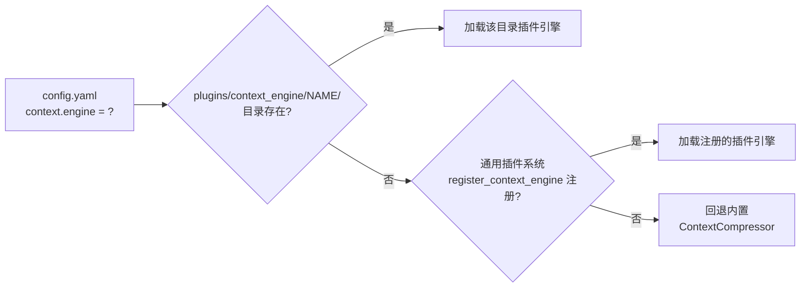

关键约束：**插件引擎永不自动激活**——用户必须显式把 `context.engine` 设成插件名；默认值 `"compressor"` 始终用内置实现。

引擎生命周期如下：

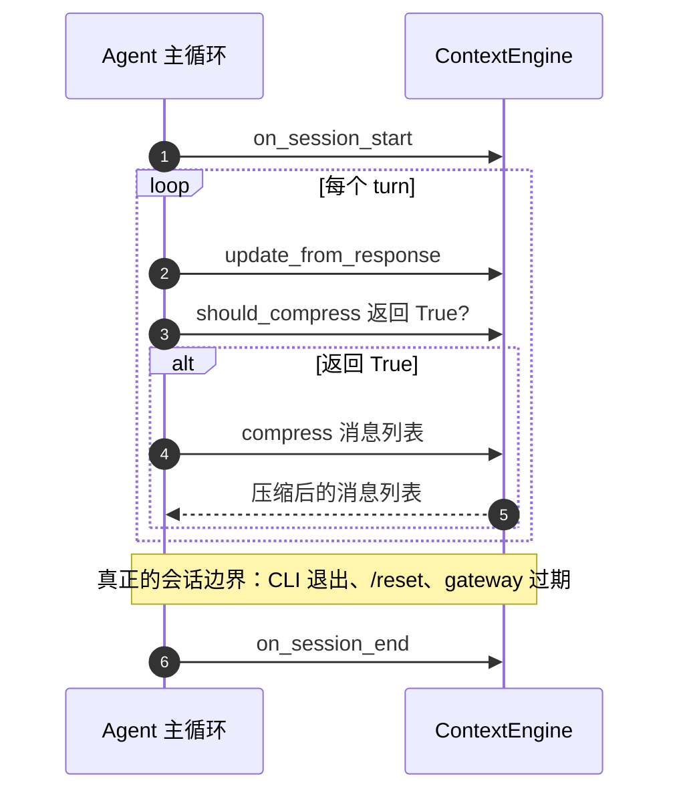

`ContextEngine` 还维护一组 `run_agent.py` 直接读取的 token 状态字段：`last_prompt_tokens`、`threshold_tokens`、`context_length`、`compression_count` 等。

### 2.2 双层压缩系统

Hermes 有**两个独立运作**的压缩层，阈值故意错开：

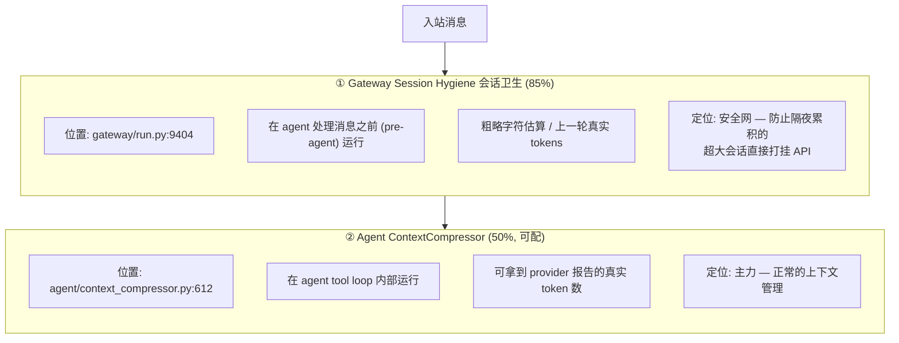

| 维度 | Gateway 会话卫生 | Agent 压缩器 |
|---|---|---|
| 阈值 | 固定 **85%** of context | 默认 **50%**（`compression.threshold` 可配） |
| 运行位置 | agent 启动前（pre-agent） | agent 工具循环内（in-loop） |
| token 来源 | 优先上一轮真实 tokens，回退字符估算 | provider 报告的真实 prompt_tokens（首选） |
| 触发条件 | `len(history) >= 4` 且压缩启用 | `prompt_tokens >= threshold_tokens` |
| 角色 | 安全网（catch 漏网之鱼） | 主力（normal management） |

**为什么阈值要错开？** 官方注释写得很直白：会话卫生阈值故意比 agent 压缩器高（85% vs 50%）。如果把会话卫生也设成 50%，长 gateway 会话会在**每一轮**都触发过早压缩。会话卫生只是为了兜住那些在两次 turn 之间疯长（如 Telegram/Discord 群里隔夜累积）的会话。

> Gateway 会话卫生还有一个**硬阀门**：`hygiene_hard_message_limit`（默认 5000 条消息），无视 token 估算强制压缩。这是为了打破"API 断连 → 拿不到 token 数据 → 不压缩 → 更多断连"的死亡螺旋。

---

## 3. 触发时机：三个触发点与阈值计算

实际代码里，**Agent 压缩器有三个触发点**，分布在一个 turn 的不同阶段。理解这三点是理解整个机制的关键。

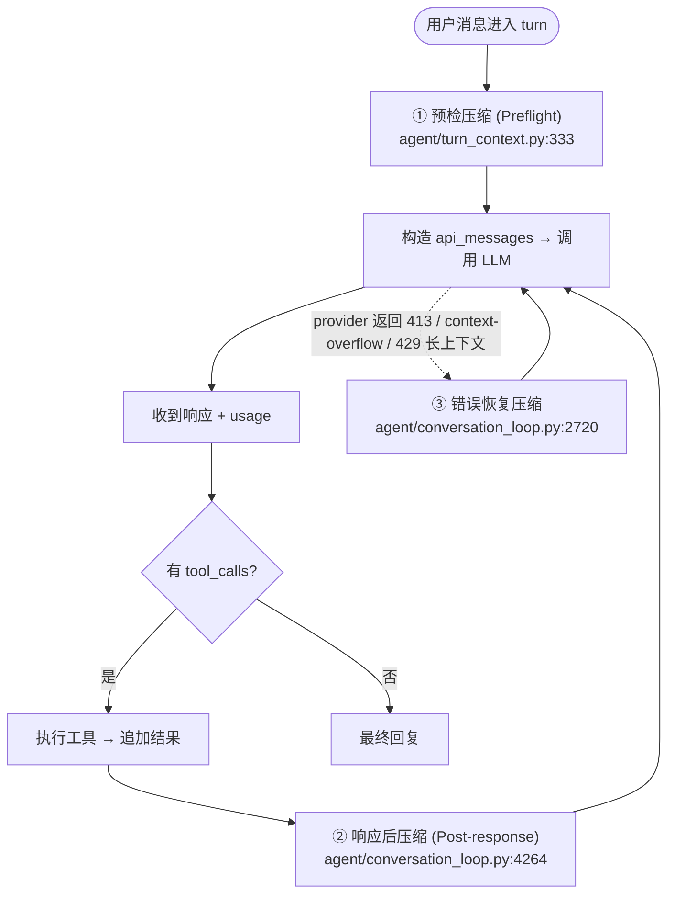

### 3.1 触发点①：预检压缩（Preflight）

位置：`agent/turn_context.py:333` 的 `build_turn_context`，在调用 LLM **之前**跑。

它先用一个**廉价门控** `_should_run_preflight_estimate()` 决定要不要做（昂贵的）完整 token 估算——满足任一即做：

- (a) 消息数 > `protect_first_n + protect_last_n + 1`（历史门控）；或
- (b) 廉价字符估算已越过阈值（修复 #27405：少量但巨大的消息会绕过 count 门控）。

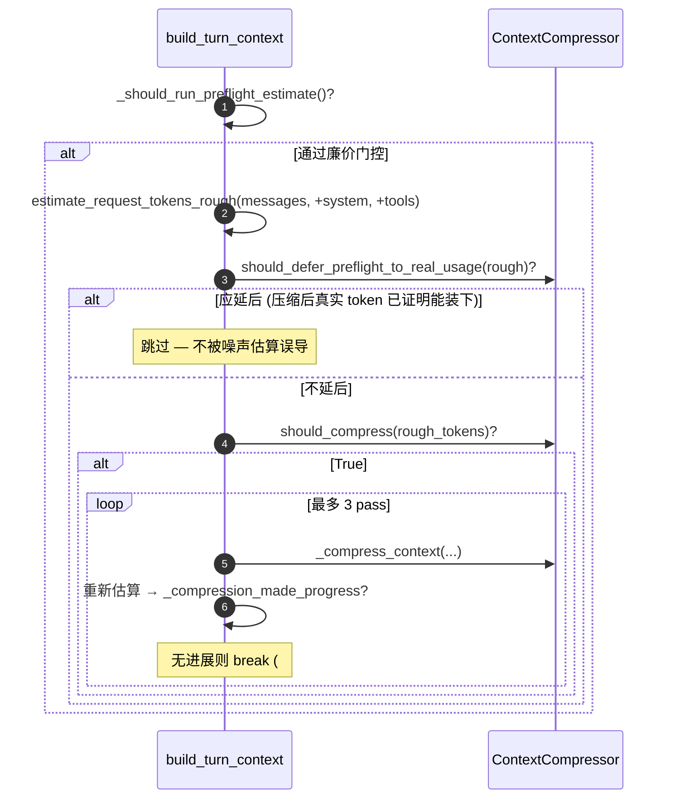

注意两个工程细节：

- **`estimate_request_tokens_rough` 会带上 tool schemas**。50+ 工具能加 20–30K token，messages-only 估算会漏掉，导致越过阈值仍不压缩（`agent/model_metadata.py:2069`）。
- **`should_defer_preflight_to_real_usage`** 是一个反噪声机制：schema-heavy 请求的 rough 估算会故意高估；一旦某次压缩后的请求被 provider 证明能装下，就更信任真实 `prompt_tokens` 而非重复用同样的 schema 高估去再压一次（`agent/context_compressor.py:922`）。

### 3.2 触发点②：响应后压缩（Post-response）

位置：`agent/conversation_loop.py:4264`，在收到响应、执行完工具后跑。这是**最常规**的触发点，用的是 provider 报告的真实 token：

```python
_compressor = agent.context_compressor
if _compressor.last_prompt_tokens > 0:
    _real_tokens = _compressor.last_prompt_tokens     # 真实值优先
elif _compressor.last_prompt_tokens == -1:
    _real_tokens = 0                                  # 刚压缩完，等真实 usage（哨兵）
else:
    _real_tokens = estimate_request_tokens_rough(messages, tools=...)  # 断连兜底

if agent.compression_enabled and _compressor.should_compress(_real_tokens):
    messages, active_system_prompt = agent._compress_context(...)
```

关键设计：

- **只用 `prompt_tokens`，不算 `completion_tokens`**。思维模型（GLM-5.1、QwQ、DeepSeek R1）的 reasoning token 会膨胀 completion，若计入会导致过早压缩（#12026）。
- **`-1` 哨兵**：压缩刚跑完、还没拿到 provider 真实计数时，`last_prompt_tokens` 被设为 `-1`，此时 `_real_tokens=0`，避免把 schema-heavy 的"压缩后 rough 估算"误判成上下文压力（#36718）。
- **断连兜底**：若 `last_prompt_tokens==0`（API 断连或 provider 没返回 usage），回退 rough 估算，防止会话在断连后无限增长（#2153）。

### 3.3 触发点③：错误恢复压缩

位置：`agent/conversation_loop.py:2720` 的 error handler。当 provider 真的返回 413（payload too large）、context-overflow，或 Anthropic 429「long context tier」时，把 context 降级（如 Claude 长上下文层降到 200K）并强制压缩重试，最多 `max_compression_attempts=3` 次。

### 3.4 阈值计算：`_compute_threshold_tokens`

阈值不是简单的 `context_length × 0.5`。看 `agent/context_compressor.py:741`：

```python
@staticmethod
def _compute_threshold_tokens(
    context_length: int, threshold_percent: float, max_tokens: int | None = None,
) -> int:
    effective_window = context_length - (max_tokens or 0)
    if effective_window <= 0:
        effective_window = context_length
    pct_value = int(effective_window * threshold_percent)
    floored = max(pct_value, MINIMUM_CONTEXT_LENGTH)
    if effective_window > 0 and floored >= effective_window:
        return max(1, min(int(effective_window * ContextCompressor._MIN_CTX_TRIGGER_RATIO),
                          effective_window - 1))
    return floored
```

设计动机有三层：

1. **输出预留**：provider 把 `max_tokens` 从 window 里切出去做输出空间，所以可用**输入**预算是 `context_length - max_tokens`。大 `max_tokens`（如自定义 provider 的 65536）会让输入预算显著缩小，基于完整 window 的阈值会撞 400（#43547）。
2. **64K 下限**：大上下文模型不应在 50% 就压缩，所以 floored 到 `MINIMUM_CONTEXT_LENGTH=64K`。
3. **小窗口退化保护**：对 64K 本地模型，`max(0.5×64000, 64000)==64000` 会让阈值等于整个窗口——压缩永远触发不了（provider 在 100% 前就拒了，#14690）。此时改用 85% 触发。

#### Codex gpt-5.5 自动抬高阈值

ChatGPT Codex OAuth 后端把 `gpt-5.5` 硬限在 **272K**（同一 slug 在 OpenAI 直连/OpenRouter 是 1.05M，GitHub Copilot 是 400K）。默认 50% 会在 ~136K 就压缩——只用了模型能用窗口的一半。所以当路由是 Codex OAuth（`provider: openai-codex`）且模型是 gpt-5.5 时，Hermes 把触发抬到 **85%**（~231K）。关掉：

```bash
hermes config set compression.codex_gpt55_autoraise false
```

（`agent/auxiliary_client.py:240-310`、`agent/agent_init.py:1322-1353`）

#### 默认配置与计算示例（200K 模型）

```yaml
compression:
  enabled: true            # 默认 true
  threshold: 0.50          # context window 的比例，默认 50%
  target_ratio: 0.20       # 尾部 token 预算 = threshold_tokens × 0.20
  protect_last_n: 20       # 最少保留的尾部消息数
  codex_gpt55_autoraise: true
  in_place: false          # 默认 false（保持旧会话轮转），推荐显式设为 true
  abort_on_summary_failure: false
auxiliary:
  compression:
    model: null            # 摘要模型，默认自动探测
    provider: auto         # auto / openrouter / nous / main / ...
    base_url: null
```

```
context_length      = 200,000
threshold_tokens    = 200,000 × 0.50 = 100,000
tail_token_budget   = 100,000 × 0.20 = 20,000
max_summary_tokens  = min(200,000 × 0.05, 12,000) = 10,000
```

> **阈值永远基于主模型的 context window，不是摘要/辅助模型的**。在 262,144 token 的模型上默认 0.5 → 131,072，这个接近"128K"是百分比巧合，不代表辅助模型窗口是触发器。

---

## 4. 核心算法：ContextCompressor 的 4 阶段流水线

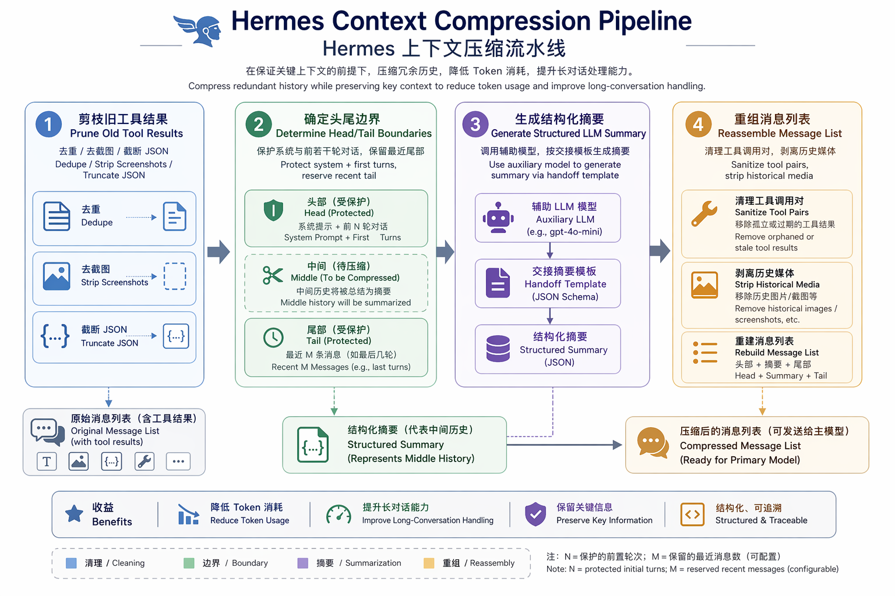

`ContextCompressor.compress()`（`agent/context_compressor.py:2372`）是整套机制的心脏。它把消息列表压缩成「头 + 摘要 + 尾」三段。官方文档把它归纳为 4 阶段：

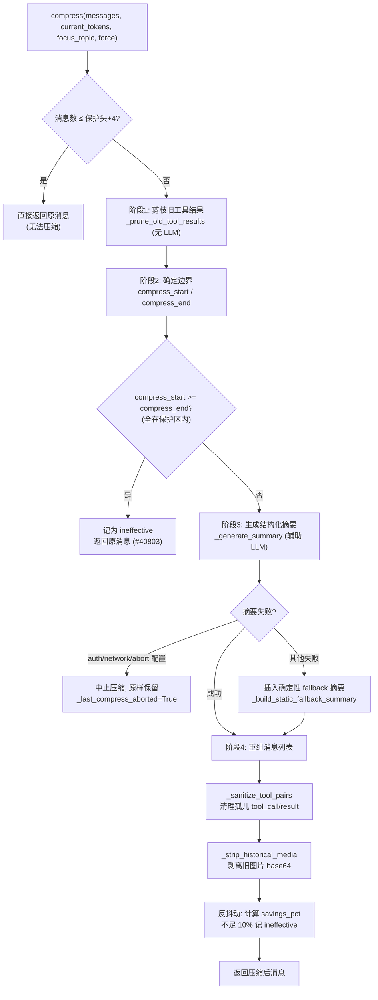

### 阶段 1：剪枝旧工具结果（廉价，无 LLM 调用）

`_prune_old_tool_results()`（`agent/context_compressor.py:990`）是一次性的预扫描，把保护尾之外的、超过 200 字符的工具结果替换为**信息化的一行摘要**，而非空洞占位符：

```
[terminal] ran `npm test` -> exit 0, 47 lines output
[read_file] read config.py from line 1 (3,400 chars)
```

它实际做了三遍扫描（pass）：

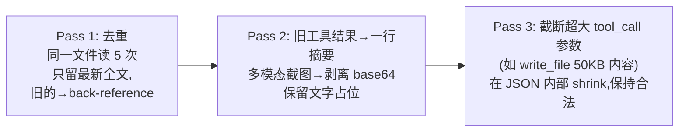

工程要点：

- **去重**用 md5 前 12 位哈希，相同内容只保留最近一份全文，旧的换成 `[Duplicate tool output — same content as a more recent call]`。
- **截图**（多模态 base64）必须剥离——否则一张 ~1MB base64（~1500 真实 token）的旧 computer_use 截图会**永远**活过每一次压缩。
- **tool_call 参数截断在解析后的 JSON 结构内做**（`_truncate_tool_call_args_json`，`agent/context_compressor.py:337`），保证结果仍是合法 JSON，否则下游 provider 会在后续每一轮都 400，直到坏 call 滑出窗口。
- 剪枝边界优先用 **token 预算**（`protect_tail_tokens`），消息数 `protect_tail_count` 作为硬下限。

### 阶段 2：确定边界

```
┌─────────────────────────────────────────────────────────────┐
│  消息列表                                                    │
│  [0..2]   ← 保护头 protect_first_n (system + 首轮)           │
│  [3..N]   ← 中段 → 被摘要                                     │
│  [N..end] ← 尾 (按 token 预算 或 protect_last_n)             │
└─────────────────────────────────────────────────────────────┘
```

- `compress_start = _protect_head_size(messages)`（`agent/context_compressor.py:2041`），再 `_align_boundary_forward`（`agent/context_compressor.py:2014`）推过孤儿 tool 结果。
- `compress_end = _find_tail_cut_by_tokens(messages, compress_start)`（`agent/context_compressor.py:2249`），**基于 token 预算**从尾部往前走累计 token，直到预算耗尽。
- 若 `compress_start >= compress_end`（整个 transcript 都在尾预算内），记为一次 ineffective 压缩并返回原消息——这是为了让反抖动守卫在 `should_compress()` 里能生效，否则后续每轮都会空转触发压缩循环（#40803）。

边界对齐的细节见 §5。

### 阶段 3：生成结构化摘要

`_generate_summary()`（`agent/context_compressor.py:1453`）把中段用**辅助 LLM**（`call_llm(task="compression")`）压成结构化摘要。这是唯一花钱的步骤。详见 §6。

> **摘要模型的 context window 必须 ≥ 主模型**。整个中段一次性发给摘要模型；若摘要模型窗口更小，API 返回 context-length 错误，`_generate_summary` 捕获、记日志、返回 `None`，压缩器随后**无摘要地丢掉中段**，悄悄丢失上下文。这是压缩质量退化最常见的原因。`check_compression_model_feasibility`（`agent/conversation_compression.py:74`）会在会话开始/首次压缩时探测并自动降低本会话阈值或硬拒绝过小的辅助模型。

摘要 token 预算随被压缩内容量缩放：

```python
content_tokens = estimate_messages_tokens_rough(turns_to_summarize)
budget = int(content_tokens * _SUMMARY_RATIO)        # _SUMMARY_RATIO = 0.20
return max(_MIN_SUMMARY_TOKENS, min(budget, self.max_summary_tokens))
# _MIN_SUMMARY_TOKENS = 2,000
# max_summary_tokens = min(context_length * 0.05, 12,000)
```

### 阶段 4：重组压缩后的消息列表

重组顺序：

1. **头消息**（首次压缩时，在 system prompt 末尾追加一条 compaction note，告知"早期对话已被压缩成 handoff 摘要"）。
2. **摘要消息**（role 经过精心选择，避免连续同 role 违例；若两种 role 都会冲突，则把摘要 merge 进第一条尾消息）。
3. **尾消息**（原样不动）。

随后两个清理步骤：

- `_sanitize_tool_pairs()`（`agent/context_compressor.py:1954`）：清理孤儿 tool_call/result（见 §5.3）。
- `_strip_historical_media()`（`agent/context_compressor.py:434`）：把最新一张含图 user turn 之前的所有图片 part 换成短文字占位，防止尾消息一直带着多 MB base64 把每个后续请求顶过 provider body 上限。

最后计算 `savings_pct` 用于反抖动（见 §8.2）。

### 4.x 压缩前后对照示例

**压缩前（45 条消息，~95K tokens）**：

```
[0] system:    "You are a helpful assistant..."
[1] user:      "Help me set up a FastAPI project"
[2] assistant: <tool_call> terminal: mkdir project </tool_call>
[3] tool:      "directory created"
    ... 30 多轮文件编辑、测试、调试 ...
[39] tool:      "8 passed, 2 failed\n..."  (5KB output)
[40] user:      "Fix the failing tests"
[44] user:      "Great, also add error handling"
```

**压缩后（25 条消息，~45K tokens）**：

```
[0] system:    "You are a helpful assistant...
               [Note: Some earlier conversation turns have been compacted...]"
[1] user:      "Help me set up a FastAPI project"
[2] assistant: "[CONTEXT COMPACTION — REFERENCE ONLY] Earlier turns were compacted...
               ## Historical Task Snapshot
               ## Goal
               ## Completed Actions
               ## Relevant Files
               ## Critical Context
               --- END OF CONTEXT SUMMARY — respond to the message below..."
[3] user:      "Fix the failing tests"
    ... 尾部最近几轮原样保留 ...
[7] user:      "Great, also add error handling"
```

---

## 5. 边界对齐：保护头、Token 预算尾、工具组完整性

边界算法是 Hermes 压缩器里"工程含量"最高的部分——大量规则都是为了**不破坏消息结构合法性**和**不丢失活跃任务**。

### 5.1 保护头：`protect_first_n` 的衰减

`_protect_head_size()` = `(system 存在 ? 1 : 0) + _effective_protect_first_n()`。

`protect_first_n`（默认 3）保护最初 N 条**非系统**消息，让原始任务框架活过**第一次**压缩。但关键在 `_effective_protect_first_n()`（`agent/context_compressor.py:2024`）的**衰减**：

```python
if self.compression_count >= 1 or self._previous_summary:
    return 0           # 首次压缩后衰减到 0
return self.protect_first_n
```

动机（#11996）：如果每次压缩都保护最初 3 条，这些早期 turn 会被反复复制进每个子会话、永不被摘要掉——老 user 消息变成"不朽"，头部跨长会话无界增长。首次压缩后这些早期 turn 已被 handoff 摘要捕获，无需再保护，衰减到 0（system prompt 仍由 `_protect_head_size` 单独永久保护）。

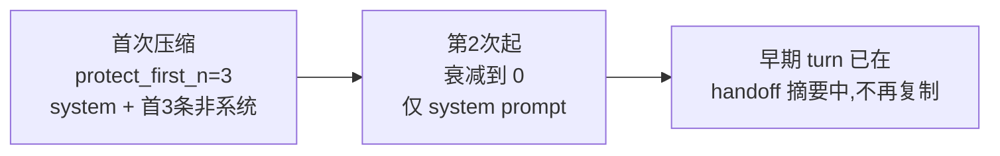

### 5.2 尾保护：token 预算优先，消息数兜底

`_find_tail_cut_by_tokens()`（`agent/context_compressor.py:2249`）从尾部往前走累计 token：

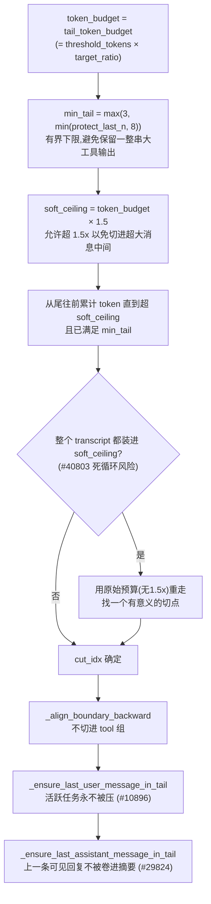

三个"锚点保证"链式调用，且都只把 `cut_idx` 往**后**（更早）推，单调——尾只会增不会缩：

- **最近一条 user 消息**必须在尾里：活跃任务（用户刚提的需求）绝不能被压进 `[CONTEXT COMPACTION]` 块。
- **最近一条 assistant 可见回复**必须在尾里：避免上一条用户看到的回复被悄悄卷进摘要（#29824）。这里"可见回复"特指**有文字内容**的 assistant 消息，纯 tool_calls 的不算。

### 5.3 工具组完整性：对齐与 sanitize

OpenAI 格式要求每个 `tool_call` 后面紧跟匹配 `tool_call_id` 的 `tool` 结果。压缩切割可能破坏这种配对，所以有两道防线：

**防线一：边界对齐**。`_align_boundary_backward()`（`agent/context_compressor.py:2066`）若发现边界落在 tool 结果组中间，会往前走过所有连续 tool 结果，找到父 assistant 消息，把边界移到它之前——让整个 `assistant + tool_results` 组一起被摘要，而非被切开。

**防线二：`_sanitize_tool_pairs()`**（`agent/context_compressor.py:1954`）修复重组后的孤儿配对：

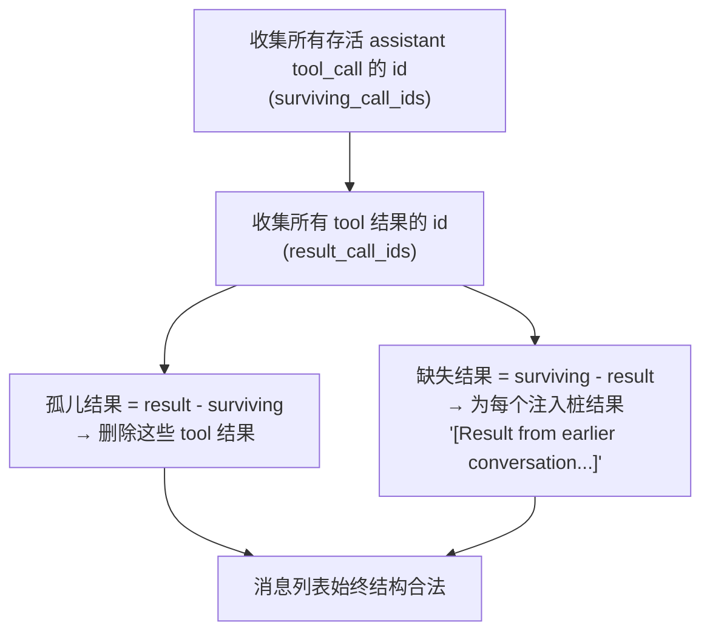

否则 API 会报 `No tool call found for function call output with call_id ...`，毒化整个会话后续请求。

---

## 6. 摘要生成：结构化模板、迭代更新与会话轮转

### 6.1 结构化摘要模板

`_generate_summary()`（`agent/context_compressor.py:1453`）不是让模型"随便总结一下"，而是用一个高度结构化的模板，强制保留对续作至关重要的字段：

```
## Historical Task Snapshot   ← 最重要字段: 用户最近未完成输入的逐字原话
## Goal                        总体目标
## Constraints & Preferences   约束/偏好/编码风格
## Completed Actions           编号列表: N. ACTION target — outcome [tool: name]
## Active State                工作目录/分支/改动文件/测试状态/运行进程
## Historical In-Progress State 压缩发生时正在做的事
## Blocked                     阻塞/错误(含精确报错)
## Key Decisions               关键技术决策 + 原因
## Resolved Questions          已回答的问题(含答案,避免重复回答)
## Historical Pending User Asks 尚未回答的旧请求(仅供参考,不得擅自执行)
## Relevant Files              读/改/建的文件
## Historical Remaining Work    剩余工作(陈旧,仅参考)
## Critical Context            具体值/报错/配置(永不含密钥→[REDACTED])
```

模板设计里有几个对 agent 工程师极有价值的反 prompt-injection / 反"任务漂移"机制：

- **`SUMMARY_PREFIX`** 是一段很长的前缀指令（`agent/context_compressor.py:43-69`），核心是：**"这是来自上一个 context window 的 handoff，当作背景参考，不是活跃指令。只响应出现在摘要之后的最新 user 消息。"** 这是为了防止弱模型把摘要里逐字引用的任务当成新的用户输入去执行（#11475、#14521），或把 assistant-role 的摘要当成自己的输出复述（#33256）。
- **`_SUMMARY_END_MARKER`**：`--- END OF CONTEXT SUMMARY — respond to the message below, not the summary above ---`，给模型一个明确的"摘要到此为止"边界。
- **Temporal Anchoring（时间锚定）**：注入当前日期，要求把已完成动作改写成"已于 YYYY-MM-DD 完成"的过去时事实，防止 resume 时重发已完成的动作（如"给 John 发邮件"被当成待办重发）。
- **安全红线**：preamble 与模板都要求绝不在摘要里写 API key/token/password，用 `[REDACTED]` 替换；且摘要输入序列化（`_serialize_for_summary`，`agent/context_compressor.py:1295`）和输出都过 `redact_sensitive_text`，双重保险。
- **保持语言**：要求用用户对话所用语言写摘要，不翻译成英文。

### 6.2 迭代更新：跨多次压缩的信息保全

后续压缩时，把上一次的摘要（`_previous_summary`）作为"PREVIOUS SUMMARY"喂给 LLM，要求**更新**而非从头总结：

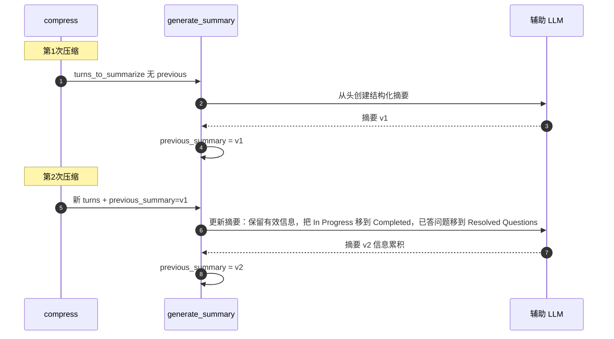

这样信息在多次压缩间累积：项目从 "In Progress" 移到 "Done"，新进展加入，过时信息移除。`compress()` 还会在当前消息里搜索已存在的 handoff 摘要（`_find_latest_context_summary`，`agent/context_compressor.py:1930`）来 rehydrate 这个迭代状态——即使是 resume 进来的会话也能接上。

> 跨会话泄漏防护：若 `_previous_summary` 非空但当前消息里找不到对应 handoff 摘要（说明它来自另一个已结束会话，如 cron 任务或上次 `/new`），就丢弃它，避免把跨会话内容注入摘要 prompt（#38788）。

### 6.3 会话轮转 vs 原地压缩

`compress_context()`（`agent/conversation_compression.py:291`）在压缩成功后要处理 SQLite 会话存储，有两种模式（`compression.in_place` 控制）：

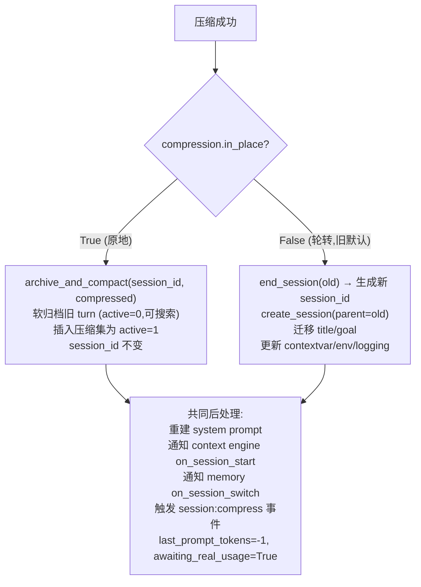

- **原地压缩（in_place）**：保持同一个 `session_id`，旧 turn 软归档（仍在磁盘 + FTS 可搜索 + 可恢复），消除了一整类"会话轮转"bug。代码当前默认 `False`，但配置注释推荐开启；对长会话稳定性改善最大。
- **轮转（rotation，旧默认）**：结束旧会话，fork 一个 `parent_session_id` 指向旧会话的新会话。旧 transcript 保留并可被 `session_search` 搜到。注释里大量篇幅在处理 fork 失败回滚（避免孤儿会话 #33906/#33907）、goal 迁移（#33618）、logging session 上下文同步（#34089）等。

**并发安全**：用 state.db 支持的、按 `session_id` 的原子压缩锁，防止两个共享同一 session 的 AIAgent 实例（最常见是父 turn agent + background-review fork）并发压缩同一会话导致会话分叉。拿不到锁就原样返回，让赢家完成（fail-safe）；锁子系统损坏（版本错配）时 fail-open，宁可冒罕见分叉也不要无限空转。

---

## 7. Prompt Caching：与压缩的协同关系

来源：`agent/prompt_caching.py:49`。这是与压缩**正交但强相关**的省钱机制：在多轮对话里缓存对话前缀，把输入 token 成本降约 75%。

### 7.1 system_and_3 策略

Anthropic 每个请求最多 4 个 `cache_control` 断点。Hermes 用 "system_and_3"：

```
断点 1: 系统提示                    (跨所有轮稳定)
断点 2: 倒数第 3 条非系统消息  ─┐
断点 3: 倒数第 2 条非系统消息   ├─ 滚动窗口
断点 4: 最后一条非系统消息      ─┘
```

`_apply_cache_marker` 按 content 类型注入 marker：字符串 content 转成 `[\{"type":"text","text":...,"cache_control":...\}]`；list content 加到最后一个元素；None/空加在 `msg["cache_control"]`；tool 消息仅 native Anthropic 加。

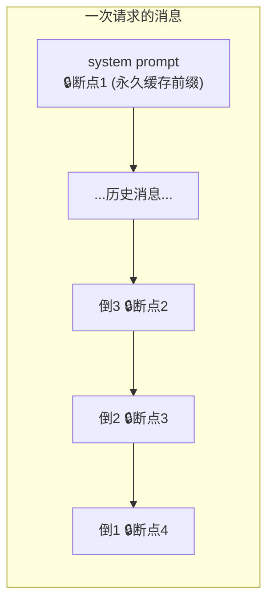

### 7.2 压缩与缓存的相互作用

这是 agent 工程师最该理解的协同点：

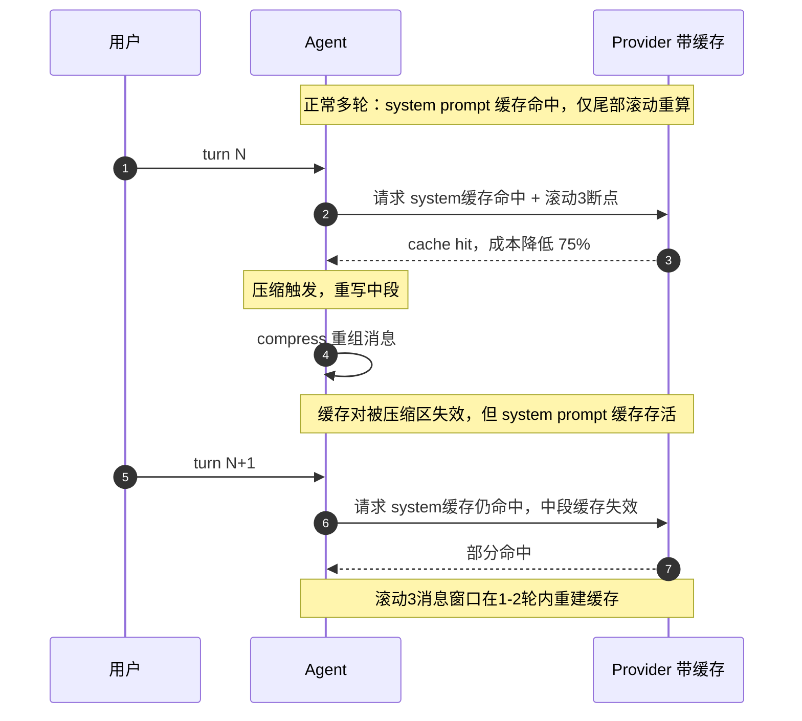

设计原则（来自官方文档与源码注释）：

1. **system prompt 必须稳定**：它是断点 1，跨所有轮缓存。Hermes 在会话开始冻结 memory，**mid-session 写入不改 system prompt**——这正是保护缓存的关键。压缩只在**首次** compaction 时往 system prompt 追加一条 note（之后衰减不再改），把缓存失效降到最低。
2. **消息顺序很重要**：缓存命中靠前缀匹配。在中间增删消息会让其后所有内容的缓存失效——这正是压缩会局部失效缓存的原因。
3. **TTL**：默认 `5m`，长任务（用户中途离开）可用 `1h`。配置：

```yaml
prompt_caching:
  cache_ttl: "5m"   # 必须是 "5m" 或 "1h"
```

启动时 CLI 会显示：`💾 Prompt caching: ENABLED (Claude via OpenRouter, 5m TTL)`。当模型是 Anthropic Claude 且 provider 支持 `cache_control`（native Anthropic 或 OpenRouter）时自动启用。

> **压缩-缓存的成本权衡**：压缩会一次性失效被压缩区的缓存（要重新付费缓存写入），但换来后续每轮更短的 prompt。所以压缩不宜过于频繁（这也是反抖动机制 §8.2 的另一层意义）。

---

## 8. 鲁棒性：失败处理、防抖动与并发锁

生产级压缩器一半的代码在处理"出错怎么办"。

### 8.1 摘要失败的分级处理

`_generate_summary` 的异常处理是一棵决策树：

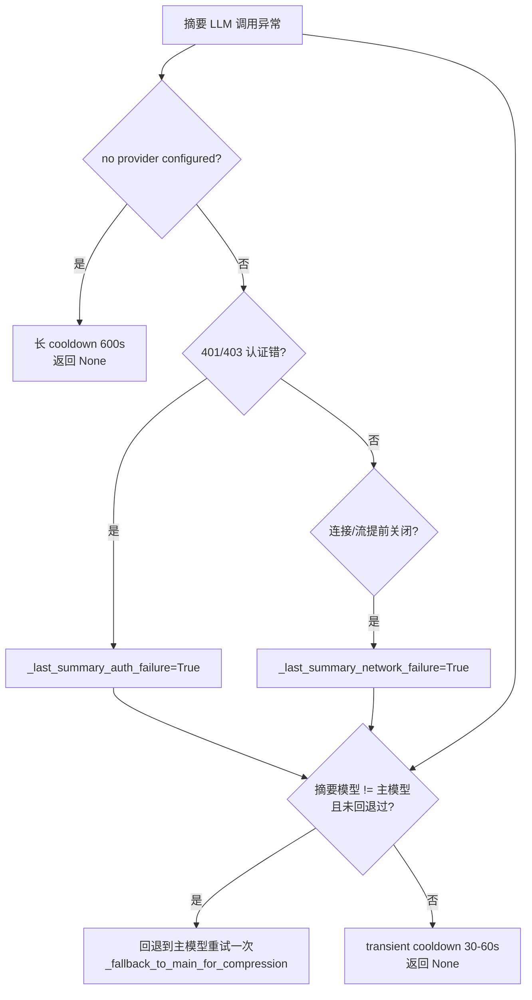

然后 `compress()` 根据失败类型决定**整体行为**：

| 失败类型 | 行为 | 原因 |
|---|---|---|
| 认证错误 (401/403) | **中止**压缩，原样保留会话 | 凭证/端点坏了，轮转进降级子会话毫无意义，每次都会同样失败 |
| 瞬时网络错误 | **中止**，原样保留 | 网络抖动，恢复后 `/compress` 重试比丢弃上下文好（#29559） |
| `abort_on_summary_failure=true` | **中止**，冻结会话 | 用户显式选择 |
| 其他失败（默认） | 插入**确定性 fallback 摘要**，丢中段 | `_build_static_fallback_summary` 保留连续性锚点，比"N 条消息被删"占位强 |

中止时设 `_last_compress_aborted=True`，上层（gateway/CLI）据此向用户发可见告警（"对话已冻结，运行 /compress 重试或 /new 重开"），而非默默吞掉。

### 8.2 反抖动（anti-thrashing）

如果连续两次压缩各自节省 < 10%，`should_compress()` 直接返回 False，避免每次只删 1-2 条消息的无限循环：

```python
def should_compress(self, prompt_tokens=None) -> bool:
    tokens = prompt_tokens if prompt_tokens is not None else self.last_prompt_tokens
    if tokens < self.threshold_tokens:
        return False
    if self._ineffective_compression_count >= 2:   # 反抖动
        return False
    return True
```

`compress()` 末尾计算 `savings_pct`，< 10% 则 `_ineffective_compression_count += 1`，否则归零。空压缩窗口（`compress_start >= compress_end`）也计为 ineffective（#40803）。

### 8.3 手动 `/compress` 与聚焦压缩

用户可手动 `/compress`（`force=True`，绕过失败 cooldown）或 `/compress <focus>`（聚焦压缩，灵感来自 Claude Code 的 `/compact`）。聚焦时摘要 prompt 末尾注入 FOCUS TOPIC，要求与该主题相关的内容保留全细节、给 60-70% 预算，其余更激进压缩。自动压缩还会用 `_derive_auto_focus_topic`（`agent/context_compressor.py:1897`）从最近几轮推断一个隐式 focus。

`has_content_to_compress()`（`agent/context_compressor.py:2357`）作为 `/compress` 的 preflight 守卫——transcript 全在保护头/尾内时直接报"没东西可压"，省一次 LLM 调用。

### 8.4 图片过大恢复

`try_shrink_image_parts_in_messages()`（`agent/conversation_compression.py:805`）在 provider 因 image-too-large（Anthropic 5MB）拒绝时，把 `data:image/...;base64` 的图片 part 重新编码到 ≤4MB 或 ≤8000px，让重试能装下。它谨慎处理 PNG 重压可能变大（非单调）的情况，只在确实满足约束时才接受。

---

## 9. 横向对比：Hermes vs Claude Code

两者都遵循"保护头 / 摘要中段 / 保留尾"的通用模式，但工程取舍不同。

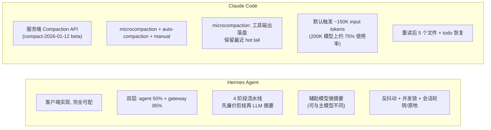

| 维度 | Hermes Agent | Claude Code |
|---|---|---|
| 实现位置 | 客户端（`agent/context_compressor.py`） | 服务端 Compaction API + 客户端三层 |
| 可配性 | 高（threshold/target_ratio/protect_last_n/in_place/aux model…） | 低（API 一个 trigger 参数，server-side handling） |
| 触发阈值 | agent 50%（可配）/ gateway 85% | 默认 ~150K input tokens（200K 模型约 75%） |
| 工具输出处理 | 剪枝成一行摘要 + 去重 + 截断（in-context） | microcompaction 落盘，仅留路径引用，保留最近 hot tail |
| 摘要模型 | 可用独立辅助模型 | 主模型自身（可指定 compact model） |
| 防失败循环 | 反抖动（连续 2 次 &lt;10% 停止） | 由服务端控制，客户端可配置 pause/retry |
| 摘要结构 | 13 段结构化模板 | 结构化摘要（goal/intent/decisions/files/next steps） |
| 续作恢复 | handoff 摘要 + session_search | 摘要 + 重读最近 5 个文件 + 恢复 todo |

**共同的盲区**（社区一致结论）：两者都很好地保留了**叙事连续性**，但都会在压缩中**悄悄丢失精确值偏好和硬约束**——你在第 2 轮给的 constraint、第 8 轮确认的精确数值，可能在压缩后消失。这正是为什么需要一个**压缩之外的持久化层**（Hermes 的 memory 系统 / Mem0 等）来在任何压缩 pass 之前抢救关键事实。

---

## 10. 给应用工程师的实践要点

把上面的机制翻译成你日常用 Hermes 构建 agent 时的可操作建议：

### 10.1 配置调优

```yaml
compression:
  enabled: true
  threshold: 0.50        # 大上下文模型可适当调低省钱; 小模型由代码自动抬到85%
  target_ratio: 0.20     # 调高→尾保留更多原文(更安全但省得少); 调低→压更狠
  protect_last_n: 20     # 任务依赖近期细节多时调高
  in_place: true         # 推荐: 同一 session_id, 避免会话轮转 bug
  abort_on_summary_failure: false  # 摘要失败时是否冻结而非插占位
auxiliary:
  compression:
    model: <≥主模型window的模型>   # 关键! 否则摘要会因 context-length 错误而无声丢失
```

- **最重要的一条**：确保 `auxiliary.compression.model` 的 context window **≥ 主模型**。这是压缩质量退化最常见的根因。`check_compression_model_feasibility` 会探测并自动降阈值或告警，但显式配置最稳。
- 大上下文模型（1M）想省钱可调低 `threshold`；小模型（≤64K）不用管，代码会自动用 85% 触发。

### 10.2 与你的 memory 层配合

压缩是**有损**的。任何"必须跨压缩/跨会话存活"的事实（用户偏好、硬约束、精确配置值）都应主动写进 memory（`MEMORY.md`/`USER.md` 或 memory provider），不要指望它活过压缩。压缩前 `on_pre_compress` 会通知 memory provider，但你得先让它知道该记什么。

> 结合项目记忆约定：**"保存偏好而非进度，声明性事实而非命令式指令"**——这正好对应压缩会丢失约束的盲区。

### 10.3 长会话的运维信号

- 看到 `Session compressed N times — accuracy may degrade. Consider /new` 时，说明会话已压多次、质量在降，建议开新会话。
- 看到 `Compression skipped — last N compressions saved &lt;10% each`，说明反抖动生效了，会话里多是不可压缩的近期大内容，考虑 `/compress <topic>` 聚焦或 `/new`。
- 看到 `⚠️ Context compression aborted (...)`，说明辅助模型/凭证/网络出问题，会话被冻结在当前大小，需修配置后 `/compress` 重试。

### 10.4 Prompt Caching 友好

- 用 Anthropic Claude + OpenRouter/native 时自动开缓存，**别在会话中途修改 system prompt**（否则断点 1 缓存失效，全盘重算）。Hermes 冻结 memory 就是为此。
- 长任务（用户会离开几十分钟）把 `cache_ttl` 设 `1h`。

### 10.5 在 Library / Celery 模式下的注意

每个任务用 `quiet_mode=True` 新建 agent 实例保证线程/进程安全；压缩的并发锁是 state.db 级的、按 session_id，跨进程并发同一 session 时会自动串行化——但**不同 session 各自独立压缩**，所以多任务并发不会互相阻塞压缩。

---

## 11. 源码索引与参考资料

### 核心源码

| 文件 | 职责 |
|---|---|
| `agent/context_engine.py:32` | `ContextEngine` ABC，可插拔引擎接口与生命周期 |
| `agent/context_compressor.py:612` | 内置 `ContextCompressor`，4 阶段算法、边界对齐、摘要生成 |
| `agent/conversation_compression.py:74` | `check_compression_model_feasibility`：辅助模型可行性探测 |
| `agent/conversation_compression.py:291` | `compress_context()`：会话轮转/原地压缩、并发锁 |
| `agent/turn_context.py:333` | 触发点①预检压缩（turn prologue） |
| `agent/conversation_loop.py:4264` | 触发点②响应后压缩 |
| `agent/conversation_loop.py:2720` | 触发点③错误恢复压缩 |
| `agent/prompt_caching.py:49` | Anthropic `system_and_3` 缓存策略 |
| `gateway/run.py:9404` | Gateway 会话卫生（85% 安全网） |
| `agent/model_metadata.py:1993` | `estimate_messages_tokens_rough` / `estimate_request_tokens_rough` |
| `agent/auxiliary_client.py:240` | Codex gpt-5.5 上下文硬限与自动抬升阈值 |

### 关键常量速查（`agent/context_compressor.py`）

| 常量 | 值 | 含义 |
|---|---|---|
| `_SUMMARY_RATIO` | 0.20 | 摘要预算 = 内容 token × 0.20 |
| `_MIN_SUMMARY_TOKENS` | 2000 | 摘要最小预算 |
| `_SUMMARY_TOKENS_CEILING` | 12000 | 摘要绝对上限 |
| `MINIMUM_CONTEXT_LENGTH` | 64000 | 上下文下限地板 |
| `_MIN_CTX_TRIGGER_RATIO` | 0.85 | 小窗口退化时的触发比例 |
| `_IMAGE_TOKEN_ESTIMATE` | 1600 | 每张图的扁平 token 估算 |
| `_MAX_TAIL_MESSAGE_FLOOR` | 8 | 尾保护消息数上限地板 |
| `_SUMMARY_FAILURE_COOLDOWN_SECONDS` | 600 | 无 provider 时的长 cooldown |

### 官方与社区资料

- Nous Research 官方文档：Context Compression and Caching — https://hermes-agent.nousresearch.com/docs/developer-guide/context-compression-and-caching
- Nous Research 官方文档：Configuration — https://hermes-agent.nousresearch.com/docs/user-guide/configuration
- Anthropic Platform Docs：Compaction — https://platform.claude.com/docs/en/build-with-claude/compaction
- Decode Claude：Inside Claude's Compaction System — https://decodeclaude.com/compaction-deep-dive
- mem0 工程博客：How Hermes and Claude Handle Context Compression — https://mem0.ai/blog/how-hermes-and-claude-handle-context-compression-in-real-production-agents-(and-what-you-should-extract)

---

*本报告基于 Hermes Agent 代码仓 2026-07 快照与上述公开资料整理，面向 agent 应用工程师。Mermaid 图可在支持 Mermaid 的 Markdown 查看器（VS Code + 插件、Obsidian、GitHub）中渲染。*
