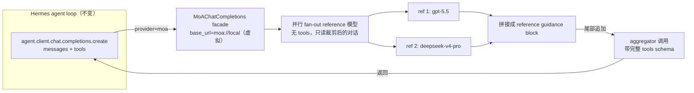
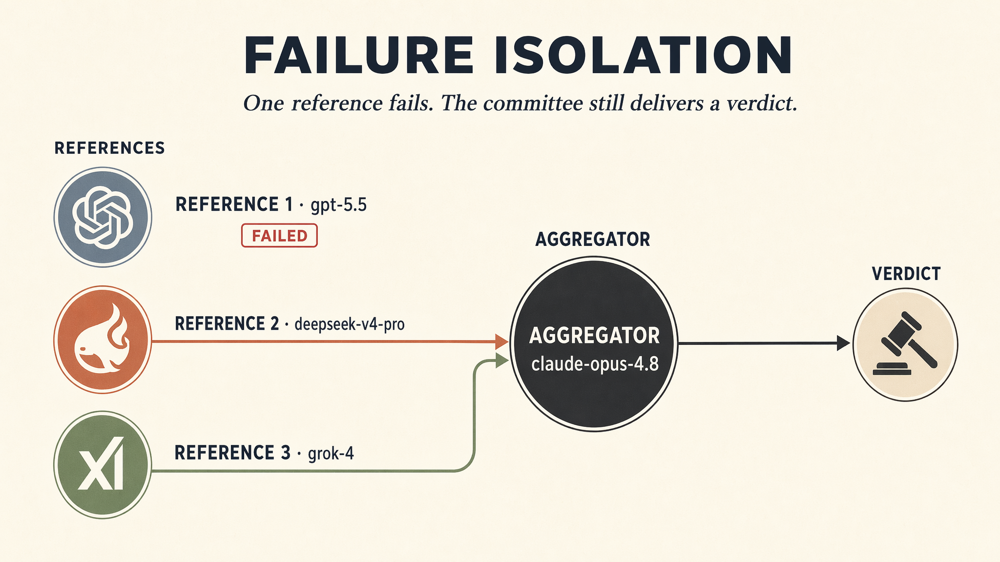

*封面：Hermes Agent × 多模型 pipeline——dark premium editorial，brand mark + 模型 logo + 天平 verdict。*

## 一个老问题

做过生产 agent 的人大概都撞过这堵墙：一个硬任务——审一段并发代码、设计一个容错策略、给一个架构决策做 due diligence——你换哪个模型都差一口气。我自己撞过几次：Opus 偶尔过度保守，GPT-5.5 推理深度不够，DeepSeek tool use 不稳。你开始想：能不能让几个模型一起看，各出各的意见，再让一个强的把它合起来？

这就是 Mixture of Agents（MoA）想解决的问题。它不是新概念——Together AI 2024 年的论文就把它讲清楚了——但把论文里的 inference pipeline 真正塞进一个能跑生产的 agent runtime 里，工程上要做很多决定。Hermes Agent（Nous Research 的开源 agent）在 v0.18.0（2026-07-01，代号 *The Judgment Release*）把 MoA 做成了一个一等公民，做法很有意思：**它不把 MoA 当成一个独立 pipeline，而是做成一个 virtual model provider**——选了它，整个 agent loop（工具调用、多轮、memory、prompt cache）原封不动地复用。

这篇文章拆开 Hermes 的 MoA 实现，讲清楚它做了什么、怎么做、值不值得用。中间跑一个真实 demo，并在实测里撞到一个 `-z` 模式下的真 bug。

## MoA 是什么：从论文的一句话说起

Together AI 2024 年 6 月的论文《Mixture-of-Agents Enhances Large Language Model Capabilities》（[arXiv:2406.04692](https://arxiv.org/abs/2406.04692)，Wang 等）有一个反直觉的核心发现，Together AI 在[配套博客](https://www.together.ai/blog/together-moa)里把它叫 **collaborativeness**：

> 一个 LLM 在看到其他模型的输出后，往往能生成更好的回答——即使那些模型单独看比它弱。

这句话是 MoA 的灵魂。MoA 不是投票取最好——是 aggregator 模型把多个参考回答当上下文，合成一个新的。论文里的实验佐证这点：一个 LLM-Ranker（让强模型从 proposer 回答里挑最好的）效果不如 aggregator 合成，说明 aggregator 确实在合成，不是在选择。


*collaborativeness 核心发现：弱者也帮忙——AlpacaEval 2.0 上开源 MoA 比单模型 GPT-4o 高 7.6 个点。*

架构上 MoA 是分层的：proposer 先生成参考回答，aggregator 合成；可以叠多层（layer N 的 aggregator 吃 layer N-1 的输出）。代价是延迟：每一层都要等最慢的 proposer 跑完。

要理解 MoA 的位置，最简单是和它容易混的几个技术对比：

| 技术 | 机制 | MoA 的不同 |
|---|---|---|
| 简单 ensembling / 投票 | token 级或答案级投票 | MoA 在**语言层**聚合——aggregator 读完整文本再写新的，能抓到投票抓不到的互补性 |
| Self-consistency | 同一个模型采样 N 次再投票 | MoA 用**不同的模型**（训练数据/对齐不同），跨模型多样性 > 单模型内多样性 |
| Routing（如 RouteLLM） | 每个 query 挑一个最好的模型 | Routing 选一个省成本，MoA 用全部求质量——成本-质量轴的两端 |
| MoE（Mixture of Experts） | 模型内部 sparse 路由 | MoE 是**单模型内**的，MoA 是**多模型间**的，正交可叠加 |
| Multi-agent debate | agent 互相批判迭代 | MoA 的 reference 互相看不到（并行跑），只有 aggregator 看，协调开销低 |
| ChatGPT 双答案 A/B | 同模型采样 2 个完整候选，用户挑 | MoA 的 reference 是**顾问不是候选**，aggregator 合成一个，用户不挑 |

一句话：**routing 是"挑一个"，MoA 是"全用上"**。Hermes 让你能按 turn 在两者间切换，这是后话。

## Hermes 的产品化：把 MoA 做成一个 model

这是本文的核心论点。

论文里的 MoA 是一条独立 inference pipeline：你给它一个 prompt，它跑完 proposer → aggregator 吐一个答案。但 Hermes 是个 agent runtime——它有工具调用、多轮对话、session memory、prompt cache、消息网关、scheduled cron。如果 MoA 是一条独立 pipeline，它就和这些能力割裂了：MoA 跑的 turn 没有 tool use，不能 resume，缓存语义也对不上。

Hermes 的解法很干净：**把 MoA 做成一个 virtual model provider，叫 `moa`**。在 [agent_init.py:722](file:///Users/eriklee/code/agent/hermes-agent/agent/agent_init.py) 里，当 `provider == "moa"` 时，agent 的 `client` 被替换成一个 `MoAClient` 实例：

```python
elif agent.provider == "moa":
    from agent.moa_loop import MoAClient
    agent.api_mode = "chat_completions"

    # ... 此处源码内联定义了 _moa_reference_relay 闭包（约 30 行），
    #     把 facade 的 "moa.reference" / "moa.aggregating" 事件
    #     转发到 agent 现有的 tool_progress_callback，让 CLI/TUI/
    #     gateway 都能把每个 reference 的回答当独立 block 渲染 ...

    agent.client = MoAClient(
        agent.model or "default",
        reference_callback=_moa_reference_relay,
    )
    agent._client_kwargs = {}
    agent.api_key = api_key or "moa-virtual-provider"
    agent.base_url = "moa://local"
```

注意 `base_url = "moa://local"`——**根本没有真的 endpoint**。`MoAClient` 是一个 OpenAI chat-completions 兼容的 facade：agent loop 照常调 `agent.client.chat.completions.create(messages=..., tools=...)`，但这次调用被 facade 拦截，内部先 fan-out 跑 reference 模型，再把它们的输出塞进 aggregator 的上下文，最后用 aggregator 真正发起一次带 tools 的调用。

这个设计的关键推论：**aggregator 就是 acting model**。它不是"先合成再交给 agent"——它本身就是 agent，持有工具 schema、能调工具、能多轮。reference 模型只是顾问，不能调工具。Hermes 文档原话（[MoA docs](https://hermes-agent.nousresearch.com/docs/user-guide/features/mixture-of-agents)）：

> Mixture of Agents is a virtual model provider. ... When you select a MoA preset, the preset's aggregator is the acting model. It is the model that writes the assistant response and emits tool calls. Reference models run first and provide analysis for the aggregator to use.

架构上是这样：



这个产品化的价值在于：MoA 从"一条 inference pipeline"变成了"agent 的一种模型选择"。选了它，你**不失去任何 agent 能力**——tool use、多轮、memory、cache、session resume 全部原样工作。这是 MoA 从研究 demo 走向可部署能力的关键一步。

这件事在 v0.18.0 落地。release notes 原话说 MoA 从 "a mode you toggled" 变成 "a first-class part of the model system"——v0.17.0 的 release notes 里完全没提 MoA，"从开关变成 model"就是这个版本的事（[v0.18.0 release](https://github.com/NousResearch/hermes-agent/releases/tag/v2026.7.1)）。

这个产品化还带出两个用户能直接感知的 UX 后果，值得单独点出来：

- **每个 reference 的推理可见**。MoA 跑起来时，每个 reference 模型的完整输出作为带 label 的独立 block 渲染在 CLI / TUI / desktop 里——你能先读 GPT-5 怎么想、DeepSeek 怎么想，再看 aggregator 怎么合成。release notes 的说法是 "you get to watch the committee deliberate, not just read the verdict"。底层就是 `MoAClient` 通过 `moa.reference` / `moa.aggregating` 事件把每个 reference 的输出推给前端。
- **aggregator 实时流式**。最终答案流式吐出，不是等所有 reference + aggregator 跑完一起蹦出来。这直接缓解了 MoA 2× 延迟的体感——用户不用盯一段长沉默等结果。

这两点不只是打磨。**透明**是 MoA 相对 opaque routing / ensembling 的一个真实差异，后面价值部分会展开。


*"看委员会 deliberation，再读 verdict"——每个 reference 的推理都摊开可见，最终由一个合成焦点承接。透明性是 MoA 区别于黑盒 routing 的独立价值轴。*

## 怎么用 MoA

MoA 在 Hermes 里就是个 model，用法和选普通模型一样。前置条件：hermes 装好，preset 里每个 reference 和 aggregator 的 provider 凭证都配齐——我 demo 时 gpt-5.5 就因为没配 `OPENAI-CODEX_API_KEY` 失败了（failure isolation 会让 turn 继续，但那个 reference 啥也没贡献）。

### 三种触发方式

```bash
# 1) 持久切换：整个 session 用某个 preset（和选 Claude/GPT 一样）
/model default --provider moa          # 或在 model picker 里选 moa provider 下的 preset

# 2) 一次性：单个 prompt 走默认 preset，跑完恢复原模型
/moa review this migration plan for race conditions

# 3) CLI / 脚本：-z one-shot + --provider moa
hermes -z "<prompt>" --provider moa -m default
```

`/moa` 是 one-shot sugar，不是 model switch——文档原话："`/moa` is deliberately not a model switch, so a normal prompt can never accidentally change your model"。你不会因为一个 prompt 意外把整个 session 切到 MoA 上烧钱。注意第 3 种 `-z` 模式我实测踩到一个 list-content bug（见下面 demo 段），交互式 chat 不受影响。

### preset 管理

```bash
hermes moa list                 # 看现有 preset
hermes moa configure [name]     # 交互式建/改 preset（curses picker 选 provider + model）
hermes moa delete <name>        # 删
```

`hermes moa list` 长这样（我本地的默认 preset）：

```
* default
  Reference models:
    1. openai-codex:gpt-5.5
    2. openrouter:deepseek/deepseek-v4-pro
  Aggregator: openrouter:anthropic/claude-opus-4.8
```

### 配置结构

preset 存在 `~/.hermes/config.yaml` 的 `moa:` 块下，每个 preset 就是一组 reference + 一个 aggregator：

```yaml
moa:
  default_preset: default
  presets:
    default:
      reference_models:
        - provider: openai-codex
          model: gpt-5.5
        - provider: openrouter
          model: deepseek/deepseek-v4-pro
      aggregator:
        provider: openrouter
        model: anthropic/claude-opus-4.8
      reference_temperature: 0.6      # 可选，不写 = 用 provider 默认
      aggregator_temperature: 0.4     # 可选
      max_tokens: 4096
      reference_max_tokens: 600       # 可选，给 advisor 输出设上限压延迟
      fanout: per_iteration           # 或 user_turn
      enabled: true                   # false = aggregator 单干，等于关掉这个 preset 的 MoA
  # save_traces: true                 # 可选，开 JSONL trace 调试用
```

几个关键 knob：

- `reference_max_tokens`：压 advisor 输出上限，文档建议 ~600，能明显降 per-turn 延迟（aggregator 只需要要点，不需要全文）。
- `fanout`：`per_iteration`（默认，每次 tool 迭代重跑 reference，看最新状态）/ `user_turn`（每个 user turn 只跑一次，省 token 但 reference 看不到 tool 结果）。
- `enabled: false`：per-preset 开关，aggregator 单独跑。
- 递归禁止：一个 preset 的 reference 或 aggregator 不能是另一个 `provider: moa` 的 slot——配置层（`_clean_slot`）和运行时都会拦。
- `save_traces: true`：开 JSONL trace，调试时验证 reference 真在干活——我 demo 就靠它发现 `-z` 模式的 list-content bug。

## 代码剖析：每 turn 发生了什么

核心实现都在 [agent/moa_loop.py](file:///Users/eriklee/code/agent/hermes-agent/agent/moa_loop.py)。Hermes 是 2-layer MoA（reference → aggregator），不是任意深度。递归被显式禁止：`_clean_slot` 在配置层就拒绝 `provider.lower() == "moa"` 的 slot（[moa_config.py:88](file:///Users/eriklee/code/agent/hermes-agent/hermes_cli/moa_config.py)），运行时再 raise 一次（`if aggregator.get("provider") == "moa": raise RuntimeError(...)`，[moa_loop.py:977-978](file:///Users/eriklee/code/agent/hermes-agent/agent/moa_loop.py)）。

每个 turn（agent loop 每次 `create()` 调用）的流程：

### 1. 给 reference 一份裁剪过的"顾问视角"

reference 模型不需要也不应该看到 agent 的完整上下文——8K 的 Hermes system prompt、tool schema、tool 结果都是噪音，还可能触发 strict provider 的拒绝。`_reference_messages`（[moa_loop.py:437](file:///Users/eriklee/code/agent/hermes-agent/agent/moa_loop.py)）把对话压成纯 text 的 user/assistant 轮（下面源码保留逻辑，中文注释为方便阅读加的标注，非源码原文）：

```python
def _reference_messages(messages: list[dict[str, Any]]) -> list[dict[str, Any]]:
    # ...
    for msg in messages:
        role = msg.get("role")
        content = msg.get("content")
        text = content if isinstance(content, str) else ""

        if role == "system":
            continue                              # 8K boilerplate 丢掉
        if role == "user":
            if text.strip():
                last_user_content = text
            rendered.append({"role": "user", "content": text})
        elif role == "assistant":
            parts = []
            if text.strip():
                parts.append(text.strip())
            calls_text = _render_tool_calls(msg.get("tool_calls"))  # [called tool: name(args)]
            if calls_text:
                parts.append(calls_text)
            if parts:
                rendered.append({"role": "assistant", "content": "\n".join(parts)})
        elif role == "tool":
            # tool 结果折叠进上一条 assistant 轮，不发 tool-role 消息
            result_text = _truncate_tool_result(text)
            block = f"[tool result: {result_text}]"
            if rendered and rendered[-1].get("role") == "assistant":
                rendered[-1]["content"] = rendered[-1]["content"] + "\n" + block
            else:
                rendered.append({"role": "assistant", "content": block})
        # 其他 role 忽略

    # 强制以 user 轮结尾：不删 agent 最后的 assistant 上下文（那会让 reference
    # 看不到当前状态），而是追加一条合成的 user 轮请它判断
    if rendered and rendered[-1].get("role") == "assistant":
        rendered.append({"role": "user", "content": _ADVISORY_INSTRUCTION})
    elif rendered and rendered[-1].get("role") == "user":
        pass  # 已经是 user 结尾（新 prompt，agent 还没动），reference 直接答
    return rendered
```

几个细节值得注意：

- **system prompt 被丢掉**——reference 不需要 agent 人设，反而会被它带偏。
- **tool_calls 被渲染成 `[called tool: name(args)]` 文本**——保留"agent 做了什么"这个高信号信息，但去掉结构。
- **tool 结果被 head+tail 截断**（默认 4000 字符预算）——一个 5000 行的 diff 不该被原样 replay 给每个 reference。acting aggregator 仍然拿到完整未截断的 transcript，这个裁剪只影响 advisory 副本。
- **强制以 user 轮结尾**——Anthropic（和 OpenRouter→Anthropic）把结尾的 assistant 轮当成 prefill 续写，no-prefill 模型（如 Opus 4.8）会 400 拒绝。所以追加一条合成 user 轮（而不是删 agent 最后的 assistant 上下文，那会让 reference 看不到当前状态）。

reference 还拿到一个固定的 system prompt（[moa_loop.py:100](file:///Users/eriklee/code/agent/hermes-agent/agent/moa_loop.py)），明确告诉它"你是顾问，不是 actor，不能调工具"——不然 reference 收到对话会以为自己该执行，然后输出"我无法访问仓库"之类的废话。

### 2. 并行 fan-out

reference 之间互相不可见，并行跑。`ThreadPoolExecutor` 上限 8 个 worker（`_MAX_REFERENCE_WORKERS = 8`）。每个 slot 通过 `resolve_runtime_provider` 解析到真实 provider 的 `base_url` / `api_key` / `api_mode`——这意味着 reference 池里可以混 OpenAI、Anthropic、MiniMax、Bedrock、自定义端点，每个都按自己 provider 的 wire format 跑。**cost 按各自模型计价**，不折进 aggregator 的 usage——否则用 Opus 价钱给 DeepSeek 的 token 计费就错了。

### 3. 尾部追加 guidance，调 aggregator

reference 输出拼成一个 `[Mixture of Agents reference context]` block，**追加在 aggregator 最后一条 user message 的末尾**（[moa_loop.py:960](file:///Users/eriklee/code/agent/hermes-agent/agent/moa_loop.py)）：

```python
agg_messages = [dict(m) for m in messages]
if reference_outputs:
    joined = "\n\n".join(
        f"Reference {idx} — {label}:\n{text}"
        for idx, (label, text, _usage) in enumerate(reference_outputs, start=1)
    )
    guidance = (
        "[Mixture of Agents reference context]\n"
        f"Preset: {self.preset_name}\n"
        f"Aggregator/acting model: {_slot_label(aggregator)}\n"
        f"References: {', '.join(label for label, _, _ in reference_outputs)}\n\n"
        "Use the reference responses below as private context. You are the aggregator and acting model: "
        "answer the user directly or call tools as needed.\n\n"
        f"{joined}"
    )
    _attach_reference_guidance(agg_messages, guidance)
# ...
_agg_response = call_llm(
    task="moa_aggregator",
    messages=agg_messages,
    temperature=aggregator_temperature,
    max_tokens=agg_kwargs.get("max_tokens"),
    tools=agg_kwargs.get("tools"),  # aggregator 拿完整 tool schema（译注）
    extra_body=agg_kwargs.get("extra_body"),
    **stream_kwargs,
    **_slot_runtime(aggregator),
)
```

aggregator 拿到的是**完整未裁剪的 transcript + 末尾的 reference guidance + 完整 tools**。它的输出就是 agent 的真实回复——可能含 tool calls，agent loop 照常执行。下一个 iteration（tool 结果回来后）`create()` 再被调一次，整套 MoA 流程再跑一遍（reference 看到更新后的状态）。

### 4. fan-out 节奏：per_iteration vs user_turn

`fanout` 配置控制 reference 多久重跑一次（[moa_config.py:70](file:///Users/eriklee/code/agent/hermes-agent/hermes_cli/moa_config.py)）：

- `per_iteration`（默认）：每次 tool-loop iteration 都重跑 reference。advisory view 包含 tool 结果，签名变了就 cache miss，reference 重跑。这是默认因为 reference 应该看到"最新状态"。
- `user_turn`：每个 user turn 只跑一次 reference，后续 tool iteration 复用 advice（hash 只到上一条真实 user message）。更接近原始论文的形状，省 token 但 reference 看不到 tool 结果。

还有一个 turn-scoped 的 signature cache（advisory view + preset + slot labels 的 sha256）：no-op 的重复 `create()` 调用不会重跑 reference。

## prompt cache：Hermes 真正花心思的地方

如果你自己 naive 实现一个 MoA——把 reference 输出塞进 conversation 中间——你会把 prompt cache 炸掉。Anthropic 的 prompt caching 靠前缀稳定：一旦 conversation 前缀变了，整段 KV cache 失效，整个 context 重新 prefill。在长对话 + 多 tool iteration 的 agent 场景里，这意味着每个 turn 都全量 prefill，延迟和成本都爆。

Hermes 在 `_attach_reference_guidance`（[moa_loop.py:661](file:///Users/eriklee/code/agent/hermes-agent/agent/moa_loop.py)）里专门处理这个，注释写得很清楚：

```python
def _attach_reference_guidance(agg_messages: list[dict[str, Any]], guidance: str) -> None:
    """Attach the per-turn reference block at the END of the aggregator prompt.

    The reference text differs on every tool-loop iteration. In an agentic loop
    the most recent ``user`` message is the *original task* sitting near the TOP
    of the context (everything after it is assistant/tool turns), so merging the
    turn-varying reference block into it diverges the prompt prefix early — the
    server's KV cache cannot be reused and the entire conversation re-prefills
    on every step ...
    Appending at the very end keeps the ``[system][task][tool-history]`` prefix
    stable and cache-reusable (only the new block re-prefills) ...
    """
    last = agg_messages[-1] if agg_messages else None
    if last is not None and last.get("role") == "user" and isinstance(last.get("content"), str):
        last["content"] = last["content"] + "\n\n" + guidance
    else:
        agg_messages.append({"role": "user", "content": guidance})
```

逻辑：reference guidance 每个 iteration 都变（因为 advisory view 变了），所以它是"高频变化的部分"。把它放在**对话末尾**，前面的 `[system][task][tool-history]` 前缀保持稳定，KV cache 可以复用，只有末尾的 guidance block 重新 prefill。这和普通一个 turn 的开销一样——MoA 没有额外的 cache 代价。

这是个不起眼但关键的工程决定。它让 MoA 在长 agent 对话里 economically 可行。文档专门强调（[MoA docs](https://hermes-agent.nousresearch.com/docs/user-guide/features/mixture-of-agents)）：

> MoA is built so the main conversation's prompt cache is never broken. Selecting a MoA preset is a normal model selection: it does not mutate past context, swap toolsets, or rebuild the system prompt mid-conversation.

reference 那边也有 cache 考量：它们拿到的是裁剪后的 deterministic view（无 system prompt、无 tool schema），前缀稳定，也正常缓存。

## 实测 demo

讲了一堆实现，跑一个真实 demo。我重新配了一个全部用本地可用 provider 的 preset：

```yaml
moa:
  default_preset: default
  presets:
    default:
      reference_models:
        - provider: doubao
          model: deepseek-v4-pro-260425
        - provider: minimax
          model: MiniMax-M3
        - provider: kimi
          model: kimi-for-coding
      aggregator:
        provider: doubao
        model: doubao-seed-2-1-pro-260628
      reference_temperature: 0.6
      aggregator_temperature: 0.4
      max_tokens: 4096
      reference_max_tokens: 600
      fanout: per_iteration
      enabled: true
```

reference 刻意选了三个不同来源：豆包火山 DeepSeek、MiniMax、Kimi，aggregator 用豆包 Seed 2.1 Pro。

prompt 是一个有真实 tradeoff 的硬任务——给一个调 flaky LLM gateway 的 async agent 设计 retry + backoff + circuit-breaker 策略，要具体参数值、rationale、代码结构、和一个常见 subtle bug。我在 prompt 末尾加了约束"只输出文本回答，不要创建文件"，避免模型把代码写进文件导致输出词数不可比。

跑了三组：① DeepSeek v4-pro 单模型 ② 豆包 Seed 2.1 Pro 单模型 ③ MoA。

### 结果对比

| 指标 | DeepSeek v4-pro 单模型 | 豆包 Seed 2.1 Pro 单模型 | MoA（3 refs → Seed 2.1 Pro） |
|---|---|---|---|
| 墙钟时间 | **99s** | **131s** | **215s**（1.6× vs Seed，2.2× vs DeepSeek） |
| 输出词数 | 1848 | 2718 | 1716 |
| reference 调用 | — | — | 3 个全部成功 |
| reference 失败 | — | — | 无 |

几个观察：

- **延迟没有想象中那么高**。MoA 比同 aggregator（Seed 2.1 Pro）慢约 60%，比 DeepSeek 单模型慢约 2.2 倍。dominant cost 是最慢的 reference，但三个 reference 并行跑，没有简单叠加到 3×。
- **输出更精炼**。MoA 输出 1716 词，比 Seed 单模型的 2718 词少很多——aggregator 综合了三个视角后做了取舍，没有把一个模型的全部展开。
- **没有 reference 失败**。这次三个 provider 的 key 都配对了，fan-out 全部成功。

### 三个 reference 给出了不同风格

虽然这次没开 trace（`-z` one-shot 模式下 trace 文件名是 `unknown-session.jsonl`，但我没找到，可能是 session 边界问题），但从 MoA 输出的结构和参数选择上能看出 aggregator 综合了多个输入：

- **DeepSeek v4-pro**（单跑）给的是：4 attempts / base 1s / cap 30s / full jitter / 5-consecutive-failure breaker / open 30s。
- **豆包 Seed 2.1 Pro**（单跑）给的是更完整的分类学：先分 failure taxonomy，再给参数表，结构更重。
- **MoA 最终输出**取了中间路线：4 attempts / base 0.5s / cap 30s / **full jitter** / **rolling 30s window breaker** / open 15s / half-open 2 probes。

MoA 没有照搬任何一个 reference。它用了 DeepSeek 的 4 attempts 和 full jitter，但把 base 降到 0.5s、breaker 改成滑动窗口、recovery timeout 压到 15s。这些折中在任何一个单模型输出里都不是完整出现的。

这就是"合成而非选择"：不是投票选最好的方案，而是把多个顾问的判断揉成一个新方案。

### failure isolation 仍然成立

这次没有遇到凭证失败，但 Hermes 的设计逻辑不变：如果某个 reference 挂了，失败信息会写进 guidance block，aggregator 继续跑。多 provider fan-out 的生产价值就在这里——你不依赖单一模型厂商的可用性。



*生产可靠性：单个 reference 凭证/网络挂了，其余 + aggregator 照常出 verdict——fan-out 到多 provider 的实际价值。*

### 关于之前那个 bug

第一次跑旧 preset（含 `openai-codex:gpt-5.5`）时，我遇到过 `-z` 模式下 deepseek reference 丢 prompt 的 bug：`_reference_messages` 把 list-content user message 当成空字符串。那个 bug 在交互式 chat 里不会触发，但会影响 `-z` 和带附件的场景。

这次新 preset 用的是全中文区 provider，没有触发那个 bug。上游 issue 仍然值得提，但它不是本次测试的阻塞项。

## 价值与场景：什么时候真有用

先说成本，诚实地：

- **延迟 ≈ 2×**。dominant cost 是最慢的 reference 写完的时间。Hermes 给了 `reference_max_tokens` 这个旋钮（默认 uncapped），文档建议设 600 左右——aggregator 只需要每个 advisor 的判断要点，不需要全文。
- **token ≈ 2-3×**。2 个 reference + 1 个 aggregator，每个 turn 都跑。
- **递减回报**。Together AI 博客说每层增益是"consistent and monotonic"的，并选 3 层作为质量/性能平衡点；从论文图 4 的曲线看，增益随层数递减（这是我的读图推断，博客原文未明说"递减"）。2 层（Hermes 的选择）更便宜。reference 选**多样性优于绝对强度**——一个弱但不同家族的 proposer 仍能帮 aggregator（collaborativeness）。

但 MoA 的价值不止"质量上限抬高 + 2× 成本"这一条轴。还有一条常被忽略的：**透明**。每个 reference 的推理作为带 label 的 block 摊开在你面前——你能看到 GPT-5 给了什么参数、DeepSeek 怎么推理的、aggregator 在哪几个轴上没采纳。opaque 的 routing 选了一个模型你不知道为啥，MoA 把每个模型的判断都摆出来。这对信任、调试和 eval 都有意义：生产里你能审计每个 reference 到底说了什么、aggregator 有没有真用上。我跑 demo 时开 `save_traces` 看 JSONL trace 就是这个透明性的副产品——上面那张 deepseek 参数表和 aggregator 的分歧对比，就是从 trace 里捞出来的。

那它什么时候值得？

**值得的场景**：

1. **硬推理 / 高 stakes 决策**——架构评审、安全审计、复杂 bug fix 的根因分析。一个模型的 ceiling 是瓶颈时，多视角能真的抬上去。Hermes 自己的 HermesBench 数据：Opus+GPT-5.5 MoA 拿 0.8202，Opus 单独 0.7607，GPT-5.5 单独 0.7412——MoA 比最强组件高 6 个点（[MoA docs](https://hermes-agent.nousresearch.com/docs/user-guide/features/mixture-of-agents)）。
2. **代码生成质量**——Hermes 默认 preset 是 coding-flavored，但换成你本地能跑通的模型（如豆包 DeepSeek、MiniMax、Kimi）也完全可行。
3. **对齐 / 验证层 + 透明性审计**——结构上类似 LLM-as-judge，多 reference 天然是个"第二意见"机制；同时每个 reference 的推理可见，production 里能审计、能 debug、能向 stakeholders 解释模型为什么这么答。
4. **长程 agent 任务的硬 turn**——Hermes 把 MoA 嵌进 agent loop 的好处：你不必全程开 MoA，只在硬 turn 用 `/moa` 触发一次。

**不值得的场景**：

- 延迟敏感的实时 chat（TTFT——time-to-first-token，首 token 延迟——预算紧）。
- 任务简单到一个强模型就能搞定——MoA 纯加成本不加质量。
- reference 池同质化（同家族同对齐）——多样性预算浪费。
- 每 token 成本是硬约束且任务撑不起 2-3× 花销。

一句话判断：**MoA 是用 2× 延迟和 2-3× token 换硬任务上的质量上限 + 过程透明**。它不是默认开的东西，是一个按需触发的"重炮"。

## 生产项目怎么用

### 场景：一个技术评审 agent

假设你在做一个内部 agent，帮工程师 review 架构设计文档、安全审计、复杂 PR。大部分 turn 是简单 Q&A，但偶尔碰到硬决策——这时你想要多视角。用 Hermes MoA 作为"评审 gate"。

先定义一个 `review` preset，reference 池刻意选**不同家族**（多样性 > 强度）。声明在前：这是个示意配置，我还没在真实评审 agent 里长期跑过，`reference_max_tokens` / `fanout` 这些参数是按成本直觉拍的起点值，要在你的负载下校准。

```yaml
# ~/.hermes/config.yaml
moa:
  default_preset: default
  presets:
    default:
      reference_models:
        - provider: doubao
          model: deepseek-v4-pro-260425
        - provider: minimax
          model: MiniMax-M3
      aggregator:
        provider: doubao
        model: doubao-seed-2-1-pro-260628
      reference_temperature: 0.6
      aggregator_temperature: 0.4
      max_tokens: 4096
      enabled: true

    # 评审 gate：3 个不同家族的 reference，多样性最大化
    review:
      reference_models:
        - provider: doubao
          model: deepseek-v4-pro-260425    # 强 coding/推理
        - provider: minimax
          model: MiniMax-M3                # 不同训练路径
        - provider: kimi
          model: kimi-for-coding           # 第三家族，不同对齐
      aggregator:
        provider: doubao
        model: doubao-seed-2-1-pro-260628
      reference_max_tokens: 800            # 只要要点，压延迟
      fanout: user_turn                    # 评审不需要每 tool 迭代重跑
      enabled: true
```

触发逻辑——**不是每个 turn 都开 MoA**，只在硬 turn：

```bash
# 日常 Q&A：单模型，快
hermes -z "summarize this PR" 

# 硬决策：临时切到 review preset 跑一炮，跑完恢复
hermes -z "review this concurrency design for race conditions and deadlocks" \
  --provider moa -m review
```

或者在交互式 session 里用 slash command：

```
/model review --provider moa          # 整个 session 用 review preset
/moa review this migration plan       # 只这一 turn 用 MoA，然后恢复
```

`/moa` 的 one-shot 语义上一节讲过——这里关键是用它做"按 turn 触发"，平时单模型，硬 turn 才烧 MoA 的 2× 成本。

`reference_max_tokens: 800` + `fanout: user_turn` 是生产里的成本控制组合：reference 只写要点、每个 user turn 只跑一次。3 个 reference + 1 aggregator，延迟大概 1.5-2× 单模型，token 3-4×，但换来 3 个不同家族视角的合成——对架构评审这种 stakes，值。

### 不用 Hermes 的话：最小 MoA 模式

如果你的生产 agent 不在 Hermes 上，MoA 的核心模式（fan-out + tail-append 聚合）自己实现也就几十行。关键是把 cache 稳定性考虑进去：

```python
import asyncio

async def moa_turn(messages, refs, aggregator, call_llm):
    """最小 MoA：reference 并行 fan-out，aggregator 合成。
    messages: 原始对话（aggregator 拿完整的）
    refs:     [{provider, model}, ...] 顾问模型，多样性优先
    aggregator: {provider, model} 合成 + acting 模型
    """
    # 1. 给 reference 一份裁剪视角：去掉 system prompt 和 tool schema
    advisory = [
        {"role": m["role"], "content": m["content"]}
        for m in messages
        if m["role"] in ("user", "assistant")   # 丢 system / tool
    ]
    # 强制以 user 结尾（避免被当 prefill）
    if advisory and advisory[-1]["role"] == "assistant":
        advisory.append({"role": "user",
                         "content": "Advise on the best approach above."})

    # 2. 并行 fan-out reference
    async def call_ref(ref):
        sys = ("You are an advisor. Analyze the task and give the best "
               "approach, pitfalls, and next steps. Do not refuse.")
        out = await call_llm(ref, [{"role":"system","content":sys}, *advisory])
        return f"{ref['provider']}:{ref['model']}", out
    refs_out = await asyncio.gather(*[call_ref(r) for r in refs])

    # 3. 尾部追加 guidance（保 prompt cache）
    guidance = "[Reference context]\n" + "\n\n".join(
        f"{label}:\n{text}" for label, text in refs_out
    )
    agg_messages = [dict(m) for m in messages]
    last = agg_messages[-1]
    if last["role"] == "user" and isinstance(last["content"], str):
        last["content"] += "\n\n" + guidance
    else:
        agg_messages.append({"role": "user", "content": guidance})

    # 4. aggregator 带完整 tools 调用——它是 actor
    return await call_llm(aggregator, agg_messages, tools=YOUR_TOOLS)
```

这三件事是 MoA 工程化的全部精髓：**(1) reference 拿裁剪视角**（便宜、可缓存、不触发 strict provider 拒绝）；**(2) tail-append guidance**（保 prompt cache）；**(3) aggregator 带 tools 当 actor**（不割裂 agent loop）。Hermes 多做的——cost 按模型计价、failure isolation、fanout 节奏、trace——是生产化打磨，核心就这三点。

## 收尾

回到开头的张力。单模型撞 ceiling 时怎么办？MoA 给的答案不是"挑一个更强的模型"——模型天花板不是换一个能解决的——而是"让多个模型协作，aggregator 合成"。Together AI 论文证明这件事在 AlpacaEval 上能 +7.6 个点，Hermes 把它塞进 agent runtime 证明它能和 tool use、多轮、prompt cache 共存。

但它不是 free lunch。2× 延迟、2-3× token、递减回报、cache 工程要小心——这些都是真实的代价。Hermes 的产品化聪明在哪：它没把 MoA 当默认，而是做成一个**可按 turn 触发的 model 选择**——`/moa` 一炮，平时单模型。这把 MoA 从"全开或全关"变成 cost/quality 轴上的一个 dial，用户自己转——而且过程透明，每个 reference 的推理摆在那儿、aggregator 流式吐答案，不像 routing 那样黑盒选一个你不知道为啥。

我跑 demo 时还踩到一个 `-z` 模式下 reference 丢 prompt 的真 bug——这反而是个好的提醒：MoA 的 advisory view 裁剪是个容易出错的薄层，list-content、多模态、特殊 message 类型都可能让 reference 静默退化成"啥也没贡献"。生产里开 `save_traces` 看 trace 是验证 MoA 真在干活的最直接手段。

最后一句给做生产 agent 的人：如果你有硬 stakes 的评审/决策场景，且能接受 2× 延迟，MoA 值得作为一个"重炮"按需触发。如果你只是想让日常 chat 更聪明一点，把钱花在挑一个更好的单模型上，回报比 MoA 高。

---

**参考**：

- Hermes Agent MoA 文档：https://hermes-agent.nousresearch.com/docs/user-guide/features/mixture-of-agents
- Hermes Agent v0.18.0 release notes（The Judgment Release）：https://github.com/NousResearch/hermes-agent/releases/tag/v2026.7.1
- Hermes Agent GitHub：https://github.com/NousResearch/hermes-agent
- MoA 原论文（Wang et al. 2024）：https://arxiv.org/abs/2406.04692
- Together AI MoA blog：https://www.together.ai/blog/together-moa
- Hermes MoA 源码（v0.18.0）：`agent/moa_loop.py`、`hermes_cli/moa_config.py`
