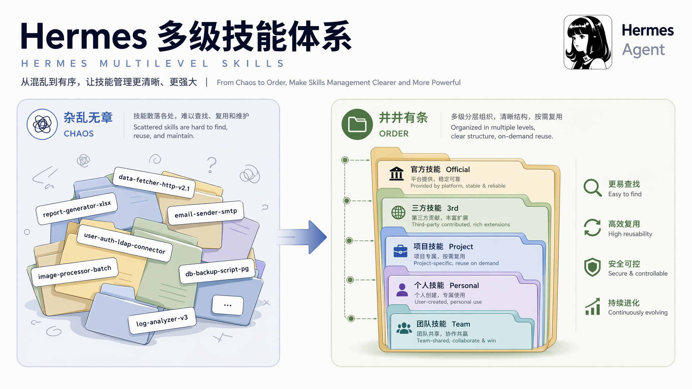
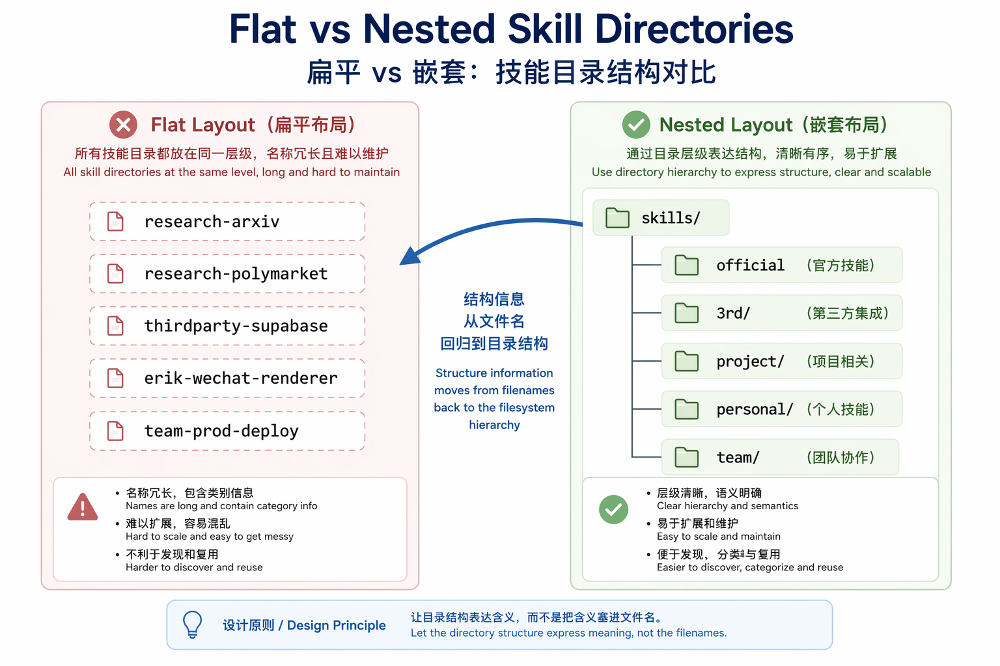
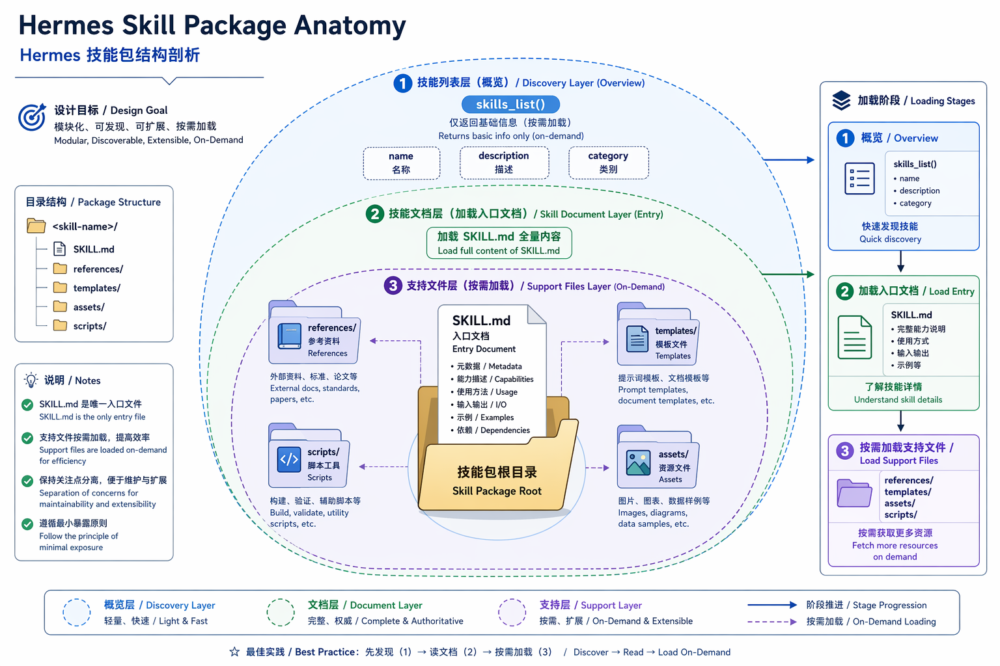
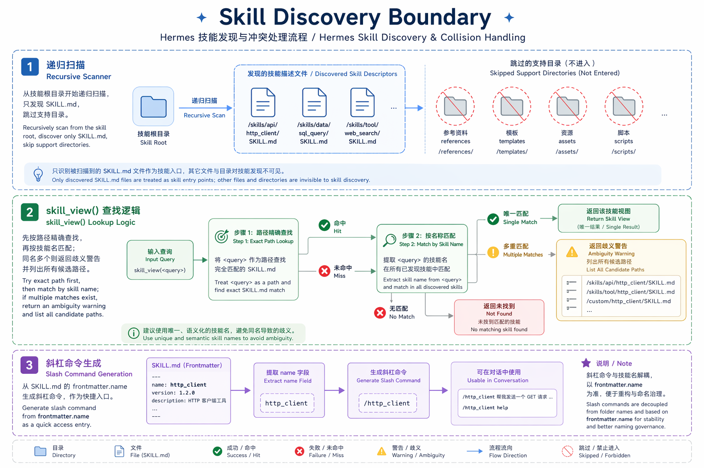

我最近看 Hermes Agent 的 skills 设计，被一个很小的目录细节绊了一下。

它的 skills 可以这样放：

```text
skills/
├── research/
│   └── arxiv/
│       ├── SKILL.md
│       └── scripts/
│           └── search_arxiv.py
├── productivity/
│   └── ocr-and-documents/
│       ├── SKILL.md
│       ├── scripts/
│       └── references/
└── ...
```

第一眼看，只是终于能把文件夹收拾得像个正经项目了。`research/arxiv` 放研究，`productivity/ocr-and-documents` 放文档处理，比一堆 `arxiv`、`ocr-and-documents`、`github-code-review` 平铺在一起清爽。

但这个小功能真正碰到的，是 skills 多起来之后，agent 的过程记忆怎么治理。

一个用得久的 agent，不会永远只有五个 skills。它会有官方 bundled skills，有社区装来的第三方 skills，有项目专用 skills，有 agent 自己从反复任务里沉淀出来的 skills，还有团队内部的发布、运维、合规流程。等这些东西全挤进一个扁平目录，命名很快就会变成一种小型考古：

```text
research-arxiv/
research-polymarket/
thirdparty-supabase/
erik-wechat-renderer/
team-prod-deploy/
```

这当然能用。很多系统就是这么长大的。但它把结构信息硬塞进名字里。名字越来越长，边界越来越含糊，最后每个 skill 都像领了一张临时工牌。



Hermes 的多层路径把一部分结构还给了文件系统。

```text
skills/
├── official/
├── 3rd/
├── project/
├── personal/
└── team/
```

或者按任务域：

```text
skills/
├── research/
├── writing/
├── coding/
├── ops/
└── integrations/
```

这谈不上多高级。它老派、无聊，也很管用。很多工程系统最后能不能继续维护，靠的往往不是更炫的 abstraction，而是这些让人半年后还能看懂的边界。

## skills目录细节

Hermes 的多层路径不是孤零零的文件系统偏好。它背后有一套 discovery、命名、加载和冲突处理逻辑。看清这套逻辑，才能判断它到底只是“支持嵌套目录”，还是一个真的能承载较大 skills 集合的 runtime 设计。

Hermes 官方文档把 skills 定义成 agent 按需加载的知识文档，并强调 progressive disclosure：先列出 `name`、`description`、`category` 这样的轻量索引，真的需要时再加载完整 `SKILL.md`，必要时再读取 `references/`、`scripts/`、`templates/` 等支持文件。文档还写明，`~/.hermes/skills/` 是本地 source of truth；fresh install 时 bundled skills 会复制进去，Hub 安装和 agent 自己创建的 skills 也会进入这里；同时可以配置 external skill directories 一起扫描。[^hermes-skills]

这和“把一个 markdown prompt 丢给模型”不是一回事。Hermes 更像是把 skill 当成一个小型 package：入口是 `SKILL.md`，旁边可以带脚本、资料、模板和 assets。



源码里的语义也对得上。在 `tools/skills_tool.py` 开头的模块注释里，Hermes 明确写了目录结构：一个 skill 是包含 `SKILL.md` 的目录，可以带 `references/`、`templates/`、`assets/`；同时也支持 `category/another-skill/SKILL.md` 这种分类目录。`skills_list()` 只返回元数据，`skill_view()` 再加载完整内容或指定支持文件。[^source-skills-tool]

目录层级参与了 discovery 和索引，已经进入 runtime 语义。

## 源码里的skills多层路径规则

### 入口是 `SKILL.md`

Hermes 不是只认 `skills/*/SKILL.md`。源码里的 `_find_all_skills()` 会扫描本地 skills 目录和 external dirs，并通过 `iter_skill_index_files(scan_dir, "SKILL.md")` 递归找到 skill 入口。然后它从 frontmatter 里取 `name` 和 `description`，再从路径里提取 category。[^source-find]

category 的规则也很直接：如果路径类似 `~/.hermes/skills/mlops/axolotl/SKILL.md`，category 就是 `mlops`。也就是说，文件系统结构会进入 `skills_list()` 的返回结果。[^source-category]

slash command 也走同一套发现逻辑。`agent/skill_commands.py` 会递归扫描 skills 和 external dirs，把 skill 注册成 `/skill-name` 命令。[^source-commands]

这比“文件夹可以嵌套”多了一层工程语义：skill 的物理位置可以是多层路径；人类调用名主要由 frontmatter `name` 决定；目录层级提供组织、分类、排错和显式路径恢复。

### skill name 不带父级目录

多层目录最容易误会的一点，是 skill name 会不会自动带上父级目录。

从源码看，不会。

`_find_all_skills()` 找到某个 `SKILL.md` 后，会先解析 frontmatter，然后用这行逻辑确定展示给 agent 的名称：

```python
name = frontmatter.get("name", skill_dir.name)[:MAX_NAME_LENGTH]
```

也就是说，`skills/research/arxiv/SKILL.md` 的名字不是天然的 `research/arxiv`，而是：

- 如果 frontmatter 写了 `name: arxiv`，名字就是 `arxiv`；
- 如果没写 `name`，才退回到当前 skill 目录名，也就是 `arxiv`；
- 父级目录 `research` 不会拼进 name。

父级目录进入的是另一个字段：`category`。`_get_category_from_path()` 会看 skill 相对 `~/.hermes/skills/` 的路径，如果至少有三段，比如 `research/arxiv/SKILL.md`，就把第一段 `research` 当作 category。这个 category 会出现在 `skills_list()` 结果里，也会参与排序。[^source-category]

slash command 也沿用这个逻辑。`scan_skill_commands()` 读取 frontmatter name，如果没有就用当前目录名，然后把它规范化成命令：转小写、空格和下划线转连字符，再剔掉不适合命令的字符。于是 `name: arxiv` 会变成 `/arxiv`，不会变成 `/research-arxiv`。[^source-commands]

这是一个有意的折中：日常调用保持短名字，目录层级留给浏览、分类和消歧。

消歧发生在 `skill_view()` 里。它有几种查找策略：

- 先尝试把用户传入的值当作直接路径，比如 `research/arxiv`；
- 再递归扫描所有 `SKILL.md`，匹配目录名或 frontmatter `name`；
- 如果多个候选都匹配同一个裸 name，就拒绝猜测，返回所有匹配路径，让用户改用 `category/skill-name` 这种完整相对路径。

多层目录没有改变 skill 的名字，它给同名场景留下了一条恢复路径。

### 递归不是随便扫

多层 discovery 听起来很简单，`**/SKILL.md` 一扫就完了。但 agent skills 这里有一个很容易出问题的地方：skill 自己也可以带 `references/`、`templates/`、`assets/`、`scripts/`。这些支持目录里可能有 markdown，甚至可能保存旧 skill 包的 `SKILL.md`。

如果扫描器不懂边界，它会把一个 skill 的素材误注册成另一个 skill。

Codex 社区最近就有类似 bug 报告：Codex CLI 递归扫描 `~/.agents/skills` 时，跟随 symlink 后把 skill 包内部的 `runtime-sources/**/SKILL.md` 也注册成用户 skills，导致重复条目和路由噪音。报告者的预期很朴素：一个安装的 skill 目录应该只注册一个 skill，内部 source material 不应该变成可调用能力。[^codex-recursive-bug]

Hermes 源码里能看到它已经在处理这类边界。`agent/skill_utils.py` 定义了 `SKILL_SUPPORT_DIRS = ("references", "templates", "assets", "scripts")`，并说明这些目录里的内容是 progressive-disclosure 数据，不是 active discovery roots。`iter_skill_index_files()` 遍历时，如果当前目录已经是一个 skill root，就不会继续把这些支持目录当作可发现 skill 的根。[^source-support]

测试里也有对应的回归场景：`references/old-skill-package/SKILL.md` 不应该出现在 `skills_list()`，也不能通过 `skill_view("old-skill")` 加载；但它仍然可以通过 `skill_view("umbrella", file_path="references/old-skill-package/SKILL.md")` 作为支持文件打开。[^source-tests]

多层目录真正复杂的地方在这里。系统要允许：

```text
skills/research/arxiv/SKILL.md
```

但不能让这个东西误伤：

```text
skills/research/arxiv/references/old-package/SKILL.md
```

支持多层结构，不是加一个递归 glob。它要定义 skill root、support files、external dirs、命名冲突和加载边界。



### 同名时不要猜

skills 多起来以后，同名冲突一定会发生。

一个团队可能有 `research/arxiv`，第三方包里也有 `arxiv`；你自己写了 `github-code-review`，官方 bundled skills 里也可能有类似名称。external dirs 再一多，冲突只是时间问题。

Hermes 的 `skill_view()` 没有默默选择一个。源码注释说得很清楚：如果同一个 skill name 在本地 skills dir 和 external dirs 中匹配到多个候选，系统会拒绝猜测，并返回所有 matches，提示用户用完整 categorized path 加载。[^source-collision]

测试也覆盖了几个场景：nested local skill 和 top-level external skill 同名时应该报 ambiguous；两个 external dirs 同名也应该报 ambiguous；如果用户传 `foundations/runtime/explore-codebase` 这样的完整路径，就可以恢复。[^source-tests]

这不是一个纯粹的 UX 选择。

扁平命名体系里，冲突常常靠“谁先扫描谁赢”解决。听起来方便，但对 agent 很危险：用户以为加载的是本地 `explore-codebase`，实际可能跑了 external dir 里的另一个版本。对普通 CLI，这是 bug；对能执行命令、写文件、访问账户态的 agent，这是信任边界被悄悄换掉。

Hermes 选择报错，牺牲了一点顺滑，换来可解释性。生产 agent 需要这种不讨好人的设计。

## 多层目录什么时候有价值

### `skills/3rd/` 的价值

可以把第三方 skills 放到 `skills/3rd/`，这个功能其实我一直都很想要。

这比“按任务分类”还要紧。按任务分类解决的是浏览问题，按来源分类解决的是信任问题。

比如：

```text
skills/
├── 1st/
│   ├── writing/
│   └── publishing/
├── 3rd/
│   ├── supabase/
│   └── github/
├── vendor/
│   ├── nous/
│   └── openai/
├── project/
│   └── writing-agent-harness/
└── archive/
```

skill 会改变 agent 的行为，可能让 agent 去跑脚本、读文件、调 CLI、访问外部服务。第三方 skill 的风险不只是“写得不够好”，更麻烦的是它可能把不该执行的动作包装成一个看似合理的 workflow。

多层路径不能替代 review、签名、权限隔离或 sandbox。但它至少让来源边界可见。一个 skill 是自己写的、项目内生的、官方带的，还是第三方来的，不应该只靠名字猜。

Hermes 自己的生态也在往这个问题上走。它支持 external skill directories，也有关于 project-local skills 的社区讨论。一个 Hermes issue 指出：agentskills.io 统一了 `SKILL.md + frontmatter` 的格式，但各家 agent 的发现路径仍然分裂；如果把项目 `.claude/skills/` 全局加入 Hermes `external_dirs`，会污染其他项目上下文，所以需要 project-scoped skill discovery。[^hermes-project-local]

这也是来源边界的另一个版本：有些 skill 只该出现在特定项目里。

### 单层还是多层

skills 少的时候，单层更清楚。五六个个人 skills，直接平铺没什么问题，甚至更省心。多层目录应该在它解决真实问题时出现，别为了让项目看起来像有架构而提前铺开。

| 场景 | 建议 | 原因 |
| --- | --- | --- |
| 少于 10 个个人 skills | 单层 | 找得到、看得懂，前缀成本最低 |
| skills 主要来自同一作者、同一用途 | 单层或按任务域一层 | 不必过早设计来源边界 |
| 有明显任务域 | `research/`、`writing/`、`ops/` | category 能帮助浏览和筛选 |
| 有第三方 skills | `3rd/<vendor-or-repo>/` | 把来源和信任边界显性化 |
| 有 agent 自动生成 skills | `generated/` 或 `inbox/` | 先隔离，验证后再 promote |
| 团队生产环境 | `team/`、`project/`、`ops/`、`archive/` | 方便 owner、review、风险分层 |
| 多项目共享一套 skills | external dirs 或 project-scoped 目录 | 避免把项目知识污染到全局 |

一种比较自然的演进是先平铺：

```text
skills/
├── arxiv/
├── github-code-review/
└── wechat-renderer/
```

等来源开始复杂，再拆：

```text
skills/
├── personal/
├── project/
├── 3rd/
├── generated/
└── archive/
```

这不是架构升级，更像一次普通但必要的收纳：东西少的时候一个抽屉够用；东西多了还坚持一个抽屉，最后每次找东西都要靠记忆和运气。

### 生产环境里怎么用

如果把 skills 当成“提示词小卡片”，多层目录最多只是收纳。

但如果把 skills 当成 agent 的过程记忆、操作手册和能力包，多层目录就会变成治理结构的一部分。

落到生产环境，会变成几件很具体的事：

1. **来源隔离**：`skills/3rd/`、`skills/internal/`、`skills/generated/` 分开，审计时一眼知道哪些是外部输入。
2. **生命周期管理**：agent 自己生成的 skills 先放 `generated/` 或 `inbox/`，验证稳定后再 promote 到 `team/` 或 `project/`。
3. **项目隔离**：不同项目的 skills 可以以目录为单位同步、备份、迁移，而不是靠命名前缀筛选。
4. **权限和风险分层**：有副作用的 skills 放 `ops/` 或 `dangerous/`，未来可以接权限策略、审批策略、sandbox 策略。
5. **团队协作**：一个团队可以维护 `skills/backend/`、`skills/frontend/`、`skills/release/`，每个目录有 owner 和 review 规则。
6. **生态导入**：从 agentskills.io、GitHub、供应商 repo 导入的 skills，可以保留来源目录，不必全部压扁成一个全局命名空间。

`skills/3rd/` 这种目录名看起来像文件管理，实际是在给 agent 记忆加 provenance。

## 标准把问题留给实现

### 标准没有规定 discovery

Agent Skills 标准本身没有直接规定“必须支持多层 skills 目录”。

因为标准主要定义的是一个 skill package 内部长什么样，并不替每个客户端决定怎么发现这些 package。agentskills.io 的 specification 说，一个 skill 是一个至少包含 `SKILL.md` 的目录，可以有 `scripts/`、`references/`、`assets/` 和其他文件；它还规定了 `name`、`description` 等 frontmatter 约束，其中 `name` 要匹配父目录名。[^agentskills-spec]

但 skill 目录应该放在哪里、要不要递归扫描、扫描多深、同名谁覆盖谁，这些属于 client implementation。官方 implementation guide 也说，Agent Skills spec 不强制 skill directories 的存放位置；本地 agent 可以扫文件系统，云端或沙箱 agent 可能需要 API、远程 registry 或 bundled assets。它还建议实现者设置扫描边界，比如跳过 `.git`、`node_modules`，并设置 max depth，避免在大目录树里 runaway scanning。[^agentskills-implementation]

这个边界很合理。标准要保证 portability，不能把每个 agent 的部署模型都规定死。

多层目录看起来只是路径问题，但客户端一支持，就会立刻遇到一串 runtime 决策：

- 扫描深度怎么限制？
- `references/SKILL.md` 算不算 skill？
- `scripts/` 下面的测试 fixture 算不算 skill？
- 同名 skill 是覆盖、并列显示，还是报错？
- slash command 里能不能表达路径？
- 项目里的 skill 是否默认可信？
- symlink 目标是否允许？
- 云端 agent 没有本地 filesystem 时怎么办？

其他 agent 对多层目录谨慎，并不一定是没想到。这个功能一旦进入默认行为，就会影响安全、性能、UI、兼容性和用户心智。

所以分析 Hermes 不能只看文档。文档能告诉我们“支持多层”，源码和测试才告诉我们它怎么防止递归误扫，怎么处理 support files，怎么处理 external dirs，怎么在冲突时拒绝猜测。

### 和其他 agent 比

截至 2026-07-05，Claude Code 官方文档已经支持项目路径上的 `.claude/skills/` 发现：从启动目录到 repo root 的父级路径都会发现，编辑子目录文件时也会按需发现 nested `.claude/skills/`。它也支持 skill 内部的 supporting files，并建议让 `SKILL.md` 只做导航。[^claude-skills]

Codex 官方文档也支持多来源 skills：repo、user、admin、system locations；repo 场景还会从当前工作目录一路扫描到 repo root 的 `.agents/skills`。Codex 还明确写了 progressive disclosure 和 context budget：初始列表只放 name、description、file path，完整 `SKILL.md` 在选中后再读。[^codex-skills]

OpenClaw 官方文档则有 `skills.load.extraDirs`、symlink target allowlist、watch 等配置，并且提到 watcher 覆盖 grouped skill roots 下的 nested files。[^openclaw-skills]

因此，更准确的判断不是“其他 agent 都不支持多层 skills”。新一代 coding agent 都在向 skills 的多来源、多路径、渐进加载演进。Hermes 的亮点，是它把分类目录、external dirs、support-file 排除、命名冲突拒绝、skill package 支持文件提示这些细节放进了同一个 runtime。

Hermes 的重点不止是找到 skill。它还在处理“找到以后怎么不找错”的问题。

### 代价

多层路径也会把问题带到台面上。

第一，UI 和命令怎么显示？如果 slash command 仍然只是 `/arxiv`，目录路径只在后台存在，那分类对用户的可见价值会下降。但如果命令变成 `/research/arxiv`，不同平台的 slash command 规则又不一定支持。Hermes 当前是用 frontmatter name 生成 slash command，目录用于分类和显式路径恢复，这是一种折中。

第二，category 目前通常只取第一层。`skills/foundations/runtime/explore-codebase` 在人类看来 category 可能是 `foundations/runtime`，但系统列表里可能只呈现第一层 `foundations`。这对深层治理未必够。未来可能需要 `category`、`source`、`owner`、`risk_level` 这样的 metadata 一起补上。

第三，递归扫描的边界必须长期维护。只要支持 scripts、references、archives、symlinks，就一定会遇到“这到底是一个 skill，还是一个 skill 的素材”的问题。Hermes 已经做了不少防线，但这类防线需要测试一直跟着走。

第四，多层路径不能替代安全。第三方 skill 放在 `skills/3rd/` 里，只是让你知道它是第三方，不代表它安全。真正的安全还需要 review、签名、安装来源、权限隔离、执行沙箱和审计日志。

它解决不了所有问题。它的价值在于便宜、直观，而且能先把边界画出来。

## Summary

我喜欢 Hermes 这个设计，不是因为它复杂，而是因为它承认了一个朴素事实：agent 用久之后，skills 会变成一个小型知识库。

一个真正工作的 agent，会有研究 skills、写作 skills、发布 skills、运维 skills、公司内部流程 skills、第三方集成 skills、临时实验 skills、被废弃但还要归档的旧 skills。它们不可能永远挤在一个扁平目录里，靠名字前缀互相礼让。

多层 skills 路径给了系统一个简单的骨架。skill 不再只是“一个可以被模型读到的 markdown 文件”，它有位置、有来源、有边界、有支持文件，也有冲突处理。

这件事很小。小到看起来只是：

```text
skills/research/arxiv/SKILL.md
```

但很多生产系统的分水岭，恰恰藏在这种小事里。

一开始你只是想把桌面收拾干净。后来你发现，收纳方式决定了你还能不能继续工作。

## References

1. Hermes Agent 官方文档，[Skills System](https://hermes-agent.nousresearch.com/docs/user-guide/features/skills)，访问日期：2026-07-05。
2. Hermes Agent 源码，本地 checkout `7e8f50a14`：[tools/skills_tool.py](file:///Users/eriklee/code/agent/hermes-agent/tools/skills_tool.py)。
3. Hermes Agent 源码：[agent/skill_commands.py](file:///Users/eriklee/code/agent/hermes-agent/agent/skill_commands.py)。
4. Hermes Agent 源码：[agent/skill_utils.py](file:///Users/eriklee/code/agent/hermes-agent/agent/skill_utils.py)。
5. Hermes Agent 源码：[tests/tools/test_skills_tool.py](file:///Users/eriklee/code/agent/hermes-agent/tests/tools/test_skills_tool.py)。
6. Hermes Agent issue，[Auto-discover project-local skills from working directory](https://github.com/NousResearch/hermes-agent/issues/4667)，访问日期：2026-07-05。
7. OpenAI Codex issue，[Skill discovery recursively registers nested `SKILL.md` files inside symlinked skill directories](https://github.com/openai/codex/issues/22275)，opened on 2026-05-12，访问日期：2026-07-05。
8. Agent Skills 官方规范，[Specification](https://agentskills.io/specification)，访问日期：2026-07-05。
9. Agent Skills 官方实现指南，[How to add skills support to your agent](https://agentskills.io/client-implementation/adding-skills-support)，访问日期：2026-07-05。
10. Anthropic Claude Code 官方文档，[Extend Claude with skills](https://code.claude.com/docs/en/skills)，访问日期：2026-07-05。
11. OpenAI Developers 官方文档，[Agent Skills - Codex](https://developers.openai.com/codex/skills)，访问日期：2026-07-05。
12. OpenClaw 官方文档，[Skills config](https://docs.openclaw.ai/tools/skills-config)，访问日期：2026-07-05。
